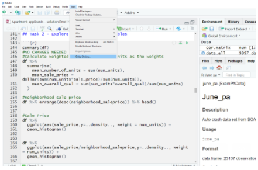
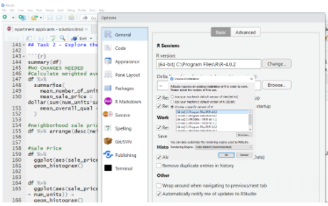

---
output:
  html_document: default
  pdf_document: default
---
# Getting started 

This chapter tells you how to install the necessary software on your computer.

## Installing R

To begin, you will need to install R.  This is the engine that *runs* the code.  You need to install two versions - the newest version **(v4)** as well as an older version **(v3.6.2)**.  The older version will be used when running the code from the SOA's modules, which needs to be consistent with what will be installed on the Prometric computers.  This course uses the newest version so that you will not have as many errors during practice.

Download it from here: https://cran.r-project.org/mirrors.html

Once both have been installed, switching between the two is easy.

```{r echo = F, fig.align="center", warning=F, out.width="50%"}

```


```{r echo = F, fig.align="center", warning=F, out.width="50%"}

```

Remember: 

**For this course, use a version later than 4.0.2.**

**For the SOA's modules, use version 3.6.2.**

## Installing RStudio

This is the tool that helps you to *write* the code.  Just as MS Word creates documents, RStudio creates R scripts and other documents.  Download RStudio Desktop (the free edition) and choose a place on your computer to install it.

Download it from here: https://rstudio.com/products/rstudio/download/

Then you need to set the R library.

R code is organized into libraries.  You want to use the exact same code that will be on the Prometric Computers.  This requires installing older versions of libraries.  Change your R library to the one which was included within the SOA's modules.

```{r eval = F}
.libPaths("PATH_TO_SOAS_LIBRARY/PAlibrary")
```

## Download the data

For your convenience, all data in this book, including data from prior exams and sample solutions, has been put into a library called `ExamPAData` by the author.  To access, simply run the below lines of code to download this data.

```{r eval = F}
# Install remotes if it's not yet installed
install.packages("remotes")
Sys.setenv(R_REMOTES_NO_ERRORS_FROM_WARNINGS="false")
remotes::install_github("sdcastillo/ExamPAData", force = TRUE)
```

Once this has run, you can access the data using `library(ExamPAData)`.  To check that this is installed correctly see if the `insurance` data set has loaded.  If this returns "object not found", then the library was not installed.  If you get an error during the installation, restart your RStudio and then run `Sys.setenv(R_REMOTES_NO_ERRORS_FROM_WARNINGS="false")` and `remotes::install_github("sdcastillo/ExamPAData", force = TRUE)` separately.

```{r}
library(ExamPAData)
summary(insurance)
```

For your convenience, you can use these data sets for your own practice.  They make great candidates for machine learning problems.  

| Dataset   |      Description      |
|----------|-------------|
|`customer_phone_calls`| Data used on June 18, 2020 Exam PA |
|`patient_length_of_stay`| Data used on June 16, 2020 Exam PA|
|`patient_num_labs`| Data used on June 19, 2020 Exam PA |
|`actuary_salaries`| DW Simpson actuarial salary data|
|`june_pa`|Auto crash data set from SOA June 2019 PA|
|`customer_value`| Customer value data set from December 2019 PA|
|`exam_pa_titanic`| Titanic passengers as used in ExamPA.net's practice exam |
|`apartment_apps`| Apartment applications as used in ExamPA.net's Practice Exam|
|`health_insurance`| Health insurance claims as used in ExamPA.net's Practice Exam|
|`student_success`| SOA Student Success PA Sample Project, 2019|
|`readmission`| SOA Hospital Readmissions Sample Exam, 2019 |
|`auto_claim`| Automotive claims |
|`boston`| Boston housing data set |
|`bank_loans`| Credit data from UCI Machine Learning Repository |


## Download ISLR

This book references the publically-avialable textbook "An Introduction to Statistical Learning", which can be downloaded for free

http://faculty.marshall.usc.edu/gareth-james/ISL/

If you already have R and RStudio installed then skip to "Download the data". 
