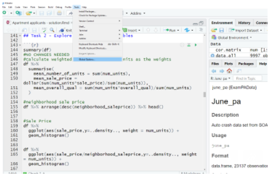
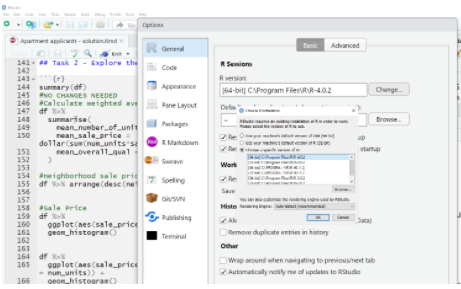

---
output:
  html_document: default
  pdf_document: default
description: "Getting started with R, RStudio, and datasets for Exam PA."
keywords: ["R installation","RStudio","Exam PA","reticulate","HuggingFace datasets"]
---
# Getting started 

## Load datasets from HuggingFace (via reticulate)

The datasets for this book are available on HuggingFace under `https://huggingface.co/supersam7`. You can load them in R using the `reticulate` package and the Python `datasets` library.

```{r eval = FALSE}
# Install once if needed
install.packages("reticulate")
```

```{r eval = FALSE}
library(reticulate)

# Point reticulate at a Python with the datasets library installed.
# You can also use a virtualenv or conda env if preferred.
py_config()

datasets <- import("datasets")

# Example: travel insurance data
ds <- datasets$load_dataset("supersam7/travel_insurance")
```

To load any dataset listed below, replace the dataset name in the string.
For example:

```{r eval = FALSE}
ds <- datasets$load_dataset("supersam7/health_insurance")
```

This chapter tells you how to install the necessary software on your computer. For updates and curated resources, visit [PredictiveInsightsAI.com](https://www.PredictiveInsightsAI.com).

## Central Limit Theorem (interactive)

Explore the Central Limit Theorem with this embedded Shiny app.

<iframe src="https://019b3dd0-3020-c090-9e63-fce06a1e928b.share.connect.posit.cloud/" width="100%" height="760" style="border:0;" loading="lazy" allowfullscreen></iframe>

Open in a new tab: <https://019b3dd0-3020-c090-9e63-fce06a1e928b.share.connect.posit.cloud/>

<iframe width="560" height="315" src="https://www.youtube.com/embed/OUkC6vVJeQA?rel=0&modestbranding=1&playsinline=1" title="YouTube video player" frameborder="0" allow="accelerometer; autoplay; encrypted-media; gyroscope; picture-in-picture" allowfullscreen></iframe>

yout
## Installing R

To begin, you will need to install R. This is the engine that runs the code. You need to install the newest version **(v4.x)** as well as a legacy version used by the SOA modules. 

The older version will be used when running the code from the modules of SOA, which needs to be consistent with what will be installed on the exam center computers. This course uses the newest version so that you will not have as many errors during practice.

Download it from here: https://cran.r-project.org/mirrors.html

You can easily switch between both of them after installation.

```{r echo = F, fig.align="center", warning=F, out.width="50%"}

```


```{r echo = F, fig.align="center", warning=F, out.width="50%"}

```

Remember: 

For this course, use a version later than $4.0.2$.

For the module of SOA, use the legacy version specified in the modules.

## Installing RStudio

Just as MS Word creates documents, RStudio creates R scripts and other documents. This is the tool that helps you to *write* the code. Download the free edition of RStudio Desktop and instal it at your selected location.

Download it from here: https://rstudio.com/products/rstudio/download/

Next you need to set the R library. R code is organized into libraries. You want to use the same code that will be on the exam center computers. It would require installing older versions of libraries. Change your R library to the one which was included within the Modules of SOA.

```{r eval = F}
.libPaths("PATH_TO_SOAS_LIBRARY/PAlibrary")
```

## Download the data

For your convenience, all data in this book, including data from prior exams and sample solutions, has been put into a library called `ExamPAData` which is available on CRAN.

```{r eval = F}
install.packages("ExamPAData")
library(ExamPAData)
```

To get the data dictionary for a data set, use `?dataset_name` such as `?customer_phone_calls`. For your convenience, you can use these data sets for your practice. They make great candidates for machine learning problems.

| Dataset   |      Description      |
|----------|-------------|
|`customer_phone_calls`| Data used on a recent Exam PA |
|`patient_length_of_stay`| Data used on a recent Exam PA |
|`patient_num_labs`| Data used on a recent Exam PA |
|`actuary_salaries`| DW Simpson actuarial salary data|
|`june_pa`|Auto crash data set from a prior SOA Exam PA|
|`customer_value`| Customer value data set from a prior Exam PA|
|`exam_pa_titanic`| Titanic passengers as used in https://PredictiveInsightsAI.com's practice exam |
|`apartment_apps`| Apartment applications as used in https://PredictiveInsightsAI.com's Practice Exam|
|`health_insurance`| Health insurance claims as used in https://PredictiveInsightsAI.com's Practice Exam|
|`student_success`| SOA Student Success PA Sample Project|
|`readmission`| SOA Hospital Readmissions Sample Exam |
|`auto_claim`| Automotive claims |
|`boston`| Boston housing data set |
|`bank_loans`| Credit data from UCI Machine Learning Repository |


## Download ISLR

This book references the publically-available textbook “An Introduction to Statistical Learning,” which can be downloaded for free

https://www.stat.berkeley.edu/~rabbee/s154/ISLR_First_Printing.pdf

If you already have R and RStudio installed then skip to "Download the data". 
