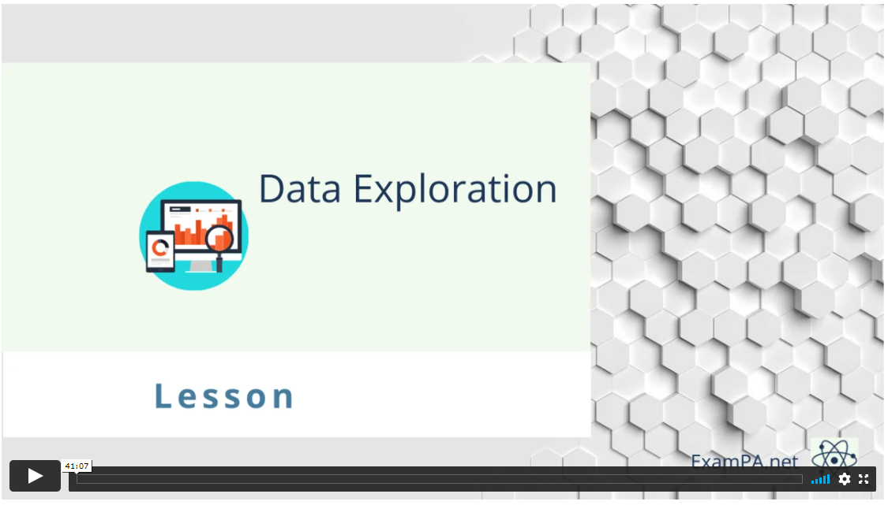
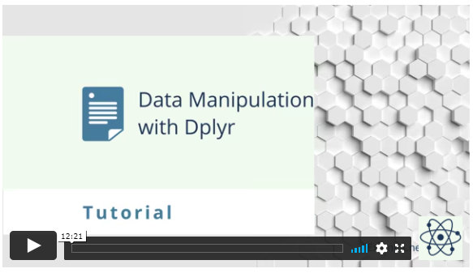

# Data exploration

```{r warning = F, echo = F, message = F}
library(dplyr)
library(ggplot2)
library(caret)
library(magick)

#set figure size
knitr::opts_chunk$set(fig.width=6, fig.height=4) 

#This is an optional library to add emojis to .Rmd files
# install.packages("devtools")
#devtools::install_github("hadley/emo")
library(emo)

library(ExamPAData)
library(tidyverse)#always load AFTER plyr.  Otherwise there are errors because some functions have the same names in both libraries.

library(kableExtra)
format_table <- function(data){data %>% kableExtra::kable("html") %>% kable_styling(bootstrap_options = "striped", full_width = F)}
```

[](https://course.exampa.net/mod/page/view.php?id=133)

Already enrolled?  Watch the full video: <a target="_parent" href="https://course.exampa.net/mod/page/view.php?id=133">Practice Exams + Lessons</a>

Exploration is about making discoveries and you should have a curious mind and strong technical skills to make sense of the data. This chapter will give you the tools to take dirty, unprocessed data, clean it up, discover interesting trends using graphs and summary statistics, and communicate your results to a business audience.

About 10 - 15% of your grade will be based on data exploration. Every version of Exam PA, such as December 2018, June 2019, and December 2019, have all had questions about data exploration. Putting in extra practice in this area is guaranteed to give you a better score because it will free up time that you can use elsewhere.

The syllabus divides this into three learning objectives, which can make the topic intimidating. Data Visualization, Data Types and Exploration, and Data Issues and Resolutions, but you will always be doing these things together, and so this chapter will cover all three at once.


```{r echo = F, fig.align="center", warning=F, out.width="400%"}
knitr::include_graphics("images/learning_obj3.PNG")
```

```{r echo = F, fig.align="center", warning=F, out.width="400%"}
knitr::include_graphics("images/learning_obj4.PNG")
```

```{r echo = F, fig.align="center", warning=F, out.width="400%"}
knitr::include_graphics("images/learning_obj5.PNG")
```


Exploratory Data Analysis (EDA) is usually the first phase of an analytics project. This is as much of an art as it is a science because everyone has their style. If you ask two actuaries to perform EDA on the same data set, they will likely use different methods. These can be broken down into phases.  

```{r echo = F, fig.cap="Data Exploration Phases - From *R for Data Science*"}
image_read('images/hadley_data_lifecycle.png') %>% image_trim() %>% image_scale("1400")
```

From the language on the December 2020 Syllabus, these are

**Import:** 

- Evaluate the quality of appropriate data sources for a problem.
- Identify the regulations, standards, and ethics surrounding predictive modeling and data

**Tidy:**

- Identify structured, unstructured, and semi-structured data.
- Identify the types of variables and terminology used in predictive modeling.
- Understand basic methods of handling missing data.
- Implement effective data design with respect to time frame, sampling, and granularity.

**Transform:**

- Identify opportunities to create features from the primary data that may add value.
- Identify outliers and other data issues.
- Handle non-linear relationships via transformations.

**Visualize:**

- Apply univariate and bivariate data exploration techniques.
- Understand the fundamental principles of constructing graphs.
- Create a variety of graphs using the ggplot2 package.

**Model:**

- Fit and interpret models

**Communicate:**

- Write the report

## How to make graphs in R?

Let us create a histogram of the claims. The first step is to create a blank canvas that holds the columns that are needed. The library to make this is called  [ggplot2](https://ggplot2.tidyverse.org/).  

The `aesthetic` argument, `aes`, means that the variable shown will the the claims.

```{r message = F, echo = F}
library(Cairo)
library(tidyverse)
theme_set(theme_bw())
```

The `sample_frac` means that only 20% of the data is used.  This makes the visuzlization less cluttered.

```{r message=F}
library(ExamPAData)
df <- readmission %>% sample_frac(0.05)
p <- df %>% 
  ggplot(aes(HCC.Riskscore))
```

If we look at `p`, we see that it is nothing but white space with axis for `count` and `income`.

```{r message=F}
p
```

### Add a plot

We add a histogram

```{r warning = F, message=F}
p + geom_histogram()
```

Different plots are called “geoms” for “geometric objects.” Geometry = Geo (space) + meter (measure), and graphs measure data. For instance, instead of creating a histogram, we can draw a gamma distribution with `stat_density`.

```{r message=F}
p + stat_density()
```

Create an xy plot by adding and `x` and a `y` argument to `aesthetic`.

```{r message=F}
df %>% 
  ggplot(aes(x = HCC.Riskscore, y = Age)) + 
  geom_point()
```

## The different graph types

Only four types of graphs are used for data exploration. You will only need to understand how to interpret them. The SOA will provide you with the code needed to create them. There will not be enough time for you to make your graphs.

### Histogram

The [histogram](https://ggplot2.tidyverse.org/reference/geom_histogram.html) is used when you want to look at the probability distribution of a continuous variable.

The template code in your .Rmd file will look like this. Just change “variable” to the name without quotes of the variable and then copy and paste.

### Box plot

The [boxplot](https://ggplot2.tidyverse.org/reference/geom_boxplot.html) compactly displays the distribution of a continuous variable. It visualizes five summary statistics (the median, two hinges, and two whiskers) and all “outlying” observations individually.

### Scatterplot

The [point geom](https://ggplot2.tidyverse.org/reference/geom_point.html) is used to create scatterplots. The scatterplot is most useful for displaying the relationship between two continuous variables. It can be used to compare one continuous and one categorical variable or two categorical variables.

### Bar charts

There are two types of [bar charts](https://ggplot2.tidyverse.org/reference/geom_bar.html): geom_bar() (Univariate) and geom_col() (Bivatiate). geom_bar() makes the height of the bar proportional to the number of cases in each group (or if the weight aesthetic is supplied, the sum of the weights). If you want the heights of the bars to represent values in the data, use geom_col() instead. geom_bar() uses stat_count() by default: it counts the number of cases at each x position.

## How to save time with dplyr?

You may have noticed that writing code for data manipulation can be slow. Fortunately, there is a faster, 100%-legal way of doing data manipulation that has worked for hundreds of exam candidates (the author included) who have taken Exam PA.

Up to this point, we have been using old R libraries. By making use of newer R libraries, we can save ourselves time. These will all be provided for you at Prometric within the [tidyverse](https://www.tidyverse.org/) library.

### Data manipulation chaining

Pipes allow for data manipulations to be chained with visualizations.  The possibilities are nearly limitless.

```{r message=F}
library(tidyverse)
iris %>%
  select_if(is.numeric) %>%
  gather(feature,value) %>%
  ggplot(aes(value)) +
  geom_histogram() +
  facet_wrap(vars(feature))
```

Suggested reading of *R for Data Science* (https://r4ds.had.co.nz/index.html):


| Chapter | Topic           |
|---------|-----------------|
| 9       | Introduction    |
| 10      | Tibbles         |
| 12      | Tidy data       |
| 15      | Factors         |
| 17      | Introduction    |
| 18      | Pipes           |
| 19      | Functions       |
| 20      | Vectors         |


## How to explore the data?

Let us look at the health insurance data set that contains information on patients along with their annual health care costs.

The descriptions of the columns are below.
  

- `age`: Age of the individual
- `sex`: Sex
- `bmi`: Body Mass Index
- `children`: Number of children
- `smoker`: Is this person a smoker?
- `region`: Region
- `charges`: Annual health care costs.

`head()` shows the top n rows.  `head(20)` shows the top 20 rows.  

```{r message = F}
head(health_insurance)
```

Using a pipe is an alternative way of doing this. 

```{r eval = F}
health_insurance %>% head()
```

</br>

```{block, type='studytip'}
**Shortcut:** Use `CTRL` + `SHFT` + `M` to create pipes `%>%`
```

</br>

The `glimpse` function is similar to `str()`.

```{r}
health_insurance %>% glimpse()
```

One of the most useful data science tools is counting things.  The function `count()` gives the number of observations by a categorical feature.   

```{r}
health_insurance %>% dplyr::count(children)
```

Two categories can be counted at once.  This creates a table with all combinations of `region` and `sex` and shows the number ofobservations in each category.

```{r}
health_insurance %>% count(region, sex)
```

The `summary()` function is shows a statistical summary.  One caveat is that each column needs to be in its appropriate type.  For example, `smoker`, `region`, and `sex` are all listed as characters when if they were factors, `summary` would give you count info.

**With incorrect data types**

```{r}
health_insurance %>% summary()
```

**With correct data types**

This tells you that there are 324 patients in the northeast, 325 in the northwest, 364 in the southeast, etc.

```{r}
health_insurance <- health_insurance %>% 
  mutate_if(is.character, as.factor)

health_insurance %>% 
  summary()
```

</br>

```{block, type='studytip'}
**Shortcut:** This "mutate_if" trick can save you time from having to copy and paste from the template code of SOA and convert each variable to a factor individually
```

</br>

## How to transform the data?

Transforming, manipulating, querying, and wrangling are synonyms in data terminology.

R syntax is designed to be similar to SQL.  They begin with a `SELECT`, use `GROUP BY` to aggregate, and have a `WHERE` to remove observations.  Unlike SQL, the ordering of these does not matter.  `SELECT` can come after a `WHERE`.

**R to SQL translation**

```
select() -> SELECT
mutate() -> user-defined columns
summarize() -> aggregated columns
left_join() -> LEFT JOIN
filter() -> WHERE
group_by() -> GROUP BY
filter() -> HAVING
arrange() -> ORDER BY

```

```{r}
health_insurance %>% 
  select(age, region) %>% 
  head()
```

Let us look at only those in the southeast region.  Instead of `WHERE`, use `filter`.

```{r}
health_insurance %>% 
  filter(region == "southeast") %>% 
  select(age, region) %>% 
  head()
```

The SQL translation is

```{sql eval = F}
SELECT age, region
FROM health_insurance
WHERE region = 'southeast'
```


Instead of `ORDER BY`, use `arrange`.  Unlike SQL, the order does not matter and `ORDER BY` doesn't need to be last.

```{r}
health_insurance %>% 
  arrange(age) %>% 
  select(age, region) %>% 
  head()
```

The `group_by` comes before the aggregation, unlike in SQL where the `GROUP BY` comes last.

```{r}
health_insurance %>% 
  group_by(region) %>% 
  summarise(avg_age = mean(age))
```

In SQL, this would be

```{sql eval = F}
SELECT region, 
       AVG(age) as avg_age
FROM health_insurance
GROUP BY region
```


Just like in SQL, many different aggregate functions can be used such as `SUM`, `MEAN`, `MIN`, `MAX`, and so forth.

```{r}
health_insurance %>% 
  group_by(region) %>% 
  summarise(avg_age = mean(age),
            max_age = max(age),
            median_charges = median(charges),
            bmi_std_dev = sd(bmi))
```

To create new columns, the `mutate` function is used.  For example, if we wanted a column of the annual charges of a person divided by their age

```{r}
health_insurance %>% 
  mutate(charges_over_age = charges/age) %>% 
  select(age, charges, charges_over_age) %>% 
  head(5)
```

We can create as many new columns as we want.

```{r}
health_insurance %>% 
  mutate(age_squared  = age^2,
         age_cubed = age^3,
         age_fourth = age^4) %>% 
  head(5)
```

The `CASE WHEN` function is quite similar to SQL.  For example, we can create a column which is `0` when `age < 50`, `1` when `50 <= age <= 70`, and `2` when `age > 70`.

```{r}
health_insurance %>% 
  mutate(age_bucket = case_when(age < 50 ~ 0,
                                age <= 70 ~ 1,
                                age > 70 ~ 2)) %>% 
  select(age, age_bucket)
```

SQL translation:

```{sql eval = F}
SELECT CASE WHEN AGE < 50 THEN 0
       ELSE WHEN AGE <= 70 THEN 1
       ELSE 2
FROM health_insurance
```

## Missing values

The most recent PA exams have had questions related to missing values. You need to perform checks before moving on to the model-building phases. In real life, man-made data always have missing observations.

In R, there are two ways that data can be missing.  The first is the `NA` value.  If you read in a csv file that has blank values, R will translate them into NAs.

```{r}
df <- tibble(x = c(1,2,NA), y = c(NA, NA, 2))
```

You can check for `NA` values with `summary` or `sum(is.na(df))`.

```{r}
summary(df)
sum(is.na(df))
```

The second type is for "Not A Number" (`NaN`) or infinity `Inf` values.  Dividing by zero produces `Inf` and taking the square root of a negative number produces `NaN`.  Notice that `NaN` counts as `NA` but `Inf` does not.  R says that there are only two missing values in this table even though there are two values which are infinity.

```{r}
df <- tibble(x = c(1/0, 4/0, 4, 1), y = c(sqrt(-1), NA, 2, 4))

sum(is.na(df))
summary(df)
```


### Types of Missing Values

Read the Data Dictionary from the Project Statement and check for these three types of missingness.

- **Missing at random (MAR):** There is no pattern between the missingness and the value of missing variable.
- **Missing not at random (MNAR):**  The value of the missing variable is related to the reason it is missing. Example: A survey concerning illegal drug use where respondents are reluctant to admit that they have broken the law.
- **Hidden missingness:** When a value is coded incorrectly, such as when a numeric variable with “999” or “0” or a factor does not match the Data Dictionary.

### Missing Value Resolutions:

You can use any of these methods but make sure that you describe your reasoning in the report.

- **Remove observations:** Use when there are only a few missing values or when they are MAR.
- **Create new level “missing:"** Use when there are more values or when they are MNAR.  
- **Impute with the mean:** Use when there are numeric values MAR.
- **Remove variable altogether:** Use when most observations are missing (≥ 50% of observations), and there is no way to repair the data. 

While you are reviewing the data for missingness, you may also decide to remove some variables altogether. This could be because of racial or ethical concerns, limitations of future availability, instability of the data over time, or inexplicability.  


## Example: SOA PA 12/12/19, Task 1

This chapter is based on the first task of the December 2019 Exam PA.

<iframe src="https://player.vimeo.com/video/467838183?title=0&byline=0&portrait=0" width="640" height="360" frameborder="0" allow="autoplay; fullscreen" allowfullscreen></iframe>

Already enrolled?  Watch the full video: <a target="_parent" href="https://course.exampa.net/mod/page/view.php?id=206
">Practice Exams</a> | <a target="_parent" href="https://course.exampa.net/mod/page/view.php?id=157
">Practice Exams + Lessons</a>

**TASK 1 (12 points)**

> Examine each variable and make appropriate adjustments.

> Examine each predictor variable other than cap_gain both on its own and for value_flag. Make appropriate adjustments. Do not make any adjustments to the cap_gain variable at this time.

> There should be no further variable adjustments unless specifically requested.

As a reminder, all data for this book can be accessed from the package `ExamPAData`.  In the actual exam, you will read the file from the Prometric computer.

Because the data is already loaded, use the below code to access the data.


```{r}
library(ExamPAData)
```

To save keystrokes, give the data a short name such as `df` for "data frame".

```{r echo = T}
df <- customer_value %>% mutate_if(is.character, as.factor)
```

### Garbage in; garbage out `r emo::ji("trash")`

This is a common saying when working with predictive models. No matter how complex the model, the actual result will be wrong if the data is terrible. For this exam, master the art of data manipulation, and everything becomes easier!

Begin by looking at a summary.


```{r}
summary(df)
str(df)
```

### Be a detective `r emo::ji("magnifying")`

Sherlock Holmes is famous for saying, “You see, Watson, but you do not observe!”

Just like detectives, actuaries need to collect data and make observations. Each exam has a few “anomalies” in the data, which they expect candidates to mention. These could be

* Any value that does not match the Data Dictionary in the Project Statement
* Variables that have `NA` values
* Variables that have many factor levels
* Incorrect data types
    * Factors that are read as characters or vice versa
    * Numeric variables that are factor/character
* Extreme values (Numeric values are too high or low)

You will get very good at spotting these with practice.  Just from looking at the above `summary`, we can observe the following:

**Observations**

* The data consists of 48,842 obs. of 8 variables.
* The lowest `age` is 17 but the Project Statement says to only include observations with `age` >= 25.
* The `cap_gain` distribution is right-skewed because the median (0) is less than the mean (1079), but the Project Statement said not to transform this. Otherwise, I would apply a log transform.
* `education_num` takes integer values between 1 and 16. There are many values that are low.
* There are missing values when `occupation` is `group NA`, which means that the occupation of the person is unknown.
* The amount that people work per work, `hours_per_week`, varies by a lot. The lowest is 1 hour, and the highest is 99. Most people work 40 hours per week.

</br>

```{block, type='studytip'}
**Study Tip:** Never apply a log transform to the target variable. Only the predictor variables get logs taken. At this stage, we note if it is right-skewed or not.
```

</br>

The solution of SOA recommends leaving comments in your .Rmd file. This helps to give you partial credit on questions that you may answer incorrectly.
  

**Good comments**

```{r}
#I observe that there are no missing values other than those indicated by Group NA for occupation.

#I removed the code provided by my assistant. It is embedded in later chunks as needed.

#I excluded people under the age of 25
df <- df[df$age >= 25,]

#I convert the target to 0-1.
df$value_flag <- ifelse(df$value_flag == "High",1,0)
```

**Useless comments**

```{r}
#this is a comment

#this loads a library called ggplot2
library(ggplot2)
```

### A picture is worth a thousand words `r emo::ji("camera")`

What is your favorite type of graph? Mine is a radar chart. This is a graphical method of displaying multivariate data in the form of a two-dimensional chart of three or more quantitative variables represented on axes starting from the same point.

That is pretty, right?


```{r echo = F, fig.align="center", warning=F, message = F, out.width="1300%"}
knitr::include_graphics("images/radar_graph.png")
```

**Do not waste time trying to make the graphs perfect!**

Only change code that you **need** to change. If you need assistance to do it faster then SOA can help you save time by giving you templates. 

This is the code template that they give you. You only need to change the “variable” names.


```{r eval = F}
# This code makes a histogram for a continuous variable.
ggplot(df, aes(x = variable)) + 
  geom_histogram(bins = 30) +
  labs(x = "variable") +
  theme(axis.text.x = element_text(angle = 90, hjust = 1))

# This code makes a bar chart for a factor variable.
ggplot(df, aes(x = variable)) +
  geom_bar() +
  labs(x = "variable") +
  theme(axis.text.x = element_text(angle = 90, hjust = 1))
```

Okay, that was not 100% true. It is common for the code to require  **small** changes. changes. For instance, the histogram that they give you has bins that are too narrow for `age`, which causes these spikes to show up in the graph.

> The best candidates altered the code to create more appropriate plots and summary tables.

```{r message = F}
# This code makes a histogram for a continuous variable.
ggplot(df, aes(x = age)) + 
  geom_histogram(bins = 30) + #not the right number of bins
  labs(x = "age") +
  theme(axis.text.x = element_text(angle = 90, hjust = 1)) + 
  ggtitle("Bad: Default histogram with spikes")

#Histograms of continuous variables
ggplot(df, aes(x = age)) +
  geom_histogram(breaks = seq(24.5,99.5, by = 5)) +  #make bins wider and set range 
  labs(x = "Age") +
  theme(axis.text.x = element_text(angle = 90, hjust = 1)) + 
  ggtitle("Good: After adjusting the breaks")
```

How do you know when a variable should a factor and when it should be numeric?

### Factor or numeric `r emo::ji("question")`

Which variables should be converted to factors and which should be numeric? 

Questions of this sort have come up twice. On Hospital Readmissions, a Length of Stay variable was numeric but had only a few values, so some candidates treated it as a factor. The `education_num` variable here is also numeric but only has 16 unique values. So should this be a numeric or a factor?

```{r}
table(df$education_num)
```

Ask yourself this question: is there a way of comparing two values of the variable together?

* If yes, then use numeric  
* If no, then use a factor

For exmaple, we can say that `education_num = 2` is less than `education_num = 4`, which means there is a natural order. This is also known as an **ordinal**.

If the factor is say, `color`, which can be `red`, `blue`, or `green`, then there is no way of comparing values together.  Is `red` greater than `blue`?  This question has no meaning.


```{r}
ggplot(df, aes(x = education_num)) +
  geom_histogram(bins = 30) +
  labs(x = "Education") +
  theme(axis.text.x = element_text(angle = 90, hjust = 1)) + 
  ggtitle("Default number of bins (30)")

ggplot(df, aes(x = education_num)) +
  geom_histogram(bins = 16) +
  labs(x = "Education") +
  theme(axis.text.x = element_text(angle = 90, hjust = 1)) + 
  ggtitle("Set number of bins to number of factor levels (16) ")
# Set bins equal to number of levels, could have made bar chart.
```

We could also use a bar plot.

```{r}
ggplot(df, aes(x = education_num)) + 
  geom_bar(stat = "count") + 
  ggtitle("Bar plot")
```

Lastly, read the Project Statement carefully and only do what it tells you to do.

> Candidates were not required to make a plot for cap_gain. This solution has the plot made here rather than in Task 6.

### 73.6% of statistics are false `r emo::ji("shocked")`

Really? No, but statistics can help you see patterns that data visualization by itself can miss. Along with the ggplot codes, there will be code to look at summary statistics. Here is a refresher on what these statistics mean (no pun intended).

* **Mean**: The average. This gets skewed by outliers easily. If the mean is greater than the median, then the distribution is right-skewed. 
* **Median**: The “middle” value. This is an average that reduces the impact of outliers.
* **Variance**: The amount by which each observation differs from the mean.  
* **Standard Deviation**: The square root of the variance.
* **n()**: The number of observations. Always take note of groups that do not have many observations.

```{r eval =F}
# This code provides, for each level of a factor variable, the number for which value_flag is zero, the number for which it is one, the total number of observations, and the proportion of ones.
# Note that the variable name should not be enclosed in quotation marks.
df %>%
  group_by(variable) %>%
  dplyr::summarise(
    zeros = sum(value_flag == 0),
    ones = sum(value_flag == 1),
    n = n(),
    proportion = mean(value_flag)
  )
```

Factors levels should be simplified. If a group has only a few observations, then there will be problems with the model. In our data, take a look at the `marital_status` column. Do you observe anything unusual?

```{r}
table(df$marital_status)
```

Only 31 observations have `Married-AF-spouse`.  This is because the sample size `n = 31` is too small.  In modeling jargon, this is "statistical insignificant" and will cause the p-value on `marital_status` to be large.  You can fix this in a few different ways

* Delete these observations (Not recommended)
* Group these observations together with `Married-spouse` (Simplest method)

Let us use the second method.

First, look at the levels of the factor variable.

```{r}
levels(df$marital_status)
```

Now look at the profitability across marital status.  For `Married-AF-spouse` and `Married-civ-spouse` the proportion of high profit customers is **high**, but for `Married-spouse-absent` it is **low.**  Even though these are all "married", it would be a bad idea to combine them because the profitability is so different.

```{r}
#Proportion of ones by category of factor variable
df %>%
  group_by(marital_status) %>%
  dplyr::summarise(
    zeros = sum(value_flag == 0),
    ones = sum(value_flag == 1),
    n = n(),
    proportion = mean(value_flag)
  )
```


Then create a vector that has the simpler levels that you want. The order needs to be the same.

```{r}
simple_levels <- c("Divorced", "Married-spouse", "Married-spouse", "Married-spuouse-absent", "Neber-married", "Separated", "Widowed")
```

The function `mapvalues` takes in three arguments.  You can read about this by typing `?mapvalues` into the console.

`x`	: the factor or vector to modify

`from` : a vector of the items to replace

`to`	: a vector of replacement values

Then map the old values to the simpler values.

```{r echo = F, message= F, warning=F}
library(plyr)
```

```{r}
#Combine the two marital status levels
var.levels <- levels(df$marital_status)
df$marital_status <- mapvalues(x = df$marital_status,
                               from = var.levels, 
                               to = simple_levels) 
```

```{r echo = F, message= F, warning=F}
#detach functions which are from plyr
#An easier alternative is just to restart R
if(any(grepl("package:plyr", search()))) detach("package:plyr") else message("plyr not loaded")
```


Now, when you look at the `marital_status` levels, you will see the simpler levels.  

```{r}
levels(df$marital_status)
```

You can also check that the number of observations is what you expect.

```{r}
table(df$marital_status)
```

## Exercises

### Data Exploration Practice

[](https://course.exampa.net/mod/page/view.php?id=133)

### Dplyr Practice

[](https://course.exampa.net/mod/page/view.php?id=134)

Run this code on your computer to answer these exercises.

The data `actuary_salaries` contains the salaries of actuaries collected from the DW Simpson survey. Use this data to answer the exercises below.

```{r }
actuary_salaries %>% glimpse()
```

1.  How many industries are represented?
2.  The `salary_high` column is a character type when it should be numeric. Change this column to numeric.
3.  3.	What are the highest and lowest salaries for an actuary in Health with 5 exams passed?
4.  Create a new column called `salary_mid` which has the middle of the `salary_low` and `salary_high` columns.
5.  When grouping by industry, what is the highest `salary_mid`?  What about `salary_high`?  What is the lowest `salary_low`?
6.  There is a mistake when `salary_low == 11`.  Find and fix this mistake, and then rerun the code from the previous task.
7.  Create a new column, called `n_exams`, which is an integer.  Use 7 for ASA/ACAS and 10 for FSA/FCAS.  Use the code below as a starting point and fill in the `_` spaces
8. Create a column called `social_life`, which is equal to `n_exams`/`experience`.  What is the average (mean) `social_life` by industry?  Bonus question: what is wrong with using this as a statistical measure?


```{r eval = F, echo = T}
actuary_salaries <- actuary_salaries %>% 
  mutate(n_exams = case_when(exams == "FSA" ~ _,
                             exams == "ASA" ~ _,
                             exams == "FCAS" ~ _,
                             exams == "ACAS" ~ _,
                             TRUE ~ as.numeric(substr(exams,_,_)))) 
```

8. Create a column called `social_life`, which is equal to `n_exams`/`experience`.  What is the average (mean) `social_life` by industry?  Bonus question: what is wrong with using this as a statistical measure?

## Answers to exercises

Answers to these exercises, along with a video tutorial, are available at [ExamPA.net](https://exampa.net/).
