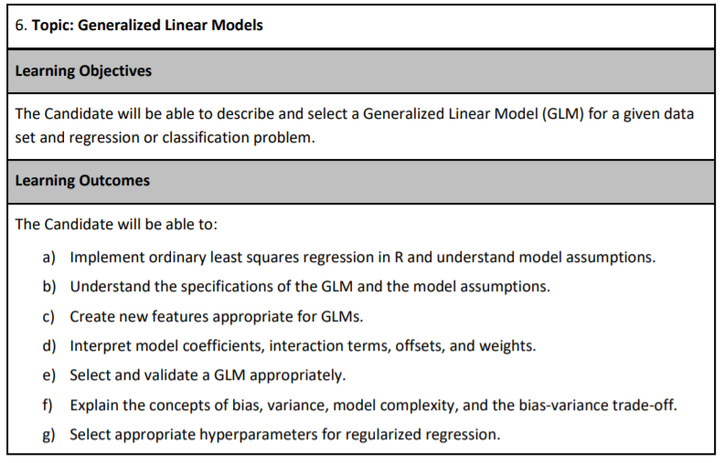
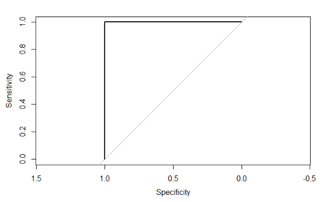
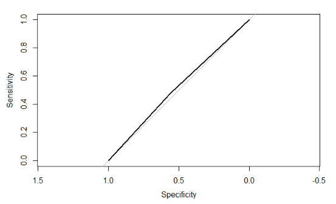
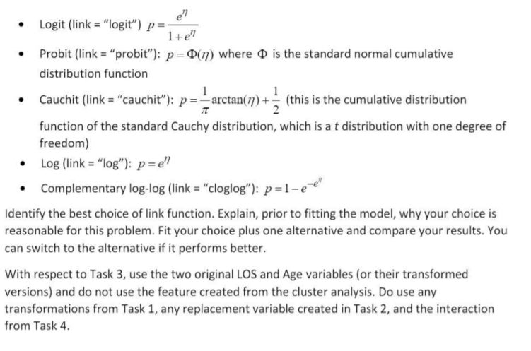

---
output:
  html_document: default
  pdf_document: default
---

```{r echo = F, message = F}
set.seed(1)
library(ggplot2)
theme_set(theme_bw())
```


# Introduction to modeling

About 40-50% of the exam grade is based on modeling. The goal is to be able to predict an unknown quantity. In actuarial applications, this tends to claim that occur in the future, death, injury, accidents, policy lapse, hurricanes, or some other insurable event.

The next few chapters will cover the following learning objectives.


```{r echo = F, fig.align="center", warning=F, out.width="400%"}

```

## Modeling vocabulary
Modeling notation is sloppy because many words mean the same thing.

The number of observations will be denoted by  $n$.  When we refer to the size of a data set, we are referring to $n$.  Each row of the data is called an observation or record. Observations tend to be people, cars, buildings, or other insurable things. These are always independent in that they do not influence one another. Because the Prometric computers have limited power, $n$ tends to be less than 100,000.

Each observation has known attributes called *variables*, *features*, or *predictors*.  We use $p$ to refer the number of input variables that are used in the model.  

The *target*, *response*, *label*, *dependent variable*, or *outcome* variable is the unknown quantity that is being predicted.  We use $Y$ for this.  This can be either a whole number, in which case we are performing regression, or a category, in which case we perform classification.

For example, say that you are a health insurance company that wants to set the premiums for a group of people. The premiums for people who are likely to incur high health costs need to be higher than those likely to be low-cost. 

Older people tend to use more of their health benefits than younger people, but there are always exceptions for those who are very physically active and healthy. Those who have an unhealthy Body Mass Index (BMI) tend to have higher costs than those who have a healthy BMI, but this has less impact on younger people. 

In short, we want to predict the future health costs of a person by taking into account many of their attributes at once.

This can be done in the `health_insurance` data by fitting a model to predict the annual health costs of a person.  The target variable is `y = charges`, and the predictor variables are `age`, `sex`, `bmi`, `children`, `smoker` and `region`.  These six variables mean that $p = 6$.  The data is collected from 1,338 patients, which means that $n = 1,338$.   

## Modeling notation

Scalar numbers are denoted by ordinary variables (i.e., $x = 2$, $z = 4$), and vectors are denoted by bold-faced letters 

$$\mathbf{a} = \begin{pmatrix} a_1 \\ a_2 \\ a_3 \end{pmatrix}$$

We organize these variables into matrices.  Take an example with $p$ = 2 columns and 3 observations.  The matrix is said to be $3 \times 2$ (read as "3-by-2") matrix.

$$
\mathbf{X} = \begin{pmatrix}x_{11} & x_{21}\\
x_{21} & x_{22}\\
x_{31} & x_{32}
\end{pmatrix}
$$

In the health care costs example, $y_1$ would be the costs of the first patient, $y_2$ the costs of the second patient, and so forth.  The variables $x_{11}$ and $x_{12}$ might represent the first patient's age and sex respectively, where $x_{i1}$ is the patient's age, and $x_{i2} = 1$ if the ith patient is male and 0 if female.

Modeling is about using $X$ to predict $Y$. We call this "y-hat", or simply the *prediction*.  This is based on a function of the data $X$.

$$\hat{Y} = f(X)$$

This is almost never going to happen perfectly, and so there is always an error term, $\epsilon$.  This can be made smaller, but is never exactly zero.  

$$
\hat{Y} + \epsilon = f(X) + \epsilon
$$

In other words, $\epsilon = y - \hat{y}$.  We call this the *residual*.  When we predict the health care costs of a person, this is the difference between the predicted costs (which we had created the year before) and the actual costs that the patient experienced (of that current year).

Another way of saying this is in terms of expected value: the model $f(X)$ estimates the expected value of the target $E[Y|X]$.  That is, once we condition on the data $X$, we can make a guess as to what we expect $Y$ to be "close to". We will see that there are many ways of measuring "closeness." 

## Ordinary Least Squares (OLS)

Also known as *simple linear regression*, OLS predicts the target as a weighted sum of the variables.

<iframe width="560" height="315" src="https://www.youtube.com/embed/PaFPbb66DxQ?rel=0&showinfo=1&playlist=nk2CQITm_eo,u1cc1r_Y7M0" frameborder="0" allowfullscreen></iframe>

</br>

We find a $\mathbf{\beta}$ so that 

$$
\hat{Y} = E[Y] =  \beta_0 + \beta_1 X_1 + \beta_2 X_2 + ... + \beta_p X_p
$$

Each $y_i$ is a *linear combination* of $x_{i1}, ..., x_{ip}$, plus a constant $\beta_0$ which is called the *intercept* term.  

In the one-dimensional case, this creates a line connecting the observations.  In higher dimensions, this creates a hyper-plane.

```{r message = F, echo = F,caption = "Linear Regression for 1-dimensional model"}
library(tidyverse)
tibble(y = rnorm(10, 0, 1),
       x = y + 0.4*rnorm(10,0, 1)) %>% 
  ggplot(aes(x,y)) + 
  geom_point( show.legend = F) + 
  geom_smooth(method = "lm", se = F, aes(fill = "linear regression"), color = "red", show.legend = T) + 
  scale_fill_manual(name="legend", values=c("blue", "red")) + 
  theme(legend.position = "top")
```

The red line shows the *expected value* of the target, as the target $\hat{Y}$ is actually a random variable.  For each observation, the model assumes a Gaussian distribution. If there is just a single predictor, $x$, then the mean is $\beta_0 + \beta_1 x$.

```{r echo = F, fig.align="center", message=F, warning = F, out.width="200%"}
knitr::include_graphics("images/conditional_response.jpg")
```

The question then is **how can we choose the best values of** $\beta?$  First of all, we need to define what we mean by "best".  Ideally, we will choose these values which will create close predictions of $Y$ on new, unseen data.  

To solve for $\mathbf{\beta}$, we first need to define a **loss function**. This would let us compare how well a model fits the data. The most commonly used loss function is the residual sum of squares (RSS), also called the **squared error loss or the L2 norm**. When RSS is small, then the predictions are close to the actual values, and the model is a good fit. When RSS is large, the model is a poor fit.

$$\text{RSS} = \sum_i(y_i - \hat{y})^2$$

When you replace $\hat{y_i}$ in the above equation with $\beta_0 + \beta_1 x_1 + ... + \beta_p x_p$, take the derivative with respect to $\beta$, set equal to zero, and solve, we can find the optimal values.  This turns the problem of statistics into a problem of numeric optimization, which computers can do quickly.  

You will also see the term **Root Mean Squared Error** (RMSE) which is just the average of the square root of the $\text{RSS}$, or just **Mean Squared Error** (MSE).

You might be wondering: why does this need to be the squared error? Why not the absolute error or the cubed error? Technically, these could be used, but the betas would not be the maximum likelihood parameters. Using the absolute error results in the model predicting the median as opposed to the mean. Two reasons behind the popularity of RSS are:  

- It provides the same solution if we assume that the distribution of $Y|X$ is Gaussian and maximize the likelihood function.  This method is used for GLMs, in the next chapter.
- It is computationally easier, and computers used to have a difficult time optimizing for MAE.

>What does it mean when a log transform is applied to $Y$?  I remember from my statistics course on regression that this was done.  

This is done so that the variance is closer to being constant. For example, if the units are in dollars, it is very common for the values to fluctuate more for higher values than for lower values. Other types of transformations can correct for skewness.

Consider a stock price, for instance. If the stock is $50 per share, it will go up or down less than $1000 per share. However, the log of 50 is about 3.9, and the log of 1000 is only 6.9, so this difference is smaller. In other words, the variance is smaller.

Transforming the target means that instead of the model predicting $E[Y]$, it predicts $E[log(Y)]$.  A common mistake is to then the take the exponent in an attempt to "undo" this transform, but $e^{E[log(Y)]}$ is not the same as $E[Y]$.


## R^2 Statistic
One of the most common ways of measuring model fit is the “R-Squared” statistic. The RSS provides an absolute measure of fit because it can be any positive value, but it is not always clear what a “good” RSS is because it is measured in units of $Y$.  

The $R^2$ statistic provides an alternative measure of fit. It takes the proportion of variance explained - so that it is always a value between 0 and 1 and is independent of the scale of $Y$.

$$R^2 = \frac{\text{TSS} - \text{RSS}}{\text{TSS}} = 1 - \frac{\text{RSS}}{\text{TSS}}$$

Where $\text{TSS} = \sum(y_i - \hat{y})^2$ is the total sum of squares. TSS measures the total variance in the response YY and can be considered the amount of variability inherent in the response before the regression is performed. In contrast, RSS measures the amount of variability that is left unexplained after performing the regression. 

Hench, $\text{TSS} - \text{RSS}$ measures the amount of variability in the response that is explained (or removed) by performing the regression, and R^2 measures the proportion of variability in $Y$ that can be explained using $X$. 

A value near 1 indicates that the regression has explained a large proportion of the variability in the response, whereas, a number near 0 indicates that the regression did not explain much of the variability in the response. This might occur because the linear model is wrong.

The $R^2$ sstatistic has an interpretational advantage over the RSE. In actuarial applications, it is useful to use an absolute measure of model fit, such as RSS, to train the model, and then use $R^2$ when explaining it to your clients so that it is easier to communicate.

This chapter was based on Chapter 3, *Linear Regression*, of *An Introduction to Statistical Learning.*

## Correlation

*Correlation does not imply causation.*

This is a common saying. Just because two things are correlated does not necessarily mean that one causes the other. Just because most actuaries work remotely when there is cold and snowing does not mean that cold and snow cause anti-social, introverted work habits. A more likely explanation is that actuaries are concerned about driving safely on icy roads and avoiding being involved in a car accident.

### Pearson's correlation

**Pearson correlation:** Measures a linear dependence between two variables $X$ and $Y$. This is the most commonly used correlation method.  

The *correlation* is defined by $r$,

$$r = Cor(X,Y) = \frac{\sum(x_i - \bar{x})(y_i - \bar{y})}{\sqrt{\sum(x_i - \bar{x})^2}\sqrt{(y_i - \bar{y})^2}}$$

and this is also a measure of the linear relationship between two vectors, $X$ and $Y$.  This suggests that we might be able to use $r = Cor(X,Y)$ instead of $R^2$ to assess the model fit.  In the case of simple linear regression, where there is only one predictor variable, it is tree that $R^2 = r^2$; however, this relationship does not extend automatically when there are more than one predictor variable.  This is because $X$ becomes a *matrix* instead of a single *vector.*

### Spearman (rank) correlation

**Spearman correlation:** Computes the correlation between the rank of x and the rank of y variables.

$$rho = \frac{\sum(x' - m_{x'})(y'_i - m_{y'})}{\sqrt{\sum(x' - m_{x'})^2 \sum(y' - m_{y'})^2}}$$
Where $x′=rank(x)$ and $y′=rank(y)$

Most questions on Exam PA will ask you about Pearson’s correlation. One advantage to Spearman over Pearson is that Spearman works for ordinal variables. See Chapter 6 for the difference between **ordinal** and **numeric** variables.

## Regression vs. classification

Regression modeling is when a target is a number. Binary classification is when there are two outcomes, such as “Yes/No,” “True/False,” or “0/1”. Multi-class regression is when there are more than two categories such as “Red, Yellow, Green” or “A, B, C, D, E.” There are many other types of regression that are not covered on this exam, such as ordinal regression, where the outcome is an ordered category, or time-series regression, where the data is time-dependent.

## Regression metrics

For any model, the goal is always to reduce an error metric. This is a way of measuring how well the model can explain the target. 

The phrases “reducing error,” “improving performance,” or “making a better fit” are synonymous with reducing the error. The word “better” means “lower error,” and “worse” means “higher error.”

The choice of error metric has a big difference in the outcome. When explaining a model to a businessperson, using simpler metrics such as R-Squared and Accuracy is convenient. When training the model, however, using a more nuanced metric is almost always better.

These are the regression metrics that are most likely to appear on Exam PA. Memorizing these formulas for AIC and BIC is unnecessary as they are in the R documentation by typing
 `?AIC` or `?BIC` into the R console.

```{r echo = F, fig.align="center", warning=F, message = F, out.width="1300%"}
knitr::include_graphics("images/regression_metrics.png")
```

</br>

```{block, type='studytip'}
Do not forget the most important metric: “usefulness!”. A model with high predictive accuracy but does not meet the needs of the business problem has low usefulness. A model which is easy to explain to the PA exam graders has high usefulness.

>"Some candidates did not consider both predictive power and applicability to the business problem and others gave justifications based on one of these but then chose a model based on the other.” - SOA PA 6/18/20, Task 12 Solution

> "Which of the three models would you recommend for this analysis? Do not base your recommendation solely on the mean squared errors (RMSE) from each model.” - SOA PA 6/13/19, Task 9 Project Statement

```

</br>


### Example: SOA PA 6/18/20, Task 4

> Three points of Investigate correlations.

>1) Create a correlation coefficient matrix for all the numeric variables in the dataset.

>2) Among these pairwise correlations, determine which correlations concern you in building GLM and tree models. The response may differ by model.

>3) State a method other than principal components analysis (PCA) that can be used to handle the correlated variables. Do not implement this method.
 
 

## Example: Health Costs

In our health insurance data, we can predict the health costs of a person based on their age, body mass index and gender. Intuitively, we expect that these costs would increase with the increase in the age of the person, be different for men than for women, and be higher for those who have a less healthy BMI. We create a linear model using `bmi`, `age`, and `sex` as an inputs.

The `formula` controls which variables are included.  There are a few shortcuts for using R formulas.  

| Formula | Meaning  | 
|-------|---------|
| `charges` ~ `bmi` + `age` | Use `age` and `bmi` to predict `charges` |
| `charges` ~ `bmi` + `age` + `bmi`*`age` | Use `age`,`bmi` as well as an interaction to predict `charges` |
| `charges` ~ (`bmi > 20`) + `age` | Use an indicator variable for `bmi > 20` `age` to predict `charges` |
| log(`charges`) ~ log(`bmi`) + log(`age`) | Use the logs of `age` and `bmi` to predict  log(`charges`) |
| `charges` ~ . | Use all variables to predict `charges`|


While you can use formulas to create new variables, the exam questions tend to have you do this in the data itself.  For example, if taking the log transform of a `bmi`, you would add a column `log_bmi` to the data and remove the original `bmi` column.

Below we fit a simple linear model to predict charges.

```{r message = F}
library(ExamPAData)
library(tidyverse)

model <- lm(data = health_insurance, formula = charges ~ bmi + age + sex)
```

The `summary` function gives details about the model.  First, the `Estimate`, gives you the coefficients.  The `Std. Error` is the error of the estimate for the coefficient.  Higher standard error means greater uncertainty.  This is relative to the average value of that variable.  The `p value` tells you how "big" this error really is based on standard deviations.  A small p-value (`Pr (>|t|))`) means that we can safely reject the null hypothesis that says the coefficient is equal to zero.

The little `*`, `**`, `***` tell you the significance level.  A variable with a `***` means that the probability of getting a coefficient of that size given that the data was randomly generated is less than 0.001.  The `**` has a significance level of 0.01, and `*` of 0.05.

```{r}
summary(model)
```

>For this exam, variable selection tends to be based on the 0.05 significance level (single star *).

When evaluating model performance, you should not rely on the  `summary` alone, based on the training data. To look at performance, test the model on validation data. This can be done by either using a hold-out set or cross-validation, which is even better.

Let us create an 80% training set and 20% testing set. You do not need to worry about understanding this code as the exam will always give this to you.


```{r message = F}
set.seed(1)
library(caret)
#create a train/test split
index <- createDataPartition(y = health_insurance$charges, 
                             p = 0.8, list = F) %>% as.numeric()
train <-  health_insurance %>% slice(index)
test <- health_insurance %>% slice(-index)
```

Train the model on the `train` and test on `test`.  

```{r}
model <- lm(data = train, formula = charges ~ bmi + age)
pred = predict(model, test)
```

Let's look at the Root Mean Squared Error (RMSE).  

```{r}
get_rmse <- function(y, y_hat){
  sqrt(mean((y - y_hat)^2))
}

get_rmse(pred, test$charges)
```

And the Mean Absolute Error as well.

```{r}
get_mae <- function(y, y_hat){
  sqrt(mean(abs(y - y_hat)))
}

get_mae(pred, test$charges)
```

The above metrics do not tell us if this is a good model or not by itself. We need a comparison. The fastest check is to compare against a prediction of the mean. In other words, all values of the `y_hat` are the average of `charges`, which is about \$13,000.

```{r}
get_rmse(mean(test$charges), test$charges)
get_mae(mean(test$charges), test$charges)
```

The RMSE and MAE are both higher (worse) when using just the mean, which we expect. If you ever fit a model and get an error that is worse than the average prediction, something must be wrong.

The next test is to see if any assumptions have been violated.

First, is there a pattern in the residuals? If there is, this means that the model is missing key information. 

For the model below, this is a yes, which means that this is a bad model. Because this is just for illustration, we are going to continue using it.
  

```{r fig.cap="Residuals vs. Fitted"}
plot(model, which = 1)
```
The normal QQ shows how well the quantiles of the predictions fit a theoretical normal distribution. If this is true, then the graph is a straight 45-degree line. In this model, you can see that this is not the case. If this were a good model, this distribution would be closer to normal.

```{r fig.cap="Normal Q-Q"}
plot(model, which = 2)
```

Once you have chosen your model, you should re-train over the entire data set. This is to make the coefficients more stable because `n` is larger. Below you can see that the standard error is lower after training over the entire data set.

```{r }
all_data <- lm(data = health_insurance, 
               formula = charges ~ bmi + age)
testing <- lm(data = test, 
              formula = charges ~ bmi + age)
```

```{r fig.cap="Coefficient Standard Error on Test vs. All Data", echo = F, message=F}
library(broom)
library(kableExtra)
all_data %>% 
  tidy() %>% 
  select(term, std.error) %>% 
  left_join(testing %>% tidy() %>% select(term, std.error), by = "term") %>% 
  rename(full_data_std_error = std.error.x, test_data_std_error = std.error.y) %>% 
  mutate_if(is.numeric, ~round(.x, 1)) %>% 
  kableExtra::kable("markdown")
```

All interpretations should be based on the model which was trained on the entire data set. This only makes a difference if you are interpreting the precise values of the coefficients. If you are just looking at which variables are included or at the size and sign of the coefficients, then this would probably not make a difference.

```{r}
coefficients(model)
```

Translating the above into an equation we have

$$\hat{y_i} = -4,526 + 287 \space\text{bmi} + 228\space \text{age}$$

For example, if a patient has `bmi = 27.9` and `age = 19` then predicted value is 

$$\hat{y_1} = 4,526 + (287)(27.9) + (228)(19) = 16,865$$

This model structure implies that each of the variables $x_1, ..., x_p$ each change the predicted $\hat{y}$.  If $x_{ij}$ increases by one unit, then $y_i$ increases by $\beta_j$ units, regardless of what happens to all of the other variables.  This is one of the main assumptions of linear models: *variable independence*.  If the variables are correlated, say, then this assumption will be violated.  

| Readings |  | 
|-------|---------|
| ISLR 2.1 What is statistical learning?|  |
| ISLR 2.2 Assessing model accuracy|  |


# Generalized linear Models (GLMs)

[](https://exampa.net/)

Already enrolled?  Watch the full video: <a target="_parent" href="https://course.exampa.net/mod/page/view.php?id=136">Practice Exams + Lessons</a>

GLMs are a broad category of models. Ordinary Least Squares and Logistic Regression are both examples of GLMs.

### Assumptions of OLS

We assume that the target is Gaussian with a mean equal to the linear predictor. This can be broken down into two parts:

1. A *random component*: The target variable $Y|X$ is normally distributed with mean $\mu = \mu(X) = E(Y|X)$

2. A link between the target and the covariates (also known as the systemic component) $\mu(X) = X\beta$

This says that each observation follows a normal distribution that has a mean that is equal to the linear predictor. Another way of saying this is that “after we adjust for the data, the error is normally distributed and the variance is constant.” If $I$ is an n-by-in identity matrix, and $\sigma^2 I$ is the covariance matrix, then

$$
\mathbf{Y|X} \sim N( \mathbf{X \beta}, \mathbf{\sigma^2} I)
$$

### Assumptions of GLMs

GLMs are more general which eludes that they are more flexible. We relax these two assumptions by saying that the model is defined by

1. A random component: $Y|X \sim \text{some exponential family distribution}$

2. A link: between the random component and covariates: 

$$g(\mu(X)) = X\beta$$
where $g$ is called the *link function* and $\mu = E[Y|X]$.

Each observation follows some type of exponential distribution (Gamma, Inverse Gaussian, Poisson, Binomial, etc.), and that distribution has a mean which is related to the linear predictor through the link function. Additionally, there is a dispersion parameter, but that is more info is needed here. For an explanation, see [Ch. 2.2 of CAS Monograph 5](https://contentpreview.s3.us-east-2.amazonaws.com/CAS+Monograph+5+-+Generalized+Linear+Models+for+Insurance+Ratemaking.pdf).

## Advantages and disadvantages

There is usually at least one question on the PA exam which asks you to “list some of the advantages and disadvantages of using this particular model,” and so here is one such list. It is unlikely that the grader will take off points for including too many comments and so a good strategy is to include everything that comes to mind.

**GLM Advantages**

- Easy to interpret
- Can easily be deployed in spreadsheet format
- Handles different response/target distributions
- Is commonly used in insurance ratemaking

**GLM Disadvantages**

- Does not select features (without stepwise selection)
- Strict assumptions around distribution shape and randomness of error terms
- Predictor variables need to be uncorrelated
- Unable to detect non-linearity directly (although this can manually be addressed through feature engineering)
- Sensitive to outliers
- Low predictive power

## GLMs for regression

For regression problems, we try to match the actual distribution to the distribution of the model being used in the GLM. These are the most likely distributions.

The choice of target distribution should be similar to the actual distribution of $Y$.  For instance, if $Y$ is never less than zero, then using the Gaussian distribution is not ideal because this can allow for negative values. If the distribution is right-skewed, then the Gamma or Inverse Gaussian may be appropriate because they are also right-skewed. 

```{r fig.height = 4, message = F, echo = F, warning = F, fig.align="center"}
library(mgcv)
library(ggpubr)
sample_size = 3000
p1 <- tibble(gaussian = rnorm(sample_size),
       gamma = rgamma(sample_size, 1, 1/2),
       inverse_gaussian = rig(sample_size, 1, 2)) %>% 
  gather(distribution, values) %>% 
  ggplot(aes(values)) + 
  geom_density(fill = "blue", alpha = 0.2) + 
  facet_wrap(vars(distribution), scales = "free") + 
  ggtitle("Continuous Target Distributions") + 
  xlab("")

p2 <- tibble(poisson = rpois(sample_size, 1),
       binomial = rbinom(sample_size, 10, 0.5)) %>% 
  gather(distribution, values) %>% 
  ggplot(aes(values)) + 
  geom_histogram(fill = "blue", alpha = 0.2) + 
  facet_wrap(vars(distribution), scales = "free") + 
  ggtitle("Discrete Target Distributions") + 
  xlab("")

ggarrange(p1,p2,nrow=2)
```

Notice that the top three distributions are continuous but the bottom two are discrete.  

```{r echo = F, fig.align="center", warning=F, out.width="250%"}
knitr::include_graphics("images/response_distributions.png")
```

There are five link functions for a continuous $Y$, , although the choice of distribution family will typically rule out several of these immediately. The linear predictor (a.k.a., the systemic component) is $z$ and the link function is how this connects to the expected value of the response.

$$z = X\beta = g(\mu)$$

```{r echo = F, fig.align="center", warning=F, message = F, out.width="200%"}
knitr::include_graphics("images/link_functions.png")
```

If the target distribution must have a positive mean, such as in the Inverse Gaussian or Gamma, then the Identity or Inverse links are poor choices because they allow for negative values; the mean range is $(-\infty, \infty)$.  The other link functions force the mean to be positive. 

## Interpretation of coefficients

The GLM's interpretation depends on the choice of link function.  

### Identity link

This is the easiest to interpret.  For each one-unit increase in $X_j$, the expected value of the target, $E[Y]$, increases by $\beta_j$, assuming that all other variables are held constant.

### Log link

This is the most popular choice when the results need to be easy to understand.  Simply take the exponent of the coefficients and the model turns into a product of numbers being multiplied together.

$$
log(\hat{Y}) = X\beta \Rightarrow \hat{Y} = e^{X \beta}
$$

For a single observation $Y_i$, this is

$$
\text{exp}(\beta_0 + \beta_1 X_{i1} + \beta_2 X_{i2} + ... + \beta_p X_{ip}) = \\
e^{\beta_0} e^{\beta_1 X_{i1}}e^{\beta_2 X_{i2}} ...  e^{\beta_p X_{ip}} = 
R_{i0} R_{i2} R_{i3} ... R_{ip}
$$

$R_{ik}$ is known as the *relativity* is known as the relativity of the kth variable. This terminology is from insurance ratemaking, where actuaries need to explain the impact of each variable to insurance regulators.

Another advantage to the log link is that the coefficients can be interpreted as having a percentage change on the target. Here is an example for a GLM with variables $X_1$ and $X_2$ and a log link function. This holds any continuous target distribution.

| Variable    | $\beta_j$ | $e^{\beta_j} - 1$ | Interpretation                                    | 
|-------------|-------------|----------------------|---------------------------------------------------| 
| (intercept) | 0.100       | 0.105                |                                                   | 
| $X_1$          | 0.400       | 0.492                | 49% increase in $E[Y]$ for each unit increase in $X_1$* | 
| $X_2$          | -0.500      | -0.393               | 39% decrease in $E[Y]$ for each unit increase in $X_2$* | 


If categorical predictors are used, then the interpretation is very similar.  Say that there is one predictor, `COLOR`, which takes on values of `YELLOW` (reference level), `RED`, and `BLUE`.  


| Variable    | $\beta_j$ | $e^{\beta_j} - 1$  | Interpretation                                          | 
|-------------|-------------|----------------------|---------------------------------------------------------| 
| (intercept) | 0.100       | 0.105                |                                                         | 
| Color=RED   | 0.400       | 0.492                | 49% increase  in $E[Y]$ for RED cars as opposed to YELLOW cars*| 
| Color=BLUE  | -0.500      | -0.393               | 39% decrease in $E[Y]$ for BLUE cars rather than YELLOW cars*| 

\* Assuming all other variables are held constant.


</br>

```{block, type='studytip'}
**Warning:** Never take the log of Y with a GLM! This is a common mistake because we handled skewness for multiple linear regression models, but that was before we had the GLM in our toolbox. Do not move on until you understand the difference between these two models: 

`glm(y ~ x, family = gaussian(link = "log"), data = data)` 

`glm(log(y) ~ x, family = gaussian(link = "identity"), data = data)`

The first says that the target has a Gaussian distribution which has a mean equal to the log of the linear predictor. The second says that the target's log has a Guassian distribution that is exactly equal to the linear predictor. You will remember from Exam P that when you apply a transform to a random variable, the distribution changes completely. Try running the above examples on real data and see if you can spot the differences in the results.
```

</br>


## Other links

The other link functions are not straightforward to interpret using math. One solution is to use the **model-demo-method**. See the example at the end of this next chapter.


# GLMs for classification

For classification, the predicted values need to be a category instead of a number. Using a discrete target distribution ensures that this will be the case. The probability of an event occurring is $E[Y] = p$. Unlike the continuous case, all of the link functions have the same range between 0 and 1 because this is a probability.

These StatQuest videos explain the most common type of GLM classification model: Logistic regression.


<iframe width="560" height="315" src="https://www.youtube.com/embed/PaFPbb66DxQ?rel=0&showinfo=1&playlist=yIYKR4sgzI8,vN5cNN2-HWE,BfKanl1aSG0,xxFYro8QuXA,C4N3_XJJ-jU" frameborder="0" allowfullscreen></iframe>


## Binary target

When $Y$ is binary, then the Binomial distribution is the only choice. If there are multiple categories, then the Multinomial should be used.

## Count target 

When $Y$ is a count, the Poisson distribution is the only choice. Two examples are counting the number of claims a policy has in a given year or counting the number of people visiting the ER in a given month. The key ingredients are 1) some events and 2) some fixed periods.

Statistically, the name for this is a Poisson Process, which describes a series of discrete events where the average time between events is known, called the "rate" $\lambda$, but the exact timing of events is unknown. For a time interval of length $m$, the expected number of events is $\lambda m$.  

By using a GLM, we can fit a different rate for each observation. In the ER example, each patient would have a different rate. Those who are unhealthy or who work in risky environments would have a higher rate of ER visits than those who are healthy and work in offices.

$$Y_i|X_i \sim \text{Poisson}(\lambda_i m_i)$$


When all observations have the same exposure, $m = 1$.  When the mean of the data is far from the variance, an additional parameter known as the dispersion parameter is used. A classic example is when modeling insurance claim counts, which have a lot of zero claims. Then the model is said to be an “over-dispersed Poisson” or “zero-inflated” model.  

## Link functions

There are four link functions. The most common are the Logit and Probit, but the Cauchit and Cloglog did appear on the Hospital Readmissions practice exam of SOA in 2019. The identity link does not make sense for classification because it would result in predictions being outside of $(0,1)$

```{r echo = F, fig.align="center", warning=F, message = F, out.width="1200%"}
knitr::include_graphics("images/discrete_link_functions.png")
```

> The *logit* is also known as the *standard logistic function* or *sigmoid* and is also used in deep learning.

Below we see how the linear predictor (x-axis) gets converted to a probability (y-axis).  

```{r warning = F, message = F, echo = F, fig.align="center"}
library(purrr)
tibble(z = seq(-9, 9, 0.01)) %>% 
  mutate(
    logit = exp(z)/(1 + exp(z)),
    probit = map_dbl(z, ~pnorm(.x)),
    cauchit = 1/3.14*atan(z) + 1/2,
    cloglog = 1 - exp(-exp(z))
         ) %>% 
  gather(link_function, mean_target, -z) %>% 
  ggplot(aes(z, mean_target, color = link_function)) +
  geom_line() + 
  theme_bw() + 
  xlab("Z = Linear Predictor") + 
  ylab("Predicted Probability") + 
  theme(legend.position = "top")
```

- <span style="color:#85C1E9 ">Logit: </span> Most commonly used; default in R; canonical link for the binomial distribution.
- <span style="color:purple ">Probit: </span> Sharper curves than the other links which may have best performance for certain data; Inverse CDF of a standard normal distribution makes it easy to explain.
- <span style="color:red ">Cauchit: </span> Very gradual curves may be best for certain data;  CDF for the standard Cauchy distribution which is a t distribution with one degree of freedom.
- <span style="color:green">Complimentary Log-Log (cloglog)</span> Asymmetric; Important in survival analysis (not on this exam).


## Interpretation of coefficients

Interpreting the coefficients in classification is trickier than in classification because the result must always be within $(0,1)$.  

### Logit

The link function $log(\frac{p}{1-p})$ is known as the log-odds, where the odds are $\frac{p}{1-p}$.  These come up in gambling, where bets are placed on the odds of some event occurring. For example: if the probability of a claim is $p = 0.8$, then the probability of no claim is 0.2 and the odds of a claim occurring are 0.8/0.2 = 4.  

The transformation from probability to odds is monotonic.  This is a fancy way of saying that if $p$ increases, then the odds of $p$ increases as well, and vice versa if $p$ decreases.  The log transform is monotonic as well.  

The net result is that when a variable increases the linear predictor, this increases the log odds, increasing the log of the odds, and vice versa if the linear predictor decreases. In other words, the signs of the coefficients indicate whether the variable increases or decreases the probability of the event.

### Probit, Cauchit, Cloglog

These link functions are still monotonic, so the sign of the coefficients can be interpreted to mean that the variable has a positive or negative impact on the target.

More extensive interpretation is not straightforward. In the case of the Probit, instead of dealing with the log-odds function, we have the inverse CDF of a standard Normal distribution (a.k.a., a Gaussian distribution with mean 0 and variance 1). There is no way of taking this inverse directly.


## Demo the model for interpretation

For uglier link functions, we can rely on trial-and-error to interpret the result. We will call this the **“model-demo method**, " which, as the name implies, involves running example cases and seeing how the results change.

This method works not only for categorical GLMs, but any other type of models such as a continuous GLM, GBM, or random forest.

See the example from **SOA PA 12/12/19** below to learn how this works.


## Example - Auto Claims

Using the `auto_claim` data, we predict whether or not a policy has a claim.  This is also known as the *claim frequency*.

```{r}
auto_claim %>% count(CLM_FLAG)
```

About 40% do not have a claim while 60% have at least one claim.

```{r}
set.seed(42)
index <- createDataPartition(y = auto_claim$CLM_FLAG, 
                             p = 0.8, list = F) %>% as.numeric()
auto_claim <- auto_claim %>% 
  mutate(target = as.factor(ifelse(CLM_FLAG == "Yes", 1,0)))
train <-  auto_claim %>% slice(index)
test <- auto_claim %>% slice(-index)

frequency <- glm(target ~ AGE + GENDER + MARRIED + CAR_USE + 
                   BLUEBOOK + CAR_TYPE + AREA, 
                 data=train, 
                 family = binomial(link="logit"))
```

All of the variables except for the `CAR_TYPE` and `GENDERM` are highly significant.  The car types `SPORTS CAR` and `SUV` appear to be significant, and so if we wanted to make the model simpler we could create indicator variables for `CAR_TYPE == SPORTS CAR` and `CAR_TYPE == SUV`.

```{r}
frequency %>% summary()
```

The signs of the coefficients tell if the probability of having a claim is either increasing or decreasing by each variable. For example, the likelihood of an accident

* Decreases as the age of the car increases
* Is lower for men 
* Is higher for sports cars and SUVs

The p-values tell us if the variable is significant.

- `Age`, `MarriedYes`, `CAR_USEPrivate`, `BLUEBOOK`, and `AreaUrban` are significant.
- Certain values of `CAR_TYPE` are significant but others are not.

The output is a predicted probability.  We can see that this is centered around a probability of about 0.3.  

```{r fig.cap="Distribution of Predicted Probability", fig.width=5, fig.height=3, message = F}
preds <- predict(frequency, newdat=test,type="response")
qplot(preds) 
```

In order to convert these values to predicted 0's and 1's, we assign a *cutoff* value so that if $\hat{y}$ is above this threshold we use a 1 and 0 otherwise. The default cutoff is 0.5. We change this to 0.3 and see that there are 763 policies predicted to have claims.

```{r}
test <- test %>% mutate(pred_zero_one = as.factor(1*(preds>.3)))
summary(test$pred_zero_one)
```

How do we decide on this cutoff value? We need to compare cutoff values based on some evaluation metrics. For example, we can use *accuracy*.

$$\text{Accuracy} = \frac{\text{Correct Guesses}}{\text{Total Guesses}}$$

This results in an accuracy of 70%.  But is this good?

```{r}
test %>% summarise(accuracy = mean(pred_zero_one == target))
```

Consider what would happen if we just predicted all 0's.  The accuracy is 74%.

```{r}
test %>% summarise(accuracy = mean(0 == target))
```

For policies which experience claims the accuracy is 63%.

```{r}
test %>% 
  filter(target == 1) %>% 
  summarise(accuracy = mean(pred_zero_one == target))
```

But for policies that don't actually experience claims this is 72%.  

```{r}
test %>% 
  filter(target == 0) %>% 
  summarise(accuracy = mean(pred_zero_one == target))
```

How do we know if this is a good model? We can repeat this process with a different cutoff value and get different accuracy metrics for these groups. Let us use a cutoff of 0.6.

75%

```{r}
test <- test %>% mutate(pred_zero_one = as.factor(1*(preds>.6)))
test %>% summarise(accuracy = mean(pred_zero_one == target))
```

10% for policies with claims and 98% for policies without claims.  

```{r}
test %>% 
  filter(target == 1) %>% 
  summarise(accuracy = mean(pred_zero_one == target))

test %>% 
  filter(target == 0) %>% 
  summarise(accuracy = mean(pred_zero_one == target))
```

The punchline is that the accuracy depends on the cutoff value, and changing the cutoff value changes whether the model is accurate for the “true = 1” classes (policies with actual claims) vs. the “false = 0” classes (policies without claims).

# Classification metrics

For regression problems, when the output is a whole number, we can use the sum of squares $\text{RSS}$, the r-squared $R^2$, the mean absolute error $\text{MAE}$, and the likelihood.  For classification problems we need to a new set of metrics.  
  
A *confusion matrix* shows is a table that summarizes how the model classifies each group.

- No claims and predicted to not have claims - **True Negatives (TN) = 1,489**
- Had claims and predicted to have claims - **True Positives (TP) = 59**
- No claims but predicted to have claims - **False Positives (FP) = 22**
- Had claims but predicted not to - **False Negatives (FN) = 489**

```{r}
confusionMatrix(test$pred_zero_one,factor(test$target))$table
```

These definitions allow us to measure performance on the different groups.

*Precision* answers the question "out of all of the positive predictions, what percentage were correct?"

$$\text{Precision} = \frac{\text{TP}}{\text{TP} + \text{FP}}$$

*Recall* answers the question "out of all of positive examples in the data set, what percentage were correct?"

$$\text{Recall} = \frac{\text{TP}}{\text{TP} + \text{FN}}$$

The choice of using precision vs. recall depends on the relative cost of making an FP or an FN error. If FP errors are expensive, then use precision; if FN errors are expensive, then use recall.

**Example A:** the model is trying to detect a deadly disease, which only 1 out of every 1,000 patients survives without early detection. Then the goal should be to optimize **recall** because we would want every patient that has the disease to get detected.

**Example B:** the model is detecting which emails are spam or not. If an important email is flagged as spam incorrectly, the cost is 5 hours of lost productivity. In this case, **precision** is the main concern.

In some cases, we can compare this “cost” in actual values. For example, if a federal court is predicting if a criminal will recommit or not, they can agree that “1 out of every 20 guilty individuals going free” in exchange for “90% of those who are guilty being convicted”. 

A dollar amount can be used when money is involved: flagging non-spam as spam may cost $100, whereas missing a spam email may cost $2. Then the cost-weighted accuracy is


$$\text{Cost} = (100)(\text{FN}) + (2)(\text{FP})$$

The cutoff value can be tuned in order to find the minimum cost.

Fortunately, all of this is handled in a single function called `confusionMatrix`.

```{r}
confusionMatrix(test$pred_zero_one,factor(test$target))
```

## Area Under the ROC Curve (AUC)

What if we look at both the true-positive rate (TPR) and false-positive rate (FPR) simultaneously? That is, for each value of the cutoff, we can calculate the TPR and TNR. 

For example, say that we have 10 cutoff values, $\{k_1, k_2, ..., k_{10}\}$.  Then for each value of $k$ we calculate both the true positive rates

$$\text{TPR} = \{\text{TPR}(k_1), \text{TPR}(k_2), .., \text{TPR}(k_{10})\} $$ 

and the true negative rates

$$\{\text{FNR} = \{\text{FNR}(k_1), \text{FNR}(k_2), .., \text{FNR}(k_{10})\}$$

Then we set `x = TPR` and `y = FNR` and graph x against y. The resulting plot is called the **Receiver Operator Curve (ROC)** and the the Area Under the Curve is called the AUC.

<iframe width="560" height="315" src="https://www.youtube.com/embed/4jRBRDbJemM" frameborder="0" allow="accelerometer; autoplay; clipboard-write; encrypted-media; gyroscope; picture-in-picture" allowfullscreen></iframe>

You can also think of AUC as being a **probability.**  Unlike a conventional probability, this ranges between 0.5 and 1 instead of 0 and 1. In the Logit example, we were predicting whether or not an auto policy would file a claim. Then you can interpret the AUC as

- The expected proportion of positives ranked before a uniformly drawn random negative

- The probability that a model prediction for a policy that filed a claim is greater than the model prediction for a policy that did not file a claim

- The expected true positive rate if the ranking is split just before a uniformly drawn random negative.

- The expected proportion of negatives ranked after a uniformly drawn random positive.

- The expected false positive rate if the ranking is split just after a uniformly drawn random positive.

You can save yourself time by memorizing these three scenarios:

$$ \text{AUC} = 1.0 $$

```{r echo = F, fig.align="center", warning=F, out.width="50%"}

```


This is a perfect model that predicts the correct class for new data each time. It will have a ROC plot showing the curve approaching the top left corner so that the square area is 1.0.

$$ \text{AUC} = 0.5 $$*

```{r echo = F, fig.align="center", warning=F, out.width="50%"}

```

When the ROC curve runs along the diagonal, then the area is 0.5. This performance is no better than randomly selecting the class for new data such that the proportions of each class match that of the data.

$$ \text{AUC} < 0.5 $$
Any model having an AUC less than 0.5 means providing predictions that are worse than random selection, with a near 0 AUC indicating that the model makes the wrong classification almost every time. This can occur in two ways

1)	The model is overfitting. For example, the AUC on the train data set may be higher than 0.8 but only 0.2 on the test data set. This indicates that you need to adjust the parameters of your model. See the chapter on the Bias-Variance Tradeoff.

2)	There is an error in the AUC calculation or model prediction.


## Example - Auto Claims

Let's create an ROC curve and find the AUC for our logit.  

```{r message=F, fig.cap="AUC for auto_claim"}
library(pROC)
roc(test$target, preds, plot = T)
```

If we just randomly guess, the AUC would be 0.5, represented by the 45-degree line. A perfect model would maximize the curve to the upper-left corner.

The AUC of 0.76 is decent. If we had multiple models, we could compare them based on the AUC.  

In general, AUC is preferred over Accuracy when there are many more “true” classes than “false” classes, which is known as having *class imbalance*. An example is bank fraud detection: 99.99% of bank transactions are “false” or “0” classes, and so optimizing for accuracy alone will result in a low sensitivity for detecting actual fraud.


## Example: SOA HR, Task 5

The following question is from the Hospital Readmissions sample project from 2018.

<iframe src="https://player.vimeo.com/video/467845050?title=0&byline=0&portrait=0" width="640" height="360" frameborder="0" allow="autoplay; fullscreen" allowfullscreen></iframe>

Already enrolled?  Watch the full video: <a target="_parent" href="https://course.exampa.net/mod/page/view.php?id=202
">Practice Exams</a> | <a target="_parent" href="https://course.exampa.net/mod/page/view.php?id=153
">Practice Exams + Lessons</a>

>"With the target variable being only 0 or 1, the binomial distribution is the only reasonable choice. Your assistant has done some research and learned that for the glm package in R, five link functions could be used with the binomial distribution. They are shown below (the inverse of the link function is presented here as it represents how the linear predictor is transformed into the actual response), where $\nu$ is the linear predictor and $\p$ is the response.

```{r echo = F, fig.align="center", warning=F, message = F, out.width="1200%"}

```

## Example: SOA PA 12/12/19, Task 11

<iframe src="https://player.vimeo.com/video/467848221?title=0&byline=0&portrait=0" width="640" height="360" frameborder="0" allow="autoplay; fullscreen" allowfullscreen></iframe>

Already enrolled?  Watch the full video: <a target="_parent" href="https://course.exampa.net/mod/page/view.php?id=206
">Practice Exams</a> | <a target="_parent" href="https://course.exampa.net/mod/page/view.php?id=157
">Practice Exams + Lessons</a>

>Marketing has asked to demonstrate how your model is to be used with examples of cases that predict high value and cases that predict low value. Your assistant has prepared some sample cases that can be run through your model. You may need to adjust some of them to obtain illustrative examples of interest in marketing.

>Write, in language appropriate for marketing, the illustration and demonstration they are looking for. This demonstration should be more detailed than what will go into your executive summary (including an example).

>The sample cases are provided here and in your report template if you wish to include them in your report.

probability of each case. You need to create the column **Prob of high** using your GLM. Then you assign each case as being “High” or “Low” depending on if this value is above the cutoff.

The values that change are in bold.

|age|education num|marital status    |occupation|cap_ga in|hours_per week|score|**Prob of high**|**Value**|
|---|-------------|------------------|----------|---------|--------------|-----|------------|-----|
|39 |10           |Married-spouse    |Group 3   |0        |40            |60   |0.32     |High |
|39 |10           |**Never-married**    |Group 3   |0        |40            |60   |0.24      |**Low** |
|39 |**5**           |Married-spouse    |Group 3   |0        |40            |60   |0.39       |High |
|39 |10           |Married-spouse    |**Group 5**   |0        |40            |60   |0.80     |High |
|39 |10           |Married-spouse    |Group 3   |0        |**30**            |60   |0.18        |**Low**  |

You can interpret this as:

- The typical profitable customer is middle aged (39 years old), has 10 years of education, is married, and in group 3
- Having never been married decreases profitability
- Being less educated does not decreases profitability.  You can see this because the customer with `education_num = 5` has the same characteristics as the first customer
- Being in Group 5 increases profitability.  You can see this because `Prob of high` increases to 0.8.
- Working fewer than 40 hours per week decreases profitability

This was a difficult question. “Do not be afraid to be assertive and think creatively or to change the values that they give you,” the solution of SOA say.

>Many candidates struggled with this task. Candidates needed to include sample cases that resulted in low and high-value predictions and clearly describe the analysis for the marketing team.

>Candidates were encouraged to modify the supplied cases. Few elected to test changes in both directions from the base case.

## Additional reading

| Title | Source           |
|---------|-----------------|
| An Overview of Classification   | ISL 4.1 |
| [Understanding AUC - ROC Curv](https://towardsdatascience.com/understanding-auc-roc-curve-68b2303cc9c5#:~:targetText=What%20is%20AUC%20%2D%20ROC%20Curve%3F,capable%20of%20distinguishing%20between%20classes.)| Sarang Narkhede, Towards Data Science   |
| [Precision vs. Recall](https://towardsdatascience.com/precision-vs-recall-386cf9f89488#:~:targetText=Precision%20and%20recall%20are%20two,correctly%20classified%20by%20your%20algorithm.)     | Shruti Saxena, Towards Data Science    |


# Additional GLM topics

As you can tell, PA has a lot of small topics related to GLMs.  This chapter completes some of the *residual* (no pun intended) topics.  

## Residuals

Learning from mistakes is the path to improvement. For GLMs, the residual analysis looks for patterns in the errors to find ways of improving the model.

<iframe width="563" height="383" src="https://www.youtube.com/embed/9T0wlKdew6I" frameborder="0" allow="accelerometer; autoplay; clipboard-write; encrypted-media; gyroscope; picture-in-picture" allowfullscreen></iframe>

### Raw residuals

The word “residual” by itself means the “raw residual” in GLM language. This is the difference in actual vs. predicted values.

$$\text{Raw Residual} = y_i - \hat{y_i}$$

### Deviance residuals

This is not meant for GLMs with non-Gaussian distributions. To adjust for other distributions, we need the concept of deviance residuals.

<iframe width="563" height="383" src="https://www.youtube.com/embed/JC56jS2gVUE" frameborder="0" allow="accelerometer; autoplay; clipboard-write; encrypted-media; gyroscope; picture-in-picture" allowfullscreen></iframe>

Deviance is a way of assessing the adequacy of a model by comparing it with a more general model with the maximum number of parameters that can be estimated. It is referred to as the saturated model and it has one parameter per observation. 

The deviance assesses the goodness of fit for the model by looking at the difference between the log-likelihood functions of the saturated model and the model under investigation, i.e. $l(b_{sat},y) - l(b,y)$. Here sat $b_{sat}$ denotes the maximum likelihood
estimator of the parameter vector of the saturated model, $\beta_{sat}$ , and $b$ is the maximum
likelihood estimator of the parameters of the model under investigation, $\beta$. The maximum likelihood estimator is the estimator that maximizes the likelihood function.  **The deviance is defined as**

$$D = 2[l(b_{sat},y) - l(b,y)]$$

The deviance residual uses the deviance of the ith observation $d_i$ and then takes the square root and applies the same sign (aka, the + or - part) of the raw residual.

$$\text{Deviance Residual} = \text{sign}(y_i - \hat{y_i})\sqrt{d_i}$$

## Example

Just as with OLS, there is a `formula` and `data argument`.  In addition, we need to specify the target distribution and link function.

```{r}
model = glm(formula = charges ~ age + sex + smoker, 
            family = Gamma(link = "log"),
            data = health_insurance)
```

We see that `age`, `sex`, and `smoker` are all significant (p <0.01).  Reading off the coefficient signs, we see that claims

- Increase as age increases
- Are higher for women
- Are higher for smokers

```{r}
model %>% tidy()
```

Below you can see graph of deviance residuals vs. the predicted values.

**If this were a perfect model, all of these below assumptions would be met:**

- Scattered around zero? 
- Constant variance? 
- No obvious pattern? 

```{r}
plot(model, which = 3)
```

The quantile-quantile (QQ) plot shows the quantiles of the deviance residuals (i.e., after adjusting for the Gamma distribution) against theoretical Gaussian quantiles.  

**In a perfect model, all of these assumptions would be met:**

- Points lie on a straight line?  
- Tails are not significantly above or below line?  Some tail deviation is ok.
- No sudden "jumps"?  This indicates many $Y$'s which have the same value, such as insurance claims which all have the exact value of \$100.00 or $0.00.

```{r}
plot(model, which = 2)
```

## Log transforms of predictors

When a log link is used, taking the natural logs of continuous variables allows for the scale of each predictor to match the scale of the thing that they are predicting, the log of the mean of the response. In addition, when the distribution of the continuous variable is skewed, taking the log helps to make it more symmetric.


For $\mu$ the mean response,

$$log(\mu) = \beta_0 + \beta_1 log(X)$$
To solve for $\mu$, take the exponent of both sides

$$\mu = e^{\beta_1} e^{\beta_1 log(X)} = e^{\beta_0} X^{\beta_1}$$

## Example

In the Hospital Readmission sample project, one of the predictor variables, “Length of stay”, is the number of days since a person has been readmitted to the hospital. You can tell that it is right-skewd because the median is higher than the mean.

```{r}
summary(readmission$LOS)
```

But it could also be thought of as a discrete variable because it only takes on 36 values. **Should you still apply a log transform?**

```{r}
readmission %>% count(LOS)
```

Here are the histograms

```{r echo = F, warning=F, message = F, fig.height=4}
library(ggpubr)
p1 <- readmission %>% ggplot(aes(LOS)) + geom_histogram() + ggtitle("Without Log Transform")
p2 <- readmission %>% ggplot(aes(log(LOS))) + geom_histogram() + ggtitle("With Log Transform")
ggarrange(p1,p2)
```

**Yes**, the SOA's solution applys the log transform.

## Reference levels

When a categorical variable is used in a GLM, the model actually uses indicator variables for each level.  The default reference level is the order of the R factors.  For the `sex` variable, the order is `female` and then `male`.  This means that the base level is `female` by default.

```{r}
health_insurance$sex %>% as.factor() %>% levels()
```

Why does this matter?  Statistically, the coefficients are most stable when there are more observations.

```{r}
health_insurance$sex %>% as.factor() %>% summary()
```

There is already a function to do this in the `tidyverse` called `fct_infreq`.  Let's quickly fix the `sex` column so that these factor levels are in order of frequency.

```{r}
health_insurance <- health_insurance %>% 
  mutate(sex = fct_infreq(sex))
```

Now `male` is the base level.

```{r}
health_insurance$sex %>% as.factor() %>% levels()
```

## Interactions

An interaction occurs when the effect of a variable on the response is different depending on the level of other variables in the model.

Consider this model:


Let $x_2$ be an indicator variable, which is 1 for some observations and 0 otherwise.  

$$\hat{y_i} = \beta_0 + \beta_1 x_1 + \beta_2 x_2 + \beta_3 x_1 x_2$$

There are now two different linear models depending on whether `x_1` is 0 or 1.

When $x_1 = 0$,

$$\hat{y_i} = \beta_0  + \beta_2 x_2$$

and when $x_1 = 1$

$$\hat{y_i} = \beta_0 + \beta_1 + \beta_2 x_2 + \beta_3 x_2$$
By rewriting this we can see that the intercept changes from $\beta_0$ to $\beta_0^*$ and the slope changes from $\beta_1$ to $\beta_1^*$

$$
(\beta_0 + \beta_1) + (\beta_2 + \beta_3 ) x_2 \\
 = \beta_0^* + \beta_1^* x_2
$$
Here is an example from the `auto_claim` data. The lines show the slope of a linear model, assuming that only `BLUEBOOK` and `CAR_TYPE` were predictors in the model.  You can see that the slope for Sedans and Sports Cars is higher than for Vans and Panel Trucks.  

```{r fig.cap="Example of strong interaction" ,warning = F}
auto_claim %>% 
  sample_frac(0.2) %>% 
  ggplot(aes(log(CLM_AMT), log(BLUEBOOK), color = CAR_TYPE)) + 
  geom_point(alpha = 0.3) + 
  geom_smooth(method = "lm", se = F) + 
  labs(title = "Kelly Bluebook Value vs Claim Amount")
```

Any time that effect of one variable on the response is different depending on the value of other variables, we say that there is an interaction. We can also use a hypothesis test with a GLM to check this. Simply include an interaction term and see if the coefficient is zero at the desired significance level.


## Offsets

In certain situations, it is convenient to include a constant term in the linear predictor. This is the same as including a variable that has a coefficient equal to 1. We call this an *offset*.


$$g(\mu) = \beta_0 + \beta_1 X_1 + ... + \beta_p X_p + \text{offset}$$
On Exam PA, offsets will only be used for one special case:

1) With Poisson regression
2) With a log link function
3) As a measure of exposure (usually length of policy period)

While it is technically possible to use offsets in other ways, this is not likely to appear on PA.

If modeling the spread of COVID, the exposure would be the number of people exposed to the virus and the response would be the number of people infected.

In auto insurance, the exposure might be the number of months of coverage, and the response would be the claims incurred. Consider a very simple model which only uses the year that the car was manufactured as a predictor. This expected value of the claims, the target variable, would be


$$log(E[\frac{\text{Claims}}{\text{Months}}]) = \beta_0 + \beta_1  \text{Year}$$
Then you can use the property of the log where $log(\frac{A}{B}) = log(A) - log(B)$ to move things around.  Because $\text{Months}$ is known, you can remove the expected value.  This is the offset term.


$$log(E[\text{Claims}]) = \beta_0 + \beta_1  \text{Year} + \text{Months}$$

## Tweedie regression

While this topic is briefly mentioned in the modules, the only R libraries which support Tweedie Regression (`statmod` and `tweedie`) are not on the syllabus, and so there is no way that the SOA could ask you to build a tweedie model. This means that you can safely skip this section.

## Combinations of Link Functions and Target Distributions

What is an example of when to use a log link with a Gaussian response? What about a Gamma family with an inverse link? What about an inverse 

Gaussian response and an inverse square link? As these questions illustrate, there are many combinations of link and response families. In the real world, a model never fits perfectly, and so often, these choices come down to the judgment of the modeler - which model is the best fit and meets the business objectives?

However, there is one way that we can know for certain which link and response family is the best, and that is if we generate the data ourselves.

Recall that a GLM has two parts:


1. A **random component**: $Y|X \sim \text{some exponential family distribution}$

2. A **link function**: between the random component and the covariates: $g(\mu(X)) = X\beta$ where $\mu = E[Y|X]$

**Following this recipe, we can simulate data from any combination of link function and response family.  This helps us to understand the GLM framework very clearly.**

### Gaussian Response with Log Link

We create a function that takes in data $x$ and returns a Gaussian random variable that has mean equal to the inverse link, which in the case of a log link is the exponent.  We add 10 to $x$ so that the values will always be positive, as will be described later on.

```{r}
sim_norm <- function(x) {
  rnorm(1, mean = exp(10 + x), sd = 1)
}
```

The values of $X$ do not need to be normal.  The above assumption is merely that the mean of the response $Y$ is related to $X$ through the link function, `mean = exp(10 + x)`, and that the distribution is normal.  This has been accomplished with `rnorm` already.  For illustration, here we use $X$'s from a uniform distribution.

```{r}
data <- tibble(x = runif(500)) %>% 
  mutate(y = x %>% map_dbl(sim_norm))
```

We already know what the answer is: a Gaussian response with a log link.  We fit a GLM and see a perfect fit.

```{r}
glm <- glm(y ~ x, family = gaussian(link = "log"), data = data)

summary(glm)
par(mfrow = c(2,2))
plot(glm, cex = 0.4)
```

### Gaussian Response with Inverse Link

The same steps are repeated except the link function is now the inverse, `mean = 1/x`.  We see that some values of $Y$ are negative, which is ok.

```{r warning = F}
sim_norm <- function(x) {
  rnorm(1, mean = 1/x, 1)
}

data <- tibble(x = runif(500)) %>% 
  mutate(y = x %>% map_dbl(sim_norm))
summary(data)
```

```{r}
glm <- glm(y ~ x, family = gaussian(link = "inverse"), data = data)

summary(glm)
par(mfrow = c(2,2))
plot(glm, cex = 0.4)
```

### Gaussian Response with Identity Link

And now the link is the identity, `mean = x`.

```{r}
sim_norm <- function(x) {
  rnorm(1, mean = x, 1)
}

data <- tibble(x = rnorm(500)) %>% 
  mutate(y = x %>% map_dbl(sim_norm))

glm <- glm(y ~ x, family = gaussian(link = "identity"), data = data)

summary(glm)
par(mfrow = c(2,2))
plot(glm, cex = 0.4)
```

### Gaussian Response with Log Link and Negative Values

By Gaussian response we say that the *mean* of the response is Gaussian.  The range of a normal random variable is $(-\infty, +\infty)$, which means that negative values are always possible. If the mean is a large positive number, then negative values are much less likely but still possible: about 95% of the observations will be within 2 standard deviations of the mean.

We see below that there are some $Y$ values which are negative.

```{r}
sim_norm <- function(x) {
  rnorm(1, mean = exp(x), sd = 1)
}

data <- tibble(x = runif(500)) %>% 
  mutate(y = x %>% map_dbl(sim_norm))
summary(data)
```

We can also see this from the histogram.

```{r fig.height=3, fig.align="center"}
data %>% ggplot(aes(y)) + geom_density( fill = 1, alpha = 0.3)
```

If we try to fit a GLM with a log link, there is an error.  

```{r eval = F}
glm <- glm(y ~ x, family = gaussian(link = "log"), data = data)
```

`Error in eval(family$initialize) : cannot find valid starting values: please specify some`

This is because the domain of the natural logarithm only includes positive numbers, and we just tried to take the log of negative numbers.

Our initial reaction might be to add some constant to each $Y$, say 10, for instance, so that they are all positive. This does produce a model which is a good fit.


```{r}
glm <- glm(y + 10 ~ x, family = gaussian(link = "log"), data = data)
summary(glm)
par(mfrow = c(2,2))
plot(glm, cex = 0.4)
```

We see that on average, the predictions are 10 higher than the target.  This is no surprise since $E[Y + 10] = E[Y] + 10$.

```{r}
y <- data$y 
y_hat <- predict(glm, type = "response")
mean(y_hat) - mean(y)
```

However, we see that the actual predictions are bad. If we were to look at the R-squared, MAE, RMSE, or any other metric, it would tell us the same story. This is because our GLM assumption **not** that $Y$ is related to the link function of $X$, but that the **mean** of $Y$ is.

```{r}
tibble(y = y, y_hat = y_hat - 10) %>% ggplot(aes(y, y_hat)) + geom_point()
```

One solution is to adjust the $X$ which the model is based on.  Add a constant term to $X$ so that the mean of $Y$ is larger, and hence $Y$ is non zero.  While is a viable approach in the case of only one predictor variable, with more predictors this would not be easy to do.

```{r}
data <- tibble(x = runif(500) + 10) %>% 
  mutate(y = x %>% map_dbl(sim_norm))
summary(data)
glm <- glm(y ~ x, family = gaussian(link = "log"), data = data)
par(mfrow = c(2,2))
plot(glm, cex = 0.4)
```

A better approach may be to use an inverse link even though the data was generated from a log link. This is a good illustration of the saying “all models are wrong, but some are useful” in that the statistical assumption of the model is not correct but the model still works.

```{r}
data <- tibble(x = runif(500)) %>% 
  mutate(y = x %>% map_dbl(sim_norm))
glm <- glm(y ~ x, family = gaussian(link = "inverse"), data = data)
par(mfrow = c(2,2))
plot(glm, cex = 0.4)
summary(glm)
```

### Gamma Response with Log Link

The gamma distribution with rate parameter $\alpha$ and scale parameter $\theta$ is density.

$$f(y) = \frac{(y/\theta)^\alpha}{x \Gamma(\alpha)}e^{-x/\theta}$$

The mean is $\alpha\theta$.

Let's use a gamma with shape 2 and scale 0.5, which has mean 1.  

```{r}
gammas <- rgamma(500, shape=2, scale = 0.5)
mean(gammas)
```

We then generate random gamma values. Because the mean now depends on two parameters instead of one, which was just $\mu$ in the Gaussian case, we need to use a slightly different approach to simulate the random values. The link function here is seen in `exp(x)`.

```{r}
#random component
x <- runif(1000, min=0, max=100)

#relate Y to X with a log link function
y <- gammas*exp(x)

data <- tibble(x = x, y  = y)
summary(data)
```

As expected, the residual plots are all perfect because the model is perfect.

```{r}
glm <- glm(y ~ x, family = Gamma(link = "log"), data = data)
par(mfrow = c(2,2))
plot(glm, cex = 0.4)
```

If we had tried using an inverse instead of the log, the residual plots would look much worse.

```{r}
glm <- glm(y ~ x, family = Gamma(link = "inverse"), data = data)
par(mfrow = c(2,2))
plot(glm, cex = 0.4)
```


### Gamma with Inverse Link

With the inverse link, the mean has a factor `1/(x + 1)`.  Note that we need to add 1 to x to avoid dividing by zero.

```{r}
#relate Y to X with a log link function
y <- gammas*1/(x + 1)

data <- tibble(x = x, y  = y)
summary(data)
```

```{r}
glm <- glm(y ~ x, family = Gamma(link = "inverse"), data = data)
par(mfrow = c(2,2))
plot(glm, cex = 0.4)
```

# GLM variable selection

Predictive Analytics is about using results to solve business problems. Complex models are almost useless if they cannot be explained. This chapter will explain how to make GLMs easier to explain by either removing variables entirely or lessening their impact.

## Stepwise subset selection

In theory, we could test all possible combinations of variables and interaction terms. This includes all $p$ models with one predictor, all p-choose-2 models with two predictors, all p-choose-3 models with three predictors, and so on. Then we take whichever model has the best performance as the final model.

This “brute force” approach is statistically ineffective: the more searched, the higher the chance of finding models that overfit.
A subtler method, known as the stepwise selection, reduces the chances of over-fitting by only looking at the most promising models.
  

**Forward Stepwise Selection:**

1. Start with no predictors in the model;
2. Evaluate all $p$ models which use only one predictor and choose the one with the best performance (highest $R^2$ or lowest $\text{RSS}$);
3. Repeat the process when adding one additional predictor, and continue until there is a model with one predictor, a model with two predictors, a model with three predictors, and so forth until there are $p$ models;
4. Select the single best model which has the best $\text{AIC}$,$\text{BIC}$, or adjusted $R^2$.

**Backward Stepwise Selection:**

1. Start with a model that contains all predictors;
2. Create a model which removes all predictors;
3. Choose the best model which removes all-but-one predictor;
4. Choose the best model which removes all-but-two predictors;
5. Continue until there are $p$ models;
6. Select the single best model which has the best $\text{AIC}$,$\text{BIC}$, or adjusted $R^2$.

**Both Forward & Backward Selection:**

A hybrid approach is to consider using both forward and backward selection. This is done by creating two lists of variables at each step, one from forward and backward selection. 

Then variables from both lists are tested to see if adding or subtracting from the current model would improve the fit or not. ISLR does not mention this directly. However, by default, the `stepAIC` function uses a default of `both`.

>**Tip**: Always load the `MASS` library before `dplyr` or `tidyverse`.  Otherwise there will be conflicts as there are functions named `select()` and `filter()` in both.  Alternatively, specify the library in the function call with `dplyr::select()`.

| Readings |  | 
|-------|---------|
| [CAS Monograph 5 Chapter 2](https://contentpreview.s3.us-east-2.amazonaws.com/CAS+Monograph+5+-+Generalized+Linear+Models+for+Insurance+Ratemaking.pdf) |  |

## Example: SOA PA 6/12/19, Task 6

<iframe src="https://player.vimeo.com/video/467840434?title=0&byline=0&portrait=0" width="640" height="360" frameborder="0" allow="autoplay; fullscreen" allowfullscreen></iframe>

Already enrolled?  Watch the full video: <a target="_parent" href="https://course.exampa.net/mod/page/view.php?id=204
">Practice Exams</a> | <a target="_parent" href="https://course.exampa.net/mod/page/view.php?id=155
">Practice Exams + Lessons</a>

> AIC and BIC are among the available techniques for feature selection. Briefly describe them and outline the differences in the two criteria. Make a recommendation as to which one should be used for this problem. Use only your recommended criterion when completing this task.

>Some of the features may lack predictive power and lead to overfitting. Determine which features should be retained. Use the stepAIC function (from the MASS package) to make this determination. When using this function, there are two decisions to make. Make each decision based on the business problem. Use ?stepAIC to learn more about these parameters (note that the MASS package must be loaded before help on this function can be accessed).

>Use direction = “backward” or direction = “forward” Use AIC (k = 2) or BIC (k=log(nrow(train)))


## Penalized Linear Models

One of the main weaknesses of the GLM, including all linear models in this chapter, is that the features need to be selected by hand. Stepwise selection helps to improve this process but fails when the inputs are correlated and often has a strong dependence on seemingly arbitrary choices of evaluation metrics such as using AIC or BIC and forward or backward directions.

The Bias Variance Trade-off is about finding the lowest error by changing the flexibility of the model. Penalization methods use a parameter to control for this flexibility directly.

Earlier on, we said that the linear model minimizes the sum of square terms, known as the residual sum of squares (RSS)


$$
\text{RSS} = \sum_i(y_i - \hat{y})^2 = \sum_i(y_i - \beta_0 - \sum_{j = 1}^p\beta_j x_{ij})^2
$$

This loss function can be modified so that models which include more (and larger) coefficients are considered as worse.  In other words, when there are more $\beta$'s, or $\beta$'s which are larger, the RSS is higher.

## Ridge Regression

Ridge regression adds a penalty term which is proportional to the square of the sum of the coefficients.  This is known as the "L2" norm.

$$
\sum_i(y_i - \beta_0 - \sum_{j = 1}^p\beta_j x_{ij})^2 + \lambda \sum_{j = 1}^p\beta_j^2
$$

<iframe width="563" height="383" src="https://www.youtube.com/embed/Q81RR3yKn30" frameborder="0" allow="accelerometer; autoplay; clipboard-write; encrypted-media; gyroscope; picture-in-picture" allowfullscreen></iframe>

This $\lambda$ controls how much of a penalty is imposed on the size of the coefficients.  When $\lambda$ is high, simpler models are treated more favorably because the $\sum_{j = 1}^p\beta_j^2$ carries more weight.  Conversely, then $\lambda$ is low, complex models are more favored.  When $\lambda = 0$, we have an ordinary GLM.

## Lasso

The official name is the Least Absolute Shrinkage and Selection Operator, but the common name is just “the lasso.” 

Just as with Ridge regression, we want to favor simpler models; however, we also want to select variables. This is the same as forcing some coefficients to be equal to 0.

Instead of taking the square of the coefficients (L2 norm), we take the absolute value (L1 norm).
  

$$
\sum_i(y_i - \beta_0 - \sum_{j = 1}^p\beta_j x_{ij})^2 + \lambda \sum_{j = 1}^p|\beta_j|
$$

<iframe width="563" height="383" src="https://www.youtube.com/embed/NGf0voTMlcs" frameborder="0" allow="accelerometer; autoplay; clipboard-write; encrypted-media; gyroscope; picture-in-picture" allowfullscreen></iframe>

In ISLR, Hastie et al show that this results in coefficients being forced to be exactly 0.  This is extremely useful because it means that by changing $\lambda$, we can select how many variables to use in the model.

**Note**: While any response family is possible with penalized regression, in R, only the Gaussian family is possible in the library `glmnet`, and so this is the only type of question that the SOA can ask.

## Elastic Net

The Elastic Net uses a penalty term which is between the L1 and L2 norms. The penalty term is a weighted average using the mixing parameter $0 \leq \alpha \leq 1$. The loss function is then

$$\text{RSS} + (1 - \alpha) \sum_{j = 1}^{p}\beta_j^2 + \alpha \sum_{j = 1}^p |\beta_j|$$
When $\alpha = 1$, the model is known as the Lasso, and when $\alpha = 0$, the model is known as Ridge Regression. 

<iframe width="560" height="315" src="https://www.youtube.com/embed/PaFPbb66DxQ?rel=0&showinfo=1&playlist=1dKRdX9bfIo,ctmNq7FgbvI" frameborder="0" allowfullscreen></iframe>


Luckily, none of this needs to be memorized.  On the exam, read the documentation in R to refresh your memory.  For the Elastic Net, the function is `glmnet`, and so running `?glmnet` will give you this info.

>**Shortcut**: When using complicated functions on the exam, use `?function_name` to get the documentation.

## Advantages and disadvantages

**Elastic Net/Lasso/Ridge Advantages**

- All benefits from GLMS
- Automatic variable selection for Lasso; smaller coefficients for Ridge
- Better predictive power than GLM

**Elastic Net/Lasso/Ridge Disadvantages**

- All cons of GLMs

| Readings |  | 
|-------|---------|
| ISLR 6.1 Subset Selection  | |
| ISLR 6.2 Shrinkage Methods|  |


```{r, global_options, message=FALSE, warning=FALSE, echo=FALSE}
require(knitr)
opts_chunk$set(warning = F, message = F)
```

## Example: Ridge Regression

```{r include=F, message = F}
library(ISLR)
library(glmnet)
library(dplyr)
library(tidyr)
```

We will use the `glmnet` package in order to perform ridge regression and
the lasso. The main function in this package is `glmnet()`,which can be used to fit ridge regression models, lasso models, and more. 

This function has a slightly different syntax from other model-fitting functions that we have encountered thus far in this book. In particular, we must pass in an $x$ matrix as well as a $y$ vector, and we do not use the $y \sim x$ syntax.

Before proceeding, let us first ensure that the missing values have been removed from the data described in the previous lab.

```{r}
Hitters = na.omit(Hitters)
```

We will now perform ridge regression and the lasso in order to predict `Salary` on
the `Hitters` data. Let's set up our data:

```{r}

x = model.matrix(Salary~., Hitters)[,-1] # trim off the first column
                                         # leaving only the predictors
y = Hitters %>%
  select(Salary) %>%
  unlist() %>%
  as.numeric()
```

The `model.matrix()` function is particularly useful for creating $x$; not only does it produce a matrix corresponding to the 19 predictors but it also automatically transforms any qualitative variables into dummy variables.

The latter property is important because `glmnet()` can only take numerical,
quantitative inputs.

The `glmnet()` function has an alpha argument that determines what type of model is fit. If `alpha = 0` then a ridge regression model is fit, and if `alpha = 1` then a lasso model is fit. We first fit a ridge regression model:

```{r}
grid = 10^seq(10, -2, length = 100)
ridge_mod = glmnet(x, y, alpha = 0, lambda = grid)
```

By default the `glmnet()` function performs ridge regression for an automatically selected range of $\lambda$ values. However, here we have chosen to implement the function over a grid of values ranging from $\lambda = 10^10$ to $\lambda = 10^{-2}$, essentially covering the full range of scenarios from the null model containing
only the intercept, to the least squares fit. 

As we will see, we can also compute model fits for a particular value of $\lambda$ that is not one of the original grid values. Note that by default, the `glmnet()` function standardizes the
variables so that they are on the same scale. To turn off this default setting, use the argument `standardize = FALSE`.

Associated with each value of $\lambda$ is a vector of ridge regression coefficients,
stored in a matrix that can be accessed by `coef()`. In this case, it is a $20 \times 100$
matrix, with 20 rows (one for each predictor, plus an intercept) and 100 columns (one for each value of $\lambda$).

```{r}
dim(coef(ridge_mod))
```

We expect the coefficient estimates to be much smaller, in terms of $l_2$ norm,
when a large value of $\lambda$ is used, as compared to when a small value of $\lambda$ is
used. These are the coefficients when $\lambda = 11498$, along with their $l_2$ norm:

```{r}
ridge_mod$lambda[50] #Display 50th lambda value
coef(ridge_mod)[,50] # Display coefficients associated with 50th lambda value
sqrt(sum(coef(ridge_mod)[-1,50]^2)) # Calculate l2 norm
```

In contrast, here are the coefficients when $\lambda = 705$, along with their $l_2$
norm. Note the much larger $l_2$ norm of the coefficients associated with this
smaller value of $\lambda$.

```{r}
ridge_mod$lambda[60] #Display 60th lambda value
coef(ridge_mod)[,60] # Display coefficients associated with 60th lambda value
sqrt(sum(coef(ridge_mod)[-1,60]^2)) # Calculate l2 norm
```

We can use the `predict()` function for a number of purposes. For instance,
we can obtain the ridge regression coefficients for a new value of $\lambda$, say 50:

```{r}
predict(ridge_mod, s=50, type="coefficients")[1:20,]
```

We now split the samples into a training set and a test set in order to estimate the test error of ridge regression and the lasso.

```{r}
set.seed(1)

train = Hitters %>%
  sample_frac(0.5)

test = Hitters %>%
  setdiff(train)

x_train = model.matrix(Salary~., train)[,-1]
x_test = model.matrix(Salary~., test)[,-1]

y_train = train %>%
  select(Salary) %>%
  unlist() %>%
  as.numeric()

y_test = test %>%
  select(Salary) %>%
  unlist() %>%
  as.numeric()
```

Next we fit a ridge regression model on the training set, and evaluate its MSE on the test set, using $\lambda = 4$. Note the use of the `predict()` function again: this time we get predictions for a test set, by replacing
`type="coefficients"` with the `newx` argument.

```{r}
ridge_mod = glmnet(x_train, y_train, alpha=0, lambda = grid, thresh = 1e-12)
ridge_pred = predict(ridge_mod, s = 4, newx = x_test)
mean((ridge_pred - y_test)^2)
```

The test MSE is 101242.7. If we had instead simply fit a model with just an intercept, we would have predicted each test observation using the mean of the training observations. In that case, we could compute the test set MSE like this:

```{r}
mean((mean(y_train) - y_test)^2)
```

We could also get the same result by fitting a ridge regression model with a very large value of $\lambda$. Note that `1e10` means $10^{10}$.

```{r}
ridge_pred = predict(ridge_mod, s = 1e10, newx = x_test)
mean((ridge_pred - y_test)^2)
```

So fitting a ridge regression model with $\lambda = 4$ leads to a much lower test MSE than fitting a model with just an intercept. We now check whether
there is any benefit to performing ridge regression with $\lambda = 4$ instead of just performing least squares regression. Recall that least squares is simply ridge regression with $\lambda = 0$.

\* Note: In order for `glmnet()` to yield the **exact** least squares coefficients when $\lambda = 0$, we use the argument `exact=T` when calling the `predict()` function. Otherwise, the
`predict()` function will interpolate over the grid of $\lambda$ values used in fitting the
`glmnet()` model, yielding approximate results. Even when we use `exact = T`, there remains
a slight discrepancy in the third decimal place between the output of `glmnet()` when
$\lambda = 0$ and the output of `lm()`; this is due to numerical approximation on the part of
`glmnet()`.

```{r}
ridge_pred = predict(ridge_mod, s = 0, x = x_train, y = y_train, newx = x_test, exact = T)
mean((ridge_pred - y_test)^2)

lm(Salary~., data = train)
predict(ridge_mod, s = 0, x = x_train, y = y_train, exact = T, type="coefficients")[1:20,]
```

IIt looks like we are indeed improving over regular least-squares! Side note: in general, if we want to fit a (unpenalized) least squares model, then we should use the 'lm()' function, since that function provides more useful outputs, such as standard errors and $p$-values for the coefficients.

Instead of arbitrarily choosing $\lambda = 4$, it would be better to use cross-validation to choose the tuning parameter $\lambda$. We can do this using the built-in cross-validation function, `cv.glmnet()`. By default, the function
performs 10-fold cross-validation, though this can be changed using the argument `folds`. Note that we set a random seed first so our results will be
reproducible, since the choice of the cross-validation folds is random.

```{r}
set.seed(1)
cv.out = cv.glmnet(x_train, y_train, alpha = 0) # Fit ridge regression model on training data
plot(cv.out) # Draw plot of training MSE as a function of lambda
bestlam = cv.out$lambda.min  # Select lamda that minimizes training MSE
bestlam
```

Therefore, we see that the value of $\lambda$ that results in the smallest cross-validation
error is 339.1845 What is the test MSE associated with this value of
$\lambda$?

```{r}
ridge_pred = predict(ridge_mod, s = bestlam, newx = x_test) # Use best lambda to predict test data
mean((ridge_pred - y_test)^2) # Calculate test MSE
```

This represents a further improvement over the test MSE that we got using
$\lambda = 4$. Finally, we refit our ridge regression model on the full data set,
using the value of $\lambda$ chosen by cross-validation, and examine the coefficient
estimates.

```{r}
out = glmnet(x, y, alpha = 0) # Fit ridge regression model on full dataset
predict(out, type = "coefficients", s = bestlam)[1:20,] # Display coefficients using lambda chosen by CV
```

As expected, none of the coefficients are exactly zero - ridge regression does not perform variable selection!

## Example: The Lasso

We saw that ridge regression with a wise choice of $\lambda$ can outperform least squares and the null model on the Hitters data set. We now ask whether the lasso can yield either a more accurate or a more interpretable model than ridge regression. In order to fit a lasso model, we once again use the `glmnet()` function; however, this time we use the argument `alpha=1`. Other than that change, we proceed just as we did in fitting a ridge model:

```{r}
lasso_mod = glmnet(x_train, y_train, alpha = 1, lambda = grid) # Fit lasso model on training data
plot(lasso_mod)                                          # Draw plot of coefficients
```

Notice that some of the coefficients are exactly equal to zero in the coefficient plot depending on the choice of the tuning parameter. We now perform cross-validation and compute the associated test error:

```{r}
set.seed(1)
cv.out = cv.glmnet(x_train, y_train, alpha = 1) # Fit lasso model on training data
plot(cv.out) # Draw plot of training MSE as a function of lambda
bestlam = cv.out$lambda.min # Select lamda that minimizes training MSE
lasso_pred = predict(lasso_mod, s = bestlam, newx = x_test) # Use best lambda to predict test data
mean((lasso_pred - y_test)^2) # Calculate test MSE
```

This is substantially lower than the test set MSE of the null model and least squares and very similar to the test MSE of ridge regression with  $\lambda$ chosen by cross-validation.

However, the lasso has a substantial advantage over ridge regression in that the resulting coefficient estimates are sparse. Here we see that 12 of the 19 coefficient estimates are exactly zero:

```{r}
out = glmnet(x, y, alpha = 1, lambda = grid) # Fit lasso model on full dataset
lasso_coef = predict(out, type = "coefficients", s = bestlam)[1:20,] # Display coefficients using lambda chosen by CV
lasso_coef
```

Selecting only the predictors with non-zero coefficients, we see that the lasso model with $\lambda$ chosen by cross-validation contains only seven variables:

```{r}
lasso_coef[lasso_coef!=0] # Display only non-zero coefficients
```

Practice questions:

 * How do ridge regression and the lasso improve on simple least squares?
 * In what cases would you expect ridge regression outperform the lasso, and vice versa?
 
# Bias-variance trade-off

This is a big topic in machine learning in general but only has had a handful of questions on PA. Without stating this explicitly as “the bias-variance tradeoff,” you have already been using this concept. We first need some definitions:

**Mean Squared Error (MSE):**

The sum of the squared difference between the predictions and target.  

**Variance of model:**

The variance of the parameters, $var(f(X))$.  When variance is high, the model is often overfitting.

**Bias:**

The difference between the expected value of the estimate and the actual expected value. When the bias is high, the model is under fitting and is not complex enough to capture the signal in the data.

$$\text{Model Bias} = E(Y) - f(X)$$

```{r echo = F, fig.align="center", warning=F, out.width="100%"}
knitr::include_graphics("images/over-under-fitting.PNG")
```


**Irreducible Error:**

Random noise in the data that can never be understood. This is “irreducible,” meaning that the model cannot reduce it, but you can reduce it by cleaning the data, transforming variables, and engineering additional features.

The Bias-variance trade-off says that when the bias of the parameter estimates increases, the variance decreases, and vice versa as the bias decreases.
 

$$\text{MSE} = \text{Variance of model} + \text{Bias}^2 + \text{Irreducible Error}$$
Your goal is to make the MSE as small as possible. When you test different models, tune parameters, and perform shrinkage or variable selection, you change the bias and the variance.

A helpful way to remember this relationship is with the following picture. Imagine that you are at a shooting range and am firing a pistol at a target. Your goal is to get as close to the center of the bullseye as possible.

Ideally, your bullets would have low bias and low variance (upper left). This would mean that you consistently hit the center of the target. In the worst case, your bullets would have high bias and high variance (lower right). You would be changing your aim between shots and would not be centered at the bullseye.

The other diagonals (lower left and upper right) are the more common outcomes. Either you keep your arm steady and do not change your aim between shots but miss the center, or you move around too much and have high variance.
  

```{r echo = F, fig.align="center", warning=F, out.width="100%"}
knitr::include_graphics("images/bias-variance-target.PNG")
```

You can decrease the variance by using more data. From Exam P, you may remember that the variance of the sample means decreases as the square root of $N$, the sample size, increases.  To decrease the bias, you can change the type of model being used.

Model **flexibility** is the amount that the model can change. The easiest way to understand flexibility is in the case of the linear model. A GLM with 1 predictor has low flexibility. 

A GLM with 100 predictors has high flexibility. This is a general definition because you technically need to consider the size of the coefficients as well. It is easy to confuse flexibility with the variance of model, but the two concepts are different. In this GLM example, the variance would be determined by the standard errors on the coefficients. 

A model with high variance would have large p-values, but this could still be inflexible if only a few predictors are included. Conversely, a model could have high flexibility by having many predictor variables and interaction terms but have low variance if all of the p-values were small.

Your goal of PA is to solve a business problem. There is a constant balance between making an interpretable model and one that has good performance. Highly flexible models, which are often called black boxes, are only useful for making predictions.
  

```{r echo = F, fig.align="center", warning=F, out.width="100%"}
knitr::include_graphics("images/flexibility vs interpretability.png")
```

The parameters that you change also have an impact.  In the case of the lasso or ridge regression, by increasing $\lambda$ you can decrease the flexibility. For stepwise selection, the value of k controls the amount by which the log-likelihood is adjusted based on the number of parameters. As you will see in the next chapter on trees, decision trees have flexibility adjusted by CP, and random forests (RFs) and gradient boosted machines (GBMs) have their parameters.
