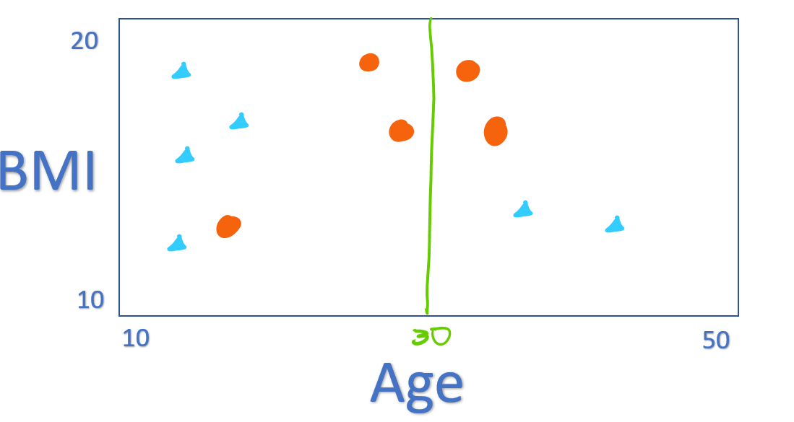

---
output:
  html_document: default
  pdf_document: default
---

```{r include = F}
library(ExamPAData)
library(tidyverse)
```

# Tree-based models

The models that you have used up to this point have been linear.  On the PA Syllabus, these all fall under **Topic 6: Generalized Linear Models.**  This if for good reason: every sitting of exam PA has included a GLM.  While GLMs get a lot of attention, the syllabus also contains **Topic 7: Decision Trees.**  Fortunately, much of what you already know about modeling will apply here.  We will use the same set up for training and testing, performance metrics, concepts of bias and variance, and weights that you already know about.  This chapter is called "tree-**based** models" because the algorithms all rely on the atomic unit of a decision tree.  

As of the fall of 2020, there have been eight different PA exams.  The above table shows which types of models were used on each.  You will definitely see a question about GLMs or decision trees because every exam has included these.  There are variations as to the type of GLM - whether it is using stepwise selection or elastic net.  The final two models are popular with data scientists but do not get much attention on PA - the random forest and the GBM.  

```{r echo = F, fig.align="center", warning=F, out.width="100%"}
knitr::include_graphics("images/model_q_history.png")
```

The syllabus describes these topics.

```{r echo = F, fig.align="center", warning=F, out.width="400%"}
knitr::include_graphics("images/learning_obj7.png")
```

## The basics of decision trees

<iframe width="560" height="315" src="https://www.youtube.com/embed/7VeUPuFGJHk" frameborder="0" allow="accelerometer; clipboard-write; encrypted-media; gyroscope; picture-in-picture" allowfullscreen></iframe>

<iframe width="560" height="315" src="https://www.youtube.com/embed/7VeUPuFGJHk&?rel=0&showinfo=1&playlist=wpNl-JwwplA,g9c66TUylZ4,D0efHEJsfHo" frameborder="0" allowfullscreen></iframe>

<br>

Let's take an example of predicting whether or not a patient has a large claim of over \$ 10,000 or not.  First, we look at all of the patients on a graph.  The shape and color reflects whether the claim is large or not.  On the x-axis is the patient's age and on the y-axis is their body-mass index (bmi).

```{r echo = F, fig.align="center", warning=F, out.width="100%"}
knitr::include_graphics("images/treeslabeled.png")
```

Trees make predictions by asking a series of yes/no questions to each patient.  The questions are called *nodes* or *splits*.  The first node is called the *root*.  You can remember this by imagining that the tree is upside down and growing out of the ground.  The *depth* is the highest number of nodes.  Every patient begins at the top and moves either left or right at each node.  At the end is the predicted probability that that patient will have high claims.

- For patients over the age of 52, 96% had large claims and so the predicted probability is 0.96.  This represents 24% of the data
- For patients under the age of 52, who were smokers, 100% had large claims.  This accounts for 16%.

The other branches are interpreted in the same way.

## Choosing where to split  

We divide the predictor space, that is, the set of possible values for `age`, `children`, `charges`, `sex`, `smoker`, `age_bucket`, `bmi`, and `region`, into distinct non-overlaping regions.  In theory, the trree could be composed by any combination of rules based on these variables.  In reality, though, this is not computationally practical.  Consider a single variable, say, `age`.  You would need to consider all rules where `age<1`, `age<2`, `age<3`, `age<4`, and so on.  Instead, an approximation method is used known as *recursive binary splitting*.  

This is called a *top-down* approach because it begins at the top of the tree, which is the point where all observations belong to a single tree and then successively splits the predictor space.  It's also called a *greedy* approach because at each step, the best split is made.  

How is the "best" split determined?  There are two ways.  Neither method works best on all data sets so it's best to try out both and compare.  On PA, this topic has never appeared on the exam and so you don't need to memorize these details but should be familiar with the concepts.

### Entropy 

Also known as information gain, entropy is a measure of disorder or randomness.  For a given split $S$ with binary outcomes, where the probability of being in the positive class is $p$ and $\bar{p}$ of being in the negative class (the compelementary probability),the entropy is

$$E(S) = -plog_2(p) - \bar{p}log_2(\bar{p})$$

### Gini

This is the method which the StatQuest videos show.

$$G(S) = 1 - p^2 - \bar{p}^2$$

Where $G(S) = 0$ or $E(S) = 0$ $\rightarrow$ Best split $\rightarrow$ Highest purity $\rightarrow$ all elements belong to a single class.

Where  $G(S) = 1$ or $E(S) = 1$ $\rightarrow$ Worst split $\rightarrow$ Lowest purity $\rightarrow$ Elements are randomly distributed across the classes.

Consider the below split at `age = 20`.  The gini and entropy are first calculated for each branch of the tree and then the overall average is taken.

```{r echo = F, fig.align="center", warning=F, out.width="50%"}
knitr::include_graphics("images/splitrule2.png")
```

```{r include = F}
get_gini <- function(p){round(1 - p^2 - (1-p)^2,2)}

get_entropy <- function(p){round(-p*log2(p) - (1-p)*log2(1-p),2)}
```


**Left Branch: Age < 20**

There are four large claims and only one small claim and so $p = 4/5 = 0.8$.

$$G(S) = 1 - 0.8^2 - 0.2^2 = 0.32$$

$$E(S) = -0.8log_2(0.8) - 0.2log_2(0.2) = 0.72$$

**Right branch: Age >= 20**

There are four small claims and two large claims and so $p = 2/6 = 0.33$

$$G(S) = 1 - 0.33^2 - 0.67^2 = 0.44$$

$$E(s) = 0.33log2(0.33) - 0.67log2(0.67) = 0.91$$


To get the overall score, take the weighted average with the number of patients as the weights.

$$G(S) = (5(0.32) + 6(0.44))/11 = 0.39$$

$$E(S) = (5(0.72) + 6(0.91))/11 = 0.82$$

Is this better or worse than a split where `age = 30`?  

```{r echo = F, fig.align="center", warning=F, out.width="50%"}

```

**Left Branch: Age < 30**

$$p = 4/7 = 0.571$$

$$G(S) = 1 - 0.571^2 - 0.429^2 = 0.49$$
$$E(S) = 0.99$$

**Right Branch: Age >= 30**

$$p = 2/4 = 0.5$$

$$G(S) = 1 - 0.5^2 - 0.5^2 = 0.5$$
$$E(S) = 1$$

The overall gini is $(0.49(7) + 0.5(4))/11 = 0.49$ and the overall entropy is $(0.99(7) + 1.0(4))/11 = 0.99$.  In both cases, this is higher (worse) than the split at $age = 20$ because the groups are less homogeneous.  

Once the first split has been chosen based on the gini or entropy, the next step is to further subdivide each of the regions.  For all patients over the age of 20, the algorithm will look at the variable-split-point combinations of all other variables and again choose the one with the best criteria.  For example, this might be at $\text{BMI} = 15$.  The lower right and upper right regions have only divided the large claims from the small claims, which is the objective.  The entropy and gini of these regions is 0.

This tree can be writtten as a series of simple if statements:

- If `age` < 20, predict `yes` with probability 4/5 
- If `age` >= 20 and `bmi` > 15, predict `no` with probability 4/4
- If `age` >= 20 and `bmi` < 15, predict `yes` with probability 2/2

The first group on the left could be partiontioned down again.  We could take into consideration other variables such as `smoker`, `children`, and so forth.


```{r echo = F, fig.align="center", warning=F, out.width="50%"}
knitr::include_graphics("images/splitrule4.png")
```

### Example - SRM Practice Question 33

This question from the SOA's Statistics for Risk Modeling (SRM) exam is an example of how to interpret a tree.  Simply begin at the top and proceed downwards, asking each question.  The first auto has `agecat = 1` and so there's only one possible value, which results in a prediction of 8.146.  The second has `agecat >=1.5`, `veh_age >= 2.5`, `agecat >= 4.5`, and `veh_age >= 3.5`, which results in a predicted value of 8.028.  The third auto is interpreted similarly.

```{r echo = F, fig.align="center", warning=F, out.width="100%"}
knitr::include_graphics("images/srm33.png")
```

## Tree complexity

If this pattern of recursive partitioning continues for too long then the model will overfit.  This results in high accuracy on the training data but poor accuracy on the test data.  This type of model is useless in real life because predictions are always made on new, never-before-seen data.  In addition, the tree structure is often too complicated to explain in business terms.

Consider this tree

```{r }
library(rpart)
library(rpart.plot)
df <- health_insurance %>% mutate(large_claim = ifelse(charges > 10000, "yes", "no"))
tree <- rpart(formula = large_claim ~  age + bmi + smoker + sex + children, data = df,
              control = rpart.control(cp = 0))

rpart.plot(tree, type = 3)
```


*Pruning* is the process of making a tree simpler by trimming off branches.  This is very similar to how with linear models we reduce complexity by reducing the number of coefficients.

A measure of the depth of the tree is the *complexity*.  A simple way of measuring this from the number of terminal nodes, called $|T|$.  In the above example, $|T| = 8$.  The amount of penalization is controlled by $\alpha$.  This is very similar to $\lambda$ in the Lasso.

Intuitively, only looking at the number of nodes by itself is too simple because not all data sets will have the same characteristics such as $n$, $p$, the number of categorical variables, correlations between variables, and so fourth.  In addition, if we just looked at the error then we would overfit very easily.  To address this issue, we use a cost function which takes into account the error as well as $|T|$.  If this were a regression tree then squared error would be used, and if a classification tree then misclassification error would be used.

To calculate the cost of a tree, number the terminal nodes from $1$ to $|T|$, and let the set of observations that fall into the $mth$ bucket be $R_m$.  Then add up the squared error over all terminal nodes to the penalty term.

$$
\text{Cost}_\alpha(T) = \sum_{m=1}^{|T|} \sum_{R_m}(y_i - \hat{y}_{Rm})^2 + \alpha |T|
$$

The argument `cp` is the complexity parameter.  Essentially, the user informs the program that any split which does not improve the fit by `cp` will likely be pruned off by cross-validation, and that hence the program need not pursue it.  The above tree sets `cp = 0`which means that no pruning takes place.  The tree continues to create more splits until there are 5 or fewer patients in the leaf nodes.

```{block, type='studytip'}
**You don't need to memorize parameter definitions!** Simply type `?rpart.control` into the console to bring up the documentation.  You can do this on the Prometric computer as well.
```

## Cost-complexity pruning

Now that you have a way of comparing trees together based on their complexity, how do we know which amount of complexity is right?  If complexity is too low, the model will be underfitting and will not capture all of the signal that is in the data.  On the other hand, if complexity is too high, then the tree will be too sensitive to random noise and will overfit.  

This table shows the `cp` along with the number of splits at each tree.  When `nsplit = 0`, all patients are in the same group.  When `cp = 0`, then `nsplit = 18` which is the above tree.  The `xerror` column is the missclassification error, and `rel error` is the normalized version so that it is between 0 and 1.  `xstd` is the standard deviation of the predictions.  **For PA, you want to choose a tree that strikes a balance between having a low error and having few splits so that it can be interpreted.**

```{r message = F}
cost <- tree$cptable %>% 
  as_tibble() 
cost %>% head()
```

As more splits are added, the cost continues to decrease, reaches a minimum, and then begins to increase.  

```{r echo = F}
cost %>% 
 # filter(nsplit > 1) %>% 
  mutate(min = ifelse(xerror == min(cost$xerror),"y", "n")) %>% 
  ggplot(aes(nsplit, xerror, color = min)) + 
  geom_line() + 
  geom_point() + 
  theme_bw() + 
  theme(legend.position = "none") + 
  scale_color_manual(values = c("black", "red")) + 
  annotate("text", x = 4, y = 0.2, label = "Minimum Error", color = "red")
```

The SOA may give you code to find the lowest CP value such as below.  You could always find this value yourself by inspecting the CP table and choosing the value of `CP` which has the lowest `xerror`.

```{r}
pruned_tree <- prune(tree,
                     cp = tree$cptable[which.min(tree$cptable[, "xerror"]), "CP"])
```

Many questions on PA have given candidates a big tree and then asked that they use pruning to make it simpler.  There are ways of doing this besides just adjusting `cp`.  To make a simpler tree, you can 

- Set `cp` to be higher
- Set the maximum depth of a tree with `maxdepth`
- Use fewer input variables and avoid categories with many levels
- Force a high number of minimum observations per terminal node with `minbucket`

For instance, using these suggestions allows for a simpler tree to be fit.

```{r message = F}
library(caret)
set.seed(42)
index <- createDataPartition(y = health_insurance$charges, 
                             p = 0.8, list = F)
train <- health_insurance %>% slice(index)
test <- health_insurance %>% slice(-index)

simple_tree <- rpart(formula = charges ~  ., 
              data = train,
              control = rpart.control(cp = 0.0001, 
                                      minbucket = 100,
                                      maxdepth = 4))
rpart.plot(simple_tree, type = 3)
```

## Example: SOA PA 6/16/2020, Task 6

<iframe src="https://player.vimeo.com/video/467846520" width="640" height="360" frameborder="0" allow="autoplay; fullscreen" allowfullscreen></iframe>

Already enrolled?  Watch the <a target="_parent" href="https://course.exampa.net/mod/page/view.php?id=85">full video.</a>

(10 Points)

> Describe what pruning does and why it might be considered it for this business problem.

> Construct an unpruned regression tree using the code provided.

> Review the complexity parameter table and plot for this tree. State the optimal
complexity parameter and the number of leaves that will result if the tree is pruned
using that value.

> Prune the tree using a complexity parameter that will result in eight leaves. If eight is
not a possible option, select the largest number less than eight that is possible.

> Calculate and compare the Pearson goodness-of-fit statistic on the test set for both
trees (original and pruned).

> Interpret the entire pruned tree (all leaves) in the context of the business problem. 


## Advantages and disadvantages

**Advantages**

- Easy to interpret 
- Performs variable selection
- Categorical variables do not require binarization in order for each level to be used as a separate predictor
- Captures non-linearities and interaction effects
- Handles missing values

**Disadvantages**

- Predictive accuracy tends to be lower than other models on PA
- Is often a simplification of the underlying process because all observations at terminal nodes have equal predicted values
- Can be very non-robust because small changes in the data can cause a large change in the final estimated tree

| Readings |  | 
|-------|---------|
| ISLR 8.1.1 Basics of Decision Trees  | |
| ISLR 8.1.2 Classification Trees|  |
| [rpart Documentation (Optional)](https://cran.r-project.org/web/packages/rpart/vignettes/longintro.pdf) ||

## Ensemble learning

The "wisdom of crowds" says that often many are smarter than the few.  In the context of modeling, the models which we have looked at so far have been single guesses; however, often the underlying process is more complex than any single model can explain.  If we build separate models and then combine them, known as *ensembling*, performance can be improved.  Instead of trying to create a single perfect model, many simple models, known as *weak learners* are combined into a *meta-model*.

The two main ways that models are combined are through *bagging* and *boosting*.

### Bagging

To start, we create many "copies" of the training data by sampling with replacement.  Then we fit a simple model, typically a decision tree or linear model, to each of the data sets.  Because each model is looking at different areas of the data, the predictions are different.  The final model is a weighted average of each of the individual models.

### Boosting

Boosting always uses the original training data and iteratively fits models to the error of the prior models.  These weak learners are ineffective by themselves but powerful when added together.  Unlike with bagging, the computer must train these weak learners *sequentially* instead of in parallel.

## Random Forests

A random forest is the most common example of bagging.  As the name implies, a forest is made up of *trees*.  Seperate trees are fit to sampled data sets.  For random forests, there is one minor modification: in order to make each model even more different, each tree selects a *random subset of variables*.

<iframe width="560" height="315" src="https://www.youtube.com/embed/J4Wdy0Wc_xQ?rel=0&showinfo=1&playlist=nyxTdL_4Q-Q,6EXPYzbfLCE" frameborder="0" allowfullscreen></iframe>


If we had to explain why a random forest works in three steps, they would be:

1. Assume that the underlying process, $Y$, has some signal within the data $\mathbf{X}$.
2. Introduce randomness (variance) to capture the signal.
3. Remove the variance by taking an average.

When using only a single tree, there can only be as many predictions as there are terminal nodes.  In a random forest, predictions can be more granular due to the contribution of each of the trees.

The below graph illustrates this.  A single tree (left) has stair-like, step-wise predictions whereas a random forest is free to predict any value.  The color represents the predicted value (light blue = highest, black = lowest).

```{r message = F, echo = F, fig.height = 4}
library(randomForest)
tree <- rpart(charges ~ age + bmi, data = health_insurance)
df <- health_insurance %>% mutate(
  prediction = predict(tree, health_insurance))

p1 <- df %>% 
  ggplot(aes(bmi, age, color = prediction)) + 
  geom_point() + 
  theme_bw() + 
  labs(title ="Decision Tree") + 
  theme(legend.position = "none")

rf <- randomForest(charges ~ age + bmi, 
                   data = health_insurance, ntree = 50)
df <- health_insurance %>% mutate(
  prediction = predict(rf, health_insurance))

p2 <- df %>% 
  ggplot(aes(bmi, age, color = prediction)) + 
  geom_point() + 
  theme_bw() + 
  labs(title ="Random Forest") + 
  theme(legend.position = "none")

library(ggpubr)
ggarrange(p1,p2)
```

Unlike decision trees, random forest trees do not need to be pruned.  This is because overfitting is less of a problem: if one tree overfits, there are other trees which overfit in other areas to compensate.  

In most applications, only the `mtry` parameter, which controls how many variables to consider at each split, needs to be tuned.  Tuning the `ntrees` parameter is not required; however, the SOA may still ask you to.

### Example

Using the basic `randomForest` package we fit a model with 500 trees. 

This expects only numeric values.  We create dummy (indicator) columns. 

```{r}
rf_data <- health_insurance %>% 
  sample_frac(0.2) %>% 
  mutate(sex = ifelse(sex == "male", 1, 0),
         smoker = ifelse(smoker == "yes", 1, 0),
         region_ne = ifelse(region == "northeast", 1,0),
         region_nw = ifelse(region == "northwest", 1,0),
         region_se = ifelse(region == "southeast", 1,0),
         region_sw = ifelse(region == "southwest", 1,0)) %>% 
  select(-region)
rf_data %>% glimpse(50)
```


```{r message = F}
library(caret)
set.seed(42)
index <- createDataPartition(y = rf_data$charges, 
                             p = 0.8, list = F)
train <- rf_data %>% slice(index)
test <- rf_data %>% slice(-index)
```

```{r fig.height=4, include = T}
rf <- randomForest(charges ~ ., data = train, ntree = 400)
plot(rf)
```

We again use RMSLE.  This is lower (better) than a model that uses the average as a baseline.

```{r}
pred <- predict(rf, test)
get_rmsle <- function(y, y_hat){
  sqrt(mean((log(y) - log(y_hat))^2))
}

get_rmsle(test$charges, pred)
get_rmsle(test$charges, mean(train$charges))
```

### Variable Importance

*Variable importance* is a way of measuring how each variable contributes to the overall model's performance.  For single decision trees, variable "higher up" in the tree have greater influence.  Statistically, there are two ways of measuring this:

1) Look at the mean reduction in accuracy when the variable is randomly permuted verses using the actual values from the data.  This is done with `type = 1` (default).

2) Use the total decrease in node impurities from splitting on the variable, averaged over all trees.  For classification, the node impurity is measured by the Gini index; for regression, it is measured by the residual sum of squares $\text{RSS}$.  This is `type = 2`.

`smoker`, `bmi`, and `age` are the most importance predictors of charges. As you can imagine, variable importance is a highly useful tool for building models.  We could use this to test out newly engineered features, or perform feature selection by taking the top-n features and use them in a different model.  Random forests can handle very high dimensional data which allows for many tests to be run at once. 

```{r}
varImpPlot(x = rf)
```

### Partial dependence

We know which variables are important, but what about the direction of the change?  In a linear model we would be able to just look at the sign of the coefficient.  In tree-based models, we have a tool called *partial dependence*.  This attempts to measure the change in the predicted value by taking the average $\hat{\mathbf{y}}$ after removing the effects of all other predictors.

Although this is commonly used for trees, this approach is model-agnostic in that any model could be used.

Take a model of two predictors, $\hat{\mathbf{y}} = f(\mathbf{X}_1, \mathbf{X_2})$.  For simplicity, say that $f(x_1, x_2) = 2x_1 + 3x_2$. 

The data looks like this

```{r}
df <- tibble(x1 = c(1,1,2,2), x2 = c(3,4,5,6)) %>% 
  mutate(f = 2*x1 + 3*x2)
df
```

Here is the partial dependence of `x1` on to `f`.  

```{r}
df %>% group_by(x1) %>% summarise(f = mean(f))
```

This method of using the mean is know as the *Monte Carlo* method.  There are other methods for partial dependence that are not on the syllabus.

For the Random Forest, this is done with `pdp::partial()`.

```{r message = F,fig.cap="Partial Dependence", fig.height=4}
library(pdp)
bmi <- pdp::partial(rf, pred.var = "bmi", 
                    grid.resolution = 15) %>% 
  autoplot() + theme_bw()
age <- pdp::partial(rf, pred.var = "age", 
                    grid.resolution = 15) %>% 
  autoplot() + theme_bw()

ggarrange(bmi, age)
```

### Advantages and disadvantages

**Advantages**

- Resilient to overfitting due to bagging 
- Measures variable importance
- Captures non-linearities 
- Captures interaction effects
- Handles missing values
- Only one parameter to tune (mtry, the number of features considered at each split)

**Disadvantages**

- More difficult to interpret than a single tree because the result depends on many different trees
- Often requires over or undersampling when the target is an imbalanced class
- Tends to have lower predictive power than boosted trees
- Unable to predict beyond training data for regression

| Readings |  | 
|-------|---------|
| ISLR 8.2.1 Bagging  | |
| ISLR 8.1.2 Random Forests|  |

## Gradient Boosted Trees

Another ensemble learning method is *gradient boosting*, also known as the Gradient Boosted Machine (GBM).  This is one of the most widely-used and powerful machine learning algorithms that is in use today.

Before diving in to the gradient boosting, understanding the AdaBoost algorithm is helpful.


### Gradient Boosting

<iframe width="560" height="315" src="https://www.youtube.com/embed/3CC4N4z3GJc?rel=0&showinfo=1&playlist=2xudPOBz-vs,jxuNLH5dXCs,StWY5QWMXCw" frameborder="0" allowfullscreen></iframe>

</br>

### Notation

Start with an initial model, which is just a constant prediction of the mean.

$$f = f_0(\mathbf{x_i}) = \frac{1}{n}\sum_{i=1}^ny_i$$

Then we update the target (what the model is predicting) by subtracting off the previously predicted value.  

$$ \hat{y_i} \leftarrow y_i - f_0(\mathbf{x_i})$$

This $\hat{y_i}$ is called the *residual*.  In our example, instead of predicting `charges`, this would be predicting the residual of $\text{charges}_i - \text{Mean}(\text{charges})$.  We now use this model for the residuals to update the prediction.

If we updated each prediction with the prior residual directly, the algorithm would be unstable.  To make this process more gradual, we use a *learning rate* parameter.

At step 2, we have

$$f = f_0 + \alpha f_1$$

Then we go back and fit another weak learner to this residual and repeat.

$$f = f_0 + \alpha f_1 + \alpha f_2$$

We then iterate through this process hundreds or thousands of times, slowly improving the prediction.

Because each new tree is fit to *residuals* instead of the response itself, the process continuously improves the prediction.  As the prediction improves, the residuals get smaller and smaller.  In random forests, or other bagging algorithms, the model performance is more limited by the individual trees because each only contributes to the overall average.  The name is *gradient boosting* because the residuals are an approximation of the gradient, and gradient descent is how the loss functions are optimized.

Similarly to how GLMs can be used for classification problems through a logit transform (aka logistic regression), GBMs can also be used for classification.

### Parameters

For random forests, the individual tree parameters do not get tuned.  For GBMs, however, these parameters can make a significant difference in model performance. 

**Boosting parameters:**

- `n.trees`: Integer specifying the total number of trees to fit. This is equivalent to the number of iterations and the number of basis functions in the additive expansion. Default is 100.

- `shrinkage`: a shrinkage parameter applied to each tree in the expansion. Also known as the learning rate or step-size reduction; 0.001 to 0.1 usually work, but a smaller learning rate typically requires more trees. Default is 0.1.

**Tree parameters:**

- `interaction.depth`: Integer specifying the maximum depth of each tree (i.e., the highest level of variable interactions allowed). A value of 1 implies an additive model, a value of 2 implies a model with up to 2-way interactions, etc. Default is 1.

- `n.minobsinnode`: Integer specifying the minimum number of observations in the terminal nodes of the trees. Note that this is the actual number of observations, not the total weight.

GBMs are easy to overfit, and the parameters need to be carefully tuned using cross-validation.  In the Examples section we go through how to do this.

</br>

```{block, type='studytip'}
**Tip:** Whenever fitting a model, use `?model_name` to get the documentation.  The parameters below are from `?gbm`. 
```

### Example

We fit a gbm below without tuning the parameters for the sake of example.  

```{r message = F, cache=T}
library(gbm)
gbm <- gbm(charges ~ ., data = train,
           n.trees = 100,
           interaction.depth = 2,
           n.minobsinnode = 50,
           shrinkage = 0.1)

pred <- predict(gbm, test, n.trees = 100)

get_rmsle(test$charges, pred)
get_rmsle(test$charges, mean(train$charges))
```

### Advantages and disadvantages

This exam covers the basics of GBMs.  There are many variations of GBMs not covered in detail such as `xgboost`.

**Advantages**

- High prediction accuracy
- Shown to work empirically well on many types of problems
- Nonlinearities, interaction effects, resilient to outliers, corrects for missing values
- Deals with class imbalance directly by weighting observations

**Disadvantages**

- Requires large sample size
- Longer training time
- Does not detect linear combinations of features.  These must be engineered
Can overfit if not tuned correctly

| Readings |  | 
|-------|---------|
| ISLR 8.2.3 Boosting  | |


## Exercises

```{r message = F}
library(ExamPAData)
library(tidyverse)
```


Run this code on your computer to answer these exercises.

### 1. RF with `randomForest`

(Part 1 of 2)

The below code is set up to fit a random forest to the `soa_mortality` data set to predict `actual_cnt`.

There is a problem: all of the predictions are coming out to be 1.  Find out why this is happening and fix it.

```{r eval = F}
set.seed(42)
#When writing this book, only 5% of the records were used so that the code runs faster.
#Increase this sampling if running this on your machine.
df <- soa_mortality %>% 
  sample_frac(0.05) %>% #20% sample
  mutate(target = as.factor(ifelse(actual_cnt == 0, 1, 0))) %>% 
  select(target, prodcat, distchan, smoker, sex, issage, uwkey) %>% 
  mutate_if(is.character, ~as.factor(.x))

#check that the target has 0's and 1's
df %>% count(target)
```

```{r  eval = F,message=F}
library(caret)
library(randomForest)
index <- createDataPartition(y = df$target, p = 0.8, list = F)

train <- df %>% slice(index)
test <- df %>% slice(-index)

k = 0.5
cutoff=c(k,1-k) 

model <- randomForest(
  formula = target ~ ., 
  data = train,
  ntree = 100,
  cutoff = cutoff
  )

pred <- predict(model, test)
confusionMatrix(pred, test$target)
```

(Part 2 of 2)

Downsample the majority class and refit the model, and then choose between the original data and the downsampled data based on the model performance.  Use your own judgement when choosing how to evaluate the model based on accuracy, sensitivity, specificity, and Kappa.

```{r  eval = F}
down_train <- downSample(x = train %>% select(-target),
                         y = train$target)

down_test <- downSample(x = test %>% select(-target),
                         y = test$target)

down_train %>% count(Class)
```

```{r  eval = F}
model <- randomForest(
  formula = Class ~ ., 
  data = down_train,
  ntree = 100,
  cutoff = cutoff
  )

down_pred <- predict(model, down_test)
confusionMatrix(down_pred, down_test$Class)
```

Now up-sample the minority class and repeat the same procedure.

```{r  eval = F}
up_train <- upSample(x = train %>% select(-target),
                         y = train$target)

up_test <- upSample(x = test %>% select(-target),
                         y = test$target)

up_train %>% count(Class)
```

```{r eval = F}
model <- randomForest(
  formula = Class ~ ., 
  data = up_train,
  ntree = 100,
  cutoff = cutoff
  )

up_pred <- predict(model, up_test)
confusionMatrix(up_pred, up_test$Class)
```

### 2. RF tuning with `caret`

The best practice of tuning a model is with cross-validation.  This can only be done in the `caret` library.  If the SOA asks you to use `caret`, they will likely ask you a question related to cross validation as below.

An actuary has trained a predictive model and chosen the best hyperparameters, cleaned the data, and performed feature engineering.  They have one problem, however: the error on the training data is far lower than on new, unseen test data.  Read the code below and determine their problem.  Find a way to lower the error on the test data *without changing the model or the data.*  Explain the rational behind your method.

```{r eval = F, cache=T}
set.seed(42)
#Take only 250 records 
#Uncomment this when completing this exercise
data <- health_insurance %>% sample_n(250) 

index <- createDataPartition(
  y = data$charges, p = 0.8, list = F) %>% 
  as.numeric()
train <-  health_insurance %>% slice(index)
test <- health_insurance %>% slice(-index)

control <- trainControl(
  method='boot', 
  number=2, 
  p = 0.2)

tunegrid <- expand.grid(.mtry=c(1,3,5))
rf <- train(charges ~ .,
            data = train,
            method='rf', 
            tuneGrid=tunegrid, 
            trControl=control)

pred_train <- predict(rf, train)
pred_test <- predict(rf, test)

get_rmse <- function(y, y_hat){
  sqrt(mean((y - y_hat)^2))
}

get_rmse(pred_train, train$charges)
get_rmse(pred_test, test$charges)
```

### 3. Tuning a GBM with `caret`

If the SOA asks you to tune a GBM, they will need to give you starting hyperparameters which are close to the "best" values due to how slow the Prometric computers are.  Another possibility is that they pre-train a GBM model object and ask that you use it.

This example looks at 135 combinations of hyper parameters.

```{r, eval = F}
set.seed(42)
index <- createDataPartition(y = health_insurance$charges, 
                             p = 0.8, list = F)
#To make this run faster, only take 50% sample
df <- health_insurance %>% sample_frac(0.50) 
train <- df %>% slice(index) 
test <- df %>% sample_frac(0.05)%>% slice(-index)

tunegrid <- expand.grid(
    interaction.depth = c(1,5, 10),
    n.trees = c(50, 100, 200, 300, 400), 
    shrinkage = c(0.5, 0.1, 0.0001),
    n.minobsinnode = c(5, 30, 100)
    )
nrow(tunegrid)

control <- trainControl(
  method='repeatedcv', 
  number=5, 
  p = 0.8)
```

```{r cache=T, eval = F}
gbm <- train(charges ~ .,
            data = train,
            method='gbm', 
            tuneGrid=tunegrid, 
            trControl=control,
            #Show detailed output
            verbose = FALSE
            )
```

The output shows the RMSE for each of the 135 models tested.

(Part 1 of 3)

Identify the hyperpameter combination that has the lowest training error.

(Part 2 of 3)

2. Suppose that the optimization measure was RMSE.  The below table shows the results from three models.  Explain why some sets of parameters have better RMSE than the others.  

```{r, eval = F}
results <- gbm$results %>% arrange(RMSE)
top_result <- results %>% slice(1)%>% mutate(param_rank = 1)
tenth_result <- results %>% slice(10)%>% mutate(param_rank = 10)
twenty_seventh_result <- results %>% slice(135)%>% mutate(param_rank = 135)

rbind(top_result, tenth_result, twenty_seventh_result) %>% 
  select(param_rank, 1:5)
```

3. The partial dependence of `bmi` onto `charges` makes it appear as if `charges` increases monotonically as `bmi` increases.

```{r fig.width=5, fig.height=5, cache=T, eval = F}
pdp::partial(gbm, pred.var = "bmi", grid.resolution = 15, plot = T)
```

However, when we add in the `ice` curves, we see that there is something else going on.  Explain this graph.  Why are there two groups of lines?

```{r cache=T, eval = F}
pdp::partial(gbm, pred.var = "bmi", grid.resolution = 20, plot = T, ice = T, alpha = 0.1, palette = "viridis")
```

