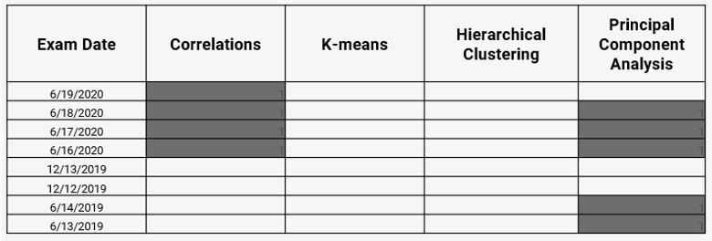

---
output:
  html_document: default
  pdf_document: default
---

# Unsupervised Learning

This chapter covers the eighth learning objective along with one additional topic of correlation analysis.


[](https://exampa.net/)

Already enrolled?  Watch the full video: <a target="_parent" href="https://course.exampa.net/mod/page/view.php?id=147">Practice Exams + Lessons</a>

```{r echo = F, fig.align="center", warning=F, out.width="400%"}
knitr::include_graphics("images/learning_obj8.png")
```

As of the fall of 2020, there have been eight different PA exams. The table below shows the types of questions in each. Your exam in December will likely have a question on either k-means or hierarchical clustering because these topics have not frequently been tested. The Hospital Readmissions sample project did have one question related to k-means, but that was in 2018. Our ExamPA.net practice exams contain questions on both topics.

```{r echo = F, fig.align="center", warning=F, out.width="400%"}

```

## Types of Learning

You are in a classroom and your teacher is giving a lesson which has a correct answer, such as 1 + 2 = 2.  This is called *supervised learning*.  The teacher is the supervisor, who is responsible for minimizing the number of incorrect answers. When a question is answered correctly, there is a reward, and when a mistake is made, there is a penalty. In machine learning, we measure the performance using metrics such as RMSE, and we say that the model is a good “fit” when this metric is low.

```{r, echo=FALSE,out.width="49%", out.height="20%",fig.cap="Supervised (Left), Unsupervised (Right)",fig.show='hold',fig.align='center'}
knitr::include_graphics(c("images/classroom.png","images/legos.png"))
``` 

However, if you are given a pile of **Legos** and told to build whatever you want, that would be *unsupervised learning*.  There are no right or wrong answers and to goal is to explore patterns in the data. There are no performance metrics, and it is impossible to say whether a model is a good fit or not.

Up to this point, you have been working with supervised learning. This is the major focus of PA because predictive analytics often is used to predict a future outcome. We now move on to the unsupervised learning algorithms. Here are all of the learning algorithms on PA:


|Supervised                   |Unsupervised                      |
|-----------------------------|----------------------------------|
|GLM                          |Correlation analysis              |
|Lasso, Ridge, and Elastic Net|Principal component analysis (PCA)|
|Decision Tree                |K-means clustering                |
|Bagged Tree                  |Hierarchical clustering           |
|Boosted Tree                 |                                  |

**Semi-Supervised Learning** is a mix of the two. One example of this is using PCA or Clustering to create features used in a supervised model.

## Correlation Analysis

- Two variables are said to be positively correlated when increasing one tends to increase the other and negatively correlated when increasing one decreases the other
- Correlation is unsupervised because it does not depend on the target variable
- Correlation is only defined for numeric variables. It is possible to calculate the correlation between binary variables if coded as 0 or 1, but these questions have never appeared on PA.

### Correlation does not equal causation

This is a common saying of statisticians. Two things happening at the same time are not sufficient evidence to suggest that one causes the other. A [spurious correlation](https://tylervigen.com/old-version.html) is when two unrelated variables have a positive or negative correlation by random chance.

Examples:

**Number of Drownings and Ice Cream Sales:** Drownings rise when ice cream sales rise because the heat causes more people to go swimming and want ice cream.

**Executives who say "please" and "thank you" more often enjoy better performance reviews:**  It might at first appear that this is due to brown-nosing or flattery, but a more likely explanation is that people who take the extra effort to be polite also take the extra effort to do their jobs well. People who have good performance may also be polite, but not all polite people are high performers.

## Principal Component Analysis (PCA)

Often there are variables that contain redundant information.  PCA is one method of simplifying them.

<iframe width="560" height="315" src="https://www.youtube-nocookie.com/embed/FgakZw6K1QQ" frameborder="0" allow="accelerometer; autoplay; encrypted-media; gyroscope; picture-in-picture" allowfullscreen></iframe>

StatQuest. “Principal Component Analysis (PCA), Step-by-Step” YouTube, Joshua Starmer, 2 Apr 2018, https://www.youtube.com/watch?v=FgakZw6K1QQ

PCA is a *dimensionality reduction* method which reduces the number of variables needed to retain most of the information in a matrix.  If there are predictor variables $(x_1, x_2, x_3)$, then running PCA and choosing the first two Principal Components (PCs) would reduce the dimension from 3 to 2. You can imagine this as observations in three-dimensional space being projected down onto a plane. The coordinates of this plane are $(\text{PC}_1, \text{PC}_2)$.

```{r echo = F, message = F, warning = F, fig.align="center"}
library(png)
library(tidyverse)
knitr::include_graphics("images/3d_dim_reduction.png")
```

Each PC is a linear combination of the original variables. For example, PC1 might be

$$PC_1 = 0.2X_1 + 0.3X_2 - 0.2X_3$$
The weights here are also called *loadings* or *rotations*, and are (0.2, 0.3, -0.2) in this example.  

| Readings |  | 
|-------|---------|
| ISLR 10.2 Principal Component Analysis|  |
| ISLR 10.3 Clustering Methods|  |

### Example: US Arrests

In this example, we perform PCA on the `USArrests` data set, which is part of
the base `R` package. The rows of the data set contain the 50 states, in
alphabetical order:

```{r message = F}
library(tidyverse)
states=row.names(USArrests)
states
```

The columns of the data set contain four variables relating to various crimes:

```{r}
glimpse(USArrests)
```

Let us start by taking a quick look at the column means of the data. 

```{r}
USArrests %>% summarise_all(mean)
```

We see right away the the data have **vastly** different means. We can also examine the variances of the four variables.

```{r}
USArrests %>% summarise_all(var)
```

Not surprisingly, the variables also have vastly different variances: the `UrbanPop` variable measures the percentage of the population in each state living in an urban area, which is not comparable to the number of crimes committed in each state per 100,000 individuals. If we failed to scale the variables before performing PCA, then most of the principal components we observed would be driven by the `Assault` variable, since it has by far the largest mean and variance. 

Thus, it is important to standardize the variables to have mean zero and standard deviation 1 before performing PCA. We will perform principal components analysis using the `prcomp()` function, which is one of several functions that perform PCA. By default, this centers the variables to have a mean zero. By using the option `scale=TRUE`, we scale the variables to have standard
deviation 1:

```{r}
pca = prcomp(USArrests, scale=TRUE)
```

The output from `prcomp()` contains a number of useful quantities:

```{r}
names(pca)
```

The `center` and `scale` components correspond to the means and standard deviations of the variables that were used for scaling prior to implementing PCA:

```{r}
pca$center
pca$scale
```

The rotation matrix provides the principal component loadings; each column
of `pr.out\$rotation` contains the corresponding principal component
loading vector:

```{r}
pca$rotation
```

We see that there are four distinct principal components. This is to be
expected because there are in general `min(n − 1, p)` informative principal
components in a data set with $n$ observations and $p$ variables.

Using the `prcomp()` function, we do not need to explicitly multiply the data by the principal component loading vectors in order to obtain the principal component score vectors. Rather the 50 × 4 matrix  $x$ has as its columns the principal component score vectors. That is, the $k^{th` column is the $k^{th` principal component score vector. We'll take a look at the first few states:

```{r}
head(pca$x)
```

We can plot the first two principal components using the `biplot()` function:

```{r fig.width=8, fig.height=6}
biplot(pca, scale=0)
```

The `scale=0` argument to `biplot()` ensures that the arrows are scaled to represent the loadings; other values for `scale` give slightly different bi plots with different interpretations.

The `prcomp()` function also outputs the standard deviation of each principal component. We can access these standard deviations as follows:

```{r}
pca$sdev
```

The variance explained by each principal component is obtained by squaring
these:

```{r}
pca_var=pca$sdev^2
pca_var
```

To compute the proportion of variance explained by each principal component, we simply divide the variance explained by each principal component by the total variance explained by all four principal components:

```{r}
pve=pca_var/sum(pca_var)
pve
```

We see that the first principal component explains 62.0% of the variance in the data, the next principal component explains 24.7% of the variance, and so forth. We can plot the PVE explained by each component as follows:

```{r}
plot(pve, xlab="Principal Component", ylab="Proportion of Variance Explained", ylim=c(0,1),type='b')
```

We can also use the function `cumsum()`, which computes the cumulative sum of the elements of a numeric vector, to plot the cumulative PVE:

```{r}
plot(cumsum(pve), xlab="Principal Component", ylab="Cumulative Proportion of Variance Explained", ylim=c(0,1),type='b')
a=c(1,2,8,-3)
cumsum(a)
```


### Example: SOA PA 6/12/19, Task 3

>3. (9 points) Use observations from principal components analysis (PCA) to generate a new feature

>Your assistant has provided code to run a PCA on three variables. Run the code on these three variables. Interpret the output, including the loadings on significant principal components. Generate one new feature based on your observations (which may also involve dropping some current variables). Your assistant has provided some notes on using PCA on factor variables in the .Rmd file.

<iframe src="https://player.vimeo.com/video/465063620" width="640" height="360" frameborder="0" allow="autoplay; fullscreen" allowfullscreen></iframe>

Already enrolled?  Watch the full video: <a target="_parent" href="https://course.exampa.net/mod/page/view.php?id=204">Practice Exams</a> | <a target="_parent" href="https://course.exampa.net/mod/page/view.php?id=155">Practice Exams + Lessons</a>

### Example: PCA on Cancel Cells

The data  `NCI60` contains expression levels of 6,830 genes from 64 cancel cell lines. Cancer type is also recorded.

```{r}
library(ISLR)
nci_labs=NCI60$labs
nci_data=NCI60$data
```

We first perform PCA on the data after scaling the variables (genes) to have a standard deviation one, although one could reasonably argue that it is better not to scale the genes:

```{r}
pca = prcomp(nci_data, scale=TRUE)
```

We now plot the first few principal component score vectors in order to visualize the data. The observations (cell lines) corresponding to a given cancer type will be plotted in the same color to see to what extent the observations within a cancer type are similar to each other. We first create a simple function that assigns a distinct color to each element of a numeric vector. The function will be used to assign a color to each of the 64 cell lines, based on the cancer type to which it corresponds. We will use the `rainbow()` function, which takes its argument a positive integer and returns a vector containing that number of distinct colors.

```{r}
Cols=function(vec){
    cols=rainbow(length(unique(vec)))
    return(cols[as.numeric(as.factor(vec))])
  }
```

We now can plot the principal component score vectors:

```{r}
par(mfrow=c(1,2))
plot(pca$x[,1:2], col=Cols(nci_labs), pch=19,xlab="Z1",ylab="Z2")
plot(pca$x[,c(1,3)], col=Cols(nci_labs), pch=19,xlab="Z1",ylab="Z3")
```

On the whole, cell lines corresponding to a single cancer type tend to have similar values on the first few principal component score vectors. 

This indicates that cell lines from the same cancer type tend to have pretty similar gene expression levels.

We can obtain a summary of the proportion of variance explained (PVE) of the first few principal components using the (PVE) of the first few principal components using the `summary()` method for a `prcomp` object:

```{r}
summary(pca)
```

Using the `plot()` function, we can also plot the variance explained by the first few principal components:

```{r}
plot(pca)
```

Note that the height of each bar in the bar plot is given by squaring the corresponding element of `pr.out\$sdev`. However, it is generally more informative to plot the PVE of each principal component (i.e. a **scree plot**) and the cumulative PVE of each principal component. This can be done with just a little tweaking:

```{r}
pve = 100*pca$sdev^2/sum(pca$sdev^2)
par(mfrow=c(1,2))
plot(pve,  type="o", ylab="PVE", xlab="Principal Component", col="blue")
plot(cumsum(pve), type="o", ylab="Cumulative PVE", xlab="Principal Component", col="brown3")
```

Together, we see that the first seven principal components explain around 40% of the variance in the data. This is not a huge amount of the variance. However, looking at the scree plot, we see that while each of the first seven principal components explains a substantial amount of variance, there is a marked decrease in the variance explained by other principal components. That is, there is an **elbow** in the plot after approximately the seventh principal component. This suggests that there may be little benefit to examining more than seven or so principal components (phew! even examining seven principal components may be difficult).

## Clustering

Imagine that you are a large retailer interested in understanding the customer base. There may be several “types” of customers, such as those shopping for a business with corporate accounts, those shopping for leisure, or debt-strapped grad students. Each of these customers would exhibit different behavior and should be treated differently statistically. However, how can the “type” of customer be defined? Especially for large customer data sets in the millions, one can imagine how this problem can be challenging.

Clustering algorithms look for groups of observations that are similar to one another. Because there is no target variable, measuring the quality of the “fit” is much more complicated. There are many clustering algorithms, but this exam only focuses on the two that are most common.


## K-Means Clustering

Kmeans takes continuous data and assigns observations into k clusters or groups. In the two-dimensional example, this is the same as drawing lines around points. 

<iframe width="560" height="315" src="https://www.youtube.com/embed/4b5d3muPQmA" frameborder="0" allow="accelerometer; autoplay; encrypted-media; gyroscope; picture-in-picture" allowfullscreen></iframe>

StatQuest. “ K-means clustering” YouTube, Joshua Starmer, 2 Apr 2018, https://www.youtube.com/watch?v=4b5d3muPQmA&t=268s

Kmeans consists of the following steps:

**a)** Start with two variables ($X_1$ on the X-axis, and $X_2$ on the Y-axis.)
**b)** Randomly assign cluster centers.
**c)** Put each observation into the cluster that is closest.
**d) - f)** Move the cluster center to the mean of the observations assigned to it and continue until the centers stop moving.
**g)** Repeated steps a) - f) a given number of times (controlled by `n.starts`).  This reduces the uncertainty from choosing the initial centers randomly.

```{r, message = FALSE, warning = FALSE, echo = FALSE, out.width="1000%"}
knitr::include_graphics("images/kmeans.png")
```

#### R Example

In `R`, the function `kmeans()` performs K-means clustering in R. We begin with a simple simulated example in which there truly are two clusters in the data: the first 25 observations have a mean shift relative to the next 25 observations.

```{r}
set.seed(2)
x = matrix(rnorm(50*2), ncol = 2)
x[1:25,1] = x[1:25,1]+3
x[1:25,2] = x[1:25,2]-4
```

We now perform K-means clustering with `K  =  2`:

```{r}
km_out = kmeans(x,2,nstart = 20)
```

The cluster assignments of the 50 observations are contained in
`km_out$cluster`:

```{r}
km_out$cluster
```

The K-means clustering perfectly separated the observations into two clusters even though we did not supply any group information to `kmeans()`. We can plot the data, with each observation colored according to its cluster assignment:

```{r}
plot(x, col = (km_out$cluster+1), main = "K-Means Clustering Results with K = 2", xlab = "", ylab = "", pch = 20, cex = 2)
```

Here the observations can be easily plotted because they are two-dimensional. If there were more than two variables, we could instead perform PCA and plot the first two principal components score vectors.
In this example, we knew that there were two clusters because we generated the data. However, for real data, in general, we do not know the true number of clusters. We could instead have performed K-means clustering on this example with `K  =  3`. If we do this, K-means clustering will split up the two “real” clusters since it has no information about them:

```{r}
set.seed(4)
km_out = kmeans(x, 3, nstart = 20)
km_out
plot(x, col = (km_out$cluster+1), main = "K-Means Clustering Results with K = 3", xlab = "", ylab = "", pch = 20, cex = 2)
```

To run the `kmeans()` function in R with multiple initial cluster assignments, we use the nstart argument. If a value of `nstart` greater than one is used, then K-means clustering will be performed using multiple random assignments, and the `kmeans()` function will report only the best results. Here we compare using `nstart = 1`:

```{r}
set.seed(3)
km_out = kmeans(x, 3, nstart = 1)
km_out$tot.withinss
```

to `nstart = 20`:

```{r}
km_out = kmeans(x,3,nstart = 20)
km_out$tot.withinss
```

Note that `km_out\$tot.withinss` is the total within-cluster sum of squares, which we seek to minimize by performing K-means clustering. The individual within-cluster sum-of-squares are contained in the vector `km_out\$withinss`.

It is generally recommended to always run K-means clustering with a large value of `nstart`, such as 20 or 50, to avoid getting stuck in an undesirable local optimum.

When performing K-means clustering and using multiple initial cluster assignments, it is also important to set a random seed using the 
`set.seed()` function. This way, the initial cluster assignments can be replicated, and the K-means output will be fully reproducible.

## Hierarchical Clustering

Kmeans required that we choose the number of clusters, k. Hierarchical clustering is an alternative that does not require that we choose only one value of k.

<iframe width="560" height="315" src="https://www.youtube.com/embed/7xHsRkOdVwo" frameborder="0" allow="accelerometer; autoplay; encrypted-media; gyroscope; picture-in-picture" allowfullscreen></iframe>

StatQuest. “ Hierarchical Clustering” YouTube, Joshua Starmer, 20 Jun, 2017, https://www.youtube.com/watch?v=7xHsRkOdVwo&t=137s

The most common type of hierarchical clustering uses a *bottom-up* approach.  This starts with a single **observation** and then looks for others close and puts them into a cluster. Then it looks for other **clusters** that are similar and groups these together into a **mega cluster**.  It continues to do this until all observations are in the same group.

This is analyzed with a graph called a dendrogram (dendro = tree, gram = graph).  The height represents “distance,” or how similar the clusters are to one another. The clusters on the bottom, which are vertically close to one another, have similar data values; the clusters that are further apart vertically are less similar.

Choosing the value of the cutoff height changes the number of clusters that result.


```{r, message = FALSE, warning = FALSE, echo = FALSE, fig.align="center", out.width="1000%"}
knitr::include_graphics("images/HClustering.png")
```

Certain data have a natural hierarchical structure. For example, say that the variables are City, Town, State, Country, and Continent. If we used hierarchical clustering, this pattern could be established even if we did not have labels for Cities, Towns, and so forth.

The `hclust()` function implements hierarchical clustering in R. In the following example; we use the data of previous section to plot the hierarchical clustering dendrogram using full, single, and average linkage clustering Euclidean distance as the dissimilarity measure. We begin by clustering observations using complete linkage. The `dist()` function is used
to compute the 50 $\times$ 50 inter-observation Euclidean distance matrix:

```{r}
hc_complete = hclust(dist(x), method = "complete")
```

We could just as easily perform hierarchical clustering with average or single linkage instead:

```{r}
hc_average = hclust(dist(x), method = "average")
hc_single = hclust(dist(x), method = "single")
```

We can now plot the dendrograms obtained using the usual `plot()` function.
The numbers at the bottom of the plot identify each observation:

```{r}
par(mfrow = c(1,3))
plot(hc_complete,main = "Complete Linkage", xlab = "", sub = "", cex = .9)
plot(hc_average, main = "Average Linkage", xlab = "", sub = "", cex = .9)
plot(hc_single, main = "Single Linkage", xlab = "", sub = "", cex = .9)
```

To determine the cluster labels for each observation associated with a given cut of the dendrogram, we can use the `cutree()` function:

```{r}
cutree(hc_complete, 2)
cutree(hc_average, 2)
cutree(hc_single, 2)
```

For this data, complete and average linkage generally separate the observations into their correct groups. However, single linkage identifies one observation as belonging to its own cluster. A more sensible answer is obtained when four clusters are selected, although there are still two singletons:

```{r}
cutree(hc_single, 4)
```

To scale the variables before performing hierarchical clustering of the
observations, we can use the `scale()` function:

```{r}
xsc = scale(x)
plot(hclust(dist(xsc), method = "complete"), main = "Hierarchical Clustering with Scaled Features")
```

Correlation-based distance can be computed using the `as.dist()` function, which converts an arbitrary square symmetric matrix into a form that the `hclust()` function recognizes as a distance matrix. However, this only makes sense for data with **at least three features** since the absolute correlation between any two observations with measurements on two features is always 1. Let us generate and cluster a three-dimensional data set:

```{r}
x = matrix(rnorm(30*3), ncol = 3)
dd = as.dist(1-cor(t(x)))
plot(hclust(dd, method = "complete"), main = "Complete Linkage with Correlation-Based Distance", xlab = "", sub = "")
```

### Example: Clustering Cancel Cells

Unsupervised techniques are often used in the analysis of genomic data. In this example, we will see how hierarchical and K-means clustering compare on the `NCI60` cancer cell line microarray data, which consists of 6,830 gene expression measurements on 64 cancer cell lines: 

```{r}
# The NCI60 data
library(ISLR)
nci_labels = NCI60$labs
nci_data = NCI60$data
```

Each cell line is labeled with a cancer type. We will ignore the cancer types in performing clustering, as these are unsupervised techniques. After performing clustering, we will use this column to see the extent to which these cancer types agree with the results of these unsupervised techniques.

The data has 64 rows and 6,830 columns.


```{r}
dim(nci_data)
```

Let's take a look at the cancer types for the cell lines:

```{r}
table(nci_labels)
```

We now proceed to hierarchically cluster the cell lines in the `NCI60` data to determine whether or not the observations cluster into distinct types of cancer. To begin, we standardize the variables to have mean zero and standard deviation one. This step is optional and needs only be performed if we want each gene to be on the same scale:

```{r}
sd_data = scale(nci_data)
```

We now perform hierarchical clustering of the observations using complete, single, and average linkage. We will use standard Euclidean distance as the dissimilarity measure:

```{r}
par(mfrow = c(1,3))
data_dist = dist(sd_data)
plot(hclust(data_dist), labels = nci_labels, main = "Complete Linkage", xlab = "", sub = "",ylab = "")
plot(hclust(data_dist, method = "average"), labels = nci_labels, main = "Average Linkage", xlab = "", sub = "",ylab = "")
plot(hclust(data_dist, method = "single"), labels = nci_labels,  main = "Single Linkage", xlab = "", sub = "",ylab = "")
```

We see that the choice of linkage certainly does affect the results obtained. Typically, a single linkage will tend to yield trailing clusters: very large clusters onto which individual observations attach one-by-one. On the other hand, complete and average linkage tends to yield more balanced, attractive clusters. For this reason, the complete and average linkage is generally preferred to single linkage. Cell lines within a single cancer type tend to cluster together, although the clustering is not perfect.

Let us use our complete linkage hierarchical clustering for the analysis. We can cut the dendrogram at the height that will yield a particular number of clusters, say 4:


```{r}
hc_out = hclust(dist(sd_data))
hc_clusters = cutree(hc_out,4)
table(hc_clusters,nci_labels)
```

There are some clear patterns. All the leukemia cell lines fall in cluster 3, while the breast cancer cell lines are spread out over three different clusters. We can plot the cut on the dendrogram that produces these four clusters using the `abline()` function, which draws a straight line on top of any existing plot in R:

```{r}
par(mfrow = c(1,1))
plot(hc_out, labels = nci_labels)
abline(h = 139, col = "red")
```

Printing the output of `hclust` gives a useful brief summary of the object:

```{r}
hc_out
```

We claimed earlier that K-means clustering and hierarchical clustering with the dendrogram cut to obtain the same number of clusters could yield **very** different results. How do these `NCI60` hierarchical clustering results compare to what we get if we perform K-means clustering
with `K  =  4`?

```{r}
set.seed(2)
km_out = kmeans(sd_data, 4, nstart = 20)
km_clusters = km_out$cluster
```

We can use a confusion matrix to compare the differences in how the two methods assigned observations to clusters:

```{r}
table(km_clusters,hc_clusters)
```

We see that the four clusters obtained using hierarchical clustering and Kmeans clustering are somewhat different. Cluster 2 in K-means clustering is identical to cluster 3 in hierarchical clustering. However, the other clusters differ: for instance, cluster 4 in K-means clustering contains a portion of the observations assigned to cluster 1 by hierarchical clustering and all of the observations assigned to cluster 2 by hierarchical clustering.

### References

These examples are an adaptation of p. 404-407, 410-413 of “Introduction to Statistical Learning with Applications in R” by Gareth James, Daniela Witten, Trevor Hastie, and Robert Tibshirani. Adapted by R. Jordan Crouser at Smith College for SDS293: Machine Learning (Spring 2016), and re-implemented in Fall 2016 `tidyverse` format by Amelia McNamara and R. Jordan Crouser at Smith College.

Used with permission from Jordan Crouser at Smith College and to the following contributors on GitHub:

* github.com/jcrouser
* github.com/AmeliaMN
* github.com/mhusseinmidd
* github.com/rudeboybert
* github.com/ijlyttle
