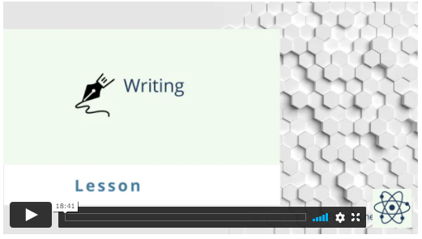
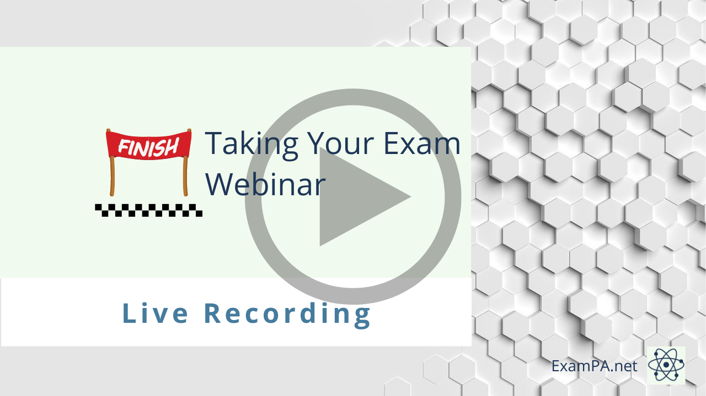

---
output:
  html_document: default
  pdf_document: default
---

# Writing and Communication

30-40% of the points on this exam are from communication. In all prior sittings of this exam, candidates did most of their writing at the end of the report. This was called an Executive Summary. As of 4/3/21, the writing questions were moved into the specific tasks with instructions to write “for a general audience.” In these cases, we will teach you how to use non-technical language and other communication techniques previously used in the executive summary.

## Spelling and Grammar

## Final Review Webinar

Here we go. The last week. Your months of hard work are about to be put to the test. How are you feeling? Nervous? Confident?

This webinar is for you!

In this water-cooler-style discussion, you can bring all of your awkward or "stupid" questions. Really, though, the only stupid question is the one that never gets asked.

**Review the core concepts**

You will get a double-dose of PA material as I review the most critical topics, talk about the topics and questions which are most likely to appear in the June exam, and offer a collection of strategies and advice for succeeding on this exam. You will be able to take a break, gather your thoughts, and gear up for the days leading up to PA. So start now! This is your "checkpoint" before the exam, so don't worry about being too aggressive with your study schedule. In fact, try to be. Learn faster than you ever have. And when you have gaps in your knowledge, then ask them in this webinar and review them the days leading up to your exam.

