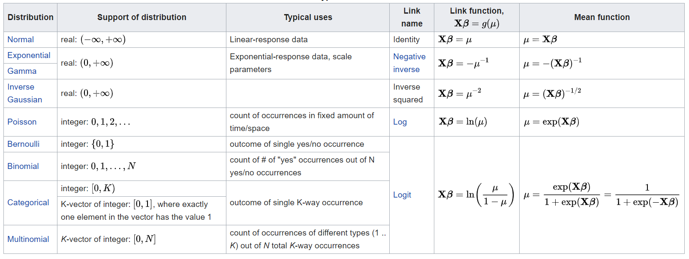
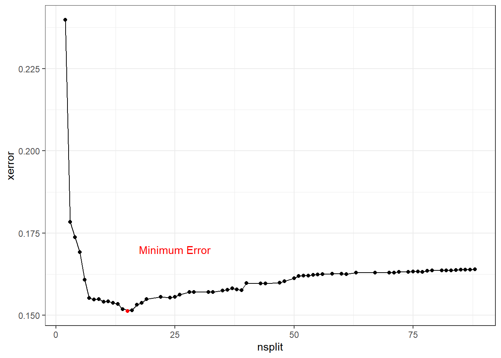

--- 
title: "The Predictive Analytics R Study Manual"
author: 
- "Sam Castillo"
date: "2019-10-29"
site: bookdown::bookdown_site
output: bookdown::gitbook
documentclass: book
bibliography: [book.bib, packages.bib]
biblio-style: apalike
link-citations: yes
github-repo: rstudio/bookdown-demo
description: "This will help you pass these exams"
---
# Welcome {#intro}
---

This book prepares you for the SOA's Predictive Analytics (PA) Exam.  

**Note:** This book is still being written and this is only a preview.

Many candidates start with prior knowledge about parts of this exam.  Very few are learning all of these topics for the first time. **This book allows you to skip the redundant sections and just focus on the new material.**  If you are new to this whole business of machine learning and R programming, great!  Every page will be useful.  

**Features**

- All data sets used are packaged in a single R library
- Clean, easy-to-read, efficient R code
- Explanations of the statistical concepts
- Tips on taking the exam
- Two **original** practice exams

# The Exam

You will have 5 hours and 15 minutes to use RStudio and Excel to fill out a report in Word on a Prometric computer.  The syllabus uses fancy language to describe the topics covered on the exam, making it sound more difficult than it should be.  A good analogy is a job description that has many complex-sounding tasks, when in reality the day-to-day operations of the employee are far simpler.

https://www.soa.org/globalassets/assets/files/edu/2019/2019-12-exam-pa-syllabus.pdf

A non-technical translation is as follows:

**Writing in Microsoft Word (30-40%)**

- Write in professional language
- Type more than 50 words-per-minute

**Manipulating Data in R (15-25%)**

- Quickly clean data sets
- Find data errors planted by the SOA
- Perform queries (aggregations, summaries, transformations)

**Making decisions based on machine learning and statistics knowledge (40-50%)**

- Understand several algorithms from a high level and be able to interpret and explain results in english
- Read R documentation about models and use this to make decisions

# Preface - What is Machine Learning?

All of use are already familiar with how to learn - by learning from our mistakes.  By repeating what is successful and avoiding what results in failure, we learn by doing, by experience, or trial-and-error.  Some study methods work well, but other methods do not.  We all know that memorizing answers without understanding concepts is an ineffective method, and that doing many practice problems is better than doing only a few.  These ideas apply to how computers learn as much as they do to how humans learn.

Take the example of preparing for an actuarial exam.  We can clearly state our objective: get as many correct answers as possible! We want to correctly predict the solution to every problem.  Said another way, we are trying to minimize the error, the percentage of incorrect problems.  Later on, we will see how choosing the objective function changes how models are fit.

The "data" are the practice problems, and the “label” is the answer (A,B,C,D,E).  We want to build a “mental model” that reads the question and predicts the answer.  The SOA suggests 100 hours per hour of exam, which means that actuaries train on hundreds of problems before the real exam.  We don’t have access to the questions that will be on the exam ahead of time, and so this represents “validation” or “holdout” data.  In the chapter on cross-validation, we will see how computers use hold-out sets to test model performance.

The more practice problems that we do, the larger the training data set, and the better our "mental model" becomes.  When we see new problems, ones which have not appeared in the practice exams, we often have a difficult time.  Problems which we have seen before are easier, and we have more confidence in our answers.  Statistics tells us that as the sample size increases, model performance tends to increase.  More difficult concepts tend to require more practice, and more complex machine learning problems require more data.

We typically save time by only doing odd-numbered problems.  This insures that we still get the same proportion of each type of question while doing fewer problems.  If we are unsure of a question, we will often seek a second opinion, or ask an online forum for help.  Later on, we will see how “down-sampling”, “bagging”, and “boosting” are all similar concepts.

<!--chapter:end:index.Rmd-->

# Getting started 

This book is designed to get you set up within an hour.  If this is your first time using R, then you will need to install two pieces of software, R and RStudio.  Once these four steps have been done you should not need to download anything else needed for this book.  You will be able to work offline.

## Download ISLR

This book references the publically-avialable textbook "An Introduction to Statistical Learning", which can be downloaded for free

http://faculty.marshall.usc.edu/gareth-james/ISL/

## Installing R

This is the engine that *runs* the code.  https://cran.r-project.org/mirrors.html

## Installing RStudio

This is the tool that helps you to *write* the code.  Just as MS Word creates documents, RStudio creates R scripts and other documents.  Download RStudio Desktop (the free edition) and choose a place on your computer to install it.

https://rstudio.com/products/rstudio/download/

## Set the R library

R code is organized into libraries.  You want to use the exact same code that will be on the Prometric Computers.  This requires installing older versions of libraries.  Change your R library to the one which was included within the SOA's modules.


```r
#.libPaths("PATH_TO_SOAS_LIBRARY/PAlibrary")
```

## Download the data

For your convenience, all data in this book, including data from prior exams and sample solutions, has been put into a library called `ExamPAData` by the author.  To access, simplly run the below lines of code to download this data.


```r
#check if devtools is installed and then install ExamPAData from github
if("devtools" %in% installed.packages()){
  library(devtools)
  install_github("https://github.com/sdcastillo/ExamPAData")
} else{
  install.packages("devtools")
  library(devtools)
  install_github("https://github.com/sdcastillo/ExamPAData")
}
```

Once this has run, you can access the data using `library(ExamPAData)`.  To check that this is installed correctly see if the `insurance` data set has loaded.  If this returns "object not found", then the library was not installed.


```r
library(ExamPAData)
summary(insurance)
```

```
##     district       group               age               holders       
##  Min.   :1.00   Length:64          Length:64          Min.   :   3.00  
##  1st Qu.:1.75   Class :character   Class :character   1st Qu.:  46.75  
##  Median :2.50   Mode  :character   Mode  :character   Median : 136.00  
##  Mean   :2.50                                         Mean   : 364.98  
##  3rd Qu.:3.25                                         3rd Qu.: 327.50  
##  Max.   :4.00                                         Max.   :3582.00  
##      claims      
##  Min.   :  0.00  
##  1st Qu.:  9.50  
##  Median : 22.00  
##  Mean   : 49.23  
##  3rd Qu.: 55.50  
##  Max.   :400.00
```


<!--chapter:end:01-getting-started.Rmd-->

# R programming

There are already many great R tutorials available.  To save time, this book will cover the absolute essentials.  The book "R for Data Science" provides one such introduction.

https://r4ds.had.co.nz/

## Notebook chunks

On the Exam, you will start with an .Rmd (R Markdown) template.  The way that this book writes code is in the [R Notebook](https://bookdown.org/yihui/rmarkdown/notebook.html). Learning markdown is useful for other web development and documentation tasks as well.

Code is organized into chunks.  To run everything in a chunk quickly, press `CTRL + SHIFT + ENTER`.  To create a new chunk, use `CTRL + ALT + I`.

## Basic operations

The usual math operations apply.


```r
#addition
1 + 2 
```

```
## [1] 3
```

```r
3 - 2
```

```
## [1] 1
```

```r
#multiplication
2*2
```

```
## [1] 4
```

```r
#division
4/2
```

```
## [1] 2
```

```r
#exponentiation
2^3
```

```
## [1] 8
```

There are two assignment operators: `=` and `<-`.  The latter is preferred because it is specific to assigning a variable to a value.  The "=" operator is also used for assigning values in functions (see the functions section).  In R, the shortcut `ALT + -` creates a `<-`.


```r
#variable assignment
x = 2
y <- 2

#equality
4 == 2 #False
```

```
## [1] FALSE
```

```r
5 == 5 #true
```

```
## [1] TRUE
```

```r
3.14 > 3 #true
```

```
## [1] TRUE
```

```r
3.14 >= 3 #true
```

```
## [1] TRUE
```

Vectors can be added just like numbers.  The `c` stands for "concatenate", which creates vectors.


```r
x <- c(1,2)
y <- c(3,4)
x + y
```

```
## [1] 4 6
```

```r
x*y
```

```
## [1] 3 8
```

```r
z <- x + y
z^2
```

```
## [1] 16 36
```

```r
z/2
```

```
## [1] 2 3
```

```r
z + 3
```

```
## [1] 7 9
```

Lists are like vectors but can take any type of object type.  I already mentioned `numeric` types.  There are also `character` (string) types, `factor` types, and `boolean` types.


```r
character <- "The"
character_vector <- c("The", "Quick")
```

Factors are characters that expect only specific values.  A character can take on any value.  A factor is only allowed a finite number of values.  This reduces the memory size.

The below factor has only one "level", which is the list of assigned values.


```r
factor = as.factor(character)
levels(factor)
```

```
## [1] "The"
```

The levels of a factor are by default in R in alphabetical order (Q comes alphabetically before T).


```r
factor_vector <- as.factor(character_vector)
levels(factor_vector)
```

```
## [1] "Quick" "The"
```

Booleans are just True and False values.  R understands `T` or `TRUE` in the same way.  When doing math, bools are converted to 0/1 values where 1 is equivalent to TRUE and 0 FALSE.


```r
bool_true <- T
bool_false <- F
bool_true*bool_false
```

```
## [1] 0
```

Vectors work in the same way.


```r
bool_vect <- c(T,T, F)
sum(bool_vect)
```

```
## [1] 2
```

Vectors are indexed using `[]`.


```r
abc <- c("a", "b", "c")
abc[1]
```

```
## [1] "a"
```

```r
abc[2]
```

```
## [1] "b"
```

```r
abc[c(1,3)]
```

```
## [1] "a" "c"
```

```r
abc[c(1,2)]
```

```
## [1] "a" "b"
```

```r
abc[-2]
```

```
## [1] "a" "c"
```

```r
abc[-c(2,3)]
```

```
## [1] "a"
```


## Lists

Lists are vectors that can hold mixed object types.  Vectors need to be all of the same type.


```r
ls <- list(T, "Character", 3.14)
ls
```

```
## [[1]]
## [1] TRUE
## 
## [[2]]
## [1] "Character"
## 
## [[3]]
## [1] 3.14
```

Lists can be named.


```r
ls <- list(bool = T, character = "character", numeric = 3.14)
ls
```

```
## $bool
## [1] TRUE
## 
## $character
## [1] "character"
## 
## $numeric
## [1] 3.14
```

The `$` operator indexes lists.


```r
ls$numeric
```

```
## [1] 3.14
```

```r
ls$numeric + 5
```

```
## [1] 8.14
```

Lists can also be indexed using `[]`.


```r
ls[1]
```

```
## $bool
## [1] TRUE
```

```r
ls[2]
```

```
## $character
## [1] "character"
```


Lists can contain vectors, other lists, and any other object.


```r
everything <- list(vector = c(1,2,3), character = c("a", "b", "c"), list = ls)
everything
```

```
## $vector
## [1] 1 2 3
## 
## $character
## [1] "a" "b" "c"
## 
## $list
## $list$bool
## [1] TRUE
## 
## $list$character
## [1] "character"
## 
## $list$numeric
## [1] 3.14
```

To find out the type of an object, use `class` or `str` or `summary`.


```r
class(x)
```

```
## [1] "numeric"
```

```r
class(everything)
```

```
## [1] "list"
```

```r
str(everything)
```

```
## List of 3
##  $ vector   : num [1:3] 1 2 3
##  $ character: chr [1:3] "a" "b" "c"
##  $ list     :List of 3
##   ..$ bool     : logi TRUE
##   ..$ character: chr "character"
##   ..$ numeric  : num 3.14
```

```r
summary(everything)
```

```
##           Length Class  Mode     
## vector    3      -none- numeric  
## character 3      -none- character
## list      3      -none- list
```


## Functions

You only need to understand the very basics of functions for this exam.  Still, understanding functions helps you to understand *everything* in R, since R is a functional [programming language](http://adv-r.had.co.nz/Functional-programming.html), unlike Python, C, VBA, Java which are all object-oriented, or SQL which isn't really a language but a series of set-operations.

Functions do things.  The convention is to name a function as a verb.  The function `make_rainbows()` would create a rainbow.  The function `summarise_vectors` would summarise vectors.  Functions may or may not have an input and output.  

If you need to do something in R, there is a high probability that someone has already written a function to do it.  That being said, creating simple functions is quite useful.

**A function that does not return anything**


```r
greet_me <- function(my_name){
  print(paste0("Hello, ", my_name))
}

greet_me("Future Actuary")
```

```
## [1] "Hello, Future Actuary"
```

**A function that returns something**

When returning something, the `return` statement is optional.


```r
add_together <- function(x, y){
  x + y
}

add_together(2,5)
```

```
## [1] 7
```

```r
add_together <- function(x, y){
  return(x + y)
}

add_together(2,5)
```

```
## [1] 7
```

Functions can work with vectors.


```r
x_vector <- c(1,2,3)
y_vector <- c(4,5,6)
add_together(x_vector, y_vector)
```

```
## [1] 5 7 9
```

## Data frames

R is an old programming language.  The original `data.frame` object has been updated with the newer and better `tibble` (like the word "table").  **Tibbles are really lists of vectors, where each column is a vector**.  


```r
library(tibble) #the tibble library has functions for making tibbles
data <- tibble(age = c(25, 35), has_fsa = c(F, T))

data
```

```
## # A tibble: 2 x 2
##     age has_fsa
##   <dbl> <lgl>  
## 1    25 FALSE  
## 2    35 TRUE
```

To index columns in a tibble, the same "$" is used as indexing a list.


```r
data$age
```

```
## [1] 25 35
```

To find the number of rows and columns, use `dim`.


```r
dim(data)
```

```
## [1] 2 2
```

To fine a summary, use `summary`


```r
summary(data)
```

```
##       age        has_fsa       
##  Min.   :25.0   Mode :logical  
##  1st Qu.:27.5   FALSE:1        
##  Median :30.0   TRUE :1        
##  Mean   :30.0                  
##  3rd Qu.:32.5                  
##  Max.   :35.0
```

## Pipes

The pipe operator `%>%` is a way of making code more readable and easier to edit. The way that we are taught to do functional composition is by nesting, which is slow to read and write.

In five seconds, tell me what the below code is doing.


```r
log(sqrt(exp(log2(sqrt((max(c(3, 4, 16))))))))
```

```
## [1] 1
```

Did you get the answer of 1?  If so, you are good at reading parenthesis.  This requires starting from the inner-most nested brackets and moving outwards from right to left.

The math notation would be slightly easier to read, but still painful.

$$log(\sqrt{e^{log_2(\sqrt{max(3,4,16)})}})$$

Here is the same algebra using the pipe.  To read this, replace the `%>%` with the word `THEN`.


```r
library(dplyr) #the pipe is from the dplyr library
max(c(3, 4, 16)) %>% 
  sqrt() %>% 
  log2() %>% 
  exp() %>% 
  sqrt() %>% 
  log()
```

```
## [1] 1
```

```r
#max(c(3, 4, 16) THEN   #The max of 3, 4, and 16 is 16
#  sqrt() THEN          #The square root of 16 is 4
#  log2() THEN          #The log in base 2 of 4 is 2
#  exp() THEN           #the exponent of 2 is e^2
#  sqrt() THEN          #the square root of e^2 is e
#  log()                #the natural logarithm of e is 1
```

You may not be convinced by this simple example using numbers; however, once we get to data manipulations in the next section the advantage of piping will become obvious.

To quickly produce pipes, use `CTRL + SHIFT + M`.  By highlighting only certain sections, we can run the code in steps as if we were using a debugger.  This makes testing out code much faster.


```r
max(c(3, 4, 16))
```

```
## [1] 16
```


```r
max(c(3, 4, 16)) %>% 
  sqrt() 
```

```
## [1] 4
```


```r
max(c(3, 4, 16)) %>% 
  sqrt() %>% 
  log2() 
```

```
## [1] 2
```


```r
max(c(3, 4, 16)) %>% 
  sqrt() %>% 
  log2() %>% 
  exp()
```

```
## [1] 7.389056
```


```r
max(c(3, 4, 16)) %>% 
  sqrt() %>% 
  log2() %>% 
  exp() %>% 
  sqrt() 
```

```
## [1] 2.718282
```


```r
max(c(3, 4, 16)) %>% 
  sqrt() %>% 
  log2() %>% 
  exp() %>% 
  sqrt() %>% 
  log()
```

```
## [1] 1
```

Those familiar with Python's Pandas will be see that `%>%` is quite similar to ".".

<!--chapter:end:02-r-programming.Rmd-->

# Data manipulation


About two hours in this exam will be spent just on data manipulation.  Putting in extra practice in this area is garanteed to give you a better score because it will free up time that you can use elsewhere.

Suggested reading of *R for Data Science* (https://r4ds.had.co.nz/index.html):


| Chapter | Topic           |
|---------|-----------------|
| 9       | Introduction    |
| 10      | Tibbles         |
| 12      | Tidy data       |
| 15      | Factors         |
| 16      | Dates and times |
| 17      | Introduction    |
| 18      | Pipes           |
| 19      | Functions       |
| 20      | Vectors         |


All data for this book can be accessed from the package `ExamPAData`.  In the real exam, you will read the file from the Prometric computer.  To read files into R, the [readr](https://readr.tidyverse.org/articles/readr.html) package has several tools, one for each data format.  For instance, the most common format, comma separated values (csv) are read with the `read_csv()` function.

Because the data is already loaded, simply use the below code to access the data.


```r
library(ExamPAData)
```


## Look at the data

The data that we are using is `health_insurance`, which has information on patients and their health care costs.

The descriptions of the columns are below.  The technical name for this is a "data dictionary", and one will be provided to you on the real exam.

- `age`: Age of the individual
- `sex`: Sex
- `bmi`: Body Mass Index
- `children`: Number of children
- `smoker`: Is this person a smoker?
- `region`: Region
- `charges`: Annual health care costs.

`head()` shows the top n rows.  `head(20)` shows the top 20 rows.  


```r
library(tidyverse)
head(health_insurance)
```

```
## # A tibble: 6 x 7
##     age sex      bmi children smoker region    charges
##   <dbl> <chr>  <dbl>    <dbl> <chr>  <chr>       <dbl>
## 1    19 female  27.9        0 yes    southwest  16885.
## 2    18 male    33.8        1 no     southeast   1726.
## 3    28 male    33          3 no     southeast   4449.
## 4    33 male    22.7        0 no     northwest  21984.
## 5    32 male    28.9        0 no     northwest   3867.
## 6    31 female  25.7        0 no     southeast   3757.
```

Using a pipe is an alternative way of doing this. Because this is more time-efficient, this will be the preferred method in this manual.  


```r
health_insurance %>% head()
```

The `glimpse` function is a transpose of the `head()` function, which can be more spatially efficient.  This also gives you the dimension (1,338 rows, 7 columns).


```r
health_insurance %>% glimpse()
```

```
## Observations: 1,338
## Variables: 7
## $ age      <dbl> 19, 18, 28, 33, 32, 31, 46, 37, 37, 60, 25, 62, 23, 5...
## $ sex      <chr> "female", "male", "male", "male", "male", "female", "...
## $ bmi      <dbl> 27.900, 33.770, 33.000, 22.705, 28.880, 25.740, 33.44...
## $ children <dbl> 0, 1, 3, 0, 0, 0, 1, 3, 2, 0, 0, 0, 0, 0, 0, 1, 1, 0,...
## $ smoker   <chr> "yes", "no", "no", "no", "no", "no", "no", "no", "no"...
## $ region   <chr> "southwest", "southeast", "southeast", "northwest", "...
## $ charges  <dbl> 16884.924, 1725.552, 4449.462, 21984.471, 3866.855, 3...
```

One of the most useful data science tools is counting things.  The function `count()` gives the number of records by a categorical feature.   


```r
health_insurance %>% count(children)
```

```
## # A tibble: 6 x 2
##   children     n
##      <dbl> <int>
## 1        0   574
## 2        1   324
## 3        2   240
## 4        3   157
## 5        4    25
## 6        5    18
```

Two categories can be counted at once.  This creates a table with all combinations of `cut` and `color` and shows the number of records in each category.


```r
health_insurance %>% count(region, sex)
```

```
## # A tibble: 8 x 3
##   region    sex        n
##   <chr>     <chr>  <int>
## 1 northeast female   161
## 2 northeast male     163
## 3 northwest female   164
## 4 northwest male     161
## 5 southeast female   175
## 6 southeast male     189
## 7 southwest female   162
## 8 southwest male     163
```

The `summary()` function is shows a statistical summary.  One caveat is that each column needs to be in it's appropriate type.  For example, `smoker`, `region`, and `sex` are all listed as characters when if they were factors, `summary` would give you count info.

**With incorrect data types**


```r
health_insurance %>% summary()
```

```
##       age            sex                 bmi           children    
##  Min.   :18.00   Length:1338        Min.   :15.96   Min.   :0.000  
##  1st Qu.:27.00   Class :character   1st Qu.:26.30   1st Qu.:0.000  
##  Median :39.00   Mode  :character   Median :30.40   Median :1.000  
##  Mean   :39.21                      Mean   :30.66   Mean   :1.095  
##  3rd Qu.:51.00                      3rd Qu.:34.69   3rd Qu.:2.000  
##  Max.   :64.00                      Max.   :53.13   Max.   :5.000  
##     smoker             region             charges     
##  Length:1338        Length:1338        Min.   : 1122  
##  Class :character   Class :character   1st Qu.: 4740  
##  Mode  :character   Mode  :character   Median : 9382  
##                                        Mean   :13270  
##                                        3rd Qu.:16640  
##                                        Max.   :63770
```

**With correct data types**

This tells you that there are 324 patients in the northeast, 325 in the northwest, 364 in the southeast, and so fourth.


```r
health_insurance <- health_insurance %>% 
  modify_if(is.character, as.factor)

health_insurance %>% 
  summary()
```

```
##       age            sex           bmi           children     smoker    
##  Min.   :18.00   female:662   Min.   :15.96   Min.   :0.000   no :1064  
##  1st Qu.:27.00   male  :676   1st Qu.:26.30   1st Qu.:0.000   yes: 274  
##  Median :39.00                Median :30.40   Median :1.000             
##  Mean   :39.21                Mean   :30.66   Mean   :1.095             
##  3rd Qu.:51.00                3rd Qu.:34.69   3rd Qu.:2.000             
##  Max.   :64.00                Max.   :53.13   Max.   :5.000             
##        region       charges     
##  northeast:324   Min.   : 1122  
##  northwest:325   1st Qu.: 4740  
##  southeast:364   Median : 9382  
##  southwest:325   Mean   :13270  
##                  3rd Qu.:16640  
##                  Max.   :63770
```

## Transform the data

Transforming, manipulating, querying, and wrangling are all words for the task of changing the values in a data frame. For those Excel users out there, this can be interpreted as "what Pivot tables, VLOOKUP, INDEX/MATCH, and SUMIFF do". 

R syntax is designed to be similar to SQL.  They begin with a `SELECT`, use `GROUP BY` to aggregate, and have a `WHERE` to remove records.  Unlike SQL, the ordering of these does not matter.  `SELECT` can come after a `WHERE`.

**R to SQL translation**

```
select() -> SELECT
mutate() -> user-defined columns
summarize() -> aggregated columns
left_join() -> LEFT JOIN
filter() -> WHERE
group_by() -> GROUP BY
filter() -> HAVING
arrange() -> ORDER BY

```


```r
health_insurance %>% 
  select(age, region) %>% 
  head()
```

```
## # A tibble: 6 x 2
##     age region   
##   <dbl> <fct>    
## 1    19 southwest
## 2    18 southeast
## 3    28 southeast
## 4    33 northwest
## 5    32 northwest
## 6    31 southeast
```

Tip: use `CTRL + SHIFT + M` to create pipes `%>%`.

Let's look at only those in the southeast region.  Instead of `WHERE`, use `filter`.


```r
health_insurance %>% 
  filter(region == "southeast") %>% 
  select(age, region) %>% 
  head()
```

```
## # A tibble: 6 x 2
##     age region   
##   <dbl> <fct>    
## 1    18 southeast
## 2    28 southeast
## 3    31 southeast
## 4    46 southeast
## 5    62 southeast
## 6    56 southeast
```

The SQL translation is


```sql
SELECT age, region
FROM health_insurance
WHERE region = 'southeast'
```


Instead of `ORDER BY`, use `arrange`.  Unlike SQL, the order does not matter and `ORDER BY` doesn't need to be last.


```r
health_insurance %>% 
  arrange(age) %>% 
  select(age, region) %>% 
  head()
```

```
## # A tibble: 6 x 2
##     age region   
##   <dbl> <fct>    
## 1    18 southeast
## 2    18 southeast
## 3    18 northeast
## 4    18 northeast
## 5    18 northeast
## 6    18 southeast
```

The `group_by` comes before the aggregation, unlike in SQL where the `GROUP BY` comes last.


```r
health_insurance %>% 
  group_by(region) %>% 
  summarise(avg_age = mean(age))
```

```
## # A tibble: 4 x 2
##   region    avg_age
##   <fct>       <dbl>
## 1 northeast    39.3
## 2 northwest    39.2
## 3 southeast    38.9
## 4 southwest    39.5
```

In SQL, this would be


```sql
SELECT region, 
       AVG(age) as avg_age
FROM health_insurance
GROUP BY region
```


Just like in SQL, many different aggregate functions can be used such as `SUM`, `MEAN`, `MIN`, `MAX`, and so forth.


```r
health_insurance %>% 
  group_by(region) %>% 
  summarise(avg_age = mean(age),
            max_age = max(age),
            median_charges = median(charges),
            bmi_std_dev = sd(bmi))
```

```
## # A tibble: 4 x 5
##   region    avg_age max_age median_charges bmi_std_dev
##   <fct>       <dbl>   <dbl>          <dbl>       <dbl>
## 1 northeast    39.3      64         10058.        5.94
## 2 northwest    39.2      64          8966.        5.14
## 3 southeast    38.9      64          9294.        6.48
## 4 southwest    39.5      64          8799.        5.69
```

To create new columns, the `mutate` function is used.  For example, if we wanted a column of the person's annual charges divided by their age


```r
health_insurance %>% 
  mutate(charges_over_age = charges/age) %>% 
  select(age, charges, charges_over_age) %>% 
  head(5)
```

```
## # A tibble: 5 x 3
##     age charges charges_over_age
##   <dbl>   <dbl>            <dbl>
## 1    19  16885.            889. 
## 2    18   1726.             95.9
## 3    28   4449.            159. 
## 4    33  21984.            666. 
## 5    32   3867.            121.
```

We can create as many new columns as we want.


```r
health_insurance %>% 
  mutate(age_squared  = age^2,
         age_cubed = age^3,
         age_fourth = age^4) %>% 
  head(5)
```

```
## # A tibble: 5 x 10
##     age sex     bmi children smoker region charges age_squared age_cubed
##   <dbl> <fct> <dbl>    <dbl> <fct>  <fct>    <dbl>       <dbl>     <dbl>
## 1    19 fema~  27.9        0 yes    south~  16885.         361      6859
## 2    18 male   33.8        1 no     south~   1726.         324      5832
## 3    28 male   33          3 no     south~   4449.         784     21952
## 4    33 male   22.7        0 no     north~  21984.        1089     35937
## 5    32 male   28.9        0 no     north~   3867.        1024     32768
## # ... with 1 more variable: age_fourth <dbl>
```

The `CASE WHEN` function is quite similar to SQL.  For example, we can create a column which is `0` when `age < 50`, `1` when `50 <= age <= 70`, and `2` when `age > 70`.


```r
health_insurance %>% 
  mutate(age_bucket = case_when(age < 50 ~ 0,
                                age <= 70 ~ 1,
                                age > 70 ~ 2)) %>% 
  select(age, age_bucket)
```

```
## # A tibble: 1,338 x 2
##      age age_bucket
##    <dbl>      <dbl>
##  1    19          0
##  2    18          0
##  3    28          0
##  4    33          0
##  5    32          0
##  6    31          0
##  7    46          0
##  8    37          0
##  9    37          0
## 10    60          1
## # ... with 1,328 more rows
```

SQL translation:


```sql
SELECT CASE WHEN AGE < 50 THEN 0
       ELSE WHEN AGE <= 70 THEN 1
       ELSE 2
FROM health_insurance
```

## Exercises

The data `actuary_salaries` contains the salaries of actuaries collected from the DW Simpson survey.  Use this data to answer the exercises below.


```r
actuary_salaries %>% glimpse()
```

```
## Observations: 138
## Variables: 6
## $ industry    <chr> "Casualty", "Casualty", "Casualty", "Casualty", "C...
## $ exams       <chr> "1 Exam", "2 Exams", "3 Exams", "4 Exams", "1 Exam...
## $ experience  <dbl> 1, 1, 1, 1, 3, 3, 3, 3, 3, 3, 3, 3, 5, 5, 5, 5, 5,...
## $ salary      <chr> "48 - 65", "50 - 71", "54 - 77", "58 - 82", "54 - ...
## $ salary_low  <dbl> 48, 50, 54, 58, 54, 57, 62, 63, 65, 70, 72, 85, 55...
## $ salary_high <chr> "65", "71", "77", "82", "72", "81", "87", "91", "9...
```

1.  How many industries are represented?
2.  The `salary_high` column is a character type when it should be numeric.  Change this column to numeric.
3.  What are the highest and lowest salaries for an actuary in Health with 5 exams passed?
4.  Create a new column called `salary_mid` which has the middle of the `salary_low` and `salary_high` columns.
5.  When grouping by industry, what is the highest `salary_mid`?  What about `salary_high`?  What is the lowest `salary_low`?
6.  There is a mistake when `salary_low == 11`.  Find and fix this mistake, and then rerun the code from the previous task.
7.  Create a new column, called `n_exams`, which is an integer.  Use 7 for ASA/ACAS and 10 for FSA/FCAS.  Use the code below as a starting point and fill in the `_` spaces


```r
actuary_salaries <- actuary_salaries %>% 
  mutate(n_exams = case_when(exams == "FSA" ~ _,
                             exams == "ASA" ~ _,
                             exams == "FCAS" ~ _,
                             exams == "ACAS" ~ _,
                             TRUE ~ as.numeric(substr(exams,_,_)))) 
```

8. Create a column called `social_life`, which is equal to `n_exams`/`experience`.  What is the average (mean) `social_life` by industry?  Bonus question: what is wrong with using this as a statistical measure?


## Answers to exercises

1.  How many industries are represented?


```r
actuary_salaries %>% count(industry)
```

```
## # A tibble: 4 x 2
##   industry     n
##   <chr>    <int>
## 1 Casualty    45
## 2 Health      31
## 3 Life        31
## 4 Pension     31
```

2.  The `salary_high` column is a character type when it should be numeric.  Change this column to numeric.


```r
#method 1
actuary_salaries <- actuary_salaries %>% mutate(salary_high = as.numeric(salary_high))

#method 2
actuary_salaries <- actuary_salaries %>% modify_at("salary_high", as.numeric)
```

3.  What are the highest and lowest salaries for an actuary in Health with 5 exams passed?


```r
actuary_salaries %>% 
  filter(industry == "Health", exams == 5) %>% 
  summarise(highest = max(salary_high),
            lowest = min(salary_low))
```

```
## # A tibble: 1 x 2
##   highest lowest
##     <dbl>  <dbl>
## 1     126     68
```


4.  Create a new column called `salary_mid` which has the middle of the `salary_low` and `salary_high` columns.


```r
actuary_salaries <- actuary_salaries %>% 
  mutate(salary_mid = (salary_low + salary_high)/2)
```


5.  When grouping by industry, what is the highest `salary_mid`?  What about `salary_high`?  What is the lowest `salary_low`?


```r
actuary_salaries %>% 
  group_by(industry) %>% 
  summarise(max_salary_mid = max(salary_mid),
            max_salary_high = max(salary_high),
            low_salary_low = min(salary_low))
```

```
## # A tibble: 4 x 4
##   industry max_salary_mid max_salary_high low_salary_low
##   <chr>             <dbl>           <dbl>          <dbl>
## 1 Casualty           302.             447             11
## 2 Health             272.             390             49
## 3 Life               244              364             51
## 4 Pension            224.             329             44
```

6.  There is a mistake when `salary_low == 11`.  Find and fix this mistake, and then rerun the code from the previous task.


```r
actuary_salaries <- actuary_salaries %>% 
  mutate(salary_low = ifelse(salary_low == 11, yes = 114, no = salary_low),
         salary_high = ifelse(salary_high == 66, yes = 166, no = salary_high))

#the minimum salary low is now 48
actuary_salaries %>% 
  group_by(industry) %>% 
  summarise(max_salary_mid = max(salary_mid),
            max_salary_high = max(salary_high),
            low_salary_low = min(salary_low))
```

```
## # A tibble: 4 x 4
##   industry max_salary_mid max_salary_high low_salary_low
##   <chr>             <dbl>           <dbl>          <dbl>
## 1 Casualty           302.             447             48
## 2 Health             272.             390             49
## 3 Life               244              364             51
## 4 Pension            224.             329             44
```

7.  Create a new column, called `n_exams`, which is an integer.  Use 7 for ASA/ACAS and 10 for FSA/FCAS.

Use the code below as a starting point and fill in the `_` spaces


```r
actuary_salaries <- actuary_salaries %>% 
  mutate(n_exams = case_when(exams == "FSA" ~ _,
                             exams == "ASA" ~ _,
                             exams == "FCAS" ~ _,
                             exams == "ACAS" ~ _,
                             TRUE ~ as.numeric(substr(exams,_,_)))) 
```


```r
actuary_salaries <- actuary_salaries %>% 
  mutate(n_exams = case_when(exams == "FSA" ~ 10,
                             exams == "ASA" ~ 7,
                             exams == "FCAS" ~ 10,
                             exams == "ACAS" ~ 7,
                             TRUE ~ as.numeric(substr(exams,1,2)))) 
```

```
## Warning in eval_tidy(pair$rhs, env = default_env): NAs introduced by
## coercion
```

```r
actuary_salaries %>% count(n_exams)
```

```
## # A tibble: 8 x 2
##   n_exams     n
##     <dbl> <int>
## 1       1    12
## 2       2    17
## 3       3    19
## 4       4    21
## 5       5    17
## 6       6     5
## 7       7    29
## 8      10    18
```

8. Create a column called `social_life`, which is equal to `n_exams`/`experience`.  What is the average (mean) `social_life` by industry?  Bonus question: what is wrong with using this as a statistical measure?


```r
actuary_salaries %>% 
  mutate(social_life = n_exams/experience) %>% 
  group_by(industry) %>% 
  summarise(avg_social_life = mean(social_life))
```

```
## # A tibble: 4 x 2
##   industry avg_social_life
##   <chr>              <dbl>
## 1 Casualty           0.985
## 2 Health             1.06 
## 3 Life               1.06 
## 4 Pension            1.00
```

```r
#this is not REALLY an average as the number of people, or number of actuaries, are not taken into consideration.  To correctly take the average, we would need use a weighted average like sum(number_actuaries*social_life)/sum(number_actuaries)
```


<!--chapter:end:03-data-manipulation.Rmd-->

# Visualization

The creator's of the exam do not expect candidates to be expert data scientists.  Being able to create basic one-dimensional graphs and to interpret results is most important.

Creating graphs in R is easy.  The most popular way to do this is with the `ggplot` library.  

Three-Steps:

## Step 1. Put the data in a pivotable format

Excel users will know this as "pivot-table format", or the way that a table is organized so it can be put into a pivot table.  This is also known as "tidy format".  There is one-row per record and one column per variable.  

### Example of "wide" or "matrix" format 

The data below contains counts on a survey which asked people about their religion and annual income.

- `religion` is stored in the rows
- `income` is spread across the columns

This is difficult to work with because there are a lot of columns. 


```
## # A tibble: 6 x 11
##   religion `<$10k` `$10-20k` `$20-30k` `$30-40k` `$40-50k` `$50-75k`
##   <chr>      <dbl>     <dbl>     <dbl>     <dbl>     <dbl>     <dbl>
## 1 Agnostic      27        34        60        81        76       137
## 2 Atheist       12        27        37        52        35        70
## 3 Buddhist      27        21        30        34        33        58
## 4 Catholic     418       617       732       670       638      1116
## 5 Don’t k~      15        14        15        11        10        35
## 6 Evangel~     575       869      1064       982       881      1486
## # ... with 4 more variables: `$75-100k` <dbl>, `$100-150k` <dbl>,
## #   `>150k` <dbl>, `Don't know/refused` <dbl>
```
### Example of "pivotable", "long", or "tidy" format

Here is the same data only in a long format.  


You don't need to know how to switch between the two for now, but only that the long format is what is needed to create graphs.

## Step 2. Create a plot object (ggplot)

The first step is to create a blank canvas that holds the columns that are needed.  Let's say that the goal is to graph `income` and `count`.  We put these into a ggplot object called `p`.

The `aesthetic` argument, `aes`, means that the x-axis will have `income` and the y-axis will have `count`.


```r
p <- data %>% ggplot(aes(x = income, y = count))
```

If we look at `p`, we see that it is nothing but white space with axis for `count` and `income`.


```r
p
```


## Step 3: Add a plot

We add an xy plot.


```r
p + geom_point()
```


We can also create a bar plot.


```r
p + geom_bar(stat = "identity")
```


Creating histograms is even easier.  Just specify the column that you want to graph as the x column.  No y is needed because a histogram is one-dimensional.  

Take a x to be a random variable from a gamma distribution.


```r
gamma = tibble(x = rgamma(1000, shape = 1, rate = 2))
```


```r
p <- gamma %>% ggplot(aes(x = x))
p + geom_histogram()
```

```
## `stat_bin()` using `bins = 30`. Pick better value with `binwidth`.
```


We can graph a density instead of a histogram by using `geom_density` instead of `geom_hist`.


```r
p + geom_density(fill = "grey")
```


<!--chapter:end:04-visualization.Rmd-->

---
output:
  pdf_document: default
  html_document: default
---

# Linear Models

## Model Notation

The number of observations will be denoted by $n$.  When we refer to the size of a data set, we are referring to $n$.  We use $p$ to refer the number of input variables used.  The word "variables" is synonymous with "features".  For example, in the `health_insurance` data, the variables are `age`, `sex`, `bmi`, `children`, `smoker` and `region`.  These 7 variables mean that $p = 7$.  The data is collected from 1,338 patients, which means that $n = 1,338$.

Scalar numbers are denoted by ordinary variables (i.e., $x = 2$, $z = 4$), and vectors are denoted by bold-faced letters 

$$\mathbf{a} = \begin{pmatrix} a_1 \\ a_2 \\ a_3 \end{pmatrix}$$

We use $\mathbf{y}$ to denote the target variable.  This is the variable which we are trying to predict.  This can be either a whole number, in which case we are performing *regression*, or a category, in which case we are performing *classification*.  In the health insurance example, `y = charges`, which are the annual health care costs for a patient.

Both $n$ and $p$ are important because they tell us what types of models are likely to work well, and which methods are likely to fail.  For the PA exam, we will be dealing with small $n$ (<100,000) due to the limitations of the Prometric computers.  We will use a small $p$ (< 20) in order to make the data sets easier to interpret.

We organize these variables into matrices.  Take an example with $p$ = 2 columns and 3 observations.  The matrix is said to be $3 \times 2$ (read as "2-by-3") matrix.

$$
\mathbf{X} = \begin{pmatrix}x_{11} & x_{21}\\
x_{21} & x_{22}\\
x_{31} & x_{32}
\end{pmatrix}
$$

The target is 

$$\mathbf{y} = \begin{pmatrix} y_1 \\ y_2 \\ y_3 \end{pmatrix}$$
This represents the *unknown* quantity that we want to be able to predict.  In the health care costs example, $y_1$ would be the costs of the first patient, $y_2$ the costs of the second patient, and so forth.  The variables $x_{11}$ and $x_{12}$ might represent the first patient's age and sex respectively, where $x_{i1}$ is the patient's age, and $x_{i2} = 1$ if the ith patient is male and 0 if female.

Machine learning is about using $\mathbf{X}$ to predict $\mathbf{y}$. We call this "y-hat", or simply the prediction.  This is based on a function of the data $X$.

$$\mathbf{\hat{y}} = f(\mathbf{X}) = \begin{pmatrix} \hat{y_1} \\ \hat{y_2} \\ \hat{y_3} \end{pmatrix}$$


This is almost never going to happen perfectly, and so there is always an error term, $\mathbf{\epsilon}$.  This can be made smaller, but is never exactly zero.  

$$
\mathbf{\hat{y}} + \mathbf{\epsilon} = f(\mathbf{X}) + \mathbf{\epsilon}
$$

In other words, $\epsilon = y - \hat{y}$.  We call this the *residual*.  When we predict a person's health care costs, this is the difference between the predicted costs (which we had created the year before) and the actual costs that the patient experienced (of that current year).

## Ordinary least squares (OLS)

The type of model used refers to the class of function of $f$.  If $f$ is linear, then we are using a linear model.  If $f$ is non-parametric (does not have input parameters), then it is non-parametric modeling.  Linear models are the simplest type of model.

We have the data $\mathbf{X}$ and the target $\mathbf{y}$, where all of the y's are real numbers, or $y_i \in \mathbb{R}$.

We want to find a $\mathbf{\beta}$ so that 

$$
\mathbf{\hat{y}} = \mathbf{X} \mathbf{\beta}
$$

Which means that each $y_i$ is a linear combination of the variables $x_1, ..., x_p$, plus a constant $\beta_0$ which is called the *intercept* term.  

$$
\begin{equation}
y_i = \beta_0 + \beta_1 x_1 + ... + \beta_p x_p
\end{equation}
$$

In the one-dimensional case, this creates a line connecting the points.  In higher dimensions, this creates a hyperplane.


The question then is **how can we choose the best values of** $\beta?$  First of all, we need to define what we mean by "best".  Ideally, we will choose these values which will create close predictions of $\mathbf{y}$ on new, unseen data.  

To solve for $\mathbf{\beta}$, we first need to define a *loss function*.  This allows us to compare how well a model is fitting the data.  The most commonly used loss function is the residual sum of squares (RSS), also called the *squared error loss* or the L2 norm.  When RSS is small, then the predictions are close to the actual values and the model is a good fit.  When RSS is large, the model is a poor fit.

$$
\text{RSS} = \sum_i(y_i - \hat{y})^2
$$

When you replace $\hat{y_i}$ in the above equation with $\beta_0 + \beta_1 x_1 + ... + \beta_p x_p$, take the derivative with respect to $\beta$, set equal to zero, and solve, we can find the optimal values.  This turns the problem of statistics into a problem of numeric optimization, which computers can do quickly.

You might be asking: why does this need to be the squared error?  Why not the absolute error, or the cubed error?  Technically, these could be used as well.  In fact, the absolute error (L1 norm) is useful in other models.  Taking the square has a number of advantages.  

- It provides the same solution if we assume that the distribution of $\mathbf{Y}|\mathbf{X}$ is guassian and maximize the likelihood function.  This method is used for GLMs, in the next chapter.
- Empirically it has been shown to be less likely to overfit as compared to other loss functions

### Example

In our health, we can create a linear model using `bmi`, `age`, and `sex` as an inputs.  

The `formula` controls which variables are included.  There are a few shortcuts for using R formulas.  

| Formula | Meaning  | 
|-------|---------|
| `charges` ~ `bmi` + `age` | Use `age` and `bmi` to predict `charges` |
| `charges` ~ `bmi` + `age` + `bmi`*`age` | Use `age`,`bmi` as well as an interaction to predict `charges` |
| `charges` ~ (`bmi > 20`) + `age` | Use an indicator variable for `bmi > 20` `age` to predict `charges` |
| log(`charges`) ~ log(`bmi`) + log(`age`) | Use the logs of `age` and `bmi` to predict  log(`charges`) |

You can use formulas to create new variables (aka feature engineering).  This can save you from needing to re-run code to create data.  

Below we fit a simple linear model to predict charges.


```r
library(ExamPAData)
library(tidyverse)

model <- lm(data = health_insurance, formula = charges ~ bmi + age)
```

The `summary` function gives details about the model.  First, the `Estimate`, gives you the coefficients.  The `Std. Error` is the error of the estimate for the coefficient.  Higher standard error means greater uncertainty.  This is relative to the average value of that variable.  The `t value` tells you how "big" this error really is based on standard deviations.  A larger `t value` implies a low probability of the null hypothesis being rejected saying that the coefficient is zero.  This is the same as having a p-value (`Pr (>|t|))`) being close to zero.

The little `*`, `**`, `***` indicate that the variable is either somewhat significant, significant, or highly significant.  "significance" here means that there is a low probability of the coefficient being that size if there were *no actual casual relationship*, or if the data was random noise.


```r
summary(model)
```

```
## 
## Call:
## lm(formula = charges ~ bmi + age, data = health_insurance)
## 
## Residuals:
##    Min     1Q Median     3Q    Max 
## -14457  -7045  -5136   7211  48022 
## 
## Coefficients:
##             Estimate Std. Error t value Pr(>|t|)    
## (Intercept) -6424.80    1744.09  -3.684 0.000239 ***
## bmi           332.97      51.37   6.481 1.28e-10 ***
## age           241.93      22.30  10.850  < 2e-16 ***
## ---
## Signif. codes:  0 '***' 0.001 '**' 0.01 '*' 0.05 '.' 0.1 ' ' 1
## 
## Residual standard error: 11390 on 1335 degrees of freedom
## Multiple R-squared:  0.1172,	Adjusted R-squared:  0.1159 
## F-statistic:  88.6 on 2 and 1335 DF,  p-value: < 2.2e-16
```

When evaluating model performance, you should not rely on the `summary` alone as this is based on the training data.  To look at performance, test the model on validation data.  This can be done by a) using a hold out set, or b) using cross-validation, which is even better.

Let's create an 80% training set and 20% testing set.  You don't need to worry about understanding this code as the exam will always give this to you.


```r
library(caret)
#create a train/test split
index <- createDataPartition(y = health_insurance$charges, p = 0.8, list = F) %>% as.numeric()
health_insurance_train <-  health_insurance %>% slice(index)
health_insurance_test <- health_insurance %>% slice(-index)
```

Train the model on the `health_insurance_train` and test on `health_insurance_test`.  


```r
model <- lm(data = health_insurance_train, formula = charges ~ bmi + age)
pred = predict(model, health_insurance_test)
```

Let's look at the Root Mean Squared Error (RMSE).  


```r
get_rmse <- function(y, y_hat){
  mean((y - y_hat)^2)
}

get_rmse(pred, health_insurance_test$charges)
```

```
## [1] 129080408
```

The above number does not tell us if this is a good model or not by itself.  We need a comparison.  The fastest check is to compare against a prediction of the mean.  In other words, all values of the `y_hat` are the average of `charges`


```r
get_rmse(mean(health_insurance_test$charges), health_insurance_test$charges)
```

```
## [1] 144725527
```

The RMSE is **higher** (worse) when predicting the mean, which is what we expect.  **If you ever fit a model and get an error which is worse than the average prediction, something must be wrong.**

The next test is to see if any assumptions have been violated.  

First, is there a pattern in the residuals?  If there is, this means that the model is missing key information.  For the model below, this is a **yes**, which means that this is a bad model.  Because this is just for illustration, I'm going to continue using it, however.  


```r
plot(model, which = 1)
```

<div class="figure">

<p class="caption">(\#fig:unnamed-chunk-8)Residuals vs. Fitted</p>
</div>

The normal QQ shows how well the quantiles of the predictions fit to a theoretical normal distribution.  If this is true, then the graph is a straight 45-degree line.  In this model, you can definitely see that this is not the case.  If this were a good model, this distribution would be closer to normal.


```r
plot(model, which = 2)
```

<div class="figure">

<p class="caption">(\#fig:unnamed-chunk-9)Normal Q-Q</p>
</div>

**Caution: This test only applies to linear models which have a gaussian response distribution.**

The below is from an excellent post of Stack Exchange.

>R does not have a distinct plot.glm() method. When you fit a model with glm() and run plot(), it calls ?plot.lm, which is appropriate for linear models (i.e., with a normally distributed error term).

>More specifically, the plots will often 'look funny' and lead people to believe that there is something wrong with the model when it is perfectly fine. We can see this by looking at those plots with a couple of simple simulations where we know the model is correct:

Once you have chosen your model, you should re-train over the entire data set.  This is to make the coefficients more stable because `n` is larger.  Below you can see that the standard error is lower after training over the entire data set.


```r
model_full_data <- lm(data = health_insurance, formula = charges ~ bmi + age)
model_test_data <-  lm(data = health_insurance_train, formula = charges ~ bmi + age)
```

<table>
 <thead>
  <tr>
   <th style="text-align:left;"> term </th>
   <th style="text-align:right;"> full_data_std_error </th>
   <th style="text-align:right;"> test_data_std_error </th>
  </tr>
 </thead>
<tbody>
  <tr>
   <td style="text-align:left;"> (Intercept) </td>
   <td style="text-align:right;"> 1744.1 </td>
   <td style="text-align:right;"> 1943.6 </td>
  </tr>
  <tr>
   <td style="text-align:left;"> bmi </td>
   <td style="text-align:right;"> 51.4 </td>
   <td style="text-align:right;"> 57.3 </td>
  </tr>
  <tr>
   <td style="text-align:left;"> age </td>
   <td style="text-align:right;"> 22.3 </td>
   <td style="text-align:right;"> 25.0 </td>
  </tr>
</tbody>
</table>

All interpretations should be based on the model which was trained on the entire data set.  Obviously, this only makes a difference if you are interpreting the precise values of the coefficients.  If you are just looking at which variables are included, or at the size and sign of the coefficients, then this would not change.


```r
coefficients(model_full_data)
```

```
## (Intercept)         bmi         age 
##  -6424.8046    332.9651    241.9308
```

Translating the above into an equation we have

$$\hat{y_i} = -6,424.80 + 332.97 \space\text{bmi} + 241.93\space \text{age}$$

For example, if a patient has `bmi = 27.9` and `age = 19` then predicted value is 

$$\hat{y_1} = -6,424.80 + (332.97)(27.9) + (241.93)(19) = 7,461.73$$

This model structure implies that each of the variables $\mathbf{x_1}, ..., \mathbf{x_p}$ each change the predicted $\mathbf{\hat{y}}$.  If $x_{ij}$ increases by one unit, then $y_i$ increases by $\beta_j$ units, regardless of what happens to all of the other variables.  This is one of the main assumptions of linear models: *variable indepdendence*.  If the variables are correlated, say, then this assumption will be violated.  


| Readings |  | 
|-------|---------|
| ISLR 2.1 What is statistical learning?|  |
| ISLR 2.2 Assessing model accuracy|  |


## Generalized linear models (GLMs)

Instead of the model being a direct linear combination of the variables, there is an intermediate step called a *link function* $g$.

$$
g(\mathbf{\hat{y}}) = \mathbf{X} \mathbf{\beta}
$$
This implies that the response $\mathbf{y}$ is related to the linear predictor $\mathbf{X} \mathbf{\beta}$ through the *inverse* link function.

$$
\mathbf{\hat{y}} = g^-1(\mathbf{X} \mathbf{\beta})
$$
This means that $g(.)$ must be an invertable.  For example, if $g$ is the natural logarithm (aka, the "log-link"), then

$$
log(\mathbf{\hat{y}}) = \mathbf{X} \mathbf{\beta} \Rightarrow \mathbf{\hat{y}} = e^{\mathbf{X} \mathbf{\beta}}
$$

This is useful when the distribution of $Y$ is skewed, as taking the log corrects skewness.

<div class="figure">

<p class="caption">(\#fig:unnamed-chunk-13)Taking the log corrects for skewness</p>
</div>

You might be asking, what if the distribution of $Y$ is not normal, no matter what choice we have for $g$?  The short answer is that we can change our assumption of the distribution of $Y$, and use this to change the parameters.  If you have taken exam STAM then you are familiar with *maximum likelihood estimation*.  

We have a response $\mathbf{Y}$, and we fit a distribution to $\mathbf{Y} | \mathbf{X}$.  This is the target variable conditioned on the data.  For each $y_i$, each observation, we assign a probability $f_Y(y_i)$

$$
f_y(y_i | X_1 = x_1, X_2 = x_2, ..., X_p = x_p) = Pr(Y = y_i | \mathbf{X})
$$

Now, when we choose the response family, we are simply changing $f_Y$.  If we say that the response family is Gaussian, then $f$ has a Gaussian PDF.  If we are modeling counts, then $f$ is a Poisson PDF.  This only works if $f$ is in the *exponential family* of distributions, which consists of the common names such as Gaussian, Binomial, Gamma, Inverse Gamma, and so forth.  Reading the CAS Monograph 5 will provide more detail into this.

The possible combinations of link functions and distribution families are summarized nicely on [Wikipedia](https://en.wikipedia.org/wiki/Generalized_linear_model#Link_function).

<div class="figure">

<p class="caption">(\#fig:unnamed-chunk-14)Distribution-Link Function Combinations</p>
</div>

For this exam, a common question is to ask candiates to choose the best distribution and link function.  There is no all-encompasing answer, but a few suggestions are

- If $Y$ is counting something, such as the number of claims, number of accidents, or some other discrete and positive counting sequence, use the Poisson;
- If $Y$ contains negative values, then do not use the Exponential, Gamma, or Inverse Gaussian as these are strictly positive.  Conversely, if $Y$ is only positive, such as the price of a policy (price is always > 0), or the claim costs, then these are good choices;
- If $Y$ is binary, the the binomial response with either a Probit or Logit link.  The Logit is more common.
- If $Y$ has more than two categories, the multinomial distribution with either the Probit or Logic link.

The exam will always ask you to interpret the GLM.  These questions can usually be answered by inverting the link function and interpreting the coefficients.  In the case of the log link, simply take the exponent of the coefficients and each of these represents a "relativity" factor.

$$
log(\mathbf{\hat{y}}) = \mathbf{X} \mathbf{\beta} \Rightarrow \mathbf{\hat{y}} = e^{\mathbf{X} \mathbf{\beta}}
$$
For a single observation $y_i$, this is

$$
\text{exp}(\beta_0 + \beta_1 x_{i1} + \beta_2 x_{i2} + ... + \beta_p x_{ip}) = \\
e^{\beta_0} e^{\beta_1 x_{i1}}e^{\beta_2 x_{i2}} ...  e^{\beta_p x_{ip}} = 
R_o R_2 R_3 ... R_{p}
$$
Where $R_k$ is the *relativity* of the kth variable.  This terminology is from insurance ratemaking, where actuaries need to be able to explain the impact of each variable in pricing insurance.  The data science community does not use this language. 

For binary outcomes with logit or probit link, there is no easy interpretation.  This has come up in at least one past sample exam, and the solution was to create "psuedo" observations and observe how changing each $x_k$ would change the predicted value.  Due to the time requirements, this is unlikely to come up on an exam.  So if you are asked to use a logit or probit link, saying that the result is not easy to interpret should suffice.

### Interactions

An interaction occurs when the effect of a variable on the response is different depending on the level of other variables in the model.

Consider this model:

Let $x_2$ be an indicator variable, which is 1 for some records and 0 otherwise.  

$$\hat{y_i} = \beta_0 + \beta_1 x_1 + \beta_2 x_2 + \beta_3 x_1 x_2$$

There are now two different linear models dependong on whether `x_1` is 0 or 1.

$$
x_1 = 0 \Rightarrow \hat{y_i} = \beta_0  + \beta_2 x_2 \\

x_1 = 1 \Rightarrow \hat{y_i} = \beta_0 + \beta_1 + \beta_2 x_2 + \beta_3 x_2 \\

 = (\beta_0 + \beta_1) + (\beta_2 + \beta_3 ) x_2 \\
 = \beta_0^* + \beta_1^* x_2
$$

Notice how the intercept changes from $\beta_0$ to $\beta_0^*$ and the slope changes from $\beta_1$ to $\beta_1^*$.

The SOA's modules give an example with the using age and gender as below.  This is not a very strong interaction, as the slopes are almost identical across `gender`.


```r
interactions %>% 
  ggplot(aes(age, actual, color = gender)) + 
  geom_line() + 
  theme_minimal() +
  labs(title = "Age vs. Actual by Gender", 
       subtitle = "Interactions imply different slopes",
       caption= "data: interactions")
```

<div class="figure">

<p class="caption">(\#fig:unnamed-chunk-15)Example of weak interaction</p>
</div>

Here is a clearer example from the `auto_claim` data. The lines show the slope of a linear model, assuming that only `BLUEBOOK` and `CAR_TYPE` were predictors in the model.  You can see that the slope for Sedans and Sports Cars is higher than for Vans and Panel Trucks.  


```r
auto_claim %>% 
  ggplot(aes(log(CLM_AMT), log(BLUEBOOK), color = CAR_TYPE)) + 
  geom_point(alpha = 0.3) + 
  geom_smooth(method = "lm", se = F) + 
  theme_minimal()  + 
  labs(title = "Kelly Bluebook Value vs Claim Amount")
```

```
## Warning: Removed 7556 rows containing non-finite values (stat_smooth).
```

<div class="figure">

<p class="caption">(\#fig:unnamed-chunk-16)Example of strong interaction</p>
</div>

Any time that the effect that one variable has on the response is different depending on the value of other variables we say that there is an interaction.  We can also use an hypothesis test with a GLM to check this.  Simply include an interaction term and see if the coefficient is zero at the desired significance level.

### Poisson Regression

When the dependent variable is a count, such as the number of claims per month, Poisson regression is appropriate.  This requires that each claim is independent in that one claim will not make another claim more or less likely.  This means that the target variable is actually a rate, $\frac{\text{claims}}{\text{months}}$.  More generally, we call the months the *exposure*.

Let $m_i$ by the units of exposure and $y_i$ the target.  We use a log-link function to correct for skewness.

$$
log(\frac{\hat{y_i}}{m_i}) = \beta_0 + \beta_1 x_1 + ... + \beta_p x_p \\

\Rightarrow log(\hat{y_i}) = log(m_i) + \beta_0 + \beta_1 x_1 + ... + \beta_p x_p
$$

We call the $log(m_i)$ the `offset` term.  Notice that there is no coefficient (beta) on this value, because we already know what the impact will be.  

In R, the code for this equation would be


```r
glm(y ~ offset(log(m)) + x, family=poisson(link=log) )
```


| Readings |  | 
|-------|---------|
| [CAS Monograph 5 Chapter 2](https://contentpreview.s3.us-east-2.amazonaws.com/CAS+Monograph+5+-+Generalized+Linear+Models+for+Insurance+Ratemaking.pdf) |  |
| ISLR 2.2 Assessing model accuracy|  |

### Advantages and disadvantages

There is usually at least one question on the PA exam which asks you to "list some of the advantages and disadvantages of using this particular model", and so here is one such list. 

**GLM Advantages**

- Easy to interpret
- Handles skewed data through different response distributions
- Models the average response which leads to stable predictions on new data
- Handles continuous and categorical data
- Works well on small data sets

**GLM Disadvantages**

- Does not select features
- Strict assumptions around distribution shape, randomness of error terms, and others
- Unable to detect non-linearity directly (although this can manually be addressed through feature engineering)
- Sensitive to outliers
- Low predictive power

## Penalized Linear Models

One of the main weaknesses of the GLM is that the features need to be selected by hand.  For large $p$, this means that the modeler needs to test every combination of variables.  This is time consuming.  

Earlier on we said that the linear model minimizes the sum of square terms, known as the residual sum of squares (RSS)

$$
\text{RSS} = \sum_i(y_i - \hat{y})^2 = \sum_i(y_i - \beta_0 - \sum_{j = 1}^p\beta_j x_{ij})^2
$$

This loss function can be modified so that models which include more (and larger) coefficients are considered as worse.  In other words, when there are more $\beta$'s, or $\beta$'s which are larger, the RSS is higher.

### Ridge Regression

Ridge regression adds a penalty term which is proportional to the square of the sum of the coefficients.  This is known as the "L2" norm.

$$
\sum_i(y_i - \beta_0 - \sum_{j = 1}^p\beta_j x_{ij})^2 + \lambda \sum_{j = 1}^p\beta_j^2
$$

This $\lambda$ controls how much of a penalty is imposed on the size of the coefficients.  When $\lambda$ is high, simpler models are treated more favorably because the $\sum_{j = 1}^p\beta_j^2$ carries more weight.  Conversely, then $\lambda$ is low, complex models are more favored.  When $\lambda = 0$, we have an ordinary GLM.

### Lasso

The official name is the Least Absolute Shrinkage and Selection Operator, but the common name is just "the lasso".  Just as with Ridge regression, we want to favor simpler models; however, we also want to *select* variables.  This is the same as forcing some coefficients to be equal to 0.

Instead of taking the square of the coefficients (L2 norm), we take the absolute value (L1 norm).  

$$
\sum_i(y_i - \beta_0 - \sum_{j = 1}^p\beta_j x_{ij})^2 + \lambda \sum_{j = 1}^p|\beta_j|
$$

In ISLR, Hastie et al show that this results in coefficients being forced to be exactly 0.  This is extremely useful because it means that by changing $\lambda$, we can select how many variables to use in the model.

**Note**: While any response family is possible with penalized regression, in R, only the Gaussian family is possible in the library `glmnet`, and so this is the only type of question that the SOA can ask.

### Advantages and disadvantages

**Elastic Net/Lasso/Ridge Advantages**

- All benefits from GLMS
- Automatic variable selection
- Better predictive power than GLM (usually)

**Elastic Net/Lasso/Ridge Disadvantages**

- All cons of GLMs

| Readings |  | 
|-------|---------|
| ISLR 6.1 Subset Selection  | |
| ISLR 6.2 Shrinkage Methods|  |


<!--chapter:end:05-linear-models.Rmd-->

---
output:
  pdf_document: default
  html_document: default
---


# Tree-based models

## Decision Trees

Decision trees can be used for either classification or regression problems.  The model structure is a series of yes/no questions.  Depending on how each observation answers these questions, a prediction is made.

The below example shows how a single tree can predict health claims.

- For non-smokers, the predicted annual claims are 8,434.  This represents 80% of the observations
- For smokers with a `bmi` of less than 30, the predicted annual claims are 21,000.  10% of patients fall into this bucket.
- For smokers with a `bmi` of more than 30, the prediction is 42,000.  This bucket accounts for 11% of patients.

<div class="figure">

<p class="caption">(\#fig:unnamed-chunk-2)Decision tree of health costs</p>
</div>

We can cut the data set up into these groups and look at the claim costs.  From this grouping, we can see that `smoker` is the most important variable as the difference in average claims is about 20,000.


|smoker |bmi_30    |mean_claims | percent|
|:------|:---------|:-----------|-------:|
|no     |bmi < 30  |$7,977.03   |    0.38|
|no     |bmi >= 30 |$8,842.69   |    0.42|
|yes    |bmi < 30  |$21,363.22  |    0.10|
|yes    |bmi >= 30 |$41,557.99  |    0.11|

This was a very simple example because there were only two variables.  If we have more variables, the tree will get large very quickly.  This will result in overfitting; there will be good performance on the training data but poor performance on the test data.

The step-by-step process of building a tree is

**Step 1: Choose a variable at random.**  

This could be any variable in `age`, `children`, `charges`, `sex`, `smoker`, `age_bucket`, `bmi`, or `region`.

**Step 2: Find the split point which best seperates observations out based on the value of $y$.  A good split is one where the $y$'s are very different. * **

In this case, `smoker` was chosen.  Then we can only split this in one way: `smoker = 1` or `smoker = 0`.

Then for each of these groups, smokers and non-smokers, choose another variable at random.  In this case, for no-smokers, `age` was chosen.  To find the best cut point of `age`, look at all possible age cut points from 18, 19, 20, 21, ..., 64 and choose the one which best separates the data.

There are three ways of deciding where to split

- *Entropy* (aka, information gain)
- *Gini*
- *Classification error*

Of these, only the first two are commonly used.  The exam is not going to ask you to calculate either of these.  Just know that neither method will work better on all data sets, and so the best practice is to test both and compare the performance. 

**Step 3: Continue doing this until a stopping criteria is reached.  For example, the minimum number of observations is 5 or less.** 

As you can see, this results in a very deep tree.


```r
tree <- rpart(formula = charges ~  ., data = health_insurance,
              control = rpart.control(cp = 0.003))
rpart.plot(tree, type = 3)
```


**Step 4: Apply cost comlexity pruning to simplify the tree**

Intuitively, we know that the above model would perform poorly due to overfitting.  We want to make it simpler by removing nodes.  This is very similar to how in linear models we reduce complexity by reducing the number of coefficients.

A measure of the depth of the tree is the *complexity*.  You can think of $|T|$ as the "degrees of freedom" in a linear model.  In the above example, $|T| = 8$.  The amount of penalization is controlled by $\alpha$.  This is very similar to $\lambda$ in the Lasso.

To calculate the cost of a tree, number the terminal nodes from $1$ to $|T|$, and let the set of observations that fall into the $mth$ bucket be $R_m$.  Then add up the squared error over all terminal nodes to the penalty term.

$$
\text{Cost}_\alpha(T) = \sum_{m=1}^{|T|} \sum_{R_m}(y_i - \hat{y}_{Rm})^2 + \alpha |T|
$$


**Step 5: Use cross-validation to select the best alpha**

The cost is controlled by the `CP` parameter.  In the above example, did you notice the line `rpart.control(cp = 0.003)`?  This is telling `rpart` to continue growing the tree until the CP reaches 0.003.  At each subtree, we can measure the cost `CP` as well as the cross-validation error `xerror`.

This is stored in the `cptable` 


```r
library(kableExtra)
library(tidyverse)
tree <- rpart(formula = charges ~  ., data = health_insurance,
              control = rpart.control(cp = 0.0001))
cost <- tree$cptable %>% 
  as_tibble() %>% 
  select(nsplit, CP, xerror) 

cost %>% head()
```

```
## # A tibble: 6 x 3
##   nsplit      CP xerror
##    <dbl>   <dbl>  <dbl>
## 1      0 0.620    1.00 
## 2      1 0.144    0.383
## 3      2 0.0637   0.240
## 4      3 0.00967  0.180
## 5      4 0.00784  0.173
## 6      5 0.00712  0.171
```

As more splits are added, the cost continues to decrease, reaches a minimum, and then begins to increase.  



To optimize performance, choose the number of splits which has the lowest error.  Often, though, the goal of using a decision tree is to create a simple model.  In this case, we can err or the side of a lower `nsplit` so that the tree is shorter and more interpretable.  All of the questions on so far have only used decision trees for interpretability, and a different model method has been used when predictive power is needed.

You will typically be given the below code, which does this automatically.  To get full credit on decision tree questions, mention that you used cross-validation to select the number of splits.


```r
pruned_tree <- prune(tree,cp = tree$cptable[which.min(tree$cptable[, "xerror"]), "CP"])
```

## Advantages and disadvantages

**Advantages**

- Easy to interpret
- Captures interaction effects
- Captures non-linearities
- Handles continuous and categorical data
- Handles missing values

**Disadvantages**

- Is a “weak learner” because of low predictive power
- Does not work on small data sets
- Is often a simplification of the underlying process because all observations at terminal nodes have equal predicted values
- Is biased towards selecting high-cardinality features because more possible split points for these features tend to lead to overfitting
- High variance (which can be alleviated with stricter parameters) leads the “easy to interpret results” to change upon retraining
Unable to predict beyond the range of the training data for regression (because each predicted value is an average of training samples)

| Readings |  | 
|-------|---------|
| ISLR 8.1.1 Basics of Decision Trees  | |
| ISLR 8.1.2 Classification Trees|  |
| [rpart Documentation (Optional)](https://cran.r-project.org/web/packages/rpart/vignettes/longintro.pdf) ||

## Random Forests

**Advantages**

- Resilient to overfitting due to bagging 
- Only one parameter to tune (mtry, the number of features considered at each split)
- Very good a multi-class prediction
- Nonlinearities
- Interaction effects
- Deal with unbalanced and missing data*Usually requires over/undersamplin

**Disadvantages**

- Does not work on small data sets
- Weaker performance than other methods (GBM, NN)
- Unable to predict beyond training data for regression

| Readings |  | 
|-------|---------|
| ISLR 8.1.1 Basics of Decision Trees  | |
| ISLR 8.1.2 Classification Trees|  |

## Gradient Boosted Trees

- High prediction accuracy
- Closest model to a “silver bullet” that exists
- Nonlinearities, interaction effects, resilient to outliers, corrects for missing values
- Deals with class imbalance directly through by weighting observations

**Disadvantages**

- Requires large sample size
- Longer training time
- Does not detect linear combinations of features.  These must be engineered
Can overfit if not tuned correctly

| Readings |  | 
|-------|---------|
| ISLR 8.1.1 Basics of Decision Trees  | |
| ISLR 8.1.2 Classification Trees|  |

<!--chapter:end:06-tree-based-models.Rmd-->

# A Mini-Exam Example

A common regret of students who failed exam PA is that they did not start doing practice exams soon enough.  Here is a simple practice exam to help you to understand what concepts that you should focus on learning, to become familiar with the format, and to test your technical skills with R, RStudio, and MS Word.

## Project Statement

ABC Health Insurance company is building a model to predict medical claims.  Using only `age` and `sex` information from the prior year, build a model to predict claims for the next year.  

### Describe the data (1 point)


```r
library(tidyverse)
data <- read_csv("C:/Users/sam.castillo/Desktop/R Manual Data/health_insurance.csv") %>% 
  select(age, sex, charges) %>%  #put this into an r library
  rename(claims = charges)

data %>% summary()
```

```
##       age            sex                claims     
##  Min.   :18.00   Length:1338        Min.   : 1122  
##  1st Qu.:27.00   Class :character   1st Qu.: 4740  
##  Median :39.00   Mode  :character   Median : 9382  
##  Mean   :39.21                      Mean   :13270  
##  3rd Qu.:51.00                      3rd Qu.:16640  
##  Max.   :64.00                      Max.   :63770
```

```r
data %>% dim()
```

```
## [1] 1338    3
```

> The data consists of 1,338 policies with age and sex information.  The objective is to predict future claims.

### Create a histogram of the claims and comment on the shape (1 point)

The distribution of claims is strictly positive and right skewed.


```r
data %>% ggplot(aes(claims)) + geom_histogram()
```

```
## `stat_bin()` using `bins = 30`. Pick better value with `binwidth`.
```


### Fit a linear model (1 point)


```r
model = lm(claims ~ age + sex, data = data)
```

### Describe the relationship between age, sex, and claim costs (1 point)

> We fit a linear model to the claim costs using age and sex as predictor variables.  The coefficient of `age` is 258, indicating that the claim costs increase by $258 for every one-unit increase in the policyholder's age.  The cofficient of 1538 on `sexmale` indicates that on average, men have $1538 higher claims than women do.


```r
coefficients(model)
```

```
## (Intercept)         age     sexmale 
##   2343.6249    258.8651   1538.8314
```

### Write a summary of steps 1-4 in non-technical language (1 point)

> ABC Health is interested in predicting the future claims for a group of policyholders.  We began by collecting data on 1,538 policy holders which recorded their age, sex, and annual claims.  We then created a histogram of the claim costs.  A linear model which shows that claim costs increase as age increases, and are higher for men on average.

<!--chapter:end:07-example.Rmd-->

# Practice Exam

This is a practice exam that is based on the December 2018 PA exam.  This is easier than the actual exam.

<!--chapter:end:08-practice-exam.Rmd-->

# Prior Exams

There are the exams and solutions published by the SOA.

<!--chapter:end:09-prior-exams.Rmd-->

