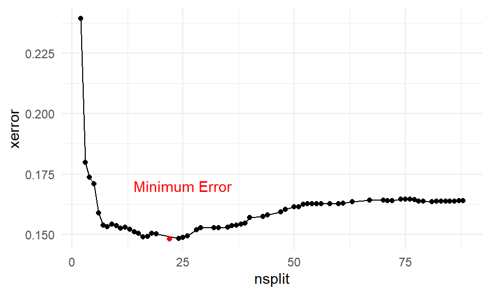

---
output:
  pdf_document: default
  html_document: default
---


# Tree-based models

## Decision Trees

Decision trees can be used for either classification or regression problems.  The model structure is a series of yes/no questions.  Depending on how each observation answers these questions, a prediction is made.

The below example shows how a single tree can predict health claims.

- For non-smokers, the predicted annual claims are 8,434.  This represents 80% of the observations
- For smokers with a `bmi` of less than 30, the predicted annual claims are 21,000.  10% of patients fall into this bucket.
- For smokers with a `bmi` of more than 30, the prediction is 42,000.  This bucket accounts for 11% of patients.

<div class="figure">

<p class="caption">(\#fig:unnamed-chunk-2)Decision tree of health costs</p>
</div>

We can cut the data set up into these groups and look at the claim costs.  From this grouping, we can see that `smoker` is the most important variable as the difference in average claims is about 20,000.


|smoker |bmi_30    |mean_claims | percent|
|:------|:---------|:-----------|-------:|
|no     |bmi < 30  |$7,977.03   |    0.38|
|no     |bmi >= 30 |$8,842.69   |    0.42|
|yes    |bmi < 30  |$21,363.22  |    0.10|
|yes    |bmi >= 30 |$41,557.99  |    0.11|

This was a very simple example because there were only two variables.  If we have more variables, the tree will get large very quickly.  This will result in overfitting; there will be good performance on the training data but poor performance on the test data.

The step-by-step process of building a tree is

**Step 1: Choose a variable at random.**  

This could be any variable in `age`, `children`, `charges`, `sex`, `smoker`, `age_bucket`, `bmi`, or `region`.

**Step 2: Find the split point which best seperates observations out based on the value of $y$.  A good split is one where the $y$'s are very different. * **

In this case, `smoker` was chosen.  Then we can only split this in one way: `smoker = 1` or `smoker = 0`.

Then for each of these groups, smokers and non-smokers, choose another variable at random.  In this case, for no-smokers, `age` was chosen.  To find the best cut point of `age`, look at all possible age cut points from 18, 19, 20, 21, ..., 64 and choose the one which best separates the data.

There are three ways of deciding where to split

- *Entropy* (aka, information gain)
- *Gini*
- *Classification error*

Of these, only the first two are commonly used.  The exam is not going to ask you to calculate either of these.  Just know that neither method will work better on all data sets, and so the best practice is to test both and compare the performance. 

**Step 3: Continue doing this until a stopping criteria is reached.  For example, the minimum number of observations is 5 or less.** 

As you can see, this results in a very deep tree.


```r
tree <- rpart(formula = charges ~  ., data = health_insurance,
              control = rpart.control(cp = 0.003))
rpart.plot(tree, type = 3)
```


**Step 4: Apply cost comlexity pruning to simplify the tree**

Intuitively, we know that the above model would perform poorly due to overfitting.  We want to make it simpler by removing nodes.  This is very similar to how in linear models we reduce complexity by reducing the number of coefficients.

A measure of the depth of the tree is the *complexity*.  You can think of $|T|$ as the "degrees of freedom" in a linear model.  In the above example, $|T| = 8$.  The amount of penalization is controlled by $\alpha$.  This is very similar to $\lambda$ in the Lasso.

To calculate the cost of a tree, number the terminal nodes from $1$ to $|T|$, and let the set of observations that fall into the $mth$ bucket be $R_m$.  Then add up the squared error over all terminal nodes to the penalty term.

$$
\text{Cost}_\alpha(T) = \sum_{m=1}^{|T|} \sum_{R_m}(y_i - \hat{y}_{Rm})^2 + \alpha |T|
$$


**Step 5: Use cross-validation to select the best alpha**

The cost is controlled by the `CP` parameter.  In the above example, did you notice the line `rpart.control(cp = 0.003)`?  This is telling `rpart` to continue growing the tree until the CP reaches 0.003.  At each subtree, we can measure the cost `CP` as well as the cross-validation error `xerror`.

This is stored in the `cptable` 


```r
library(kableExtra)
library(tidyverse)
tree <- rpart(formula = charges ~  ., data = health_insurance,
              control = rpart.control(cp = 0.0001))
cost <- tree$cptable %>% 
  as_tibble() %>% 
  select(nsplit, CP, xerror) 

cost %>% head()
```

```
## # A tibble: 6 x 3
##   nsplit      CP xerror
##    <dbl>   <dbl>  <dbl>
## 1      0 0.620    1.00 
## 2      1 0.144    0.381
## 3      2 0.0637   0.240
## 4      3 0.00967  0.180
## 5      4 0.00784  0.174
## 6      5 0.00712  0.171
```

As more splits are added, the cost continues to decrease, reaches a minimum, and then begins to increase.  



To optimize performance, choose the number of splits which has the lowest error.  Often, though, the goal of using a decision tree is to create a simple model.  In this case, we can err or the side of a lower `nsplit` so that the tree is shorter and more interpretable.  All of the questions on so far have only used decision trees for interpretability, and a different model method has been used when predictive power is needed.

You will typically be given the below code, which does this automatically.  To get full credit on decision tree questions, mention that you used cross-validation to select the number of splits.


```r
pruned_tree <- prune(tree,cp = tree$cptable[which.min(tree$cptable[, "xerror"]), "CP"])
```

## Advantages and disadvantages

**Advantages**

- Easy to interpret
- Captures interaction effects
- Captures non-linearities
- Handles continuous and categorical data
- Handles missing values

**Disadvantages**

- Is a “weak learner” because of low predictive power
- Does not work on small data sets
- Is often a simplification of the underlying process because all observations at terminal nodes have equal predicted values
- Is biased towards selecting high-cardinality features because more possible split points for these features tend to lead to overfitting
- High variance (which can be alleviated with stricter parameters) leads the “easy to interpret results” to change upon retraining
Unable to predict beyond the range of the training data for regression (because each predicted value is an average of training samples)

| Readings |  | 
|-------|---------|
| ISLR 8.1.1 Basics of Decision Trees  | |
| ISLR 8.1.2 Classification Trees|  |
| [rpart Documentation (Optional)](https://cran.r-project.org/web/packages/rpart/vignettes/longintro.pdf) ||

## Random Forests

**Advantages**

- Resilient to overfitting due to bagging 
- Only one parameter to tune (mtry, the number of features considered at each split)
- Very good a multi-class prediction
- Nonlinearities
- Interaction effects
- Deal with unbalanced and missing data*Usually requires over/undersamplin

**Disadvantages**

- Does not work on small data sets
- Weaker performance than other methods (GBM, NN)
- Unable to predict beyond training data for regression

| Readings |  | 
|-------|---------|
| ISLR 8.1.1 Basics of Decision Trees  | |
| ISLR 8.1.2 Classification Trees|  |

## Gradient Boosted Trees

- High prediction accuracy
- Closest model to a “silver bullet” that exists
- Nonlinearities, interaction effects, resilient to outliers, corrects for missing values
- Deals with class imbalance directly through by weighting observations

**Disadvantages**

- Requires large sample size
- Longer training time
- Does not detect linear combinations of features.  These must be engineered
Can overfit if not tuned correctly

| Readings |  | 
|-------|---------|
| ISLR 8.1.1 Basics of Decision Trees  | |
| ISLR 8.1.2 Classification Trees|  |
