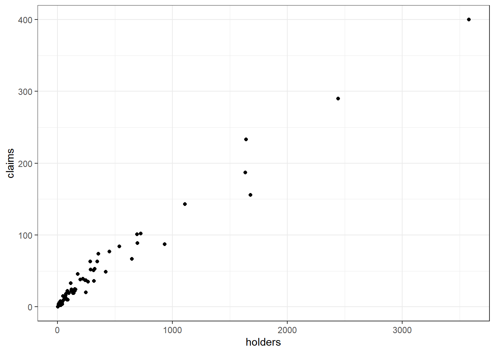
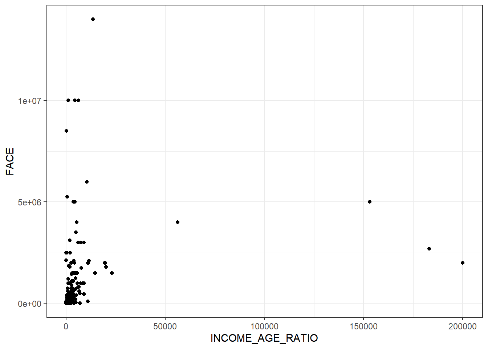
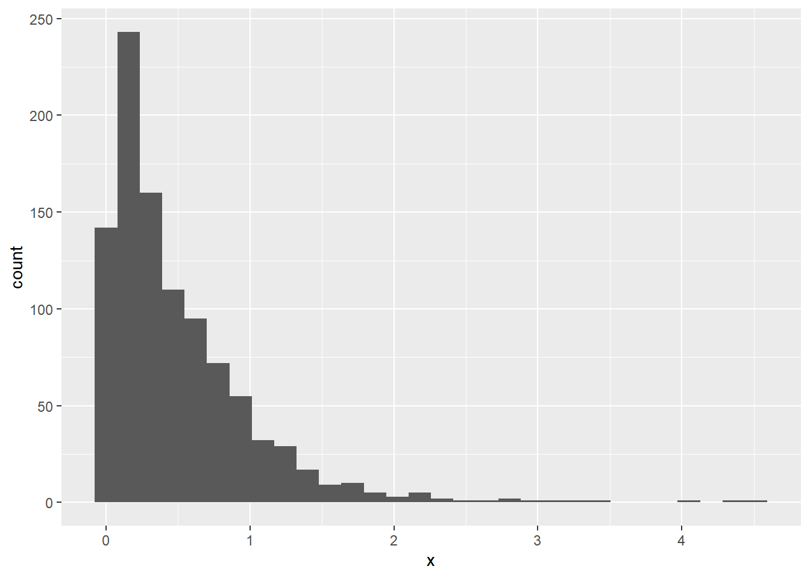
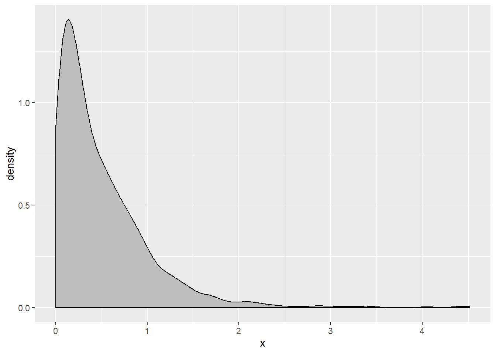

# Visualization

The creator's of the exam do not expect candidates to be expert data scientists.  Being able to create basic one-dimensional graphs and to interpret results is most important.

Creating graphs in R is easy.  The most popular way to do this is with the `ggplot` library.  

Three-Steps:

## Step 1. Put the data in a pivotable format

Excel users will know this as "pivot-table format", or the way that a table is organized so it can be put into a pivot table.  This is also known as "tidy format".  There is one-row per record and one column per variable.  

### Example of "wide" or "matrix" format 

The data below contains counts on a survey which asked people about their religion and annual income.

- `religion` is stored in the rows
- `income` is spread across the columns

This is difficult to work with because there are a lot of columns. 


```
## # A tibble: 6 x 11
##   religion `<$10k` `$10-20k` `$20-30k` `$30-40k` `$40-50k` `$50-75k`
##   <chr>      <dbl>     <dbl>     <dbl>     <dbl>     <dbl>     <dbl>
## 1 Agnostic      27        34        60        81        76       137
## 2 Atheist       12        27        37        52        35        70
## 3 Buddhist      27        21        30        34        33        58
## 4 Catholic     418       617       732       670       638      1116
## 5 Don’t k~      15        14        15        11        10        35
## 6 Evangel~     575       869      1064       982       881      1486
## # ... with 4 more variables: `$75-100k` <dbl>, `$100-150k` <dbl>,
## #   `>150k` <dbl>, `Don't know/refused` <dbl>
```
### Example of "pivotable", "long", or "tidy" format

Here is the same data only in a long format.  


You don't need to know how to switch between the two for now, but only that the long format is what is needed to create graphs.

## Step 2. Create a plot object (ggplot)

The first step is to create a blank canvas that holds the columns that are needed.  Let's say that the goal is to graph `income` and `count`.  We put these into a ggplot object called `p`.

The `aesthetic` argument, `aes`, means that the x-axis will have `income` and the y-axis will have `count`.


```r
p <- data %>% ggplot(aes(x = income, y = count))
```

If we look at `p`, we see that it is nothing but white space with axis for `count` and `income`.


```r
p
```


## Step 3: Add a plot

We add an xy plot.


```r
p + geom_point()
```



We can also create a bar plot.


```r
p + geom_bar(stat = "identity")
```



Creating histograms is even easier.  Just specify the column that you want to graph as the x column.  No y is needed because a histogram is one-dimensional.  

Take a x to be a random variable from a gamma distribution.


```r
gamma = tibble(x = rgamma(1000, shape = 1, rate = 2))
```


```r
p <- gamma %>% ggplot(aes(x = x))
p + geom_histogram()
```

```
## `stat_bin()` using `bins = 30`. Pick better value with `binwidth`.
```



We can graph a density instead of a histogram by using `geom_density` instead of `geom_hist`.


```r
p + geom_density(fill = "grey")
```



