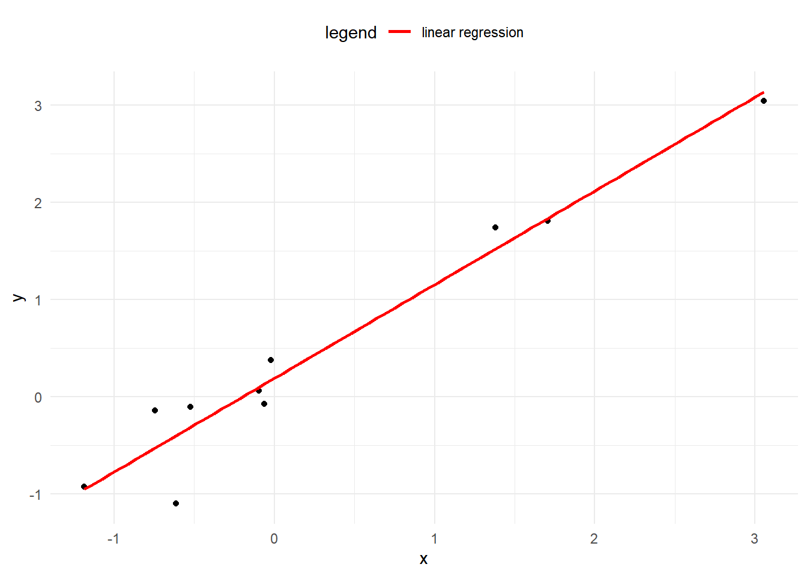
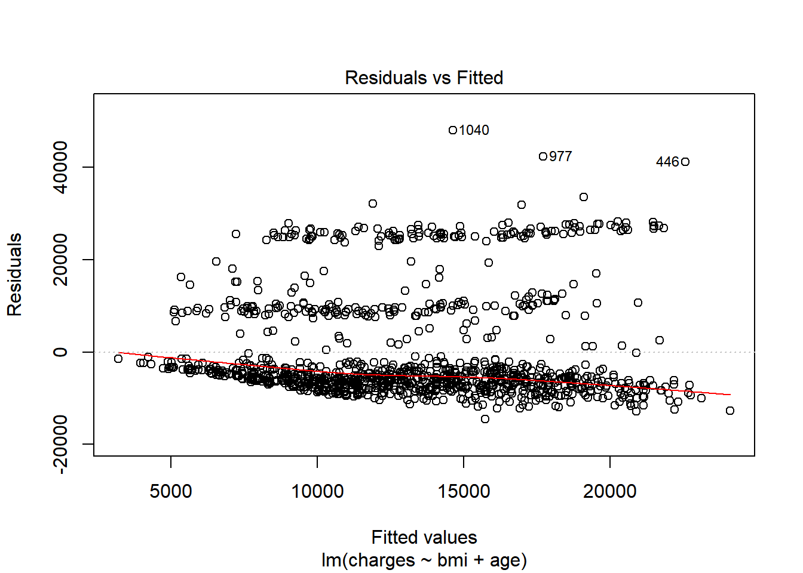
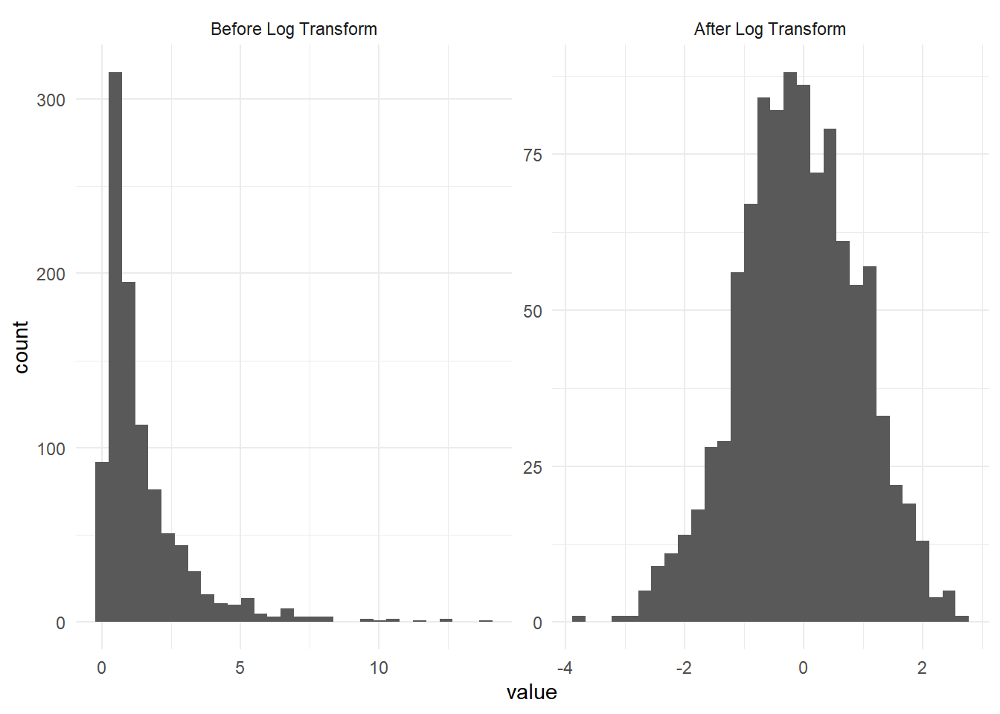
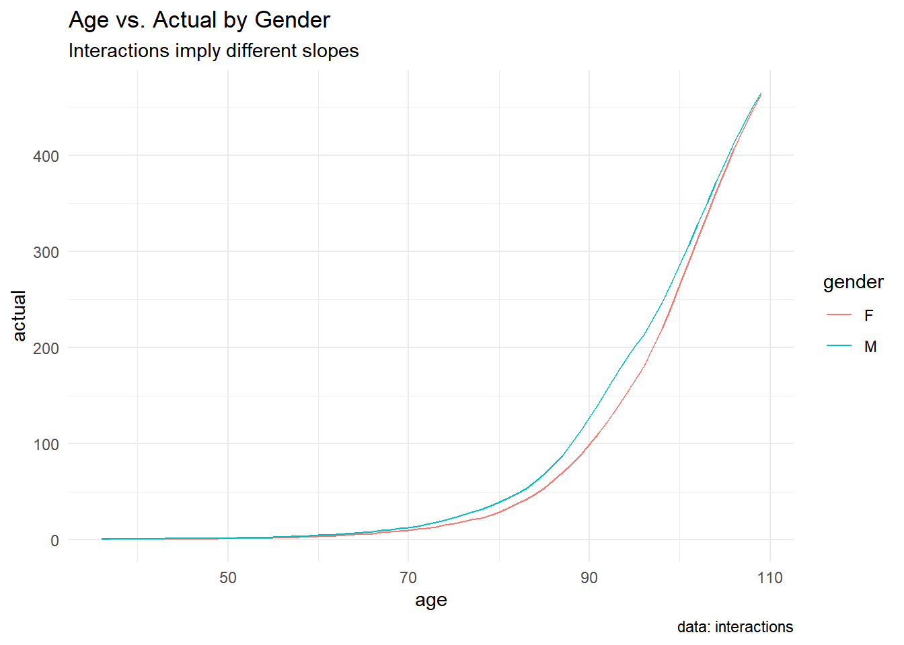
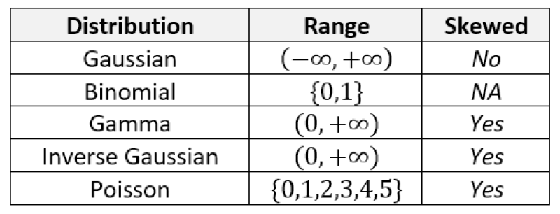

---
output:
  pdf_document: default
  html_document: default
---

# Linear Models

## Model Notation

The number of observations will be denoted by $n$.  When we refer to the size of a data set, we are referring to $n$.  We use $p$ to refer the number of input variables used.  The word "variables" is synonymous with "features".  For example, in the `health_insurance` data, the variables are `age`, `sex`, `bmi`, `children`, `smoker` and `region`.  These 7 variables mean that $p = 7$.  The data is collected from 1,338 patients, which means that $n = 1,338$.

Scalar numbers are denoted by ordinary variables (i.e., $x = 2$, $z = 4$), and vectors are denoted by bold-faced letters 

$$\mathbf{a} = \begin{pmatrix} a_1 \\ a_2 \\ a_3 \end{pmatrix}$$

We use $\mathbf{y}$ to denote the target variable.  This is the variable which we are trying to predict.  This can be either a whole number, in which case we are performing *regression*, or a category, in which case we are performing *classification*.  In the health insurance example, `y = charges`, which are the annual health care costs for a patient.

Both $n$ and $p$ are important because they tell us what types of models are likely to work well, and which methods are likely to fail.  For the PA exam, we will be dealing with small $n$ (<100,000) due to the limitations of the Prometric computers.  We will use a small $p$ (< 20) in order to make the data sets easier to interpret.

We organize these variables into matrices.  Take an example with $p$ = 2 columns and 3 observations.  The matrix is said to be $3 \times 2$ (read as "2-by-3") matrix.

$$
\mathbf{X} = \begin{pmatrix}x_{11} & x_{21}\\
x_{21} & x_{22}\\
x_{31} & x_{32}
\end{pmatrix}
$$

The target is 

$$\mathbf{y} = \begin{pmatrix} y_1 \\ y_2 \\ y_3 \end{pmatrix}$$
This represents the *unknown* quantity that we want to be able to predict.  In the health care costs example, $y_1$ would be the costs of the first patient, $y_2$ the costs of the second patient, and so forth.  The variables $x_{11}$ and $x_{12}$ might represent the first patient's age and sex respectively, where $x_{i1}$ is the patient's age, and $x_{i2} = 1$ if the ith patient is male and 0 if female.

Machine learning is about using $\mathbf{X}$ to predict $\mathbf{y}$. We call this "y-hat", or simply the prediction.  This is based on a function of the data $X$.

$$\mathbf{\hat{y}} = f(\mathbf{X}) = \begin{pmatrix} \hat{y_1} \\ \hat{y_2} \\ \hat{y_3} \end{pmatrix}$$


This is almost never going to happen perfectly, and so there is always an error term, $\mathbf{\epsilon}$.  This can be made smaller, but is never exactly zero.  

$$
\mathbf{\hat{y}} + \mathbf{\epsilon} = f(\mathbf{X}) + \mathbf{\epsilon}
$$

In other words, $\epsilon = y - \hat{y}$.  We call this the *residual*.  When we predict a person's health care costs, this is the difference between the predicted costs (which we had created the year before) and the actual costs that the patient experienced (of that current year).

## Ordinary least squares (OLS)

The type of model used refers to the class of function of $f$.  If $f$ is linear, then we are using a linear model.  If $f$ is non-parametric (does not have input parameters), then it is non-parametric modeling.  Linear models are the simplest type of model.

We have the data $\mathbf{X}$ and the target $\mathbf{y}$, where all of the y's are real numbers, or $y_i \in \mathbb{R}$.

We want to find a $\mathbf{\beta}$ so that 

$$
\mathbf{\hat{y}} = \mathbf{X} \mathbf{\beta}
$$

Which means that each $y_i$ is a linear combination of the variables $x_1, ..., x_p$, plus a constant $\beta_0$ which is called the *intercept* term.  

$$
\begin{equation}
y_i = \beta_0 + \beta_1 x_1 + ... + \beta_p x_p
\end{equation}
$$

In the one-dimensional case, this creates a line connecting the points.  In higher dimensions, this creates a hyperplane.




The question then is **how can we choose the best values of** $\beta?$  First of all, we need to define what we mean by "best".  Ideally, we will choose these values which will create close predictions of $\mathbf{y}$ on new, unseen data.  

To solve for $\mathbf{\beta}$, we first need to define a *loss function*.  This allows us to compare how well a model is fitting the data.  The most commonly used loss function is the residual sum of squares (RSS), also called the *squared error loss* or the L2 norm.  When RSS is small, then the predictions are close to the actual values and the model is a good fit.  When RSS is large, the model is a poor fit.

$$
\text{RSS} = \sum_i(y_i - \hat{y})^2
$$

When you replace $\hat{y_i}$ in the above equation with $\beta_0 + \beta_1 x_1 + ... + \beta_p x_p$, take the derivative with respect to $\beta$, set equal to zero, and solve, we can find the optimal values.  This turns the problem of statistics into a problem of numeric optimization, which computers can do quickly.

You might be asking: why does this need to be the squared error?  Why not the absolute error, or the cubed error?  Technically, these could be used as well.  In fact, the absolute error (L1 norm) is useful in other models.  Taking the square has a number of advantages.  

- It provides the same solution if we assume that the distribution of $\mathbf{Y}|\mathbf{X}$ is guassian and maximize the likelihood function.  This method is used for GLMs, in the next chapter.
- Empirically it has been shown to be less likely to overfit as compared to other loss functions

### Example

In our health, we can create a linear model using `bmi`, `age`, and `sex` as an inputs.  

The `formula` controls which variables are included.  There are a few shortcuts for using R formulas.  

| Formula | Meaning  | 
|-------|---------|
| `charges` ~ `bmi` + `age` | Use `age` and `bmi` to predict `charges` |
| `charges` ~ `bmi` + `age` + `bmi`*`age` | Use `age`,`bmi` as well as an interaction to predict `charges` |
| `charges` ~ (`bmi > 20`) + `age` | Use an indicator variable for `bmi > 20` `age` to predict `charges` |
| log(`charges`) ~ log(`bmi`) + log(`age`) | Use the logs of `age` and `bmi` to predict  log(`charges`) |

You can use formulas to create new variables (aka feature engineering).  This can save you from needing to re-run code to create data.  

Below we fit a simple linear model to predict charges.


```r
library(ExamPAData)
library(tidyverse)

model <- lm(data = health_insurance, formula = charges ~ bmi + age)
```

The `summary` function gives details about the model.  First, the `Estimate`, gives you the coefficients.  The `Std. Error` is the error of the estimate for the coefficient.  Higher standard error means greater uncertainty.  This is relative to the average value of that variable.  The `t value` tells you how "big" this error really is based on standard deviations.  A larger `t value` implies a low probability of the null hypothesis being rejected saying that the coefficient is zero.  This is the same as having a p-value (`Pr (>|t|))`) being close to zero.

The little `*`, `**`, `***` indicate that the variable is either somewhat significant, significant, or highly significant.  "significance" here means that there is a low probability of the coefficient being that size if there were *no actual casual relationship*, or if the data was random noise.


```r
summary(model)
```

```
## 
## Call:
## lm(formula = charges ~ bmi + age, data = health_insurance)
## 
## Residuals:
##    Min     1Q Median     3Q    Max 
## -14457  -7045  -5136   7211  48022 
## 
## Coefficients:
##             Estimate Std. Error t value Pr(>|t|)    
## (Intercept) -6424.80    1744.09  -3.684 0.000239 ***
## bmi           332.97      51.37   6.481 1.28e-10 ***
## age           241.93      22.30  10.850  < 2e-16 ***
## ---
## Signif. codes:  0 '***' 0.001 '**' 0.01 '*' 0.05 '.' 0.1 ' ' 1
## 
## Residual standard error: 11390 on 1335 degrees of freedom
## Multiple R-squared:  0.1172,	Adjusted R-squared:  0.1159 
## F-statistic:  88.6 on 2 and 1335 DF,  p-value: < 2.2e-16
```

When evaluating model performance, you should not rely on the `summary` alone as this is based on the training data.  To look at performance, test the model on validation data.  This can be done by a) using a hold out set, or b) using cross-validation, which is even better.

Let's create an 80% training set and 20% testing set.  You don't need to worry about understanding this code as the exam will always give this to you.


```r
library(caret)
#create a train/test split
index <- createDataPartition(y = health_insurance$charges, p = 0.8, list = F) %>% as.numeric()
health_insurance_train <-  health_insurance %>% slice(index)
health_insurance_test <- health_insurance %>% slice(-index)
```

Train the model on the `health_insurance_train` and test on `health_insurance_test`.  


```r
model <- lm(data = health_insurance_train, formula = charges ~ bmi + age)
pred = predict(model, health_insurance_test)
```

Let's look at the Root Mean Squared Error (RMSE).  


```r
get_rmse <- function(y, y_hat){
  mean((y - y_hat)^2)
}

get_rmse(pred, health_insurance_test$charges)
```

```
## [1] 129080408
```

The above number does not tell us if this is a good model or not by itself.  We need a comparison.  The fastest check is to compare against a prediction of the mean.  In other words, all values of the `y_hat` are the average of `charges`


```r
get_rmse(mean(health_insurance_test$charges), health_insurance_test$charges)
```

```
## [1] 144725527
```

The RMSE is **higher** (worse) when predicting the mean, which is what we expect.  **If you ever fit a model and get an error which is worse than the average prediction, something must be wrong.**

The next test is to see if any assumptions have been violated.  

First, is there a pattern in the residuals?  If there is, this means that the model is missing key information.  For the model below, this is a **yes**, which means that this is a bad model.  Because this is just for illustration, I'm going to continue using it, however.  


```r
plot(model, which = 1)
```

<div class="figure">

<p class="caption">(\#fig:unnamed-chunk-8)Residuals vs. Fitted</p>
</div>

The normal QQ shows how well the quantiles of the predictions fit to a theoretical normal distribution.  If this is true, then the graph is a straight 45-degree line.  In this model, you can definitely see that this is not the case.  If this were a good model, this distribution would be closer to normal.


```r
plot(model, which = 2)
```

<div class="figure">

<p class="caption">(\#fig:unnamed-chunk-9)Normal Q-Q</p>
</div>

**Caution: This test only applies to linear models which have a gaussian response distribution.**

The below is from an excellent post of Stack Exchange.

>R does not have a distinct plot.glm() method. When you fit a model with glm() and run plot(), it calls ?plot.lm, which is appropriate for linear models (i.e., with a normally distributed error term).

>More specifically, the plots will often 'look funny' and lead people to believe that there is something wrong with the model when it is perfectly fine. We can see this by looking at those plots with a couple of simple simulations where we know the model is correct:

Once you have chosen your model, you should re-train over the entire data set.  This is to make the coefficients more stable because `n` is larger.  Below you can see that the standard error is lower after training over the entire data set.


```r
model_full_data <- lm(data = health_insurance, formula = charges ~ bmi + age)
model_test_data <-  lm(data = health_insurance_train, formula = charges ~ bmi + age)
```

<table>
 <thead>
  <tr>
   <th style="text-align:left;"> term </th>
   <th style="text-align:right;"> full_data_std_error </th>
   <th style="text-align:right;"> test_data_std_error </th>
  </tr>
 </thead>
<tbody>
  <tr>
   <td style="text-align:left;"> (Intercept) </td>
   <td style="text-align:right;"> 1744.1 </td>
   <td style="text-align:right;"> 1943.6 </td>
  </tr>
  <tr>
   <td style="text-align:left;"> bmi </td>
   <td style="text-align:right;"> 51.4 </td>
   <td style="text-align:right;"> 57.3 </td>
  </tr>
  <tr>
   <td style="text-align:left;"> age </td>
   <td style="text-align:right;"> 22.3 </td>
   <td style="text-align:right;"> 25.0 </td>
  </tr>
</tbody>
</table>

All interpretations should be based on the model which was trained on the entire data set.  Obviously, this only makes a difference if you are interpreting the precise values of the coefficients.  If you are just looking at which variables are included, or at the size and sign of the coefficients, then this would not change.


```r
coefficients(model_full_data)
```

```
## (Intercept)         bmi         age 
##  -6424.8046    332.9651    241.9308
```

Translating the above into an equation we have

$$\hat{y_i} = -6,424.80 + 332.97 \space\text{bmi} + 241.93\space \text{age}$$

For example, if a patient has `bmi = 27.9` and `age = 19` then predicted value is 

$$\hat{y_1} = -6,424.80 + (332.97)(27.9) + (241.93)(19) = 7,461.73$$

This model structure implies that each of the variables $\mathbf{x_1}, ..., \mathbf{x_p}$ each change the predicted $\mathbf{\hat{y}}$.  If $x_{ij}$ increases by one unit, then $y_i$ increases by $\beta_j$ units, regardless of what happens to all of the other variables.  This is one of the main assumptions of linear models: *variable indepdendence*.  If the variables are correlated, say, then this assumption will be violated.  


| Readings |  | 
|-------|---------|
| ISLR 2.1 What is statistical learning?|  |
| ISLR 2.2 Assessing model accuracy|  |


## Generalized linear models (GLMs)

Instead of the model being a direct linear combination of the variables, there is an intermediate step called a *link function* $g$.

$$
g(\mathbf{\hat{y}}) = \mathbf{X} \mathbf{\beta}
$$
This implies that the response $\mathbf{y}$ is related to the linear predictor $\mathbf{X} \mathbf{\beta}$ through the *inverse* link function.

$$
\mathbf{\hat{y}} = g^-1(\mathbf{X} \mathbf{\beta})
$$
This means that $g(.)$ must be an invertable.  For example, if $g$ is the natural logarithm (aka, the "log-link"), then

$$
log(\mathbf{\hat{y}}) = \mathbf{X} \mathbf{\beta} \Rightarrow \mathbf{\hat{y}} = e^{\mathbf{X} \mathbf{\beta}}
$$

This is useful when the distribution of $Y$ is skewed, as taking the log corrects skewness.

<div class="figure">

<p class="caption">(\#fig:unnamed-chunk-13)Taking the log corrects for skewness</p>
</div>

You might be asking, what if the distribution of $Y$ is not normal, no matter what choice we have for $g$?  The short answer is that we can change our assumption of the distribution of $Y$, and use this to change the parameters.  If you have taken exam STAM then you are familiar with *maximum likelihood estimation*.  

We have a response $\mathbf{Y}$, and we fit a distribution to $\mathbf{Y} | \mathbf{X}$.  This is the target variable conditioned on the data.  For each $y_i$, each observation, we assign a probability $f_Y(y_i)$

$$
f_y(y_i | X_1 = x_1, X_2 = x_2, ..., X_p = x_p) = Pr(Y = y_i | \mathbf{X})
$$

Now, when we choose the response family, we are simply changing $f_Y$.  If we say that the response family is Gaussian, then $f$ has a Gaussian PDF.  If we are modeling counts, then $f$ is a Poisson PDF.  This only works if $f$ is in the *exponential family* of distributions, which consists of the common names such as Gaussian, Binomial, Gamma, Inverse Gamma, and so forth.  Reading the CAS Monograph 5 will provide more detail into this.

The possible combinations of link functions and distribution families are summarized nicely on [Wikipedia](https://en.wikipedia.org/wiki/Generalized_linear_model#Link_function).

<div class="figure">

<p class="caption">(\#fig:unnamed-chunk-14)Distribution-Link Function Combinations</p>
</div>

For this exam, a common question is to ask candiates to choose the best distribution and link function.  There is no all-encompasing answer, but a few suggestions are

- If $Y$ is counting something, such as the number of claims, number of accidents, or some other discrete and positive counting sequence, use the Poisson;
- If $Y$ contains negative values, then do not use the Exponential, Gamma, or Inverse Gaussian as these are strictly positive.  Conversely, if $Y$ is only positive, such as the price of a policy (price is always > 0), or the claim costs, then these are good choices;
- If $Y$ is binary, the the binomial response with either a Probit or Logit link.  The Logit is more common.
- If $Y$ has more than two categories, the multinomial distribution with either the Probit or Logic link.

The exam will always ask you to interpret the GLM.  These questions can usually be answered by inverting the link function and interpreting the coefficients.  In the case of the log link, simply take the exponent of the coefficients and each of these represents a "relativity" factor.

$$
log(\mathbf{\hat{y}}) = \mathbf{X} \mathbf{\beta} \Rightarrow \mathbf{\hat{y}} = e^{\mathbf{X} \mathbf{\beta}}
$$
For a single observation $y_i$, this is

$$
\text{exp}(\beta_0 + \beta_1 x_{i1} + \beta_2 x_{i2} + ... + \beta_p x_{ip}) = \\
e^{\beta_0} e^{\beta_1 x_{i1}}e^{\beta_2 x_{i2}} ...  e^{\beta_p x_{ip}} = 
R_o R_2 R_3 ... R_{p}
$$
Where $R_k$ is the *relativity* of the kth variable.  This terminology is from insurance ratemaking, where actuaries need to be able to explain the impact of each variable in pricing insurance.  The data science community does not use this language. 

For binary outcomes with logit or probit link, there is no easy interpretation.  This has come up in at least one past sample exam, and the solution was to create "psuedo" observations and observe how changing each $x_k$ would change the predicted value.  Due to the time requirements, this is unlikely to come up on an exam.  So if you are asked to use a logit or probit link, saying that the result is not easy to interpret should suffice.

### Interactions

An interaction occurs when the effect of a variable on the response is different depending on the level of other variables in the model.

Consider this model:

Let $x_2$ be an indicator variable, which is 1 for some records and 0 otherwise.  

$$\hat{y_i} = \beta_0 + \beta_1 x_1 + \beta_2 x_2 + \beta_3 x_1 x_2$$

There are now two different linear models dependong on whether `x_1` is 0 or 1.

$$
x_1 = 0 \Rightarrow \hat{y_i} = \beta_0  + \beta_2 x_2 \\

x_1 = 1 \Rightarrow \hat{y_i} = \beta_0 + \beta_1 + \beta_2 x_2 + \beta_3 x_2 \\

 = (\beta_0 + \beta_1) + (\beta_2 + \beta_3 ) x_2 \\
 = \beta_0^* + \beta_1^* x_2
$$

Notice how the intercept changes from $\beta_0$ to $\beta_0^*$ and the slope changes from $\beta_1$ to $\beta_1^*$.

The SOA's modules give an example with the using age and gender as below.  This is not a very strong interaction, as the slopes are almost identical across `gender`.


```r
interactions %>% 
  ggplot(aes(age, actual, color = gender)) + 
  geom_line() + 
  theme_minimal() +
  labs(title = "Age vs. Actual by Gender", 
       subtitle = "Interactions imply different slopes",
       caption= "data: interactions")
```

<div class="figure">

<p class="caption">(\#fig:unnamed-chunk-15)Example of weak interaction</p>
</div>

Here is a clearer example from the `auto_claim` data. The lines show the slope of a linear model, assuming that only `BLUEBOOK` and `CAR_TYPE` were predictors in the model.  You can see that the slope for Sedans and Sports Cars is higher than for Vans and Panel Trucks.  


```r
auto_claim %>% 
  ggplot(aes(log(CLM_AMT), log(BLUEBOOK), color = CAR_TYPE)) + 
  geom_point(alpha = 0.3) + 
  geom_smooth(method = "lm", se = F) + 
  theme_minimal()  + 
  labs(title = "Kelly Bluebook Value vs Claim Amount")
```

```
## Warning: Removed 7556 rows containing non-finite values (stat_smooth).
```

<div class="figure">

<p class="caption">(\#fig:unnamed-chunk-16)Example of strong interaction</p>
</div>

Any time that the effect that one variable has on the response is different depending on the value of other variables we say that there is an interaction.  We can also use an hypothesis test with a GLM to check this.  Simply include an interaction term and see if the coefficient is zero at the desired significance level.

### Poisson Regression

When the dependent variable is a count, such as the number of claims per month, Poisson regression is appropriate.  This requires that each claim is independent in that one claim will not make another claim more or less likely.  This means that the target variable is actually a rate, $\frac{\text{claims}}{\text{months}}$.  More generally, we call the months the *exposure*.

Let $m_i$ by the units of exposure and $y_i$ the target.  We use a log-link function to correct for skewness.

$$
log(\frac{\hat{y_i}}{m_i}) = \beta_0 + \beta_1 x_1 + ... + \beta_p x_p \\

\Rightarrow log(\hat{y_i}) = log(m_i) + \beta_0 + \beta_1 x_1 + ... + \beta_p x_p
$$

We call the $log(m_i)$ the `offset` term.  Notice that there is no coefficient (beta) on this value, because we already know what the impact will be.  

In R, the code for this equation would be


```r
glm(y ~ offset(log(m)) + x, family=poisson(link=log) )
```


| Readings |  | 
|-------|---------|
| [CAS Monograph 5 Chapter 2](https://www.casact.org/pubs/monographs/papers/05-Goldburd-Khare-Tevet.pdf) |  |
| ISLR 2.2 Assessing model accuracy|  |

### Advantages and disadvantages

There is usually at least one question on the PA exam which asks you to "list some of the advantages and disadvantages of using this particular model", and so here is one such list. 

**GLM Advantages**

- Easy to interpret
- Handles skewed data through different response distributions
- Models the average response which leads to stable predictions on new data
- Handles continuous and categorical data
- Works well on small data sets

**GLM Disadvantages**

- Does not select features
- Strict assumptions around distribution shape, randomness of error terms, and others
- Unable to detect non-linearity directly (although this can manually be addressed through feature engineering)
- Sensitive to outliers
- Low predictive power

## Penalized Linear Models

One of the main weaknesses of the GLM is that the features need to be selected by hand.  For large $p$, this means that the modeler needs to test every combination of variables.  This is time consuming.  

Earlier on we said that the linear model minimizes the sum of square terms, known as the residual sum of squares (RSS)

$$
\text{RSS} = \sum_i(y_i - \hat{y})^2 = \sum_i(y_i - \beta_0 - \sum_{j = 1}^p\beta_j x_{ij})^2
$$

This loss function can be modified so that models which include more (and larger) coefficients are considered as worse.  In other words, when there are more $\beta$'s, or $\beta$'s which are larger, the RSS is higher.

### Ridge Regression

Ridge regression adds a penalty term which is proportional to the square of the sum of the coefficients.  This is known as the "L2" norm.

$$
\sum_i(y_i - \beta_0 - \sum_{j = 1}^p\beta_j x_{ij})^2 + \lambda \sum_{j = 1}^p\beta_j^2
$$

This $\lambda$ controls how much of a penalty is imposed on the size of the coefficients.  When $\lambda$ is high, simpler models are treated more favorably because the $\sum_{j = 1}^p\beta_j^2$ carries more weight.  Conversely, then $\lambda$ is low, complex models are more favored.  When $\lambda = 0$, we have an ordinary GLM.

### Lasso

The official name is the Least Absolute Shrinkage and Selection Operator, but the common name is just "the lasso".  Just as with Ridge regression, we want to favor simpler models; however, we also want to *select* variables.  This is the same as forcing some coefficients to be equal to 0.

Instead of taking the square of the coefficients (L2 norm), we take the absolute value (L1 norm).  

$$
\sum_i(y_i - \beta_0 - \sum_{j = 1}^p\beta_j x_{ij})^2 + \lambda \sum_{j = 1}^p|\beta_j|
$$

In ISLR, Hastie et al show that this results in coefficients being forced to be exactly 0.  This is extremely useful because it means that by changing $\lambda$, we can select how many variables to use in the model.

**Note**: While any response family is possible with penalized regression, in R, only the Gaussian family is possible in the library `glmnet`, and so this is the only type of question that the SOA can ask.

### Advantages and disadvantages

**Elastic Net/Lasso/Ridge Advantages**

- All benefits from GLMS
- Automatic variable selection
- Better predictive power than GLM (usually)

**Elastic Net/Lasso/Ridge Disadvantages**

- All cons of GLMs

| Readings |  | 
|-------|---------|
| ISLR 6.1 Subset Selection  | |
| ISLR 6.2 Shrinkage Methods|  |

