---
output:
  html_document: default
  pdf_document: default
---


```r
set.seed(1)
library(ggplot2)
theme_set(theme_bw())
```


# Introduction to Modeling

About 40-50% of the exam grade is based on modeling.  

## Model Notation

The number of observations will be denoted by $n$.  When we refer to the size of a data set, we are referring to $n$.  We use $p$ to refer the number of input variables used.  The word "variables" is synonymous with "features".  For example, in the `health_insurance` data, the variables are `age`, `sex`, `bmi`, `children`, `smoker` and `region`.  These 7 variables mean that $p = 7$.  The data is collected from 1,338 patients, which means that $n = 1,338$.

Scalar numbers are denoted by ordinary variables (i.e., $x = 2$, $z = 4$), and vectors are denoted by bold-faced letters 

$$\mathbf{a} = \begin{pmatrix} a_1 \\ a_2 \\ a_3 \end{pmatrix}$$

We use $\mathbf{y}$ to denote the target variable.  This is the variable which we are trying to predict.  This can be either a whole number, in which case we are performing *regression*, or a category, in which case we are performing *classification*.  In the health insurance example, `y = charges`, which are the annual health care costs for a patient.

Both $n$ and $p$ are important because they tell us what types of models are likely to work well, and which methods are likely to fail.  For the PA exam, we will be dealing with small $n$ (<100,000) due to the limitations of the Prometric computers.  We will use a small $p$ (< 20) in order to make the data sets easier to interpret.

We organize these variables into matrices.  Take an example with $p$ = 2 columns and 3 observations.  The matrix is said to be $3 \times 2$ (read as "2-by-3") matrix.

$$
\mathbf{X} = \begin{pmatrix}x_{11} & x_{21}\\
x_{21} & x_{22}\\
x_{31} & x_{32}
\end{pmatrix}
$$

The target is 

$$\mathbf{y} = \begin{pmatrix} y_1 \\ y_2 \\ y_3 \end{pmatrix}$$
This represents the *unknown* quantity that we want to be able to predict.  In the health care costs example, $y_1$ would be the costs of the first patient, $y_2$ the costs of the second patient, and so forth.  The variables $x_{11}$ and $x_{12}$ might represent the first patient's age and sex respectively, where $x_{i1}$ is the patient's age, and $x_{i2} = 1$ if the ith patient is male and 0 if female.

Machine learning is about using $X$ to predict $Y$. We call this "y-hat", or simply the prediction.  This is based on a function of the data $X$.

$$\hat{Y} = f(X)$$

This is almost never going to happen perfectly, and so there is always an error term, $\epsilon$.  This can be made smaller, but is never exactly zero.  

$$
\hat{Y} + \epsilon = f(X) + \epsilon
$$

In other words, $\epsilon = y - \hat{y}$.  We call this the *residual*.  When we predict a person's health care costs, this is the difference between the predicted costs (which we had created the year before) and the actual costs that the patient experienced (of that current year).

## Ordinary least squares (OLS)

The type of model used refers to the class of function of $f$.  If $f$ is linear, then we are using a linear model.  Linear models are linear in the parameters, $\beta$.

We observe the data $X$ and the want to predict the target $Y$.

We find a $\mathbf{\beta}$ so that 

$$
\hat{Y} = \beta_0 + \beta_1 X_1 + \beta_2 X_2 + ... + \beta_p X_p
$$

Which means that each $y_i$ is a linear combination of the variables $x_1, ..., x_p$, plus a constant $\beta_0$ which is called the *intercept* term.  

In the one-dimensional case, this creates a line connecting the points.  In higher dimensions, this creates a hyperplane.

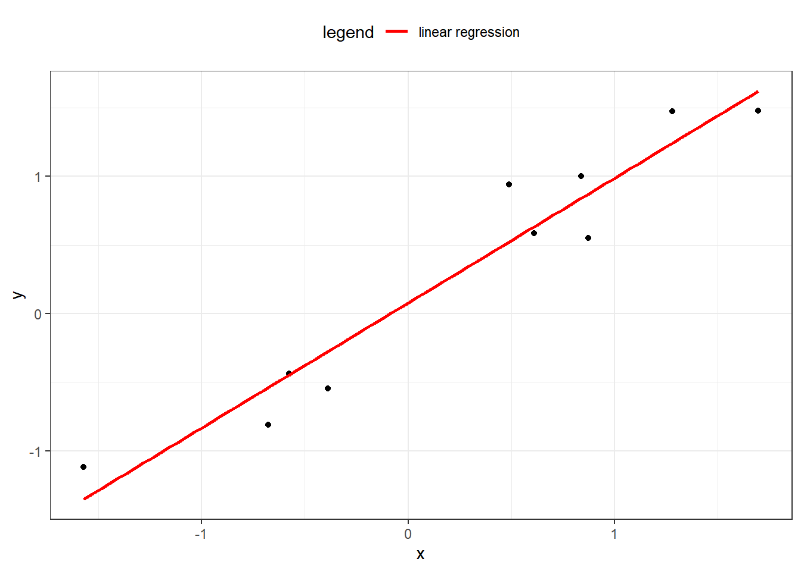


The question then is **how can we choose the best values of** $\beta?$  First of all, we need to define what we mean by "best".  Ideally, we will choose these values which will create close predictions of $\mathbf{y}$ on new, unseen data.  

To solve for $\mathbf{\beta}$, we first need to define a *loss function*.  This allows us to compare how well a model is fitting the data.  The most commonly used loss function is the residual sum of squares (RSS), also called the *squared error loss* or the L2 norm.  When RSS is small, then the predictions are close to the actual values and the model is a good fit.  When RSS is large, the model is a poor fit.

$$
\text{RSS} = \sum_i(y_i - \hat{y})^2
$$

When you replace $\hat{y_i}$ in the above equation with $\beta_0 + \beta_1 x_1 + ... + \beta_p x_p$, take the derivative with respect to $\beta$, set equal to zero, and solve, we can find the optimal values.  This turns the problem of statistics into a problem of numeric optimization, which computers can do quickly.

You might be asking: why does this need to be the squared error?  Why not the absolute error, or the cubed error?  Technically, these could be used as well.  In fact, the absolute error (L1 norm) is useful in other models.  Taking the square has a number of advantages.  

- It provides the same solution if we assume that the distribution of $Y|X$ is guassian and maximize the likelihood function.  This method is used for GLMs, in the next chapter.
- Empirically it has been shown to be less likely to overfit as compared to other loss functions

## Example

In our health, we can create a linear model using `bmi`, `age`, and `sex` as an inputs.  

The `formula` controls which variables are included.  There are a few shortcuts for using R formulas.  

| Formula | Meaning  | 
|-------|---------|
| `charges` ~ `bmi` + `age` | Use `age` and `bmi` to predict `charges` |
| `charges` ~ `bmi` + `age` + `bmi`*`age` | Use `age`,`bmi` as well as an interaction to predict `charges` |
| `charges` ~ (`bmi > 20`) + `age` | Use an indicator variable for `bmi > 20` `age` to predict `charges` |
| log(`charges`) ~ log(`bmi`) + log(`age`) | Use the logs of `age` and `bmi` to predict  log(`charges`) |
| `charges` ~ . | Use all variables to predict `charges`|

You can use formulas to create new variables (aka feature engineering).  This can save you from needing to re-run code to create data.  

Below we fit a simple linear model to predict charges.


```r
library(ExamPAData)
library(tidyverse)

model <- lm(data = health_insurance, formula = charges ~ bmi + age)
```

The `summary` function gives details about the model.  First, the `Estimate`, gives you the coefficients.  The `Std. Error` is the error of the estimate for the coefficient.  Higher standard error means greater uncertainty.  This is relative to the average value of that variable.  The `t value` tells you how "big" this error really is based on standard deviations.  A larger `t value` implies a low probability of the null hypothesis being accepted saying that the coefficient is zero.  This is the same as having a p-value (`Pr (>|t|))`) being close to zero.

The little `*`, `**`, `***` indicate that the variable is either somewhat significant, significant, or highly significant.  "significance" here means that there is a low probability of the coefficient being that size (or larger) if there were *no actual casual relationship*, or if the data was random noise.


```r
summary(model)
```

```
## 
## Call:
## lm(formula = charges ~ bmi + age, data = health_insurance)
## 
## Residuals:
##    Min     1Q Median     3Q    Max 
## -14457  -7045  -5136   7211  48022 
## 
## Coefficients:
##             Estimate Std. Error t value Pr(>|t|)    
## (Intercept) -6424.80    1744.09  -3.684 0.000239 ***
## bmi           332.97      51.37   6.481 1.28e-10 ***
## age           241.93      22.30  10.850  < 2e-16 ***
## ---
## Signif. codes:  0 '***' 0.001 '**' 0.01 '*' 0.05 '.' 0.1 ' ' 1
## 
## Residual standard error: 11390 on 1335 degrees of freedom
## Multiple R-squared:  0.1172,	Adjusted R-squared:  0.1159 
## F-statistic:  88.6 on 2 and 1335 DF,  p-value: < 2.2e-16
```

When evaluating model performance, you should not rely on the `summary` alone as this is based on the training data.  To look at performance, test the model on validation data.  This can be done by either using a hold out set, or using cross-validation, which is even better.

Let's create an 80% training set and 20% testing set.  You don't need to worry about understanding this code as the exam will always give this to you.


```r
set.seed(1)
library(caret)
#create a train/test split
index <- createDataPartition(y = health_insurance$charges, 
                             p = 0.8, list = F) %>% as.numeric()
train <-  health_insurance %>% slice(index)
test <- health_insurance %>% slice(-index)
```

Train the model on the `train` and test on `test`.  


```r
model <- lm(data = train, formula = charges ~ bmi + age)
pred = predict(model, test)
```

Let's look at the Root Mean Squared Error (RMSE).  


```r
get_rmse <- function(y, y_hat){
  sqrt(mean((y - y_hat)^2))
}

get_rmse(pred, test$charges)
```

```
## [1] 11421.96
```

The above number does not tell us if this is a good model or not by itself.  We need a comparison.  The fastest check is to compare against a prediction of the mean.  In other words, all values of the `y_hat` are the average of `charges`


```r
get_rmse(mean(test$charges), test$charges)
```

```
## [1] 12574.97
```

The RMSE is **higher** (worse) when using just the mean, which is what we expect.  **If you ever fit a model and get an error which is worse than the average prediction, something must be wrong.**

The next test is to see if any assumptions have been violated.  

First, is there a pattern in the residuals?  If there is, this means that the model is missing key information.  For the model below, this is a **yes**, which means that this is a bad model.  Because this is just for illustration, I'm going to continue using it, however.  


```r
plot(model, which = 1)
```

<div class="figure">
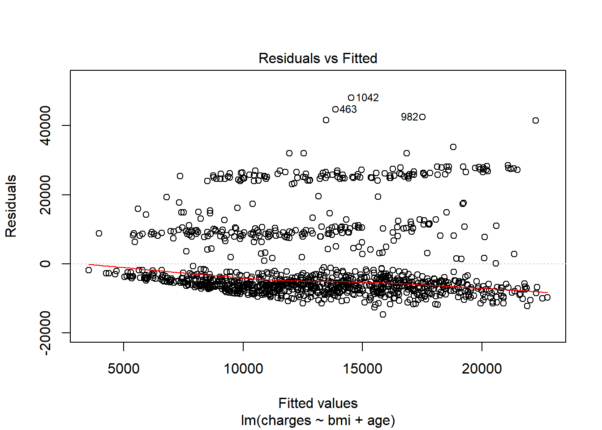
<p class="caption">(\#fig:unnamed-chunk-9)Residuals vs. Fitted</p>
</div>

The normal QQ shows how well the quantiles of the predictions fit to a theoretical normal distribution.  If this is true, then the graph is a straight 45-degree line.  In this model, you can definitely see that this is not the case.  If this were a good model, this distribution would be closer to normal.


```r
plot(model, which = 2)
```

<div class="figure">
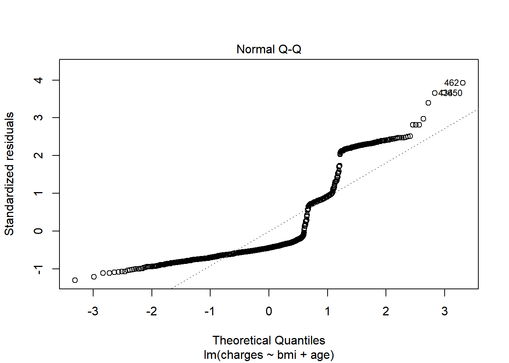
<p class="caption">(\#fig:unnamed-chunk-10)Normal Q-Q</p>
</div>

Once you have chosen your model, you should re-train over the entire data set.  This is to make the coefficients more stable because `n` is larger.  Below you can see that the standard error is lower after training over the entire data set.


```r
all_data <- lm(data = health_insurance, 
               formula = charges ~ bmi + age)
testing <- lm(data = test, 
              formula = charges ~ bmi + age)
```


|term        | full_data_std_error| test_data_std_error|
|:-----------|-------------------:|-------------------:|
|(Intercept) |              1744.1|              3824.2|
|bmi         |                51.4|               111.1|
|age         |                22.3|                47.8|

All interpretations should be based on the model which was trained on the entire data set.  Obviously, this only makes a difference if you are interpreting the precise values of the coefficients.  If you are just looking at which variables are included, or at the size and sign of the coefficients, then this would not change.


```r
coefficients(model)
```

```
## (Intercept)         bmi         age 
##  -4526.5284    286.8283    228.4372
```

Translating the above into an equation we have

$$\hat{y_i} = -4,526 + 287 \space\text{bmi} + 228\space \text{age}$$

For example, if a patient has `bmi = 27.9` and `age = 19` then predicted value is 

$$\hat{y_1} = 4,526 + (287)(27.9) + (228)(19) = 16,865$$

This model structure implies that each of the variables $x_1, ..., x_p$ each change the predicted $\hat{y}$.  If $x_{ij}$ increases by one unit, then $y_i$ increases by $\beta_j$ units, regardless of what happens to all of the other variables.  This is one of the main assumptions of linear models: *variable indepdendence*.  If the variables are correlated, say, then this assumption will be violated.  


| Readings |  | 
|-------|---------|
| ISLR 2.1 What is statistical learning?|  |
| ISLR 2.2 Assessing model accuracy|  |


# Generalized linear models (GLMs)

The linear model that we have considered up to this point, what we called "OLS", assumes that the response is a linear combination of the predictor variables.  For an error term $\epsilon_i \sim N(0,\sigma^2)$, this is assumes that

$$
Y = \beta_0 + \beta_1 X_1 + ... + \beta_p X_p + \epsilon
$$

In matrix notation, if $X$ is the matrix made up of columns $X_1, ..., X_p$, then

$$
\mathbf{Y} = \mathbf{X} \mathbf{\beta} + \mathbf{\epsilon}
$$

Another way of saying this is that "after we adjust for the data, the error is normally distributed and the variance is constant."  If $I$ is an n-by-in identity matrix, and $\sigma^2 I$ is the covariance matrix, then

$$
\mathbf{Y|X} \sim N( \mathbf{X \beta}, \mathbf{\sigma^2} I)
$$

Because this notation is getting too cumbersome, we're going to stop using bold letters to denote matrices and just use non-bold characters.  From now on, $\mathbf{X}$ is the same as $X$.

These assumptions can be expressed in two parts:

1. A *random component*: The response variable $Y|X$ is normally distributed with mean $\mu = \mu(X) = E(Y|X)$

2. A link between the response and the covariates (also known as the systemic component) $\mu(X) = X\beta$


## The generalized linear model

Just as the name implies, GLMs are more *general* in that they are more flexible.  We relax these two assumptions by saying that the model is defined by 

1. A random component: $Y|X \sim \text{some exponential family distribution}$

2. A link: between the random component and covariates: 

$$g(\mu(X)) = X\beta$$
where $g$ is called the *link function* and $\mu = E[Y|X]$.

The possible combinations of link functions and distribution families are summarized nicely on [Wikipedia](https://en.wikipedia.org/wiki/Generalized_linear_model#Link_function).

<div class="figure">

<p class="caption">(\#fig:unnamed-chunk-14)Distribution-Link Function Combinations</p>
</div>

For this exam, a common question is to ask candiates to choose the best distribution and link function.  There is no all-encompasing answer, but a few suggestions are

- If $Y$ is counting something, such as the number of claims, number of accidents, or some other discrete and positive counting sequence, use the Poisson;
- If $Y$ contains negative values, then do not use the Exponential, Gamma, or Inverse Gaussian as these are strictly positive.  Conversely, if $Y$ is only positive, such as the price of a policy (price is always > 0), or the claim costs, then these are good choices;
- If $Y$ is binary, the the binomial response with either a Probit or Logit link.  The Logit is more common.
- If $Y$ has more than two categories, the multinomial distribution with either the Probit or Logic link (See Logistic Regression)

## Interpretation

The exam will always ask you to interpret the GLM.  These questions can usually be answered by inverting the link function and interpreting the coefficients.  In the case of the log link, simply take the exponent of the coefficients and each of these represents a "relativity" factor.

$$
log(\mathbf{\hat{y}}) = \mathbf{X} \mathbf{\beta} \Rightarrow \mathbf{\hat{y}} = e^{\mathbf{X} \mathbf{\beta}}
$$

For a single observation $y_i$, this is

$$
\text{exp}(\beta_0 + \beta_1 x_{i1} + \beta_2 x_{i2} + ... + \beta_p x_{ip}) = \\
e^{\beta_0} e^{\beta_1 x_{i1}}e^{\beta_2 x_{i2}} ...  e^{\beta_p x_{ip}} = 
R_0 R_2 R_3 ... R_{p}
$$

Where $R_k$ is the *relativity* of the kth variable.  This terminology is from insurance ratemaking, where actuaries need to be able to explain the impact of each variable in pricing insurance.  The data science community does not use this language. 

For binary outcomes with logit or probit link, there is no easy interpretation.  This has come up in at least one past sample exam, and the solution was to create "psuedo" observations and observe how changing each $x_k$ would change the predicted value.  Due to the time requirements, this is unlikely to come up on an exam.  So if you are asked to use a logit or probit link, saying that the result is not easy to interpret should suffice.

## Residuals

The word "residual" by itself actually means the "raw residual" in GLM language.  This is the difference in actual vs. predicted values.

$$\text{Raw Residual} = y_i - \hat{y_i}$$

This are not meaningful for GLMs with non-Gaussian response families because the distribution changes depending on the response family chosen.  To adjust for this, we need the concept of *deviance residual*.

To paraphrase from this paper from the University of Oxford:

www.stats.ox.ac.uk/pub/bdr/IAUL/ModellingLecture5.pdf

Deviance is a way of assessing the adequacy of a model by comparing it with a more general
model with the maximum number of parameters that can be estimated. It is referred to
as the saturated model. In the saturated model there is basically one parameter per
observation. The deviance assesses the goodness of fit for the model by looking at the
difference between the log-likelihood functions of the saturated model and the model
under investigation, i.e. $l(b_{sat},y) - l(b,y)$. Here sat $b_{sat}$ denotes the maximum likelihood
estimator of the parameter vector of the saturated model, $\beta_{sat}$ , and $b$ is the maximum
likelihood estimator of the parameters of the model under investigation, $\beta$. The maximum likelihood estimator is the estimator that maximises the likelihood function.  **The deviance is defined as**

$$D = 2[l(b_{sat},y) - l(b,y)]$$
The deviance residual uses the deviance of the ith observation $d_i$ and then takes the square root and applies the same sign (aka, the + or - part) of the raw residual.

$$\text{Deviance Residual} = \text{sign}(y_i - \hat{y_i})\sqrt{d_i}$$

## Example

Just as with OLS, there is a `formula` and `data argument`.  In addition, we need to specify the response distribution and link function.


```r
model = glm(formula = charges ~ age + sex + smoker, 
            family = Gamma(link = "log"),
            data = health_insurance)
```

We see that `age`, `sex`, and `smoker` are all significant (p <0.01).  Reading off the coefficient signs, we see that claims

- Increase as age increases
- Are higher for women
- Are higher for smokers


```r
model %>% tidy()
```

```
## # A tibble: 4 x 5
##   term        estimate std.error statistic   p.value
##   <chr>          <dbl>     <dbl>     <dbl>     <dbl>
## 1 (Intercept)   7.82     0.0600     130.   0.       
## 2 age           0.0290   0.00134     21.6  3.40e- 89
## 3 sexmale      -0.0468   0.0377      -1.24 2.15e-  1
## 4 smokeryes     1.50     0.0467      32.1  3.25e-168
```

Below you can see graph of deviance residuals vs. the predicted values. 

**If this were a perfect model, all of these below assumptions would be met:**

- Scattered around zero? 
- Constant variance? 
- No obvious pattern? 


```r
plot(model, which = 3)
```


The quantile-quantile (QQ) plot shows the quantiles of the deviance residuals (i.e., after adjusting for the Gamma distribution) against theoretical Gaussian quantiles.  

**In a perfect model, all of these assumptions would be met:**

- Points lie on a straight line?  
- Tails are not significantly above or below line?  Some tail deviation is ok.
- No sudden "jumps"?  This indicates many $Y$'s which have the same value, such as insurance claims which all have the exact value of \$100.00 or $0.00.


```r
plot(model, which = 2)
```


## Combinations of Link and Response Family Examples

What is an example of when to use a log link with a guassian response?  What about a Gamma family with an inverse link?  What about an inverse Gaussian response and an inverse square link?  As these questions illustrate, there are many combinations of link and response family.  In the real world, a model rarely fits perfectly, and so often these choices come down to the judgement of the modeler - which model is the best fit and meets the business objectives?

However, there is one way that we can know for certain which link and response family is the best, and that is if we generate the data ourselves.  In each of these examples, the model will be a perfect fit.

### Gaussian Response with Log Link

The GLM consists of two parts:

1. A **random component**: $Y|X \sim \text{some exponential family distribution}$

2. A **link function**: between the random component and the covariates: $g(\mu(X)) = X\beta$

We create a function that takes in $X$ and returns a gaussian random variable with mean equal to the inverse link of $X$.  If we say that the link is the log, then the inverse link is the exponent.


```r
sim_norm <- function(x) {
  rnorm(1, mean = exp(10 + x), sd = 1)
}
```

The values of $X$ do not need to be normal.  The above assumption is merely that the mean of the response $Y$ is related to $X$ through the link function, `mean = exp(10 + x)`, and that the distribution is normal.  For illustration, here we use $X$'s from a uniform distribution.


```r
data <- tibble(x = runif(1000)) %>% 
  mutate(y = x %>% map_dbl(sim_norm))
```

We already know what the answer is: a gaussian response with a log link.  We fit a GLM and see a perfect fit.


```r
glm <- glm(y ~ x, family = gaussian(link = "log"), data = data)

summary(glm)
```

```
## 
## Call:
## glm(formula = y ~ x, family = gaussian(link = "log"), data = data)
## 
## Deviance Residuals: 
##     Min       1Q   Median       3Q      Max  
## -3.0004  -0.6964   0.0005   0.7266   3.0718  
## 
## Coefficients:
##              Estimate Std. Error t value Pr(>|t|)    
## (Intercept) 1.000e+01  2.195e-06 4554982   <2e-16 ***
## x           1.000e+00  3.085e-06  324117   <2e-16 ***
## ---
## Signif. codes:  0 '***' 0.001 '**' 0.01 '*' 0.05 '.' 0.1 ' ' 1
## 
## (Dispersion parameter for gaussian family taken to be 1.067056)
## 
##     Null deviance: 1.2235e+11  on 999  degrees of freedom
## Residual deviance: 1.0649e+03  on 998  degrees of freedom
## AIC: 2906.8
## 
## Number of Fisher Scoring iterations: 2
```

```r
par(mfrow = c(2,2))
plot(glm, cex = 0.4)
```

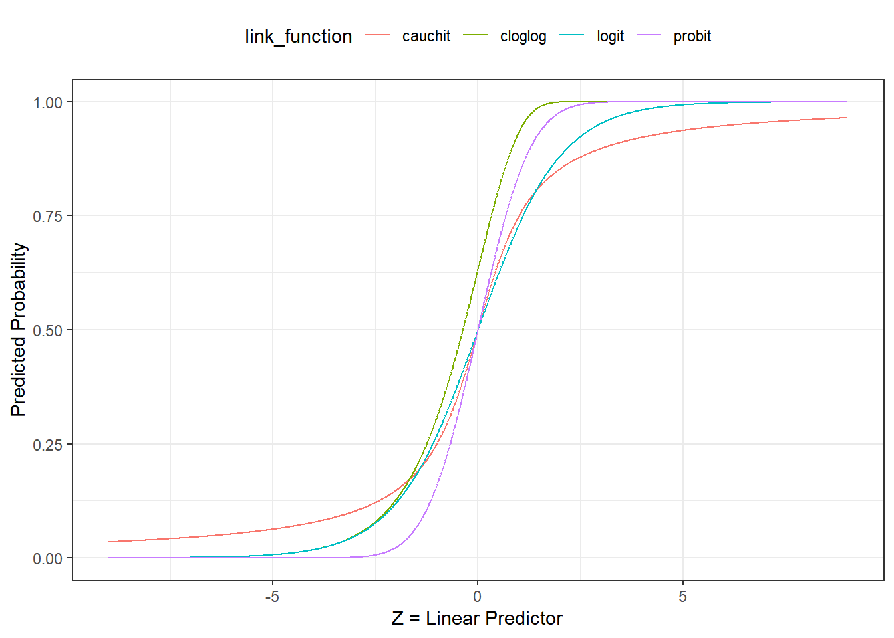

### Gaussian Response with Inverse Link

The same steps are repeated except the link function is now the inverse, `mean = 1/x`.  We see that some values of $Y$ are negative, which is ok.


```r
sim_norm <- function(x) {
  rnorm(1, mean = 1/x, 1)
}

data <- tibble(x = runif(10000)) %>% 
  mutate(y = x %>% map_dbl(sim_norm))
summary(data)
```

```
##        x                   y           
##  Min.   :0.0001064   Min.   :  -1.957  
##  1st Qu.:0.2532864   1st Qu.:   1.259  
##  Median :0.5028875   Median :   2.334  
##  Mean   :0.5018599   Mean   :  10.214  
##  3rd Qu.:0.7507694   3rd Qu.:   4.232  
##  Max.   :0.9998552   Max.   :9394.790
```


```r
glm <- glm(y ~ x, family = gaussian(link = "inverse"), data = data)

summary(glm)
```

```
## 
## Call:
## glm(formula = y ~ x, family = gaussian(link = "inverse"), data = data)
## 
## Deviance Residuals: 
##     Min       1Q   Median       3Q      Max  
## -3.5186  -0.6747   0.0105   0.6883   3.3764  
## 
## Coefficients:
##              Estimate Std. Error t value Pr(>|t|)    
## (Intercept) 3.596e-08  2.587e-08    1.39    0.165    
## x           9.998e-01  2.072e-04 4824.13   <2e-16 ***
## ---
## Signif. codes:  0 '***' 0.001 '**' 0.01 '*' 0.05 '.' 0.1 ' ' 1
## 
## (Dispersion parameter for gaussian family taken to be 1.007483)
## 
##     Null deviance: 203905704  on 9999  degrees of freedom
## Residual deviance:     10073  on 9998  degrees of freedom
## AIC: 28457
## 
## Number of Fisher Scoring iterations: 4
```

```r
par(mfrow = c(2,2))
plot(glm, cex = 0.4)
```

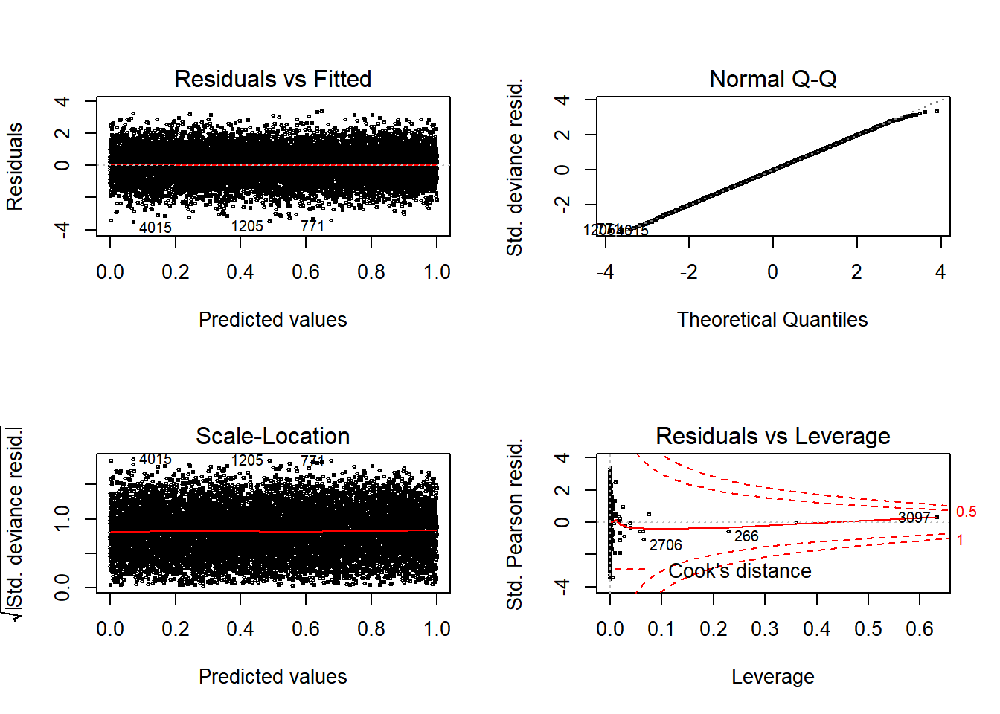

### Gaussian Response with Identity Link

And now the link is the identity, `mean = x`.


```r
sim_norm <- function(x) {
  rnorm(1, mean = x, 1)
}

data <- tibble(x = rnorm(10000)) %>% 
  mutate(y = x %>% map_dbl(sim_norm))

glm <- glm(y ~ x, family = gaussian(link = "identity"), data = data)

summary(glm)
```

```
## 
## Call:
## glm(formula = y ~ x, family = gaussian(link = "identity"), data = data)
## 
## Deviance Residuals: 
##     Min       1Q   Median       3Q      Max  
## -4.4461  -0.6853   0.0129   0.6794   3.6661  
## 
## Coefficients:
##             Estimate Std. Error t value Pr(>|t|)    
## (Intercept)  0.01393    0.01010   1.379    0.168    
## x            0.98236    0.01005  97.727   <2e-16 ***
## ---
## Signif. codes:  0 '***' 0.001 '**' 0.01 '*' 0.05 '.' 0.1 ' ' 1
## 
## (Dispersion parameter for gaussian family taken to be 1.020901)
## 
##     Null deviance: 19957  on 9999  degrees of freedom
## Residual deviance: 10207  on 9998  degrees of freedom
## AIC: 28590
## 
## Number of Fisher Scoring iterations: 2
```

```r
par(mfrow = c(2,2))
plot(glm, cex = 0.4)
```

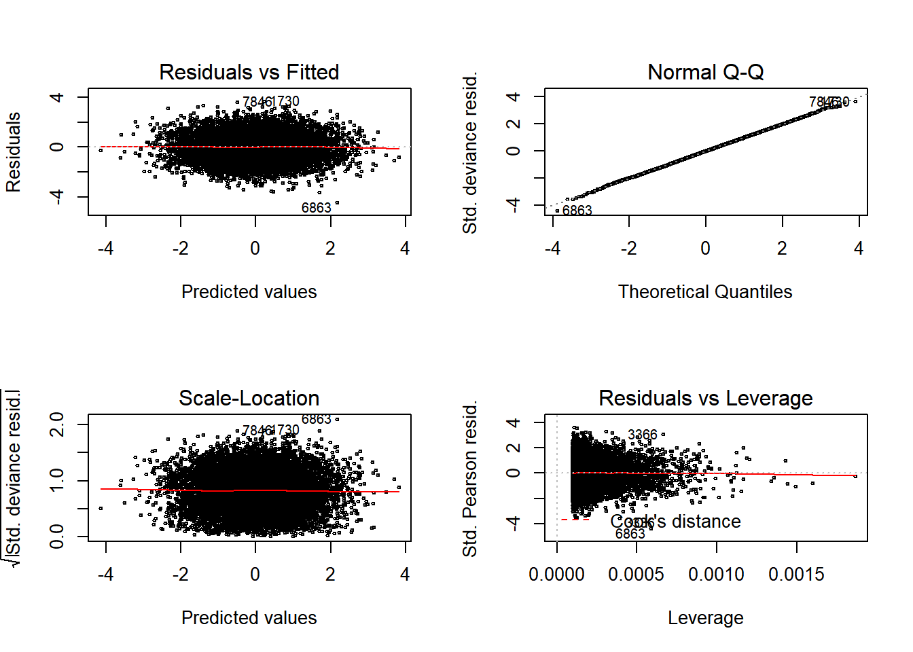

### Gaussian Response with Log Link and Negative Values

By Gaussian response we say that the *mean* of the response is Gaussian.  The range of a normal random variable is $(-\infty, +\infty)$, which means that negative values are always possible.  Now, if the mean is a large positive number, than negative values are much less likely but still possible:  about 95% of the observations will be within 2 standard deviations of the mean.

We see below that there are some $Y$ values which are negative.


```r
sim_norm <- function(x) {
  rnorm(1, mean = exp(x), sd = 1)
}

data <- tibble(x = runif(1000)) %>% 
  mutate(y = x %>% map_dbl(sim_norm))
summary(data)
```

```
##        x                   y          
##  Min.   :0.0000122   Min.   :-1.8709  
##  1st Qu.:0.2354295   1st Qu.: 0.9815  
##  Median :0.5055838   Median : 1.6969  
##  Mean   :0.4968540   Mean   : 1.7275  
##  3rd Qu.:0.7611768   3rd Qu.: 2.4854  
##  Max.   :0.9993455   Max.   : 5.0233
```

We can also see this from the histogram.


```r
data %>% ggplot(aes(y)) + geom_density( fill = 1, alpha = 0.3)
```

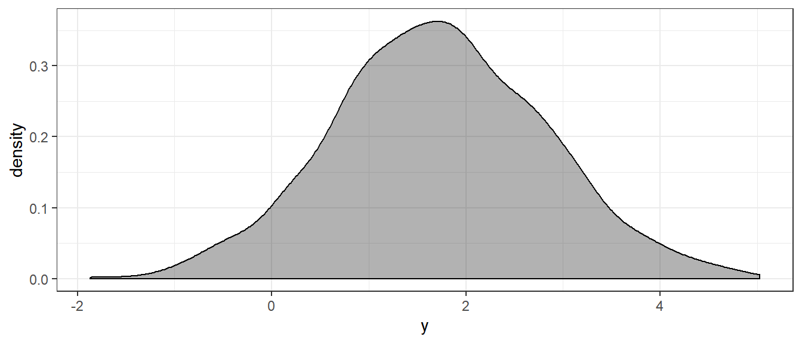

If we try to fit a GLM with a log link, there is an error.  


```r
glm <- glm(y ~ x, family = gaussian(link = "log"), data = data)
```

`Error in eval(family$initialize) : cannot find valid starting values: please specify some`

This is because the domain of the natural logarithm only includes positive numbers, and we just tried to take the log of negative numbers.

Our initial reaction might be to add some constant to each $Y$, say 10 for instance, so that they are all positive.  This does produce a model which is a good fit.


```r
glm <- glm(y + 10 ~ x, family = gaussian(link = "log"), data = data)
summary(glm)
```

```
## 
## Call:
## glm(formula = y + 10 ~ x, family = gaussian(link = "log"), data = data)
## 
## Deviance Residuals: 
##     Min       1Q   Median       3Q      Max  
## -3.1527  -0.6538  -0.0336   0.6753   3.3219  
## 
## Coefficients:
##             Estimate Std. Error t value Pr(>|t|)    
## (Intercept) 2.394232   0.005463  438.25   <2e-16 ***
## x           0.134685   0.009158   14.71   <2e-16 ***
## ---
## Signif. codes:  0 '***' 0.001 '**' 0.01 '*' 0.05 '.' 0.1 ' ' 1
## 
## (Dispersion parameter for gaussian family taken to be 0.987688)
## 
##     Null deviance: 1198.70  on 999  degrees of freedom
## Residual deviance:  985.71  on 998  degrees of freedom
## AIC: 2829.5
## 
## Number of Fisher Scoring iterations: 4
```

```r
par(mfrow = c(2,2))
plot(glm, cex = 0.4)
```

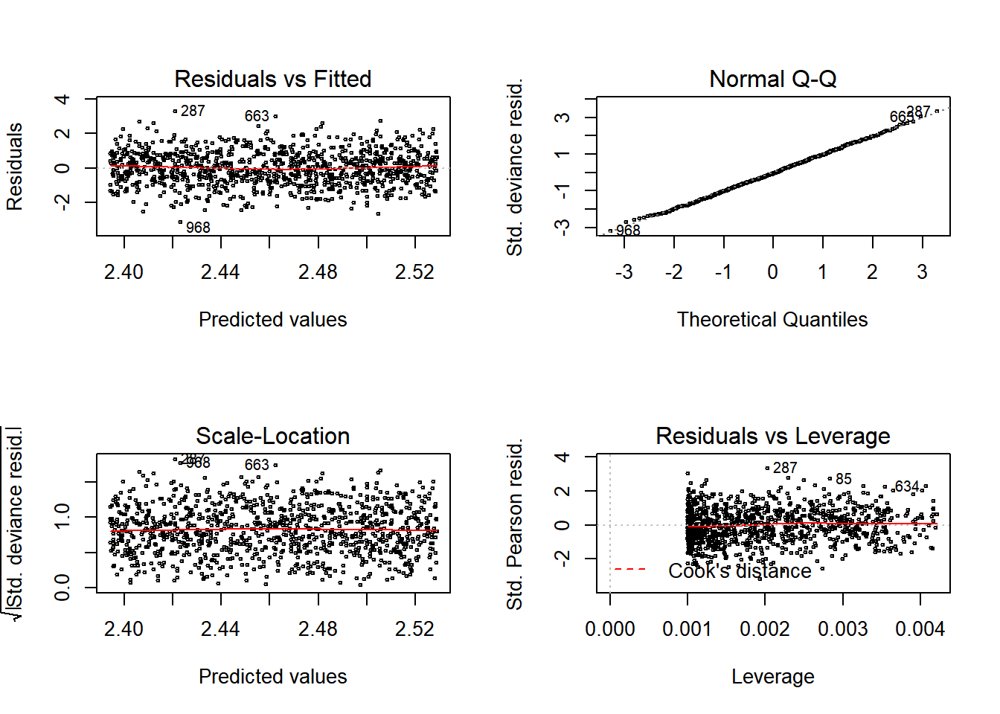

We see that on average, the predictions are 10 higher than the target.  This is no surprise since $E[Y + 10] = E[Y] + 10$.


```r
y <- data$y 
y_hat <- predict(glm, type = "response")
mean(y_hat) - mean(y)
```

```
## [1] 9.99995
```

But we see that the actual predictions are bad.  If we were to loot at the R-squared, MAE, RMSE, or any other metric it would tell us the same story.  This is because our GLM assumption is **not** that $Y$ is related to the link function of $X$, but that the **mean** of $Y$ is.


```r
tibble(y = y, y_hat = y_hat - 10) %>% ggplot(aes(y, y_hat)) + geom_point()
```

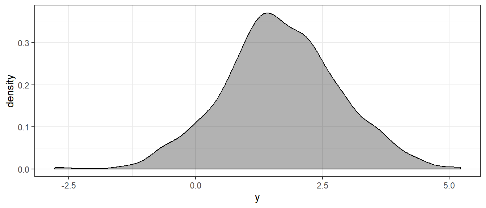

One solution is to adjust the $X$ which the model is based on.  Add a constant term to $X$ so that the mean of $Y$ is larger, and hence $Y$ is non zero.  While is a viable approach in the case of only one predictor variable, with more predictors this would not be easy to do.


```r
data <- tibble(x = runif(1000) + 10) %>% 
  mutate(y = x %>% map_dbl(sim_norm))
summary(data)
```

```
##        x               y        
##  Min.   :10.00   Min.   :22028  
##  1st Qu.:10.25   1st Qu.:28291  
##  Median :10.52   Median :36893  
##  Mean   :10.51   Mean   :38160  
##  3rd Qu.:10.77   3rd Qu.:47441  
##  Max.   :11.00   Max.   :59842
```

```r
glm <- glm(y ~ x, family = gaussian(link = "log"), data = data)
par(mfrow = c(2,2))
plot(glm, cex = 0.4)
```

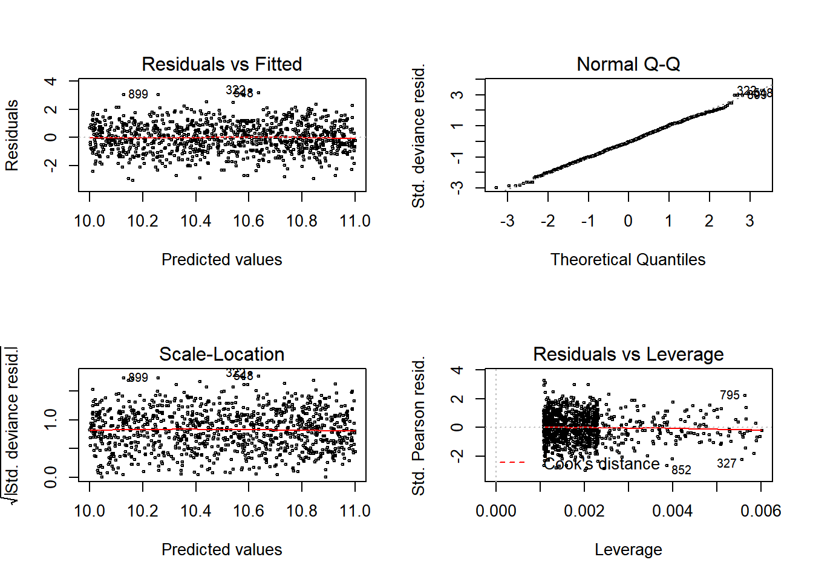

A better approach may be to use an inverse link even though the data was generated from a log link.  This is a good illustration of the saying "all models are wrong, but some are useful" in that the statistical assumption of the model is not correct but the model still works.


```r
data <- tibble(x = runif(1000)) %>% 
  mutate(y = x %>% map_dbl(sim_norm))
glm <- glm(y ~ x, family = gaussian(link = "inverse"), data = data)
par(mfrow = c(2,2))
plot(glm, cex = 0.4)
```

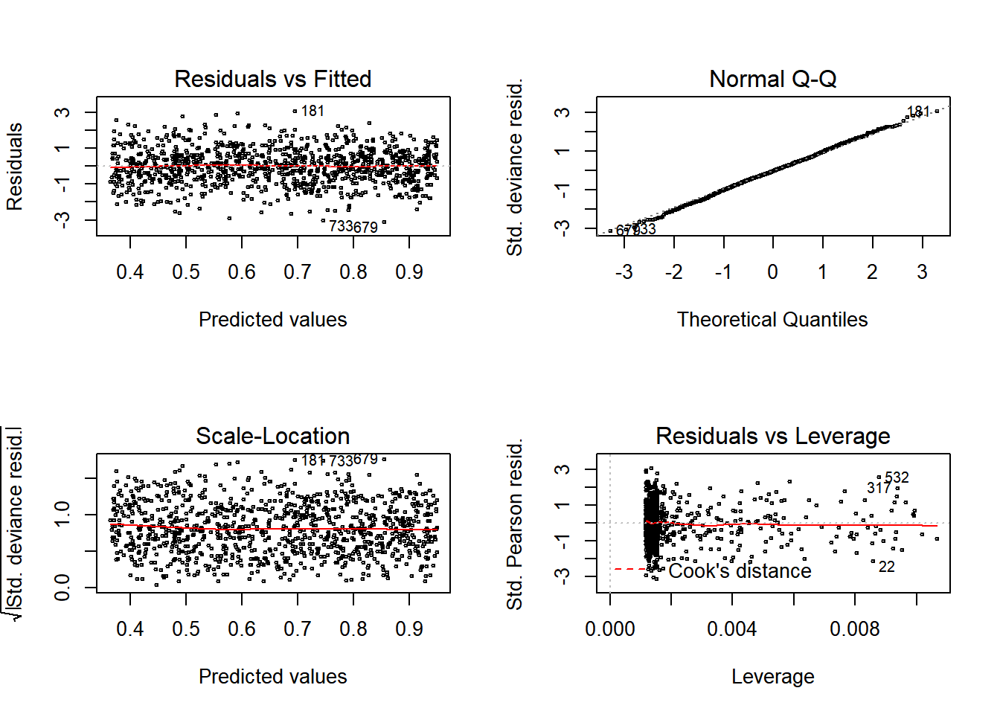

```r
summary(glm)
```

```
## 
## Call:
## glm(formula = y ~ x, family = gaussian(link = "inverse"), data = data)
## 
## Deviance Residuals: 
##      Min        1Q    Median        3Q       Max  
## -3.10622  -0.63739  -0.00542   0.63167   3.06741  
## 
## Coefficients:
##             Estimate Std. Error t value Pr(>|t|)    
## (Intercept)  0.94957    0.03515   27.02   <2e-16 ***
## x           -0.58667    0.04360  -13.46   <2e-16 ***
## ---
## Signif. codes:  0 '***' 0.001 '**' 0.01 '*' 0.05 '.' 0.1 ' ' 1
## 
## (Dispersion parameter for gaussian family taken to be 0.9967997)
## 
##     Null deviance: 1218.78  on 999  degrees of freedom
## Residual deviance:  994.82  on 998  degrees of freedom
## AIC: 2838.7
## 
## Number of Fisher Scoring iterations: 6
```

### Gamma Response with Log Link

The gamma distribution with rate parameter $\alpha$ and scale parameter $\theta$ is density.

$$f(y) = \frac{(y/\theta)^\alpha}{x \Gamma(\alpha)}e^{-x/\theta}$$

The mean is $\alpha\theta$.

Let's use a gamma with shape 2 and scale 0.5, which has mean 1.  


```r
gammas <- rgamma(1000, shape=2, scale = 0.5)
mean(gammas)
```

```
## [1] 0.9873887
```

We then generate random gamma values.  Because the mean now depends on two paramters instead of one, which was just $\mu$ in the Guassian case, we need to use a slightly different approach to simulate the random values.  The link function here is seen in `exp(x)`.


```r
#random component
x <- runif(1000, min=0, max=100)

#relate Y to X with a log link function
y <- gammas*exp(x)

data <- tibble(x = x, y  = y)
summary(data)
```

```
##        x                 y            
##  Min.   : 0.2452   Min.   :0.000e+00  
##  1st Qu.:27.0464   1st Qu.:4.946e+11  
##  Median :51.0196   Median :1.057e+22  
##  Mean   :51.0666   Mean   :2.531e+41  
##  3rd Qu.:75.3442   3rd Qu.:4.239e+32  
##  Max.   :99.9213   Max.   :2.693e+43
```

As expected, the residual plots are all perfect because the model is perfect.


```r
glm <- glm(y ~ x, family = Gamma(link = "log"), data = data)
par(mfrow = c(2,2))
plot(glm, cex = 0.4)
```

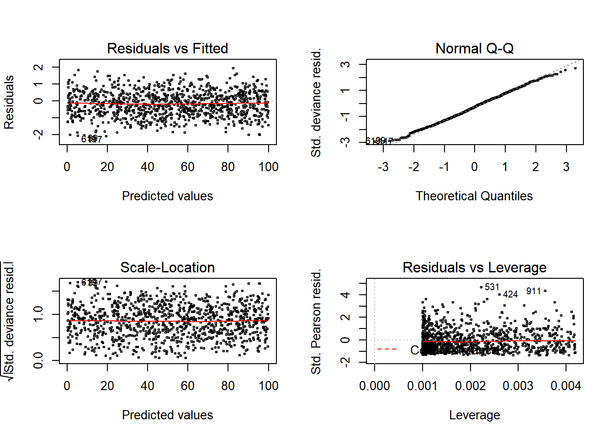

If we had tried using an inverse instead of the log, the residual plots would look much worse.


```r
glm <- glm(y ~ x, family = Gamma(link = "inverse"), data = data)
par(mfrow = c(2,2))
plot(glm, cex = 0.4)
```

```
## Warning in sqrt(crit * p * (1 - hh)/hh): NaNs produced

## Warning in sqrt(crit * p * (1 - hh)/hh): NaNs produced
```

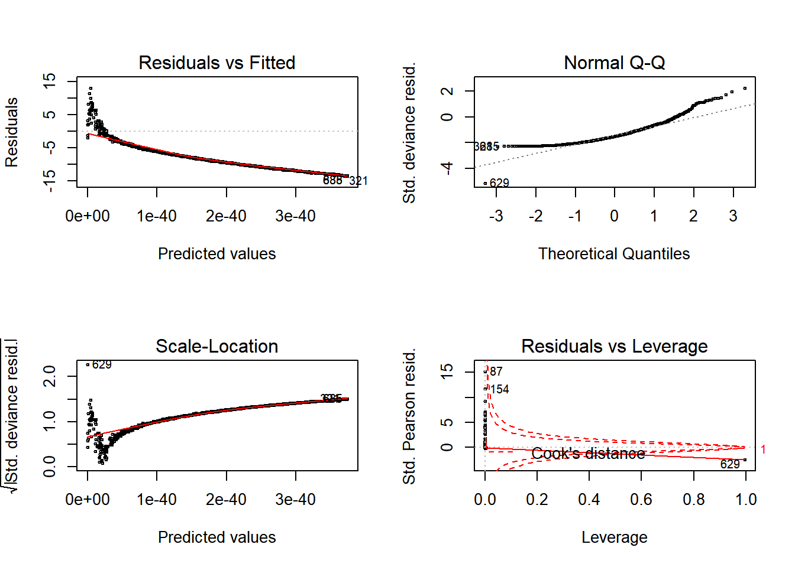


## Gamma with Inverse Link

With the inverse link, the mean has a factor `1/(x + 1)`.  Note that we need to add 1 to x to avoid dividing by zero.


```r
#relate Y to X with a log link function
y <- gammas*1/(x + 1)

data <- tibble(x = x, y  = y)
summary(data)
```

```
##        x                 y            
##  Min.   : 0.2452   Min.   :0.0005277  
##  1st Qu.:27.0464   1st Qu.:0.0084840  
##  Median :51.0196   Median :0.0167640  
##  Mean   :51.0666   Mean   :0.0485119  
##  3rd Qu.:75.3442   3rd Qu.:0.0365838  
##  Max.   :99.9213   Max.   :1.7125489
```


```r
glm <- glm(y ~ x, family = Gamma(link = "inverse"), data = data)
par(mfrow = c(2,2))
plot(glm, cex = 0.4)
```


## Log transforms of continuous predictors

When a log link is used, taking the natural logs of continuous variables allows for the scale of each predictor to match the scale of the thing that they are predicting, the log of the mean of the response.  In addition, when the distribution of the continuous variable is skewed, taking the log helps to make it more symmetric.

After taking the log of a predictor, the interpretation becomes a *power transform* of the original variable.  

For $\mu$ the mean response,

$$log(\mu) = \beta_0 + \beta_1 log(X)$$
To solve for $\mu$, take the exonent of both sides

$$\mu = e^{\beta_1} e^{\beta_1 log(X)} = e^{\beta_0} X^{\beta_1}$$


## Reference levels

When a categorical variable is used in a GLM, the model actually uses indicator variables for each level.  The default reference level is the order of the R factors.  For the `sex` variable, the order is `female` and then `male`.  This means that the base level is `female` by default.


```r
health_insurance$sex %>% as.factor() %>% levels()
```

```
## [1] "female" "male"
```

Why does this matter?  Statistically, the coefficients are most stable when there are more observations.


```r
health_insurance$sex %>% as.factor() %>% summary()
```

```
## female   male 
##    662    676
```

There is already a function to do this in the `tidyverse` called `fct_infreq`.  Let's quickly fix the `sex` column so that these factor levels are in order of frequency.


```r
health_insurance <- health_insurance %>% 
  mutate(sex = fct_infreq(sex))
```

Now `male` is the base level.


```r
health_insurance$sex %>% as.factor() %>% levels()
```

```
## [1] "male"   "female"
```

## Interactions

An interaction occurs when the effect of a variable on the response is different depending on the level of other variables in the model.

Consider this model:

Let $x_2$ be an indicator variable, which is 1 for some records and 0 otherwise.  

$$\hat{y_i} = \beta_0 + \beta_1 x_1 + \beta_2 x_2 + \beta_3 x_1 x_2$$

There are now two different linear models dependong on whether `x_1` is 0 or 1.

When $x_1 = 0$,

$$\hat{y_i} = \beta_0  + \beta_2 x_2$$

and when $x_1 = 1$

$$\hat{y_i} = \beta_0 + \beta_1 + \beta_2 x_2 + \beta_3 x_2$$
By rewriting this we can see that the intercept changes from $\beta_0$ to $\beta_0^*$ and the slope changes from $\beta_1$ to $\beta_1^*$

$$
(\beta_0 + \beta_1) + (\beta_2 + \beta_3 ) x_2 \\
 = \beta_0^* + \beta_1^* x_2
$$

The SOA's modules give an example with the using age and gender as below.  This is not a very strong interaction, as the slopes are almost identical across `gender`.


```r
interactions %>% 
  ggplot(aes(age, actual, color = gender)) + 
  geom_line() + 
  labs(title = "Age vs. Actual by Gender", 
       subtitle = "Interactions imply different slopes",
       caption= "data: interactions")
```

<div class="figure">
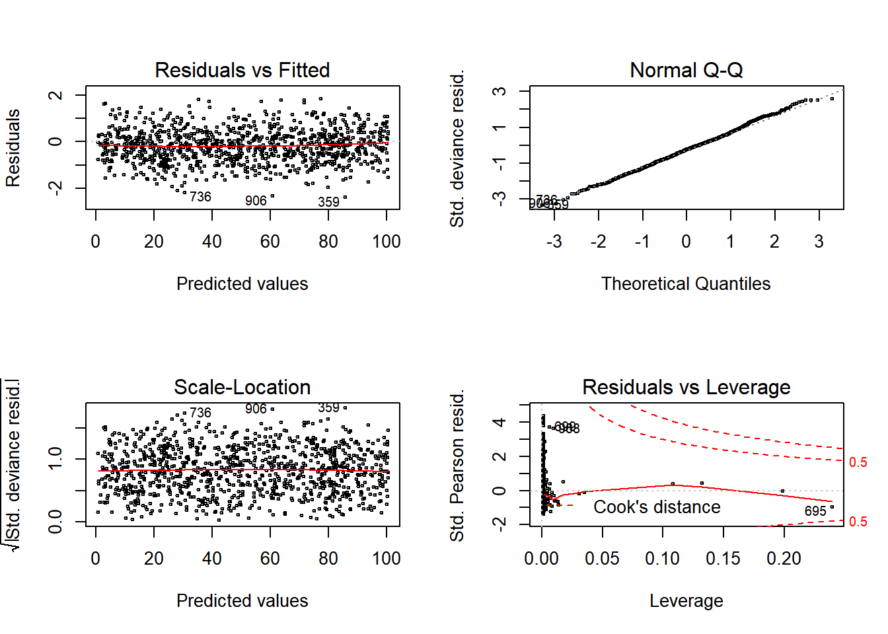
<p class="caption">(\#fig:unnamed-chunk-43)Example of weak interaction</p>
</div>

Here is a clearer example from the `auto_claim` data. The lines show the slope of a linear model, assuming that only `BLUEBOOK` and `CAR_TYPE` were predictors in the model.  You can see that the slope for Sedans and Sports Cars is higher than for Vans and Panel Trucks.  


```r
auto_claim %>% 
  ggplot(aes(log(CLM_AMT), log(BLUEBOOK), color = CAR_TYPE)) + 
  geom_point(alpha = 0.3) + 
  geom_smooth(method = "lm", se = F) + 
  labs(title = "Kelly Bluebook Value vs Claim Amount")
```

<div class="figure">

<p class="caption">(\#fig:unnamed-chunk-44)Example of strong interaction</p>
</div>

Any time that the effect that one variable has on the response is different depending on the value of other variables we say that there is an interaction.  We can also use an hypothesis test with a GLM to check this.  Simply include an interaction term and see if the coefficient is zero at the desired significance level.

## Poisson Regression

When counting something, numbers can only be positive and increase by increments of 1.  Statistically, the name for this is a Poisson Process, which is a model for a serious of discrete events where the average time between events is known, called the "rate" $\lambda$, but the exact timing of events is unknown.  We could just fit a single rate for all observations, but this would often be a simplification.  For a time interval of length $m$, the expected number of events is $\lambda m$.  

By using a GLM, we can fit a different rate for each observation.  Because the response is a count, the appropriate response distribution is the Poisson.  

$$Y_i|X_i \sim \text{Poisson}(\lambda_i m_i)$$

When all observations have the same exposure, $m = 1$.  When the mean of the data is far from the variance, an additional parameter known as the *dispersion parameter* is used.  A classic example is when modeling insurance claim counts which have a lot of zero claims.  Then the model is said to be an "over-dispersed Poisson" or "zero-inflated" model.

## Offsets

In certain situations, it is convenient to include a constant term in the linear predictor.  This is the same as including a variable that has a coefficient equal to 1.  We call this an *offset*.

$$g(\mu) = \beta_0 + \beta_1 X_1 + ... + \beta_p X_p + \text{offset}$$

## Tweedie regression

While this topic is briefly mentioned on the modules, the only R libraries which support Tweedie Regression (`statmod` and `tweedie`) are not on the syllabus, and so there is no way that the SOA could ask you to build a tweedie model. This means that you can be safely skip this section.

## Stepwise subset selection

In theory, we could test all possible combinations of variables and interaction terms.  This includes all $p$ models with one predictor, all p-choose-2 models with two predictors, all p-choose-3 models with three predictors, and so forth.  Then we take whichever model has the best performance as the final model.

This "brute force" approach is statistically ineffective: the more variables which are searched, the higher the chance of finding models that overfit.

A subtler method, known as *stepwise selection*, reduces the chances of overfitting by only looking at the most promising models.  

**Forward Stepwise Selection:**

1. Start with no predictors in the model;
2. Evaluate all $p$ models which use only one predictor and choose the one with the best performance (highest $R^2$ or lowest $\text{RSS}$);
3. Repeat the process when adding one additional predictor, and continue until there is a model with one predictor, a model with two predictors, a model with three predictors, and so forth until there are $p$ models;
4. Select the single best model which has the best $\text{AIC}$,$\text{BIC}$, or adjusted $R^2$.

**Backward Stepwise Selection:**

1. Start with a model that contains all predictors;
2. Create a model which removes all predictors;
3. Choose the best model which removes all-but-one predictor;
4. Choose the best model which removes all-but-two predictors;
5. Continue until there are $p$ models;
6. Select the single best model which has the best $\text{AIC}$,$\text{BIC}$, or adjusted $R^2$.

**Both Forward & Backward Selection:**

A hybrid approach is to consider use both forward and backward selection.  This is done by creating two lists of variables at each step, one from forward and one from backward selection.  Then variables from *both* lists are tested to see if adding or subtracting from the current model would improve the fit or not.  ISLR does not mention this directly, however, by default the `stepAIC` function uses a default of `both`.

>**Tip**: Always load the `MASS` library before `dplyr` or `tidyverse`.  Otherwise there will be conflicts as there are functions named `select()` and `filter()` in both.  Alternatively, specify the library in the function call with `dplyr::select()`.

| Readings |  | 
|-------|---------|
| [CAS Monograph 5 Chapter 2](https://www.casact.org/pubs/monographs/papers/05-Goldburd-Khare-Tevet.pdf) |  |

## Advantages and disadvantages

There is usually at least one question on the PA exam which asks you to "list some of the advantages and disadvantages of using this particular model", and so here is one such list.  It is unlikely that the grader will take off points for including too many comments and so a good strategy is to include everything that comes to mind.

**GLM Advantages**

- Easy to interpret
- Can easily be deployed in spreadsheet format
- Handles skewed data through different response distributions
- Models the average response which leads to stable predictions on new data
- Handles continuous and categorical data

**GLM Disadvantages**

- Does not select features (without stepwise selection)
- Strict assumptions around distribution shape, randomness of error terms, and variable correlations 
- Unable to detect non-linearity directly (although this can manually be addressed through feature engineering)
- Sensitive to outliers
- Low predictive power


# Logistic Regression

## Model form

Logistic regression is a special type of GLM.  The name is confusing because the objective is *classification* and not regression.  While most examples focus on binary classification, logistic regression also works for multiclass classification.

The model form is as before

$$g(\mathbf{\hat{y}}) = \mathbf{X} \mathbf{\beta}$$

However, now the target $y_i$ is a category.  Our objective is to predict a probability of being in each category.  For regression, $\hat{y_i}$ can be any number, but now we need $0 \leq \hat{y_i} \leq 1$.

We can use a special link function, known as the *standard logistic function*, *sigmoid*, or *logit*, to force the output to be in this range of $\{0,1\}$.

$$\mathbf{\hat{y}} = g^{-1}(\mathbf{X} \mathbf{\beta}) = \frac{1}{1 + e^{-\mathbf{X} \mathbf{\beta}}}$$

<div class="figure" style="text-align: center">
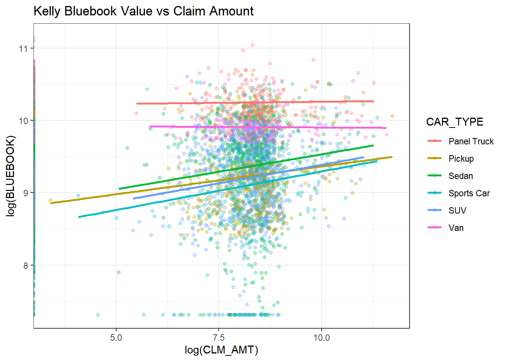
<p class="caption">(\#fig:unnamed-chunk-45)Standard Logistic Function</p>
</div>

Other link functions for classification problems are possible as well, although the logistic function is the most common.  If a problem asks for an alternative link, such as the *probit*, fit both models and compare the performance.

## Example

Using the `auto_claim` data, we predict whether or not a policy has a claim.  This is also known as the *claim frequency*.


```r
auto_claim %>% count(CLM_FLAG)
```

```
## # A tibble: 2 x 2
##   CLM_FLAG     n
##   <chr>    <int>
## 1 No        7556
## 2 Yes       2740
```

About 40% do not have a claim while 60% have at least one claim.


```r
set.seed(42)
index <- createDataPartition(y = auto_claim$CLM_FLAG, 
                             p = 0.8, list = F) %>% as.numeric()
auto_claim <- auto_claim %>% 
  mutate(target = as.factor(ifelse(CLM_FLAG == "Yes", 1,0)))
train <-  auto_claim %>% slice(index)
test <- auto_claim %>% slice(-index)

frequency <- glm(target ~ AGE + GENDER + MARRIED + CAR_USE + 
                   BLUEBOOK + CAR_TYPE + AREA, 
                 data=train, 
                 family = binomial(link="logit"))
```

All of the variables except for the `CAR_TYPE` and `GENDERM` are highly significant.  The car types `SPORTS CAR` and `SUV` appear to be significant, and so if we wanted to make the model simpler we could create indicator variables for `CAR_TYPE == SPORTS CAR` and `CAR_TYPE == SUV`.


```r
frequency %>% summary()
```

```
## 
## Call:
## glm(formula = target ~ AGE + GENDER + MARRIED + CAR_USE + BLUEBOOK + 
##     CAR_TYPE + AREA, family = binomial(link = "logit"), data = train)
## 
## Deviance Residuals: 
##     Min       1Q   Median       3Q      Max  
## -1.8431  -0.8077  -0.5331   0.9575   3.0441  
## 
## Coefficients:
##                      Estimate Std. Error z value Pr(>|z|)    
## (Intercept)        -3.523e-01  2.517e-01  -1.400  0.16160    
## AGE                -2.289e-02  3.223e-03  -7.102 1.23e-12 ***
## GENDERM            -1.124e-02  9.304e-02  -0.121  0.90383    
## MARRIEDYes         -6.028e-01  5.445e-02 -11.071  < 2e-16 ***
## CAR_USEPrivate     -1.008e+00  6.569e-02 -15.350  < 2e-16 ***
## BLUEBOOK           -4.025e-05  4.699e-06  -8.564  < 2e-16 ***
## CAR_TYPEPickup     -6.687e-02  1.390e-01  -0.481  0.63048    
## CAR_TYPESedan      -3.689e-01  1.383e-01  -2.667  0.00765 ** 
## CAR_TYPESports Car  6.159e-01  1.891e-01   3.256  0.00113 ** 
## CAR_TYPESUV         2.982e-01  1.772e-01   1.683  0.09240 .  
## CAR_TYPEVan        -8.983e-03  1.319e-01  -0.068  0.94569    
## AREAUrban           2.128e+00  1.064e-01  19.993  < 2e-16 ***
## ---
## Signif. codes:  0 '***' 0.001 '**' 0.01 '*' 0.05 '.' 0.1 ' ' 1
## 
## (Dispersion parameter for binomial family taken to be 1)
## 
##     Null deviance: 9544.3  on 8236  degrees of freedom
## Residual deviance: 8309.6  on 8225  degrees of freedom
## AIC: 8333.6
## 
## Number of Fisher Scoring iterations: 5
```

The signs of the coefficients tell if the probability of having a claim is either increasing or decreasing by each variable.  For example, the likelihood of an accident 

* Decreases as the age of the car increases
* Is lower for men 
* Is higher for sports cars and SUVs

The p-values tell us if the variable is significant.

- `Age`, `MarriedYes`, `CAR_USEPrivate`, `BLUEBOOK`, and `AreaUrban` are significant.
- Certain values of `CAR_TYPE` are significant but others are not.

The output is a predicted probability.  We can see that this is centered around a probability of about 0.5.  


```r
preds <- predict(frequency, newdat=test,type="response")
qplot(preds) 
```

<div class="figure">
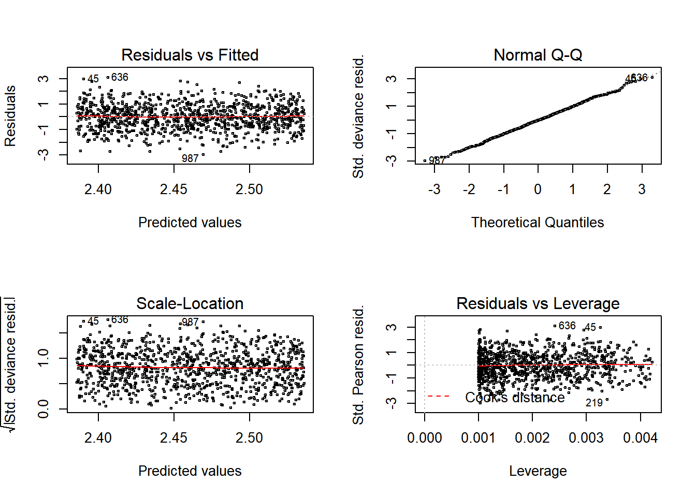
<p class="caption">(\#fig:unnamed-chunk-49)Distribution of Predicted Probability</p>
</div>

In order to convert these values to predicted 0's and 1's, we assign a *cutoff* value so that if $\hat{y}$ is above this threshold we use a 1 and 0 othersise.  The default cutoff is 0.5.  We change this to 0.3 and see that there are 763 policies predicted to have claims.


```r
test <- test %>% mutate(pred_zero_one = as.factor(1*(preds>.3)))
summary(test$pred_zero_one)
```

```
##    0    1 
## 1296  763
```

How do we decide on this cutoff value?  We need to compare cutoff values based on some evaluation metric.  For example, we can use *accuracy*.

$$\text{Accuracy} = \frac{\text{Correct Guesses}}{\text{Total Guesses}}$$

This results in an accuracy of 70%.  But is this good?


```r
test %>% summarise(accuracy = mean(pred_zero_one == target))
```

```
## # A tibble: 1 x 1
##   accuracy
##      <dbl>
## 1    0.699
```

Consider what would happen if we just predicted all 0's.  The accuracy is 74%.


```r
test %>% summarise(accuracy = mean(0 == target))
```

```
## # A tibble: 1 x 1
##   accuracy
##      <dbl>
## 1    0.734
```

For policies which experience claims the accuracy is 63%.


```r
test %>% 
  filter(target == 1) %>% 
  summarise(accuracy = mean(pred_zero_one == target))
```

```
## # A tibble: 1 x 1
##   accuracy
##      <dbl>
## 1    0.631
```

But for policies that don't actually experience claims this is 72%.  


```r
test %>% 
  filter(target == 0) %>% 
  summarise(accuracy = mean(pred_zero_one == target))
```

```
## # A tibble: 1 x 1
##   accuracy
##      <dbl>
## 1    0.724
```

How do we know if this is a good model?  We can repeat this process with a different cutoff value and get different accuracy metrics for these groups.  Let's use a cutoff of 0.6.

75%


```r
test <- test %>% mutate(pred_zero_one = as.factor(1*(preds>.6)))
test %>% summarise(accuracy = mean(pred_zero_one == target))
```

```
## # A tibble: 1 x 1
##   accuracy
##      <dbl>
## 1    0.752
```

10% for policies with claims and 98% for policies without claims.  


```r
test %>% 
  filter(target == 1) %>% 
  summarise(accuracy = mean(pred_zero_one == target))
```

```
## # A tibble: 1 x 1
##   accuracy
##      <dbl>
## 1    0.108
```

```r
test %>% 
  filter(target == 0) %>% 
  summarise(accuracy = mean(pred_zero_one == target))
```

```
## # A tibble: 1 x 1
##   accuracy
##      <dbl>
## 1    0.985
```

The punchline is that the accuracy depends on the cutoff value, and changing the cutoff value changes whether the model is accuracy for the "true = 1" classes (policies with actual claims) vs. the "false = 0" classes (policies without claims).

## Classification metrics

For regression problems, when the output is a whole number, we can use the sum of squares $\text{RSS}$, the r-squared $R^2$, the mean absolute error $\text{MAE}$, and the likelihood.  For classification problems where the output is in $\{0,1\}$, we need to a new set of metrics.

A *confusion matrix* shows is a table that summarises how the model classifies each group.

- No claims and predicted to not have claims - **True Negatives (TN) = 1,489**
- Had claims and predicted to have claims - **True Positives (TP) = 59**
- No claims but predited to have claims - **False Positives (FP) = 22**
- Had claims but predicted not to - **False Negatives (FN) = 489**


```r
confusionMatrix(test$pred_zero_one,factor(test$target))$table
```

```
##           Reference
## Prediction    0    1
##          0 1489  489
##          1   22   59
```

These definitions allow us to measure performance on the different groups.

*Precision* answers the question "out of all of the positive predictions, what percentage were correct?"

$$\text{Precision} = \frac{\text{TP}}{\text{TP} + \text{FP}}$$

*Recall* answers the question "out of all of positive examples in the data set, what percentage were correct?"

$$\text{Recall} = \frac{\text{TP}}{\text{TP} + \text{FN}}$$

The choice of using precision vs. recall depends on the relative cost of making a FP or a FN error.  If FP errors are expensive, then use precision; if FN errors are expensive, then use recall.  

**Example A:** the model trying to detect a deadly disease, which only 1 out of every 1000 patient's survive without early detection.  Then the goal should be to optimize *recall*, because we would want every patient that has the disease to get detected.  

**Example B:** the model is detecting which emails are spam or not.  If an important email is flagged as spam incorrectly, the cost is 5 hours of lost productivity.  In this case, *precision* is the main concern.

In some cases we can compare this "cost" in actual values.  For example, if a federal court is predicting if a criminal will recommit or not, they can agree that "1 out of every 20 guilty individuals going free" in exchange for "90% of those who are guilty being convicted".  When money is involed, this a dollar amount can be used: flagging non-spam as spam may cost \$100 whereas missing a spam email may cost \$2.  Then the cost-weighted accuracy is

$$\text{Cost} = (100)(\text{FN}) + (2)(\text{FP})$$

Then the cutoff value can be tuned in order to find the minimum cost.

Fortunately, all of this is handled in a single function called `confusionMatrix`.


```r
confusionMatrix(test$pred_zero_one,factor(test$target))
```

```
## Confusion Matrix and Statistics
## 
##           Reference
## Prediction    0    1
##          0 1489  489
##          1   22   59
##                                           
##                Accuracy : 0.7518          
##                  95% CI : (0.7326, 0.7704)
##     No Information Rate : 0.7339          
##     P-Value [Acc > NIR] : 0.03366         
##                                           
##                   Kappa : 0.1278          
##                                           
##  Mcnemar's Test P-Value : < 2e-16         
##                                           
##             Sensitivity : 0.9854          
##             Specificity : 0.1077          
##          Pos Pred Value : 0.7528          
##          Neg Pred Value : 0.7284          
##              Prevalence : 0.7339          
##          Detection Rate : 0.7232          
##    Detection Prevalence : 0.9607          
##       Balanced Accuracy : 0.5466          
##                                           
##        'Positive' Class : 0               
## 
```

### Area Under the ROC Curv (AUC)

What if we look at both the true-positive rate (TPR) and false positive rate (FPR) simultaneously?  That is, for each value of the cutoff, we can calculate the TPR and TNR.  

For example, say that we have 10 cutoff values, $\{k_1, k_2, ..., k_{10}\}$.  Then for each value of $k$ we calculate both the true positive rates

$$\text{TPR} = \{\text{TPR}(k_1), \text{TPR}(k_2), .., \text{TPR}(k_{10})\} $$ 

and the true negative rates

$$\{\text{FNR} = \{\text{FNR}(k_1), \text{FNR}(k_2), .., \text{FNR}(k_{10})\}$$

Then we set `x = TPR` and `y = FNR` and graph x against y.  The plot below shows the ROC for the `auto_claims` data.  The Area Under the Curv of 0.6795 is what we would get if we integrated under the curve.


```r
library(pROC)
roc(test$target, preds, plot = T)
```

<div class="figure">
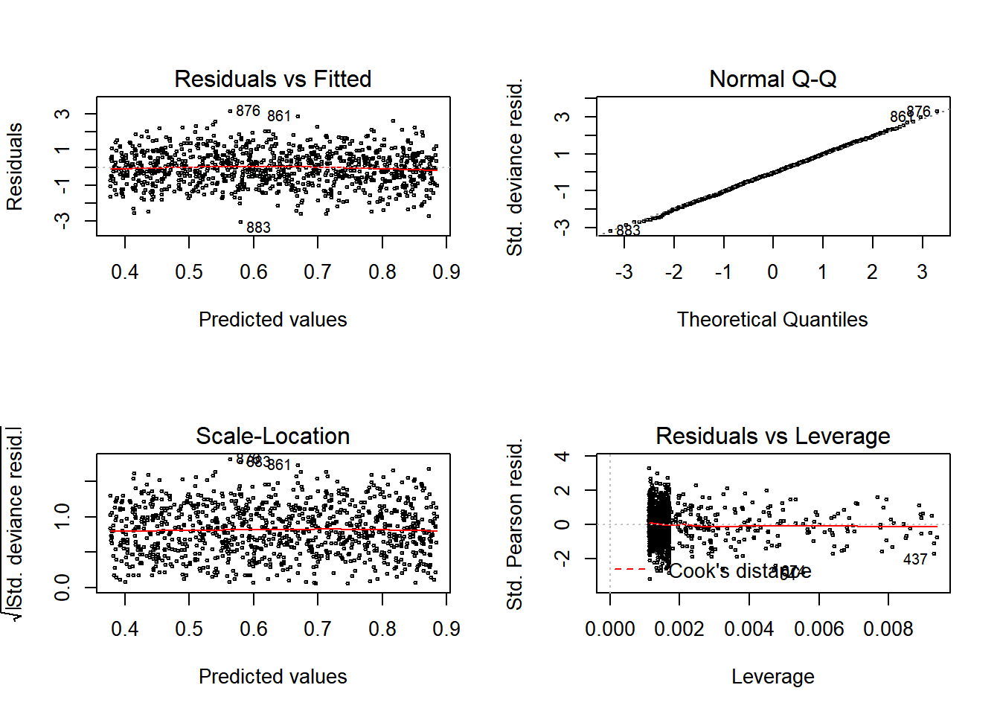
<p class="caption">(\#fig:unnamed-chunk-59)AUC for auto_claim</p>
</div>

```
## 
## Call:
## roc.default(response = test$target, predictor = preds, plot = T)
## 
## Data: preds in 1511 controls (test$target 0) < 548 cases (test$target 1).
## Area under the curve: 0.7558
```

If we just randomly guess, the AUC would be 0.5, which is represented by the 45-degree line.  A perfect model would maximize the curve to the upper-left corner.

AUC is preferred over Accuracy when there are a lot more "true" classes than "false" classes, which is known as having **class imbalance*.  An example is bank fraud detection: 99.99% of bank transactions are "false" or "0" classes, and so optimizing for accuracy alone will result in a low sensitivity for detecting actual fraud.

### Additional reading


| Title | Source           |
|---------|-----------------|
| An Overview of Classification   | ISL 4.1 |
| [Understanding AUC - ROC Curv](https://towardsdatascience.com/understanding-auc-roc-curve-68b2303cc9c5#:~:targetText=What%20is%20AUC%20%2D%20ROC%20Curve%3F,capable%20of%20distinguishing%20between%20classes.)| Sarang Narkhede, Towards Data Science   |
| [Precision vs. Recall](https://towardsdatascience.com/precision-vs-recall-386cf9f89488#:~:targetText=Precision%20and%20recall%20are%20two,correctly%20classified%20by%20your%20algorithm.)     | Shruti Saxena, Towards Data Science    |


# Penalized Linear Models

One of the main weaknesses of the GLM, including all linear models in this chapter, is that the features need to be selected by hand.  Stepwise selection helps to improve this process, but fails when the inputs are correlated and often has a strong dependence on seemingly arbitrary choices of evaluation metrics such as using AIC or BIC and forward or backwise directions.  

The Bias Variance Tradoff is about finding the lowest error by changing the flexibility of the model. Penalization methods use a parameter to control for this flexibility directly.  

Earlier on we said that the linear model minimizes the sum of square terms, known as the residual sum of squares (RSS)

$$
\text{RSS} = \sum_i(y_i - \hat{y})^2 = \sum_i(y_i - \beta_0 - \sum_{j = 1}^p\beta_j x_{ij})^2
$$

This loss function can be modified so that models which include more (and larger) coefficients are considered as worse.  In other words, when there are more $\beta$'s, or $\beta$'s which are larger, the RSS is higher.

## Ridge Regression

Ridge regression adds a penalty term which is proportional to the square of the sum of the coefficients.  This is known as the "L2" norm.

$$
\sum_i(y_i - \beta_0 - \sum_{j = 1}^p\beta_j x_{ij})^2 + \lambda \sum_{j = 1}^p\beta_j^2
$$

This $\lambda$ controls how much of a penalty is imposed on the size of the coefficients.  When $\lambda$ is high, simpler models are treated more favorably because the $\sum_{j = 1}^p\beta_j^2$ carries more weight.  Conversely, then $\lambda$ is low, complex models are more favored.  When $\lambda = 0$, we have an ordinary GLM.

## Lasso

The official name is the Least Absolute Shrinkage and Selection Operator, but the common name is just "the lasso".  Just as with Ridge regression, we want to favor simpler models; however, we also want to *select* variables.  This is the same as forcing some coefficients to be equal to 0.

Instead of taking the square of the coefficients (L2 norm), we take the absolute value (L1 norm).  

$$
\sum_i(y_i - \beta_0 - \sum_{j = 1}^p\beta_j x_{ij})^2 + \lambda \sum_{j = 1}^p|\beta_j|
$$

In ISLR, Hastie et al show that this results in coefficients being forced to be exactly 0.  This is extremely useful because it means that by changing $\lambda$, we can select how many variables to use in the model.

**Note**: While any response family is possible with penalized regression, in R, only the Gaussian family is possible in the library `glmnet`, and so this is the only type of question that the SOA can ask.

## Elastic Net

The Elastic Net uses a penalty term which is between the L1 and L2 norms. The penalty term is a weighted average using the mixing parameter $0 \leq \alpha \leq 1$. The loss fucntion is then

$$\text{RSS} + (1 - \alpha)/2 \sum_{j = 1}^{p}\beta_j^2 + \alpha \sum_{j = 1}^p |\beta_j|$$
When $\alpha = 1$ is turns into a Lasso; when $\alpha = 1$ this is the Ridge model. 

Luckily, none of this needs to be memorized.  On the exam, read the documentation in R to refresh your memory.  For the Elastic Net, the function is `glmnet`, and so running `?glmnet` will give you this info.

>**Shortcut**: When using complicated functions on the exam, use `?function_name` to get the documentation.

## Advantages and disadvantages

**Elastic Net/Lasso/Ridge Advantages**

- All benefits from GLMS
- Automatic variable selection for Lasso; smaller coefficients for Ridge
- Better predictive power than GLM

**Elastic Net/Lasso/Ridge Disadvantages**

- All cons of GLMs

| Readings |  | 
|-------|---------|
| ISLR 6.1 Subset Selection  | |
| ISLR 6.2 Shrinkage Methods|  |


