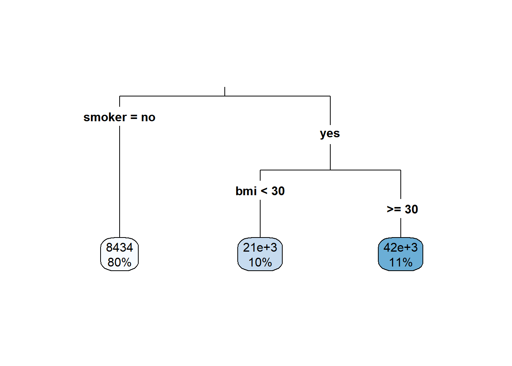
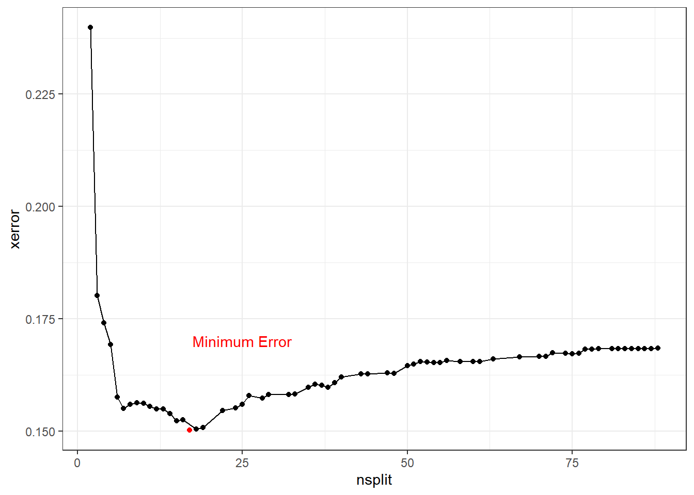
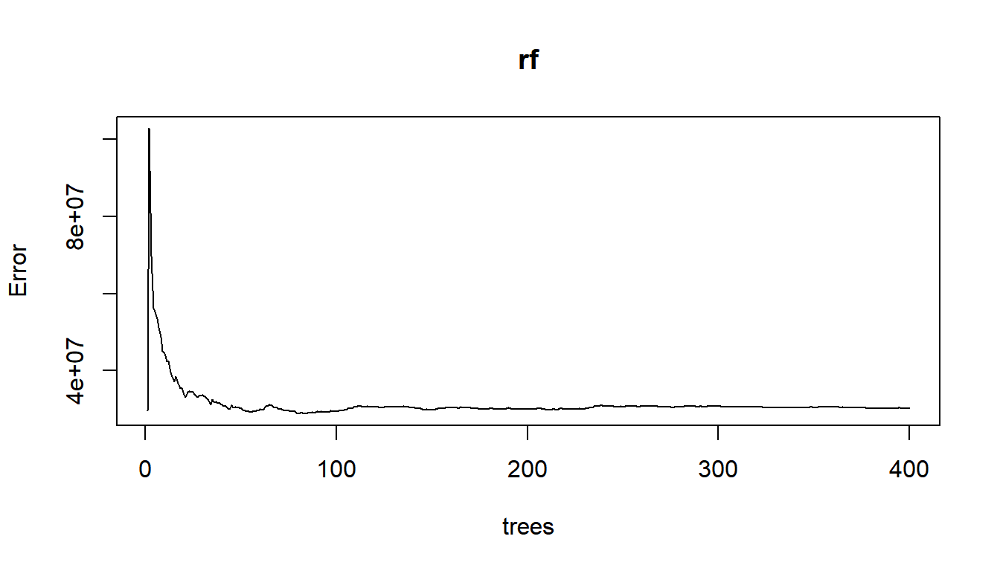
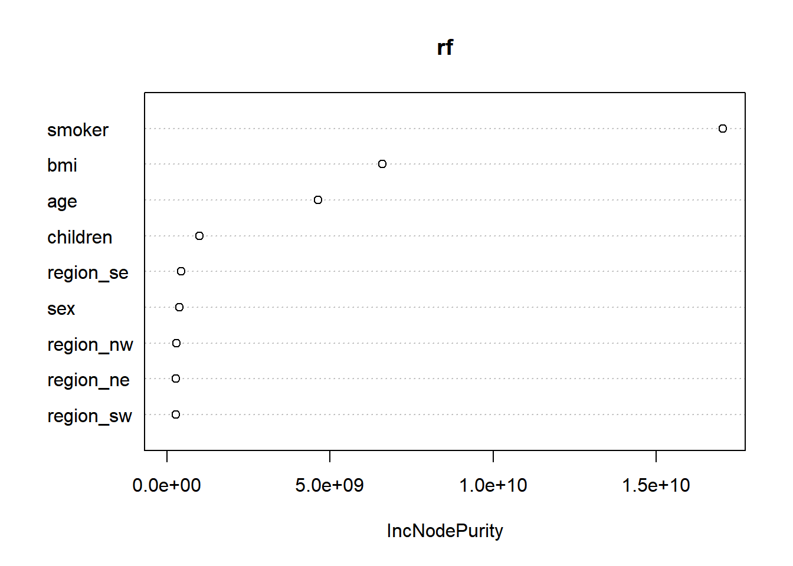
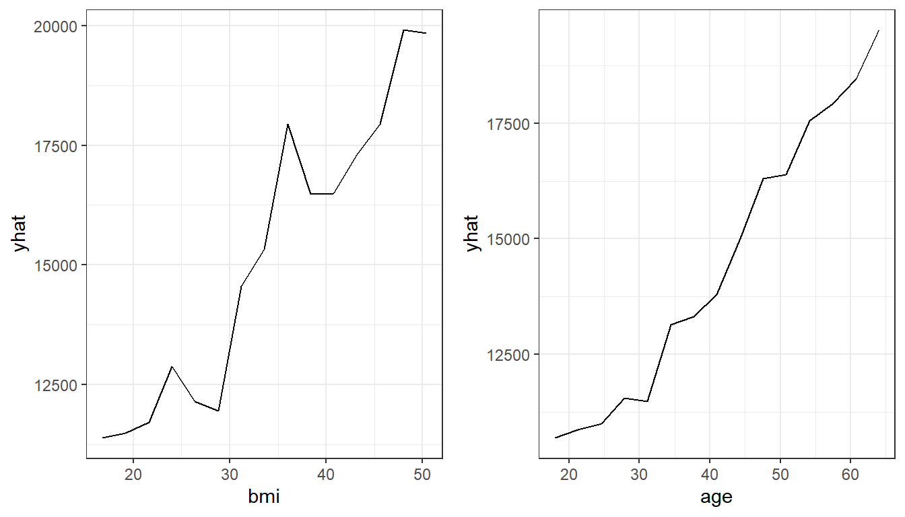

---
output:
  html_document: default
  pdf_document: default
---


# Tree-based models

## Decision Trees

### Model form

Decision trees can be used for either classification or regression problems.  The model structure is a series of yes/no questions.  Depending on how each observation answers these questions, a prediction is made.

The below example shows how a single tree can predict health claims.

- For non-smokers, the predicted annual claims are 8,434.  This represents 80% of the observations
- For smokers with a `bmi` of less than 30, the predicted annual claims are 21,000.  10% of patients fall into this bucket.
- For smokers with a `bmi` of more than 30, the prediction is 42,000.  This bucket accounts for 11% of patients.



We can cut the data set up into these groups and look at the claim costs.  From this grouping, we can see that `smoker` is the most important variable as the difference in average claims is about 20,000.


|smoker |bmi_30    |mean_claims | percent|
|:------|:---------|:-----------|-------:|
|no     |bmi < 30  |$7,286.00   |    0.41|
|no     |bmi >= 30 |$9,466.15   |    0.38|
|yes    |bmi < 30  |$22,742.94  |    0.09|
|yes    |bmi >= 30 |$42,891.38  |    0.12|

This was a very simple example because there were only two variables.  If we have more variables, the tree will get large very quickly.  This will result in overfitting; there will be good performance on the training data but poor performance on the test data.

The step-by-step process of building a tree is

**Step 1: Choose a variable at random.**  

This could be any variable in `age`, `children`, `charges`, `sex`, `smoker`, `age_bucket`, `bmi`, or `region`.

**Step 2: Find the split point which best seperates observations out based on the value of $y$.  A good split is one where the $y$'s are very different. * **

In this case, `smoker` was chosen.  Then we can only split this in one way: `smoker = 1` or `smoker = 0`.

Then for each of these groups, smokers and non-smokers, choose another variable at random.  In this case, for no-smokers, `age` was chosen.  To find the best cut point of `age`, look at all possible age cut points from 18, 19, 20, 21, ..., 64 and choose the one which best separates the data.

There are three ways of deciding where to split

- *Entropy* (aka, information gain)
- *Gini*
- *Classification error*

Of these, only the first two are commonly used.  The exam is not going to ask you to calculate either of these.  Just know that neither method will work better on all data sets, and so the best practice is to test both and compare the performance. 

**Step 3: Continue doing this until a stopping criteria is reached.  For example, the minimum number of observations is 5 or less.** 

As you can see, this results in a very deep tree.


```r
tree <- rpart(formula = charges ~  ., data = health_insurance,
              control = rpart.control(cp = 0.003))
rpart.plot(tree, type = 3)
```


**Step 4: Apply cost comlexity pruning to simplify the tree**

Intuitively, we know that the above model would perform poorly due to overfitting.  We want to make it simpler by removing nodes.  This is very similar to how in linear models we reduce complexity by reducing the number of coefficients.

A measure of the depth of the tree is the *complexity*.  A simple way of measuring this from the number of terminal nodes, called $|T|$.  This is similar to the "degrees of freedom" in a linear model.  In the above example, $|T| = 8$.  The amount of penalization is controlled by $\alpha$.  This is very similar to $\lambda$ in the Lasso.

Intuitively, merely only looking at the number of nodes by itself is too simple because not all data sets will have the same characteristics such as $n$, $p$, the number of categorical variables, correlations between variables, and so fourth.  In addition, if we just looked at the error (squared error in this case) we would overfit very easily.  To address this issue, we use a cost function which takes into account the error as well as $|T|$.

To calculate the cost of a tree, number the terminal nodes from $1$ to $|T|$, and let the set of observations that fall into the $mth$ bucket be $R_m$.  Then add up the squared error over all terminal nodes to the penalty term.

$$
\text{Cost}_\alpha(T) = \sum_{m=1}^{|T|} \sum_{R_m}(y_i - \hat{y}_{Rm})^2 + \alpha |T|
$$


**Step 5: Use cross-validation to select the best alpha**

The cost is controlled by the `CP` parameter.  In the above example, did you notice the line `rpart.control(cp = 0.003)`?  This is telling `rpart` to continue growing the tree until the CP reaches 0.003.  At each subtree, we can measure the cost `CP` as well as the cross-validation error `xerror`.

This is stored in the `cptable` 


```r
tree <- rpart(formula = charges ~  ., data = health_insurance,
              control = rpart.control(cp = 0.0001))
cost <- tree$cptable %>% 
  as_tibble() %>% 
  select(nsplit, CP, xerror) 

cost %>% head()
```

```
## # A tibble: 6 x 3
##   nsplit      CP xerror
##    <dbl>   <dbl>  <dbl>
## 1      0 0.620    1.00 
## 2      1 0.144    0.383
## 3      2 0.0637   0.240
## 4      3 0.00967  0.180
## 5      4 0.00784  0.176
## 6      5 0.00712  0.172
```

As more splits are added, the cost continues to decrease, reaches a minimum, and then begins to increase.  



To optimize performance, choose the number of splits which has the lowest error.  Often, though, the goal of using a decision tree is to create a simple model.  In this case, we can err or the side of a lower `nsplit` so that the tree is shorter and more interpretable.  All of the questions on so far have only used decision trees for interpretability, and a different model method has been used when predictive power is needed.

Once we have selected $\alpha$, the tree is pruned.  Sometimes the CP with the lowest error has a large number of splits, such as the case is here.


```r
tree$cptable %>% 
  as_tibble() %>% 
  select(nsplit, CP, xerror) %>% 
  arrange(xerror) %>% 
  head()
```

```
## # A tibble: 6 x 3
##   nsplit       CP xerror
##    <dbl>    <dbl>  <dbl>
## 1     19 0.000837  0.152
## 2     22 0.000759  0.152
## 3     18 0.000910  0.153
## 4     15 0.00116   0.153
## 5     16 0.00105   0.153
## 6     17 0.000913  0.153
```

The SOA will give you code to find the lowest CP value such as below.  This may or may not be useful depending on if they are asking for predictive performance or interpretability.


```r
pruned_tree <- prune(tree,
                     cp = tree$cptable[which.min(tree$cptable[, "xerror"]), "CP"])
```

To make a simple tree, there are a few options

- Set the maximum depth of a tree with `maxdepth`
- Manually set `cp` to be higher
- Use fewer input variables and avoid categories with many levels
- Force a high number of minimum observations per terminal node with `minbucket`

For instance, using these suggestions allows for a simpler tree to be fit.


```r
library(caret)
set.seed(42)
index <- createDataPartition(y = health_insurance$charges, 
                             p = 0.8, list = F)
train <- health_insurance %>% slice(index)
test <- health_insurance %>% slice(-index)

simple_tree <- rpart(formula = charges ~  ., 
              data = train,
              control = rpart.control(cp = 0.0001, 
                                      minbucket = 200,
                                      maxdepth = 10))
rpart.plot(simple_tree, type = 3)
```


We evaluate the performance on the test set.  Because the target variable `charges` is highly skewed, we use the Root Mean Squared Log Error (RMSLE).  We see that the complex tree has the best (lowest) error, but also has 8 terminal nodes.  The simple tree with only three terminal nodes has worse (higher) error, but this is still an improvement over the mean prediction.


```r
tree_pred <- predict(tree, test)
simple_tree_pred <- predict(simple_tree, test)

get_rmsle <- function(y, y_hat){
  sqrt(mean((log(y) - log(y_hat))^2))
}

get_rmsle(test$charges, tree_pred)
```

```
## [1] 0.3920546
```

```r
get_rmsle(test$charges, simple_tree_pred)
```

```
## [1] 0.5678457
```

```r
get_rmsle(test$charges, mean(train$charges))
```

```
## [1] 0.9996513
```


### Advantages and disadvantages

**Advantages**

- Easy to interpret
- Captures interaction effects
- Captures non-linearities
- Handles continuous and categorical data
- Handles missing values

**Disadvantages**

- Is a “weak learner” because of low predictive power
- Does not work on small data sets
- Is often a simplification of the underlying process because all observations at terminal nodes have equal predicted values
- Is biased towards selecting high-cardinality features because more possible split points for these features tend to lead to overfitting
- High variance (which can be alleviated with stricter parameters) leads the “easy to interpret results” to change upon retraining
Unable to predict beyond the range of the training data for regression (because each predicted value is an average of training samples)

| Readings |  | 
|-------|---------|
| ISLR 8.1.1 Basics of Decision Trees  | |
| ISLR 8.1.2 Classification Trees|  |
| [rpart Documentation (Optional)](https://cran.r-project.org/web/packages/rpart/vignettes/longintro.pdf) ||

## Ensemble learning

The "wisdom of crowds" says that often many are smater than the few.  In the context of modeling, the models which we have looked at so far have been single guesses; however, often the underlying process is more complex than any single model can explain.  If we build separate models and then combine them, known as *ensembling*, performance can be improved.  Instead of trying to create a single perfect model, many simple models, known as *weak learners* are combined into a *meta-model*.

The two main ways that models are combined are through *bagging* and *boosting*.

### Bagging

To start, we create many "copies" of the training data by sampling with replacement.  Then we fit a simple model, typically a decision tree or linear model, to each of the data sets.  Because each model is looking at different areas of the data, the predictions are different.  The final model is a weighted average of each of the individual models.

### Boosting

Boosting always uses the original training data and iteratively fits models to the error of the prior models.  These weak learners are ineffective by themselves but powerful when added together.  Unlike with bagging, the computer must train these weak learners *sequentially* instead of in parallel.

## Random Forests

### Model form

A random forest is the most common example of bagging.  As the name implies, a forest is made up of *trees*.  Seperate trees are fit to sampled datasets.  For random forests, there is one minor modification: in order to make each model even more different, each tree selects a *random subset of variables*.

1. Assume that the underlying process, $Y$, has some signal within the data $\mathbf{X}$.
2. Introduce randomness (variance) to capture the signal.
3. Remove the variance by taking an average.

When using only a single tree, there can only be as many predictions as there are terminal nodes.  In a random forest, predictions can be more granular due to the contribution of each of the trees.

The below graph illustrates this.  A single tree (left) has stair-like, step-wise predictions whereas a random forest is free to predict any value.  The color represents the predicted value (yellow = highest, black = lowest).


Unlike decision trees, random forest trees do not need to be pruned.  This is because overfitting is less of a problem: if one tree overfits, there are other trees which overfit in other areas to compensate.  

In most applications, only the `mtry` parameter, which controls how many variables to consider at each split, needs to be tuned.  Tuning the `ntrees` parameter is not required; however, the soa may still ask you to.

### Example

Using the basic `randomForest` package we fit a model with 500 trees. 

This expects only numeric values.  We create dummy (indicator) columns. 


```r
rf_data <- health_insurance %>% 
  sample_frac(0.2) %>% 
  mutate(sex = ifelse(sex == "male", 1, 0),
         smoker = ifelse(smoker == "yes", 1, 0),
         region_ne = ifelse(region == "northeast", 1,0),
         region_nw = ifelse(region == "northwest", 1,0),
         region_se = ifelse(region == "southeast", 1,0),
         region_sw = ifelse(region == "southwest", 1,0)) %>% 
  select(-region)
rf_data %>% glimpse(50)
```

```
## Observations: 268
## Variables: 10
## $ age       <dbl> 42, 44, 31, 36, 64, 28, 45,...
## $ sex       <dbl> 1, 1, 1, 1, 1, 0, 1, 1, 0, ...
## $ bmi       <dbl> 26.125, 39.520, 27.645, 34....
## $ children  <dbl> 2, 0, 2, 2, 0, 3, 0, 0, 0, ...
## $ smoker    <dbl> 0, 0, 0, 0, 0, 0, 0, 0, 1, ...
## $ charges   <dbl> 7729.646, 6948.701, 5031.27...
## $ region_ne <dbl> 1, 0, 1, 0, 1, 0, 0, 0, 0, ...
## $ region_nw <dbl> 0, 1, 0, 0, 0, 1, 1, 0, 1, ...
## $ region_se <dbl> 0, 0, 0, 1, 0, 0, 0, 1, 0, ...
## $ region_sw <dbl> 0, 0, 0, 0, 0, 0, 0, 0, 0, ...
```


```r
library(caret)
set.seed(42)
index <- createDataPartition(y = rf_data$charges, 
                             p = 0.8, list = F)
train <- rf_data %>% slice(index)
test <- rf_data %>% slice(-index)
```


```r
rf <- randomForest(charges ~ ., data = train, ntree = 400)
plot(rf)
```



We again use RMSLE.  This is lower (better) than a model that uses the average as a baseline.


```r
pred <- predict(rf, test)
get_rmsle <- function(y, y_hat){
  sqrt(mean((log(y) - log(y_hat))^2))
}

get_rmsle(test$charges, pred)
```

```
## [1] 0.5252518
```

```r
get_rmsle(test$charges, mean(train$charges))
```

```
## [1] 1.118947
```

### Variable Importance

*Variable importance* is a way of measuring how each variable contributes to overall model.  For single decision trees, if a variable was "higher" up in the tree, then this variable would have greater influence.  Statistically, there are two ways of measuring this:

1) Look at the reduction in error when a the variable is randomly permuted verses using the actual values.  This is done with `type = 1`.

2) Use the total decrease in node impurities from splitting on the variable, averaged over all trees.  For classification, the node impurity is measured by the Gini index; for regression, it is measured by the residual sum of squares $\text{RSS}$.  This is `type = 2`.

`smoker`, `bmi`, and `age` are the most importance predictors of charges. As you can imagine, variable importance is a highly useful tool for building models.  We could use this to test out newly engineered features, or perform feature selection by taking the top-n features and use them in a different model.  Random forests can handle very high dimensional data which allows for many tests to be run at once. 


```r
varImpPlot(x = rf)
```



### Partial dependence

We know which variables are important, but what about the direction of the change?  In a linear model we would be able to just look at the sign of the coefficient.  In tree-based models, we have a tool called *partial dependence*.  This attempts to measure the change in the predicted value by taking the average $\hat{\mathbf{y}}$ after removing the effects of all other predictors.

Although this is commonly used for trees, this approach is model-agnostic in that any model could be used.

Take a model of two predictors, $\hat{\mathbf{y}} = f(\mathbf{X}_1, \mathbf{X_2})$.  For simplicity, say that $f(x_1, x_2) = 2x_1 + 3x_2$. 

The data looks like this


```r
df <- tibble(x1 = c(1,1,2,2), x2 = c(3,4,5,6)) %>% 
  mutate(f = 2*x1 + 3*x2)
df
```

```
## # A tibble: 4 x 3
##      x1    x2     f
##   <dbl> <dbl> <dbl>
## 1     1     3    11
## 2     1     4    14
## 3     2     5    19
## 4     2     6    22
```

Here is the partial dependence of `x1` on to `f`.  


```r
df %>% group_by(x1) %>% summarise(f = mean(f))
```

```
## # A tibble: 2 x 2
##      x1     f
##   <dbl> <dbl>
## 1     1  12.5
## 2     2  20.5
```

This method of using the mean is know as the *Monte Carlo* method.  There are other methods for partial dependence that are not on the syllabus.

For the RandomForest, this is done with `pdp::partial()`.


```r
library(pdp)
bmi <- pdp::partial(rf, pred.var = "bmi", 
                    grid.resolution = 15) %>% 
  autoplot() + theme_bw()
age <- pdp::partial(rf, pred.var = "age", 
                    grid.resolution = 15) %>% 
  autoplot() + theme_bw()

ggarrange(bmi, age)
```

<div class="figure">

<p class="caption">(\#fig:unnamed-chunk-19)Partial Dependence</p>
</div>

### Advantages and disadvantages

**Advantages**

- Resilient to overfitting due to bagging 
- Only one parameter to tune (mtry, the number of features considered at each split)
- Very good a multi-class prediction
- Nonlinearities
- Interaction effects
- Handles missing data
- Deals with unbalanced after over/undersampling

**Disadvantages**

- Does not work on small data sets
- Weaker performance than other methods (GBM, NN)
- Unable to predict beyond training data for regression

| Readings |  | 
|-------|---------|
| ISLR 8.2.1 Bagging  | |
| ISLR 8.1.2 Random Forests|  |

## Gradient Boosted Trees

Another ensemble learning method is *gradient boosting*, also known as the Gradient Boosted Machine (GBM).  Although this is unlikely to get significant attention on the PA exam due to the complexity, this is the most widely-used and powerful machine learning algorithms that are in use today.

We start with an initial model, which is just a constant prediction of the mean.

$$f = f_0(\mathbf{x_i}) = \frac{1}{n}\sum_{i=1}^ny_i$$

Then we update the target (what the model is predicting) by subtracting off the previously predicted value.  

$$ \hat{y_i} \leftarrow y_i - f_0(\mathbf{x_i})$$

This $\hat{y_i}$ is called the *residual*.  In our example, instead of predicting `charges`, this would be predicting the residual of $\text{charges}_i - \text{Mean}(\text{charges})$.  We now use this model for the residuals to update the prediction.

If we updated each prediction with the prior residual directly, the algorithm would be unstable.  To make this process more gradual, we use a *learning rate* parameter.

At step 2, we have

$$f = f_0 + \alpha f_1$$

Then we go back and fit another weak learner to this residual and repeat.

$$f = f_0 + \alpha f_1 + \alpha f_2$$

We then iterate through this process hundreds or thousands of times, slowly improving the prediction.

Because each new tree is fit to *residuals* instead of the response itself, the process continuously improves the prediction.  As the prediction improves, the residuals get smaller and smaller.  In random forests, or other bagging algorithms, the model performance is more limited by the individual trees because each only contributes to the overall average.  The name is *gradient boosting* because the residuals are an approximation of the gradient, and gradient descent is how the loss functions are optimized.

Similarly to how GLMs can be used for classification problems through a logit transform (aka logistic regression), GBMs can also be used for classification.

### Parameters

For random forests, the individual tree parameters do not get tuned.  For GBMs, however, these parameters can make a significant difference in model performance. 

**Boosting parameters:**

- `n.trees`: Integer specifying the total number of trees to fit. This is equivalent to the number of iterations and the number of basis functions in the additive expansion. Default is 100.

- `shrinkage`: a shrinkage parameter applied to each tree in the expansion. Also known as the learning rate or step-size reduction; 0.001 to 0.1 usually work, but a smaller learning rate typically requires more trees. Default is 0.1.

**Tree parameters:**

- `interaction.depth`: Integer specifying the maximum depth of each tree (i.e., the highest level of variable interactions allowed). A value of 1 implies an additive model, a value of 2 implies a model with up to 2-way interactions, etc. Default is 1.

- `n.minobsinnode`: Integer specifying the minimum number of observations in the terminal nodes of the trees. Note that this is the actual number of observations, not the total weight.

GBMs are easy to overfit, and the parameters need to be carefully tuned using cross-validation.  In the Examples section we go through how to do this.

>**Tip:** Whenever fitting a model, use `?model_name` to get the documentation.  The parameters below are from `?gbm`.


### Example

We fit a gbm below without tuning the parameters for the sake of example.  


```r
library(gbm)
gbm <- gbm(charges ~ ., data = train,
           n.trees = 100,
           interaction.depth = 2,
           n.minobsinnode = 50,
           shrinkage = 0.1)
```

```
## Distribution not specified, assuming gaussian ...
```

```r
pred <- predict(gbm, test, n.trees = 100)

get_rmsle(test$charges, pred)
```

```
## [1] 1.052716
```

```r
get_rmsle(test$charges, mean(train$charges))
```

```
## [1] 1.118947
```

### Advantages and disadvantages

This exam covers the basics of GBMs.  There are many variations of GBMs not covered in detail such as `xgboost`.

**Advantages**

- High prediction accuracy
- Shown to work empirically well on many types of problems
- Nonlinearities, interaction effects, resilient to outliers, corrects for missing values
- Deals with class imbalance directly by weighting observations

**Disadvantages**

- Requires large sample size
- Longer training time
- Does not detect linear combinations of features.  These must be engineered
Can overfit if not tuned correctly

| Readings |  | 
|-------|---------|
| ISLR 8.2.3 Boosting  | |


## Exercises


```r
library(ExamPAData)
library(tidyverse)
```


Run this code on your computer to answer these exercises.

### 1. RF with `randomForest`

(Part 1 of 2)

The below code is set up to fit a random forest to the `soa_mortality` data set to predict `actual_cnt`.

There is a problem: all of the predictions are coming out to be 1.  Find out why this is happening and fix it.


```r
set.seed(42)
#When writing this book, only 5% of the records were used so that the code runs faster.
#Increase this sampling if running this on your machine.
df <- soa_mortality %>% 
  sample_frac(0.05) %>% #20% sample
  mutate(target = as.factor(ifelse(actual_cnt == 0, 1, 0))) %>% 
  select(target, prodcat, distchan, smoker, sex, issage, uwkey) %>% 
  mutate_if(is.character, ~as.factor(.x))

#check that the target has 0's and 1's
df %>% count(target)
```


```r
library(caret)
library(randomForest)
index <- createDataPartition(y = df$target, p = 0.8, list = F)

train <- df %>% slice(index)
test <- df %>% slice(-index)

k = 0.5
cutoff=c(k,1-k) 

model <- randomForest(
  formula = target ~ ., 
  data = train,
  ntree = 100,
  cutoff = cutoff
  )

pred <- predict(model, test)
confusionMatrix(pred, test$target)
```

(Part 2 of 2)

Downsample the majority class and refit the model, and then choose between the original data and the downsampled data based on the model performance.  Use your own judgement when choosing how to evaluate the model based on accuracy, sensitivity, specificity, and Kappa.


```r
down_train <- downSample(x = train %>% select(-target),
                         y = train$target)

down_test <- downSample(x = test %>% select(-target),
                         y = test$target)

down_train %>% count(Class)
```


```r
model <- randomForest(
  formula = Class ~ ., 
  data = down_train,
  ntree = 100,
  cutoff = cutoff
  )

down_pred <- predict(model, down_test)
confusionMatrix(down_pred, down_test$Class)
```

Now up-sample the minority class and repeat the same procedure.


```r
up_train <- upSample(x = train %>% select(-target),
                         y = train$target)

up_test <- upSample(x = test %>% select(-target),
                         y = test$target)

up_train %>% count(Class)
```


```r
model <- randomForest(
  formula = Class ~ ., 
  data = up_train,
  ntree = 100,
  cutoff = cutoff
  )

up_pred <- predict(model, up_test)
confusionMatrix(up_pred, up_test$Class)
```

### 2. RF tuning with `caret`

The best practice of tuning a model is with cross-validation.  This can only be done in the `caret` library.  If the SOA asks you to use `caret`, they will likely ask you a question related to cross validation as below.

An actuary has trained a predictive model and chosen the best hyperparameters, cleaned the data, and performed feature engineering.  They have one problem, however: the error on the training data is far lower than on new, unseen test data.  Read the code below and determine their problem.  Find a way to lower the error on the test data *without changing the model or the data.*  Explain the rational behind your method.


```r
set.seed(42)
#Take only 250 records 
#Uncomment this when completing this exercise
data <- health_insurance %>% sample_n(250) 

index <- createDataPartition(
  y = data$charges, p = 0.8, list = F) %>% 
  as.numeric()
train <-  health_insurance %>% slice(index)
test <- health_insurance %>% slice(-index)

control <- trainControl(
  method='boot', 
  number=2, 
  p = 0.2)

tunegrid <- expand.grid(.mtry=c(1,3,5))
rf <- train(charges ~ .,
            data = train,
            method='rf', 
            tuneGrid=tunegrid, 
            trControl=control)

pred_train <- predict(rf, train)
pred_test <- predict(rf, test)

get_rmse <- function(y, y_hat){
  sqrt(mean((y - y_hat)^2))
}

get_rmse(pred_train, train$charges)
get_rmse(pred_test, test$charges)
```

### 3. Tuning a GBM with `caret`

If the SOA asks you to tune a GBM, they will need to give you starting hyperparameters which are close to the "best" values due to how slow the Prometric computers are.  Another possibility is that they pre-train a GBM model object and ask that you use it.

This example looks at 135 combinations of hyper parameters.


```r
set.seed(42)
index <- createDataPartition(y = health_insurance$charges, 
                             p = 0.8, list = F)
#To make this run faster, only take 50% sample
df <- health_insurance %>% sample_frac(0.50) 
train <- df %>% slice(index) 
test <- df %>% sample_frac(0.05)%>% slice(-index)

tunegrid <- expand.grid(
    interaction.depth = c(1,5, 10),
    n.trees = c(50, 100, 200, 300, 400), 
    shrinkage = c(0.5, 0.1, 0.0001),
    n.minobsinnode = c(5, 30, 100)
    )
nrow(tunegrid)

control <- trainControl(
  method='repeatedcv', 
  number=5, 
  p = 0.8)
```


```r
gbm <- train(charges ~ .,
            data = train,
            method='gbm', 
            tuneGrid=tunegrid, 
            trControl=control,
            #Show detailed output
            verbose = FALSE
            )
```

The output shows the RMSE for each of the 135 models tested.

(Part 1 of 3)

Identify the hyperpameter combination that has the lowest training error.

(Part 2 of 3)

2. Suppose that the optimization measure was RMSE.  The below table shows the results from three models.  Explain why some sets of parameters have better RMSE than the others.  


```r
results <- gbm$results %>% arrange(RMSE)
top_result <- results %>% slice(1)%>% mutate(param_rank = 1)
tenth_result <- results %>% slice(10)%>% mutate(param_rank = 10)
twenty_seventh_result <- results %>% slice(135)%>% mutate(param_rank = 135)

rbind(top_result, tenth_result, twenty_seventh_result) %>% 
  select(param_rank, 1:5)
```

3. The partial dependence of `bmi` onto `charges` makes it appear as if `charges` increases monotonically as `bmi` increases.


```r
pdp::partial(gbm, pred.var = "bmi", grid.resolution = 15, plot = T)
```

However, when we add in the `ice` curves, we see that there is something else going on.  Explain this graph.  Why are there two groups of lines?


```r
pdp::partial(gbm, pred.var = "bmi", grid.resolution = 20, plot = T, ice = T, alpha = 0.1, palette = "viridis")
```

