---
output:
  html_document: default
  pdf_document: default
---

# Unsupervised Learning

Up to this point we have been trying to predict something.  We use data $X$ to predict an unknown $Y$, which is a number in the case of regression and a category in the case of classification.  These problems are known as *supvervised* because we are "supervising" how the model learns by giving it a target.

Here is an easy way to remember this: If you are in kindergarden class, and the teacher provides cards with pictures and words, and then asks each kid to look at the picture and then say the word, this is supervised learning.  The label is the name of the picture, and the data is the picture itself.  Instead, if the teacher gives out finger paints and says "express yourself!", then this is *unsupervised learning*.  There is no label but only data.

## Principal Componant Analysis (PCA)

Often there are a lot of columns in the data that contain redundant information.  For example, if your data consists of city traffic, such as (1) the number of cars on the road, (2) number of taxis, (3) number of pedestrians, and (4) number of Ubers, then knowing any one of these values will tell you about how busy the given road is.  If there are a lot of Ubers, then there are probably also a lot of Taxis.  Intuitively, we probably don't need four variables to measure this info and we could have a single variable called "traffic level". This would be reducing the dimension from 4 to 1.

PCA is a dimensionality reduction method which reduces the number of variables needed to retain most of the information in a matrix.  If there are predictor variables $X_1, X_2, X_3, X_4, X5$, then running PCA and choosing the first three Principal Components (PCs) will reduce the dimension from 5 to 3.


Each PC is a linear combination of the original $X$s.  For example, PC1 might be

$$PC_1 = 0.2X_1 + 0.3X_2 - 0.2X_3 + 0X_5 + 0.3X_5$$
The weights here are also called "loadings" or "rotations", and are (0.2, 0.3, -0.2, 0, 0.3).  Each of the PCs can be interpreted as explaining part of the data.  In the traffic example, PC1 might explain the traffic level, PC2 the weather, and PC3 the time of day.

| Readings |  | 
|-------|---------|
| ISLR 10.2 Principal Component Analysis|  |
| ISLR 10.3 Clustering Methods|  |


### Example: PCA on US Arrests

In this example, we perform PCA on the `USArrests` data set, which is part of
the base `R` package. The rows of the data set contain the 50 states, in
alphabetical order:


```r
library(tidyverse)
states=row.names(USArrests)
states
```

```
##  [1] "Alabama"        "Alaska"         "Arizona"        "Arkansas"      
##  [5] "California"     "Colorado"       "Connecticut"    "Delaware"      
##  [9] "Florida"        "Georgia"        "Hawaii"         "Idaho"         
## [13] "Illinois"       "Indiana"        "Iowa"           "Kansas"        
## [17] "Kentucky"       "Louisiana"      "Maine"          "Maryland"      
## [21] "Massachusetts"  "Michigan"       "Minnesota"      "Mississippi"   
## [25] "Missouri"       "Montana"        "Nebraska"       "Nevada"        
## [29] "New Hampshire"  "New Jersey"     "New Mexico"     "New York"      
## [33] "North Carolina" "North Dakota"   "Ohio"           "Oklahoma"      
## [37] "Oregon"         "Pennsylvania"   "Rhode Island"   "South Carolina"
## [41] "South Dakota"   "Tennessee"      "Texas"          "Utah"          
## [45] "Vermont"        "Virginia"       "Washington"     "West Virginia" 
## [49] "Wisconsin"      "Wyoming"
```

The columns of the data set contain four variables relating to various crimes:


```r
glimpse(USArrests)
```

```
## Observations: 50
## Variables: 4
## $ Murder   <dbl> 13.2, 10.0, 8.1, 8.8, 9.0, 7.9, 3.3, 5.9, 15.4, 17.4, 5.3,...
## $ Assault  <int> 236, 263, 294, 190, 276, 204, 110, 238, 335, 211, 46, 120,...
## $ UrbanPop <int> 58, 48, 80, 50, 91, 78, 77, 72, 80, 60, 83, 54, 83, 65, 57...
## $ Rape     <dbl> 21.2, 44.5, 31.0, 19.5, 40.6, 38.7, 11.1, 15.8, 31.9, 25.8...
```

Let's start by taking a quick look at the column means of the data. 


```r
USArrests %>% summarise_all(mean)
```

```
##   Murder Assault UrbanPop   Rape
## 1  7.788  170.76    65.54 21.232
```

We see right away the the data have **vastly** different means. We can also examine the variances of the four variables.


```r
USArrests %>% summarise_all(var)
```

```
##     Murder  Assault UrbanPop     Rape
## 1 18.97047 6945.166 209.5188 87.72916
```

Not surprisingly, the variables also have vastly different variances: the
`UrbanPop` variable measures the percentage of the population in each state
living in an urban area, which is not a comparable number to the number
of crimes committeed in each state per 100,000 individuals. If we failed to scale the
variables before performing PCA, then most of the principal components
that we observed would be driven by the `Assault` variable, since it has by
far the largest mean and variance. 

Thus, it is important to standardize the
variables to have mean zero and standard deviation 1 before performing
PCA. We'll perform principal components analysis using the `prcomp()` function, which is one of several functions that perform PCA. By default, this centers the variables to have mean zero. By using the option `scale=TRUE`, we scale the variables to have standard
deviation 1:


```r
pca = prcomp(USArrests, scale=TRUE)
```

The output from `prcomp()` contains a number of useful quantities:


```r
names(pca)
```

```
## [1] "sdev"     "rotation" "center"   "scale"    "x"
```

The `center` and `scale` components correspond to the means and standard
deviations of the variables that were used for scaling prior to implementing
PCA:


```r
pca$center
```

```
##   Murder  Assault UrbanPop     Rape 
##    7.788  170.760   65.540   21.232
```

```r
pca$scale
```

```
##    Murder   Assault  UrbanPop      Rape 
##  4.355510 83.337661 14.474763  9.366385
```

The rotation matrix provides the principal component loadings; each column
of `pr.out\$rotation` contains the corresponding principal component
loading vector:


```r
pca$rotation
```

```
##                 PC1        PC2        PC3         PC4
## Murder   -0.5358995  0.4181809 -0.3412327  0.64922780
## Assault  -0.5831836  0.1879856 -0.2681484 -0.74340748
## UrbanPop -0.2781909 -0.8728062 -0.3780158  0.13387773
## Rape     -0.5434321 -0.1673186  0.8177779  0.08902432
```

We see that there are four distinct principal components. This is to be
expected because there are in general `min(n − 1, p)` informative principal
components in a data set with $n$ observations and $p$ variables.

Using the `prcomp()` function, we do not need to explicitly multiply the
data by the principal component loading vectors in order to obtain the
principal component score vectors. Rather the 50 × 4 matrix $x$ has as its
columns the principal component score vectors. That is, the $k^{th` column is
the $k^{th` principal component score vector. We'll take a look at the first few states:


```r
head(pca$x)
```

```
##                   PC1        PC2         PC3          PC4
## Alabama    -0.9756604  1.1220012 -0.43980366  0.154696581
## Alaska     -1.9305379  1.0624269  2.01950027 -0.434175454
## Arizona    -1.7454429 -0.7384595  0.05423025 -0.826264240
## Arkansas    0.1399989  1.1085423  0.11342217 -0.180973554
## California -2.4986128 -1.5274267  0.59254100 -0.338559240
## Colorado   -1.4993407 -0.9776297  1.08400162  0.001450164
```

We can plot the first two principal components using the `biplot()` function:


```r
biplot(pca, scale=0)
```

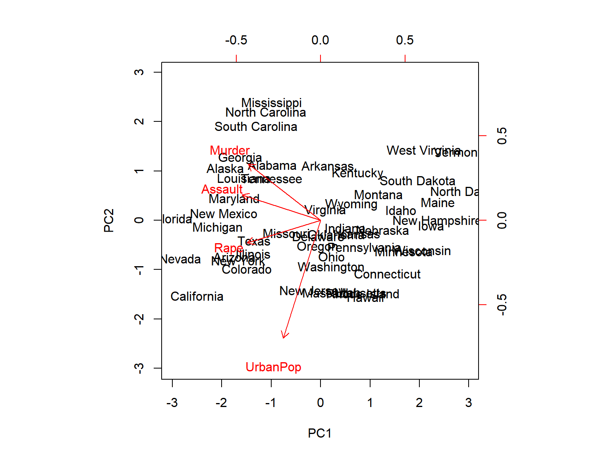

The `scale=0` argument to `biplot()` ensures that the arrows are scaled to
represent the loadings; other values for `scale` give slightly different biplots
with different interpretations.

The `prcomp()` function also outputs the standard deviation of each principal
component. We can access these standard deviations as follows:


```r
pca$sdev
```

```
## [1] 1.5748783 0.9948694 0.5971291 0.4164494
```

The variance explained by each principal component is obtained by squaring
these:


```r
pca_var=pca$sdev^2
pca_var
```

```
## [1] 2.4802416 0.9897652 0.3565632 0.1734301
```

To compute the proportion of variance explained by each principal component,
we simply divide the variance explained by each principal component
by the total variance explained by all four principal components:


```r
pve=pca_var/sum(pca_var)
pve
```

```
## [1] 0.62006039 0.24744129 0.08914080 0.04335752
```

We see that the first principal component explains 62.0% of the variance
in the data, the next principal component explains 24.7% of the variance,
and so forth. We can plot the PVE explained by each component as follows:


```r
plot(pve, xlab="Principal Component", ylab="Proportion of Variance Explained", ylim=c(0,1),type='b')
```

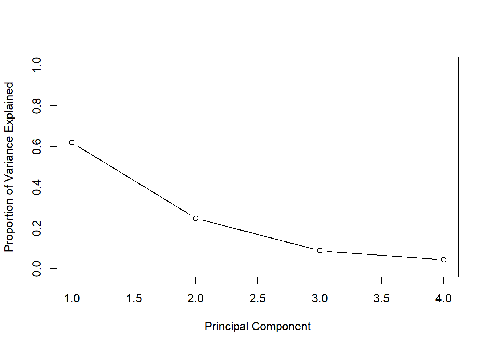

We can also use the function `cumsum()`, which computes the cumulative sum of the elements of a numeric vector, to plot the cumulative PVE:


```r
plot(cumsum(pve), xlab="Principal Component", ylab="Cumulative Proportion of Variance Explained", ylim=c(0,1),type='b')
```

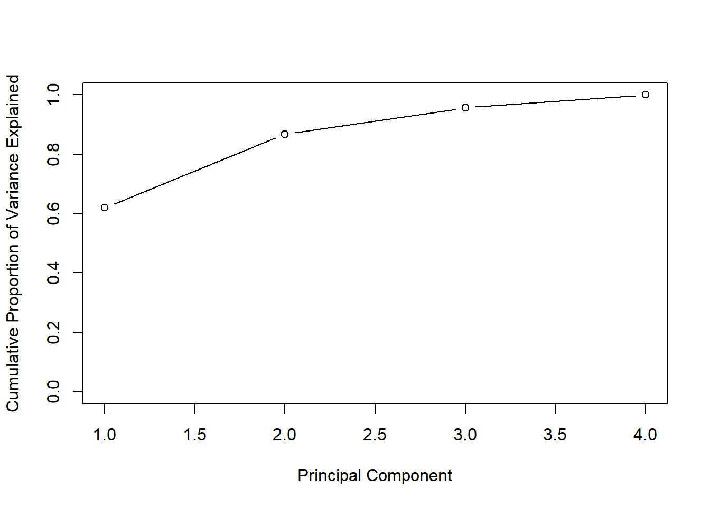

```r
a=c(1,2,8,-3)
cumsum(a)
```

```
## [1]  1  3 11  8
```

### Example: PCA on Cancel Cells

The data  `NCI60` contins expression levels of 6,830 genes from 64 cancel cell lines.  Cancer type is also recorded.


```r
library(ISLR)
nci_labs=NCI60$labs
nci_data=NCI60$data
```

We first perform PCA on the data after scaling the variables (genes) to
have standard deviation one, although one could reasonably argue that it
is better not to scale the genes:


```r
pca = prcomp(nci_data, scale=TRUE)
```

We now plot the first few principal component score vectors, in order to
visualize the data. The observations (cell lines) corresponding to a given
cancer type will be plotted in the same color, so that we can see to what
extent the observations within a cancer type are similar to each other. We
first create a simple function that assigns a distinct color to each element
of a numeric vector. The function will be used to assign a color to each of
the 64 cell lines, based on the cancer type to which it corresponds.
We'll make use of the `rainbow()` function, which takes as its argument a positive integer,
and returns a vector containing that number of distinct colors.


```r
Cols=function(vec){
    cols=rainbow(length(unique(vec)))
    return(cols[as.numeric(as.factor(vec))])
  }
```

We now can plot the principal component score vectors:


```r
par(mfrow=c(1,2))
plot(pca$x[,1:2], col=Cols(nci_labs), pch=19,xlab="Z1",ylab="Z2")
plot(pca$x[,c(1,3)], col=Cols(nci_labs), pch=19,xlab="Z1",ylab="Z3")
```

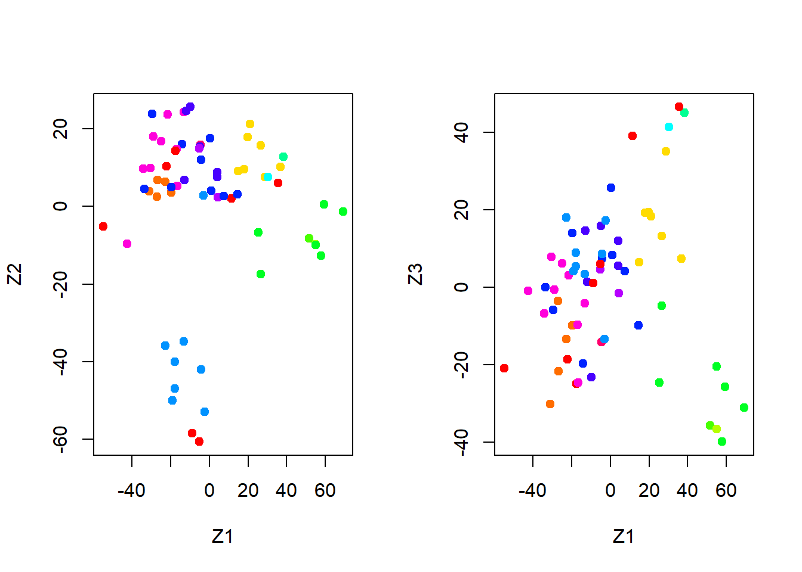

On the whole, cell lines corresponding to a single cancer type do tend to have similar values on the
first few principal component score vectors. This indicates that cell lines
from the same cancer type tend to have pretty similar gene expression
levels.

We can obtain a summary of the proportion of variance explained (PVE)
of the first few principal components using the `summary()` method for a
`prcomp` object:


```r
summary(pca)
```

```
## Importance of components:
##                            PC1      PC2      PC3      PC4      PC5      PC6
## Standard deviation     27.8535 21.48136 19.82046 17.03256 15.97181 15.72108
## Proportion of Variance  0.1136  0.06756  0.05752  0.04248  0.03735  0.03619
## Cumulative Proportion   0.1136  0.18115  0.23867  0.28115  0.31850  0.35468
##                             PC7      PC8      PC9     PC10     PC11     PC12
## Standard deviation     14.47145 13.54427 13.14400 12.73860 12.68672 12.15769
## Proportion of Variance  0.03066  0.02686  0.02529  0.02376  0.02357  0.02164
## Cumulative Proportion   0.38534  0.41220  0.43750  0.46126  0.48482  0.50646
##                            PC13     PC14     PC15     PC16     PC17     PC18
## Standard deviation     11.83019 11.62554 11.43779 11.00051 10.65666 10.48880
## Proportion of Variance  0.02049  0.01979  0.01915  0.01772  0.01663  0.01611
## Cumulative Proportion   0.52695  0.54674  0.56590  0.58361  0.60024  0.61635
##                            PC19    PC20     PC21    PC22    PC23    PC24
## Standard deviation     10.43518 10.3219 10.14608 10.0544 9.90265 9.64766
## Proportion of Variance  0.01594  0.0156  0.01507  0.0148 0.01436 0.01363
## Cumulative Proportion   0.63229  0.6479  0.66296  0.6778 0.69212 0.70575
##                           PC25    PC26    PC27   PC28    PC29    PC30    PC31
## Standard deviation     9.50764 9.33253 9.27320 9.0900 8.98117 8.75003 8.59962
## Proportion of Variance 0.01324 0.01275 0.01259 0.0121 0.01181 0.01121 0.01083
## Cumulative Proportion  0.71899 0.73174 0.74433 0.7564 0.76824 0.77945 0.79027
##                           PC32    PC33    PC34    PC35    PC36    PC37    PC38
## Standard deviation     8.44738 8.37305 8.21579 8.15731 7.97465 7.90446 7.82127
## Proportion of Variance 0.01045 0.01026 0.00988 0.00974 0.00931 0.00915 0.00896
## Cumulative Proportion  0.80072 0.81099 0.82087 0.83061 0.83992 0.84907 0.85803
##                           PC39    PC40    PC41   PC42    PC43   PC44    PC45
## Standard deviation     7.72156 7.58603 7.45619 7.3444 7.10449 7.0131 6.95839
## Proportion of Variance 0.00873 0.00843 0.00814 0.0079 0.00739 0.0072 0.00709
## Cumulative Proportion  0.86676 0.87518 0.88332 0.8912 0.89861 0.9058 0.91290
##                          PC46    PC47    PC48    PC49    PC50    PC51    PC52
## Standard deviation     6.8663 6.80744 6.64763 6.61607 6.40793 6.21984 6.20326
## Proportion of Variance 0.0069 0.00678 0.00647 0.00641 0.00601 0.00566 0.00563
## Cumulative Proportion  0.9198 0.92659 0.93306 0.93947 0.94548 0.95114 0.95678
##                           PC53    PC54    PC55    PC56    PC57   PC58    PC59
## Standard deviation     6.06706 5.91805 5.91233 5.73539 5.47261 5.2921 5.02117
## Proportion of Variance 0.00539 0.00513 0.00512 0.00482 0.00438 0.0041 0.00369
## Cumulative Proportion  0.96216 0.96729 0.97241 0.97723 0.98161 0.9857 0.98940
##                           PC60    PC61    PC62    PC63      PC64
## Standard deviation     4.68398 4.17567 4.08212 4.04124 2.148e-14
## Proportion of Variance 0.00321 0.00255 0.00244 0.00239 0.000e+00
## Cumulative Proportion  0.99262 0.99517 0.99761 1.00000 1.000e+00
```

Using the `plot()` function, we can also plot the variance explained by the
first few principal components:


```r
plot(pca)
```

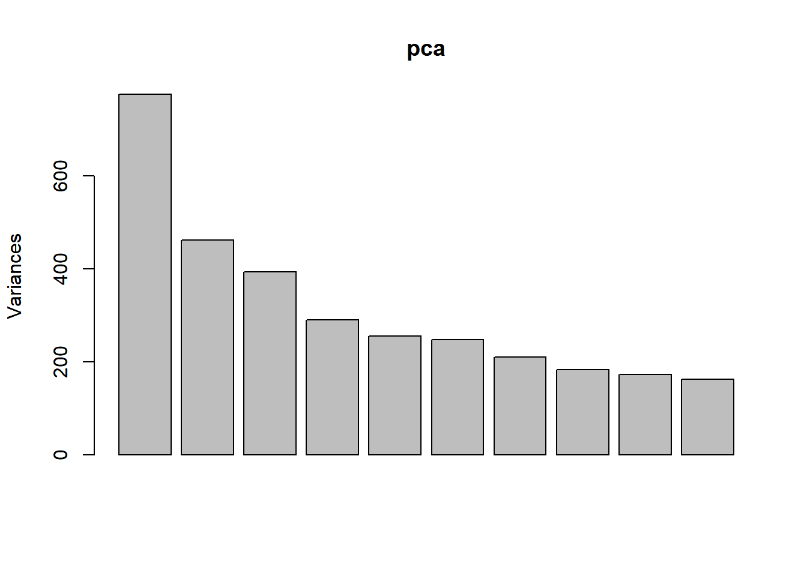

Note that the height of each bar in the bar plot is given by squaring the
corresponding element of `pr.out\$sdev`. However, it is generally more informative to
plot the PVE of each principal component (i.e. a **scree plot**) and the cumulative
PVE of each principal component. This can be done with just a
little tweaking:


```r
pve = 100*pca$sdev^2/sum(pca$sdev^2)
par(mfrow=c(1,2))
plot(pve,  type="o", ylab="PVE", xlab="Principal Component", col="blue")
plot(cumsum(pve), type="o", ylab="Cumulative PVE", xlab="Principal Component", col="brown3")
```

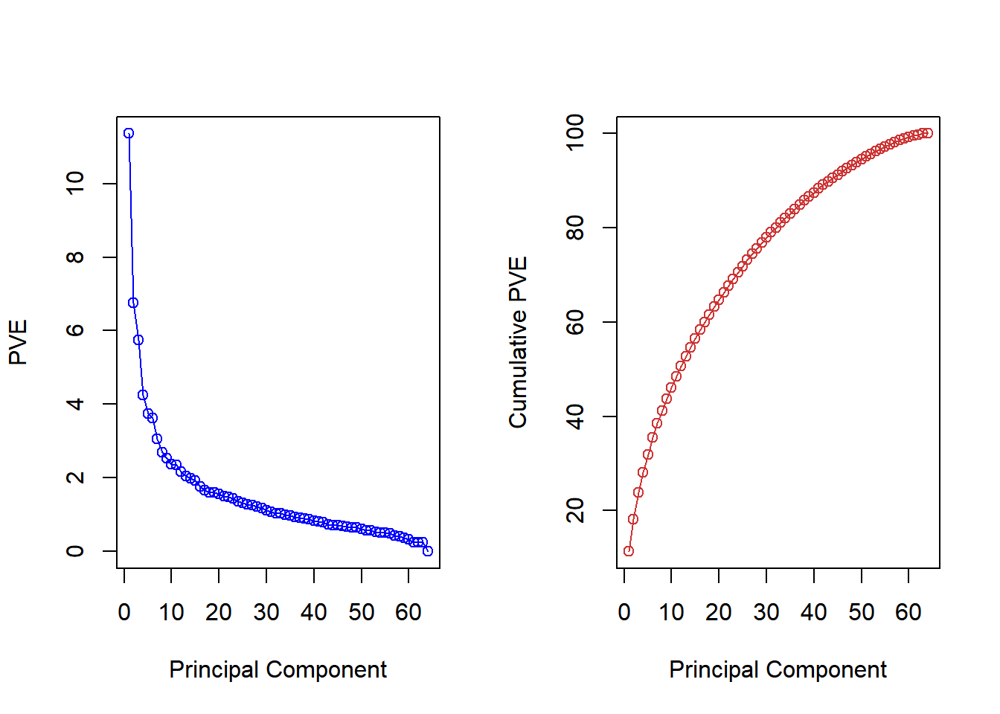

We see that together, the first seven principal components
explain around 40% of the variance in the data. This is not a huge amount
of the variance. However, looking at the scree plot, we see that while each
of the first seven principal components explain a substantial amount of
variance, there is a marked decrease in the variance explained by further
principal components. That is, there is an **elbow** in the plot after approximately
the seventh principal component. This suggests that there may
be little benefit to examining more than seven or so principal components
(phew! even examining seven principal components may be difficult).

## Clustering

Imagine that you are a large retailer interested in understanding the customer base. There may be several “types” of customers, such as those shopping for business with corporate accounts, those shopping for leisure, or debt-strapped grad students. Each of these customers would exhibit different behavior, and should be treated differently statistically. But how can a customer’s “type” be defined? Especially for large customer data sets in the millions, one can imagine how this problem can be challenging.

Clustering algorithms look for groups of observations which are similar to one another.  Because there is no target variable, measuring the quality of the "fit" is much more complicated.  There are many clustering algorithms, but this exam only focuses on the two that are most common.


### K-Means Clustering

Kmeans takes continuous data and assigns observations into k clusters, or groups. In the two-dimensional example, this is the same as drawing lines around points.  This consists of the following steps:

**a)** Start with two variables ($X_1$ on the X-axis, and $X_2$ on the Y-axis.)
**b)** Randomly assign cluster centers.
**c)** Put each point into the cluster that is closest.
**d) - f)** Move the cluster center to the mean of the points assigned to it and continue until the centers stop moving.
**g)** Repeated steps a) - f) a given number of times (controlled by `n.starts`).  This reduces the uncertainty from choosing the initial centers randomly.

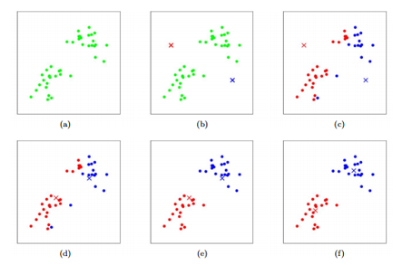

In `R`, the function `kmeans()` performs K-means clustering in R. We begin with
a simple simulated example in which there truly are two clusters in the
data: the first 25 observations have a mean shift relative to the next 25
observations.


```r
set.seed(2)
x = matrix(rnorm(50*2), ncol = 2)
x[1:25,1] = x[1:25,1]+3
x[1:25,2] = x[1:25,2]-4
```

We now perform K-means clustering with `K  =  2`:


```r
km_out = kmeans(x,2,nstart = 20)
```

The cluster assignments of the 50 observations are contained in
`km_out$cluster`:


```r
km_out$cluster
```

```
##  [1] 1 1 1 1 1 1 1 1 1 1 1 1 1 1 1 1 1 1 1 1 1 1 1 1 1 2 2 2 2 2 2 2 2 2 2 2 2 2
## [39] 2 2 2 2 2 2 2 2 2 2 2 2
```

The K-means clustering perfectly separated the observations into two clusters
even though we did not supply any group information to `kmeans()`. We
can plot the data, with each observation colored according to its cluster
assignment:


```r
plot(x, col = (km_out$cluster+1), main = "K-Means Clustering Results with K = 2", xlab = "", ylab = "", pch = 20, cex = 2)
```

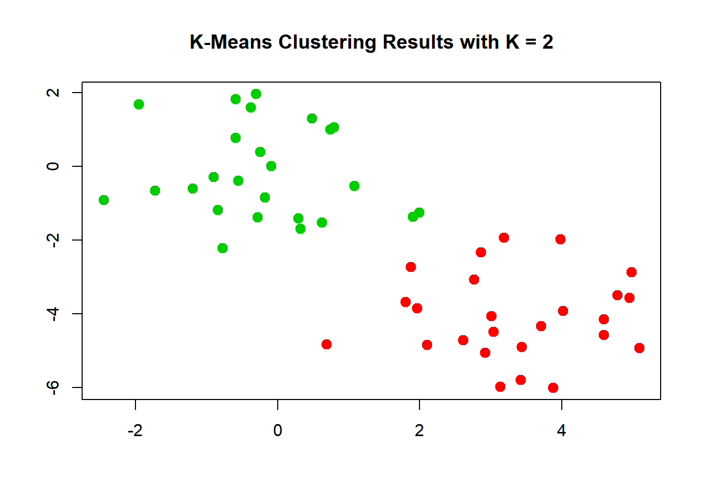

Here the observations can be easily plotted because they are two-dimensional.
If there were more than two variables then we could instead perform PCA
and plot the first two principal components score vectors.

In this example, we knew that there really were two clusters because
we generated the data. However, for real data, in general we do not know
the true number of clusters. We could instead have performed K-means
clustering on this example with `K  =  3`. If we do this, K-means clustering will split up the two "real" clusters, since it has no information about them:


```r
set.seed(4)
km_out = kmeans(x, 3, nstart = 20)
km_out
```

```
## K-means clustering with 3 clusters of sizes 17, 23, 10
## 
## Cluster means:
##         [,1]        [,2]
## 1  3.7789567 -4.56200798
## 2 -0.3820397 -0.08740753
## 3  2.3001545 -2.69622023
## 
## Clustering vector:
##  [1] 1 3 1 3 1 1 1 3 1 3 1 3 1 3 1 3 1 1 1 1 1 3 1 1 1 2 2 2 2 2 2 2 2 2 2 2 2 2
## [39] 2 2 2 2 2 3 2 3 2 2 2 2
## 
## Within cluster sum of squares by cluster:
## [1] 25.74089 52.67700 19.56137
##  (between_SS / total_SS =  79.3 %)
## 
## Available components:
## 
## [1] "cluster"      "centers"      "totss"        "withinss"     "tot.withinss"
## [6] "betweenss"    "size"         "iter"         "ifault"
```

```r
plot(x, col = (km_out$cluster+1), main = "K-Means Clustering Results with K = 3", xlab = "", ylab = "", pch = 20, cex = 2)
```

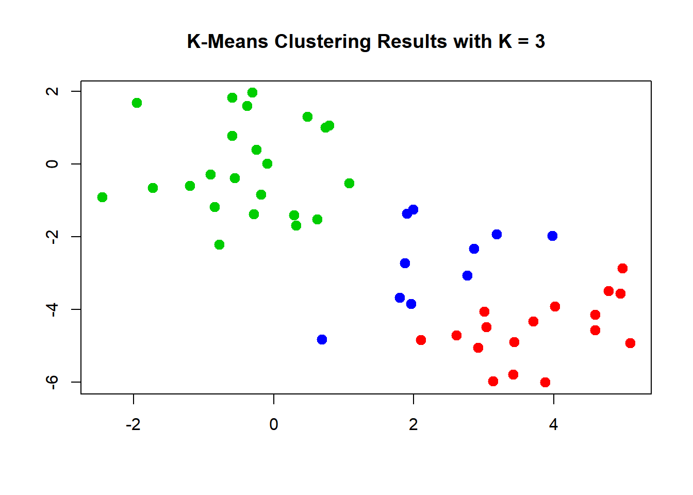

To run the `kmeans()` function in R with multiple initial cluster assignments,
we use the `nstart` argument. If a value of `nstart` greater than one
is used, then K-means clustering will be performed using multiple random
assignments, and the `kmeans()` function will
report only the best results. Here we compare using `nstart = 1`:


```r
set.seed(3)
km_out = kmeans(x, 3, nstart = 1)
km_out$tot.withinss
```

```
## [1] 97.97927
```

to `nstart = 20`:


```r
km_out = kmeans(x,3,nstart = 20)
km_out$tot.withinss
```

```
## [1] 97.97927
```

Note that `km_out\$tot.withinss` is the total within-cluster sum of squares,
which we seek to minimize by performing K-means clustering. The individual within-cluster sum-of-squares are contained in the
vector `km_out\$withinss`.

It is generally recommended to always run K-means clustering with a large
value of `nstart`, such as 20 or 50 to avoid getting stuck in an undesirable local
optimum.

When performing K-means clustering, in addition to using multiple initial
cluster assignments, it is also important to set a random seed using the
`set.seed()` function. This way, the initial cluster assignments can
be replicated, and the K-means output will be fully reproducible.

## Hierarchical Clustering

Kmeans required that we choose the number of clusters, k.  Hierarchical clustering is an alternative that does not require that we choose only one value of k.

The most common type of hieararchical clustering uses a *bottom-up* approach.  This starts with a single **observation** and then looks for others which are close and puts them into a cluster.  Then it looks for other **clusters** that are similar and groups these together into a **megacluster**.  It continues to do this until all observations are in the same group.

This is analyzed with a graph called a dendrogram (dendro = tree, gram = graph).  The height represents "distance", or how similar the clusters are to one another.  The clusters on the bottom, which are vertically close to one another, have similar data values; the clusters that are further apart vertically are less similar.

Choosing the value of the cutoff height changes the number of clusters that result.

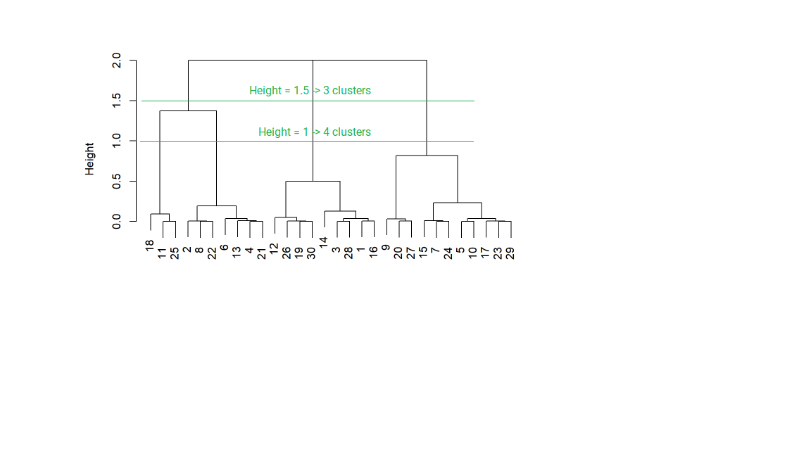

Certain data have a natural hiearchical structure.  For example, say that the variables are City, Town, State, Country, and Continent.  If we used hiearchical clustering, this pattern could be established even if we did not have labels for Cities, Towns, and so forth.

The `hclust()` function implements hierarchical clustering in R. In the following example we use the data from the previous section to plot the hierarchical
clustering dendrogram using complete, single, and average linkage clustering,
with Euclidean distance as the dissimilarity measure. We begin by
clustering observations using complete linkage. The `dist()` function is used
to compute the 50 $\times$ 50 inter-observation Euclidean distance matrix:


```r
hc_complete = hclust(dist(x), method = "complete")
```

We could just as easily perform hierarchical clustering with average or
single linkage instead:


```r
hc_average = hclust(dist(x), method = "average")
hc_single = hclust(dist(x), method = "single")
```

We can now plot the dendrograms obtained using the usual `plot()` function.
The numbers at the bottom of the plot identify each observation:


```r
par(mfrow = c(1,3))
plot(hc_complete,main = "Complete Linkage", xlab = "", sub = "", cex = .9)
plot(hc_average, main = "Average Linkage", xlab = "", sub = "", cex = .9)
plot(hc_single, main = "Single Linkage", xlab = "", sub = "", cex = .9)
```

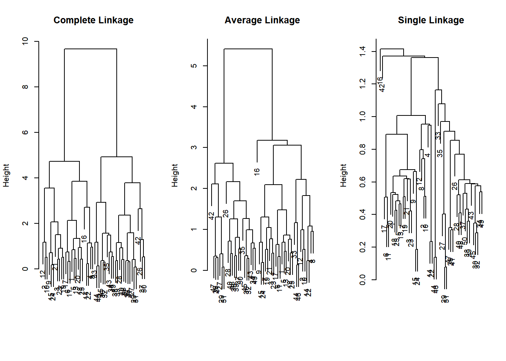

To determine the cluster labels for each observation associated with a
given cut of the dendrogram, we can use the `cutree()` function:


```r
cutree(hc_complete, 2)
```

```
##  [1] 1 1 1 1 1 1 1 1 1 1 1 1 1 1 1 1 1 1 1 1 1 1 1 1 1 2 2 2 2 2 2 2 2 2 2 2 2 2
## [39] 2 2 2 2 2 2 2 2 2 2 2 2
```

```r
cutree(hc_average, 2)
```

```
##  [1] 1 1 1 1 1 1 1 1 1 1 1 1 1 1 1 1 1 1 1 1 1 1 1 1 1 2 2 2 2 2 2 2 1 2 2 2 2 2
## [39] 2 2 2 2 2 1 2 1 2 2 2 2
```

```r
cutree(hc_single, 2)
```

```
##  [1] 1 1 1 1 1 1 1 1 1 1 1 1 1 1 1 2 1 1 1 1 1 1 1 1 1 1 1 1 1 1 1 1 1 1 1 1 1 1
## [39] 1 1 1 1 1 1 1 1 1 1 1 1
```

For this data, complete and average linkage generally separate the observations
into their correct groups. However, single linkage identifies one point
as belonging to its own cluster. A more sensible answer is obtained when
four clusters are selected, although there are still two singletons:


```r
cutree(hc_single, 4)
```

```
##  [1] 1 1 1 1 1 1 1 1 1 1 1 1 1 1 1 2 1 1 1 1 1 1 1 1 1 3 3 3 3 3 3 3 3 3 3 3 3 3
## [39] 3 3 3 4 3 3 3 3 3 3 3 3
```

To scale the variables before performing hierarchical clustering of the
observations, we can use the `scale()` function:


```r
xsc = scale(x)
plot(hclust(dist(xsc), method = "complete"), main = "Hierarchical Clustering with Scaled Features")
```


Correlation-based distance can be computed using the `as.dist()` function, which converts an arbitrary square symmetric matrix into a form that
the `hclust()` function recognizes as a distance matrix. However, this only
makes sense for data with **at least three features** since the absolute correlation
between any two observations with measurements on two features is
always 1. Let's generate and cluster a three-dimensional data set:


```r
x = matrix(rnorm(30*3), ncol = 3)
dd = as.dist(1-cor(t(x)))
plot(hclust(dd, method = "complete"), main = "Complete Linkage with Correlation-Based Distance", xlab = "", sub = "")
```


### Example: Clustering Cancel Cells

Unsupervised techniques are often used in the analysis of genomic data. In this example, we'll see how hierarchical and K-means clustering compare on the `NCI60` cancer cell line microarray data, which
consists of 6,830 gene expression measurements on 64 cancer cell lines:


```r
# The NCI60 data
library(ISLR)
nci_labels = NCI60$labs
nci_data = NCI60$data
```

Each cell line is labeled with a cancer type. We'll ignore the
cancer types in performing clustering, as these are unsupervised
techniques. After performing clustering, we'll use this column to see the extent to which these cancer types agree with the results of these
unsupervised techniques.

The data has 64 rows and 6,830 columns.


```r
dim(nci_data)
```

```
## [1]   64 6830
```

Let's take a look at the cancer types for the cell lines:


```r
table(nci_labels)
```

```
## nci_labels
##      BREAST         CNS       COLON K562A-repro K562B-repro    LEUKEMIA 
##           7           5           7           1           1           6 
## MCF7A-repro MCF7D-repro    MELANOMA       NSCLC     OVARIAN    PROSTATE 
##           1           1           8           9           6           2 
##       RENAL     UNKNOWN 
##           9           1
```

We now proceed to hierarchically cluster the cell lines in the `NCI60` data,
with the goal of finding out whether or not the observations cluster into
distinct types of cancer. To begin, we standardize the variables to have
mean zero and standard deviation one. This step is
optional, and need only be performed if we want each gene to be on the
same scale:


```r
sd_data = scale(nci_data)
```

We now perform hierarchical clustering of the observations using complete,
single, and average linkage. We'll use standard Euclidean distance as the dissimilarity
measure:


```r
par(mfrow = c(1,3))
data_dist = dist(sd_data)
plot(hclust(data_dist), labels = nci_labels, main = "Complete Linkage", xlab = "", sub = "",ylab = "")
plot(hclust(data_dist, method = "average"), labels = nci_labels, main = "Average Linkage", xlab = "", sub = "",ylab = "")
plot(hclust(data_dist, method = "single"), labels = nci_labels,  main = "Single Linkage", xlab = "", sub = "",ylab = "")
```


We see that the choice of linkage
certainly does affect the results obtained. Typically, single linkage will tend
to yield trailing clusters: very large clusters onto which individual observations
attach one-by-one. On the other hand, complete and average linkage
tend to yield more balanced, attractive clusters. For this reason, complete
and average linkage are generally preferred to single linkage. Clearly cell
lines within a single cancer type do tend to cluster together, although the
clustering is not perfect. 

Let's use our complete linkage hierarchical clustering
for the analysis. We can cut the dendrogram at the height that will yield a particular
number of clusters, say 4:


```r
hc_out = hclust(dist(sd_data))
hc_clusters = cutree(hc_out,4)
table(hc_clusters,nci_labels)
```

```
##            nci_labels
## hc_clusters BREAST CNS COLON K562A-repro K562B-repro LEUKEMIA MCF7A-repro
##           1      2   3     2           0           0        0           0
##           2      3   2     0           0           0        0           0
##           3      0   0     0           1           1        6           0
##           4      2   0     5           0           0        0           1
##            nci_labels
## hc_clusters MCF7D-repro MELANOMA NSCLC OVARIAN PROSTATE RENAL UNKNOWN
##           1           0        8     8       6        2     8       1
##           2           0        0     1       0        0     1       0
##           3           0        0     0       0        0     0       0
##           4           1        0     0       0        0     0       0
```

There are some clear patterns. All the leukemia cell lines fall in cluster 3,
while the breast cancer cell lines are spread out over three different clusters.
We can plot the cut on the dendrogram that produces these four clusters using the `abline()` function, which draws a straight line on top of any existing plot in R:


```r
par(mfrow = c(1,1))
plot(hc_out, labels = nci_labels)
abline(h = 139, col = "red")
```

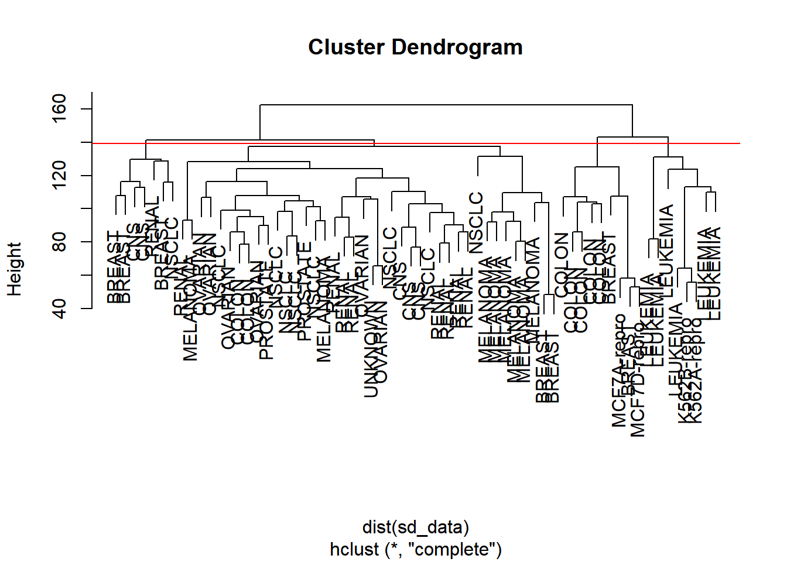

Printing the output of `hclust` gives a useful brief summary of the object:


```r
hc_out
```

```
## 
## Call:
## hclust(d = dist(sd_data))
## 
## Cluster method   : complete 
## Distance         : euclidean 
## Number of objects: 64
```

We claimed earlier that K-means clustering and hierarchical
clustering with the dendrogram cut to obtain the same number
of clusters can yield **very** different results. How do these `NCI60` hierarchical
clustering results compare to what we get if we perform K-means clustering
with `K  =  4`?


```r
set.seed(2)
km_out = kmeans(sd_data, 4, nstart = 20)
km_clusters = km_out$cluster
```

We can use a confusion matrix to compare the differences in how the two methods assigned observations to clusters:


```r
table(km_clusters,hc_clusters)
```

```
##            hc_clusters
## km_clusters  1  2  3  4
##           1 11  0  0  9
##           2 20  7  0  0
##           3  9  0  0  0
##           4  0  0  8  0
```

We see that the four clusters obtained using hierarchical clustering and Kmeans
clustering are somewhat different. Cluster 2 in K-means clustering is
identical to cluster 3 in hierarchical clustering. However, the other clusters
differ: for instance, cluster 4 in K-means clustering contains a portion of
the observations assigned to cluster 1 by hierarchical clustering, as well as
all of the observations assigned to cluster 2 by hierarchical clustering.

### References

These examples are an adaptation of p. 404-407, 410-413 of "Introduction to
Statistical Learning with Applications in R" by Gareth James, Daniela Witten, Trevor Hastie and Robert
Tibshirani. Adapted by R. Jordan Crouser at Smith College for SDS293: Machine Learning (Spring 2016), and re-implemented in Fall 2016 in `tidyverse` format by Amelia McNamara and R. Jordan Crouser at Smith College.

Used with permission from Jordan Crouser at Smith College, and to the following contributors on github:

* github.com/jcrouser
* github.com/AmeliaMN
* github.com/mhusseinmidd
* github.com/rudeboybert
* github.com/ijlyttle
